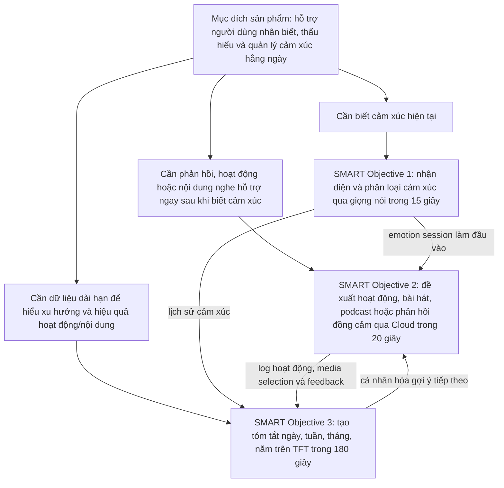

# 01. Background

## 1.1. Bối cảnh

Trong học tập, công việc và sinh hoạt cá nhân, cảm xúc của người dùng thay đổi liên tục nhưng thường không được ghi nhận một cách có hệ thống. Nhiều người chỉ nhận ra mình đang căng thẳng, buồn bã hoặc kiệt sức khi cảm xúc tiêu cực đã kéo dài. Ngược lại, những giai đoạn tích cực cũng dễ bị bỏ qua nên người dùng khó biết thói quen nào thật sự giúp mình cân bằng hơn.

Các ứng dụng ghi nhật ký cảm xúc trên điện thoại có thể hỗ trợ theo dõi tâm trạng, nhưng chúng phụ thuộc nhiều vào việc người dùng chủ động mở ứng dụng, tự nhập dữ liệu và tự đánh giá cảm xúc. Điều này tạo ra rào cản sử dụng hằng ngày, đặc biệt với người đang mệt mỏi hoặc căng thẳng. EmotiCare AIoT được thiết kế để giảm rào cản đó bằng một thiết bị vật lý đặt trong không gian cá nhân, cho phép người dùng thực hiện một lần check-in ngắn bằng giọng nói.

### 1.1.1. Thực trạng

Theo báo cáo **World mental health report: Transforming mental health for all** của World Health Organization, nhu cầu chăm sóc sức khỏe tinh thần trên toàn cầu đang ở mức cao, trong khi khả năng đáp ứng của các hệ thống hỗ trợ còn chưa tương xứng [10]. Điều này cho thấy các giải pháp hỗ trợ nhẹ, dễ tiếp cận và có thể dùng thường xuyên trong đời sống hằng ngày là một hướng bổ sung cần thiết, đặc biệt với nhóm người dùng chưa cần can thiệp y tế nhưng cần theo dõi cảm xúc và giảm căng thẳng sớm.

National Institute of Mental Health cũng nhấn mạnh rằng sức khỏe tinh thần bao gồm cả sức khỏe cảm xúc, tâm lý và xã hội; self-care có thể hỗ trợ duy trì sức khỏe tinh thần và hỗ trợ quá trình hồi phục khi người dùng gặp vấn đề tâm lý [9]. Với bối cảnh sinh viên và người đi làm thường chịu áp lực học tập, công việc, giao tiếp và nhịp sống nhanh, việc có một thiết bị giúp ghi nhận cảm xúc ngắn gọn, không phán xét và không yêu cầu thao tác phức tạp có ý nghĩa thực tiễn.

Từ thực trạng này, EmotiCare AIoT không được định vị như thiết bị chẩn đoán bệnh lý. Sản phẩm tập trung vào ba nhu cầu gần với đời sống hơn: giúp người dùng nhận biết cảm xúc hiện tại, nhận gợi ý chăm sóc phù hợp ngay trên thiết bị và xem lại xu hướng cảm xúc theo thời gian.

### 1.1.2. Sản phẩm tương tự

Trên thị trường đã có một số sản phẩm đi theo hướng thiết bị đồng hành cảm xúc hoặc robot xã hội. Tuy nhiên, mỗi sản phẩm có trọng tâm khác nhau, từ giải trí, đồng hành cho người lớn tuổi đến hỗ trợ thói quen sống. EmotiCare AIoT kế thừa ý tưởng tương tác gần gũi của nhóm sản phẩm này nhưng tập trung hẹp hơn vào **Speech Emotion Recognition**, gợi ý chăm sóc cảm xúc và báo cáo cảm xúc trên TFT.

| Sản phẩm tương tự | Mô tả ngắn | Điểm liên quan đến EmotiCare AIoT | Khác biệt của EmotiCare AIoT |
| ----------------- | ---------- | -------------------------------- | ---------------------------- |
| EMO - LivingAI | EMO là AI desktop pet có tính cách riêng, có thể ở bên cạnh người dùng, nhận biết âm thanh/người dùng, di chuyển trên bàn, nhảy theo nhạc, chơi game và hỗ trợ một số tác vụ như báo thức, thời tiết [11]. | Gợi cảm hứng về một thiết bị để bàn có cá tính, tạo cảm giác hiện diện và tương tác thân thiện. | EmotiCare AIoT không tập trung vào giải trí/nhân vật hóa, mà tập trung vào nhận diện cảm xúc bằng giọng nói, lưu emotion session và phân tích xu hướng cảm xúc. |
| ElliQ | ElliQ là companion robot hướng đến người lớn tuổi, hỗ trợ wellness, nhắc thuốc, gợi ý vận động nhẹ, kết nối xã hội, giải trí và giảm cô đơn [12]. | Cho thấy giá trị của thiết bị chủ động trò chuyện, nhắc nhở và hỗ trợ cảm xúc trong không gian cá nhân. | EmotiCare AIoT hướng đến prototype sinh viên, dùng TFT làm giao diện chính, SER chạy tại Edge và Cloud chỉ hỗ trợ gợi ý, media, hội thoại và báo cáo rút gọn. |

Từ việc tham khảo các sản phẩm trên, EmotiCare AIoT chọn một phạm vi khả thi hơn cho đồ án: không xây dựng robot xã hội phức tạp, không cố thay thế người chăm sóc, mà tạo một thiết bị AIoT nhỏ có khả năng lắng nghe một lượt check-in, phân loại cảm xúc, đề xuất hoạt động/bài hát/podcast phù hợp và giúp người dùng nhìn lại dữ liệu cảm xúc ngay trên màn hình phần cứng.

## 1.2. Nguồn cảm hứng từ EMO

Nguồn cảm hứng ban đầu của sản phẩm đến từ hình ảnh **EMO**, một thiết bị/robot để bàn có tính cách thân thiện, biết phản hồi lại người dùng và tạo cảm giác có một người bạn nhỏ trong không gian sống. Điểm hấp dẫn của EMO không chỉ nằm ở phần cứng, màn hình hay chuyển động, mà ở cảm giác thiết bị có thể hiện diện, phản hồi và làm cho tương tác công nghệ trở nên gần gũi hơn.

EmotiCare AIoT kế thừa tinh thần đó nhưng chuyển trọng tâm từ sự dễ thương và giải trí sang **chăm sóc cảm xúc có dữ liệu**. Thiết bị không chỉ phản ứng bằng biểu cảm hoặc câu nói ngắn, mà còn:

* Lắng nghe một tương tác giọng nói có chủ đích.
* Nhận diện trạng thái cảm xúc bằng Edge AI.
* Đưa ra phản hồi đồng cảm, hoạt động cải thiện tâm trạng hoặc nội dung nghe phù hợp như bài hát/podcast.
* Ghi nhận lịch sử cảm xúc để người dùng thấy được xu hướng của chính mình.
* Tạo báo cáo theo thời gian để hỗ trợ xây dựng lối sống cân bằng hơn.

Vì vậy, EmotiCare AIoT được định vị như một **Intelligent Emotional Companion**: không thay thế con người hay chuyên gia sức khỏe tinh thần, nhưng đóng vai trò một điểm chạm nhẹ nhàng, thường xuyên và riêng tư để người dùng quan tâm đến cảm xúc của mình.

## 1.3. Vấn đề cần giải quyết

| Vấn đề | Hệ quả | Cách EmotiCare AIoT giải quyết |
| ------ | ------ | ------------------------------- |
| Người dùng ít ghi nhận cảm xúc hằng ngày | Không thấy được xu hướng cảm xúc dài hạn | Check-in bằng giọng nói và lưu emotion session |
| Cảm xúc tiêu cực kéo dài khó được phát hiện sớm | Người dùng dễ rơi vào trạng thái căng thẳng, buồn bã hoặc mệt mỏi kéo dài | Báo cáo theo ngày, tuần, tháng, năm và phát hiện chuỗi cảm xúc tiêu cực |
| Gợi ý chăm sóc tinh thần thường chung chung | Người dùng khó biết hoạt động hoặc nội dung nghe nào phù hợp với mình | Gợi ý theo cảm xúc hiện tại, chủ đích, lịch sử feedback và phân tích hiệu quả hoạt động/nội dung |
| Dữ liệu giọng nói nhạy cảm | Người dùng lo ngại quyền riêng tư | Ưu tiên Edge AI, không upload âm thanh thô mặc định |
| Thiết bị hỗ trợ tinh thần dễ bị hiểu nhầm là thiết bị y tế | Rủi ro kỳ vọng sai | Đặc tả rõ sản phẩm chỉ hỗ trợ tự chăm sóc, không chẩn đoán hoặc điều trị |

Từ các vấn đề trên, có thể thấy EmotiCare AIoT cần được đặt cạnh các sản phẩm tương tự để làm rõ khoảng trống sản phẩm mà đồ án hướng đến. Các sản phẩm như EMO hoặc ElliQ đã chứng minh rằng thiết bị vật lý có thể tạo cảm giác đồng hành tốt hơn một giao diện phần mềm thuần túy, nhưng chúng chưa trùng hoàn toàn với mục tiêu của EmotiCare AIoT.

| Tiêu chí so sánh | EMO - LivingAI [11] | ElliQ [12] | EmotiCare AIoT |
| ---------------- | ------------------- | ---------- | -------------- |
| Nhóm người dùng chính | Người dùng phổ thông muốn có AI desktop pet để giải trí và tương tác thân thiện | Người lớn tuổi cần đồng hành, nhắc nhở, kết nối xã hội và hỗ trợ wellness | Sinh viên, người đi làm và người quan tâm đến mental wellness |
| Trọng tâm sản phẩm | Tạo cảm giác thú cưng để bàn có cá tính, biết phản hồi, di chuyển, nhảy theo nhạc và hỗ trợ tác vụ đơn giản | Companion robot chủ động trò chuyện, nhắc thuốc, gợi ý vận động, kết nối gia đình/người chăm sóc | Thiết bị AIoT nhận diện cảm xúc qua giọng nói, gợi ý chăm sóc cảm xúc và theo dõi xu hướng trên TFT |
| Nhận diện cảm xúc | Có tương tác thông minh và biểu cảm, nhưng không tập trung vào Speech Emotion Recognition làm use case chính | Có hội thoại và wellness support, nhưng không tập trung vào SER cục bộ trên thiết bị phần cứng sinh viên | UC-01 tập trung vào Speech Emotion Recognition chạy tại Edge |
| Gợi ý chăm sóc cảm xúc | Thiên về giải trí, nhạc, game và phản hồi kiểu thú cưng | Thiên về thói quen sống, nhắc nhở, vận động nhẹ, kết nối xã hội | Gợi ý hoạt động, bài hát, podcast và phản hồi đồng cảm dựa trên emotion context |
| Theo dõi dài hạn | Không phải trọng tâm chính của sản phẩm | Có hỗ trợ caregiver/wellness theo định hướng người lớn tuổi | Báo cáo cảm xúc theo ngày, tuần, tháng, năm hiển thị trực tiếp trên TFT |
| Quyền riêng tư âm thanh | Không phải điểm nhấn chính trong đặc tả đồ án | Có chính sách bảo mật và kết nối Cloud theo hệ sinh thái riêng | Không upload âm thanh thô mặc định; ưu tiên Edge AI cho tác vụ nhận diện cảm xúc |
| Phù hợp phạm vi đồ án | Sản phẩm thương mại có cơ khí, nhân vật hóa và trải nghiệm giải trí phức tạp | Sản phẩm thương mại có dịch vụ Cloud, caregiver app và vận hành dài hạn | Prototype khả thi hơn: Edge SER, Cloud API, TFT screen, database và flow Edge-Cloud-TFT |

Như vậy, EmotiCare AIoT không cố cạnh tranh trực tiếp với robot đồng hành thương mại. Sản phẩm chọn một lát cắt hẹp và rõ hơn: **nhận diện cảm xúc bằng giọng nói, hỗ trợ chăm sóc cảm xúc theo ngữ cảnh và tạo dữ liệu theo dõi dài hạn trên chính thiết bị phần cứng**.

## 1.4. Người dùng mục tiêu

| Nhóm người dùng | Nhu cầu chính | Giá trị sản phẩm |
| --------------- | ------------- | ---------------- |
| Sinh viên | Theo dõi căng thẳng, mệt mỏi, áp lực học tập | Check-in nhanh, gợi ý nghỉ ngơi, xem lại xu hướng cảm xúc |
| Người đi làm | Quản lý stress trong ngày làm việc | Nhận biết thời điểm căng thẳng và chọn hoạt động phục hồi |
| Người quan tâm đến mental wellness | Xây dựng thói quen chăm sóc tinh thần | Báo cáo định kỳ và theo dõi hiệu quả thói quen |
| Gia đình/người chăm sóc | Muốn có góc nhìn tổng quan nếu người dùng đồng ý chia sẻ | Báo cáo tổng quan không xâm phạm nội dung riêng tư |

## 1.5. Mục đích sản phẩm

Mục đích của **EmotiCare AIoT** là tạo ra một thiết bị AIoT đồng hành cảm xúc có thể giúp người dùng dừng lại, nhận biết trạng thái cảm xúc của mình và lựa chọn cách chăm sóc phù hợp ngay trong đời sống hằng ngày. Sản phẩm không hướng đến việc thay thế chuyên gia sức khỏe tinh thần, mà đóng vai trò như một điểm chạm nhẹ nhàng, riêng tư và dễ tiếp cận để người dùng hình thành thói quen quan sát cảm xúc.

Về mặt trải nghiệm, EmotiCare AIoT tập trung vào ba giá trị chính:

| Giá trị | Ý nghĩa đối với người dùng | Cách sản phẩm hỗ trợ |
| ------- | -------------------------- | -------------------- |
| Nhận biết cảm xúc | Người dùng biết mình đang vui vẻ, bình thường, căng thẳng, buồn bã, tức giận hoặc mệt mỏi | Check-in bằng giọng nói và nhận diện cảm xúc bằng Edge AI |
| Hỗ trợ đúng lúc | Người dùng nhận được một hành động nhỏ, một nội dung nghe phù hợp hoặc một phản hồi đồng cảm khi cần | Cloud gợi ý hoạt động, bài hát, podcast hoặc phản hồi hội thoại, sau đó hiển thị trên TFT |
| Hiểu xu hướng dài hạn | Người dùng nhìn lại sự thay đổi cảm xúc theo thời gian và biết hoạt động/nội dung nào có hiệu quả | Cloud tổng hợp emotion sessions, activity feedback, media selection logs và trả báo cáo rút gọn về TFT |

Từ góc nhìn sản phẩm, mục đích này giúp EmotiCare AIoT khác với một ứng dụng nhật ký cảm xúc thông thường. Thiết bị ưu tiên thao tác ngắn trên phần cứng, xử lý nhận diện cảm xúc tại Edge để giảm phụ thuộc Internet cho tác vụ cốt lõi, và chỉ dùng Cloud cho các phần cần dữ liệu dài hạn hoặc nội dung phong phú hơn như gợi ý, hội thoại và báo cáo.

Do đó, mục đích sản phẩm có thể tóm tắt như sau: **giúp người dùng nhận biết cảm xúc hiện tại, nhận hỗ trợ phù hợp trong thời điểm đó và theo dõi xu hướng cảm xúc lâu dài ngay trên thiết bị TFT**.

## 1.6. Từ mục đích sản phẩm suy ra 3 mục tiêu

Mục đích cốt lõi của EmotiCare AIoT là giúp người dùng **nhận biết cảm xúc**, **được hỗ trợ đúng lúc** và **hiểu xu hướng cảm xúc theo thời gian**. Từ mục đích này, sản phẩm được tách thành ba SMART objective liên kết thành một vòng lặp hoàn chỉnh.

*Mô tả diagram: Sơ đồ cho thấy mục đích chăm sóc cảm xúc được tách thành ba mục tiêu liên kết nhau: Edge AI nhận diện cảm xúc, Cloud hỗ trợ phản hồi/gợi ý, và Cloud tổng hợp báo cáo để hiển thị lại trên TFT screen.*

## 1.7. Phạm vi sản phẩm

### Trong phạm vi

* Thu âm khi người dùng chủ động kích hoạt tương tác.
* Nhận diện cảm xúc từ giọng nói bằng Edge AI.
* Phân loại các trạng thái: vui vẻ, bình thường, căng thẳng, buồn bã, tức giận, mệt mỏi và nhóm mở rộng.
* Đề xuất hoạt động cải thiện hoặc duy trì tâm trạng.
* Đề xuất bài hát hoặc podcast theo cảm xúc hiện tại, category và chủ đích của người dùng.
* Trò chuyện hỗ trợ cảm xúc với phản hồi đồng cảm và an toàn.
* Lưu emotion session, recommendation log, media selection log và feedback.
* Tạo báo cáo cảm xúc theo ngày, tuần, tháng, năm.
* Hiển thị trên TFT screen về phân bố cảm xúc, xu hướng và hiệu quả hoạt động/nội dung.

### Ngoài phạm vi

* Chẩn đoán bệnh lý tâm thần.
* Thay thế bác sĩ, nhà tâm lý học hoặc dịch vụ khẩn cấp.
* Thu âm liên tục khi người dùng chưa kích hoạt.
* Chia sẻ dữ liệu cảm xúc cho bên thứ ba khi chưa có sự đồng ý.
* Đưa ra kết luận y khoa dựa trên giọng nói hoặc dữ liệu sinh hoạt.

## 1.8. Tiêu chí thành công

| Tiêu chí | Mục tiêu |
| -------- | -------- |
| Tốc độ nhận diện | Kết quả cảm xúc trong vòng 15 giây sau tương tác giọng nói hợp lệ |
| Tốc độ hỗ trợ | Ít nhất một hoạt động, bài hát, podcast hoặc một phản hồi trong vòng 20 giây sau khi có kết quả cảm xúc và có Internet |
| Tốc độ báo cáo | Tóm tắt báo cáo được trả về TFT screen trong vòng 180 giây sau yêu cầu hoặc chu kỳ đồng bộ |
| Tính liên tục dữ liệu | Mỗi phiên có timestamp, session ID, emotion label và sync status |
| Tính riêng tư | Không upload âm thanh thô mặc định; ưu tiên xử lý cục bộ |
| Giá trị người dùng | Người dùng hiểu được xu hướng cảm xúc và hoạt động/nội dung nào có hiệu quả với mình |
