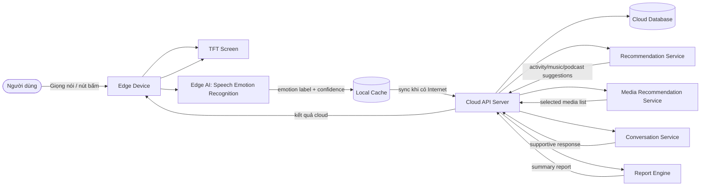

# 02. Architecture & Hardware

## 2.1. Tổng quan kiến trúc

EmotiCare AIoT sử dụng kiến trúc **Edge-Cloud-TFT**. Edge Device chịu trách nhiệm tương tác trực tiếp với người dùng, thu âm khi được kích hoạt, chạy Speech Emotion Recognition và hiển thị kết quả trên TFT screen. Cloud Service chịu trách nhiệm cho các chức năng còn lại: gợi ý hoạt động, gợi ý/chọn bài hát hoặc podcast, trò chuyện hỗ trợ, lưu trữ dài hạn, tổng hợp báo cáo và trả kết quả về thiết bị để hiển thị trên TFT.

*Mô tả diagram: Sơ đồ thể hiện Objective 1 chạy trên Edge AI, còn Objective 2 và Objective 3 phối hợp với Cloud Service; mọi kết quả cuối cùng được trả về Edge Device và hiển thị trên TFT screen.*

## 2.2. Thành phần chính

| Thành phần | Vai trò | Ghi chú |
| ---------- | ------- | ------- |
| Edge Device | Thiết bị phần cứng đặt gần người dùng | Điều khiển microphone, nút bấm, Wi-Fi, cache và TFT screen |
| TFT Screen | Giao diện theo dõi chính | Hiển thị cảm xúc hiện tại, gợi ý, phản hồi, báo cáo và trạng thái đồng bộ |
| Edge AI SER Engine | Nhận diện cảm xúc từ giọng nói | Chỉ Objective 1 chạy cục bộ |
| Local Cache | Lưu dữ liệu tạm | Giữ emotion session pending khi mất Internet |
| Cloud API Server | Cổng giao tiếp giữa thiết bị và cloud | Nhận sync, trả gợi ý, phản hồi, báo cáo và cấu hình |
| Recommendation Service | Gợi ý hoạt động, bài hát và podcast | Dùng emotion label, lịch sử và feedback để trả các card phù hợp |
| Media Recommendation Service | Lựa chọn bài hát/podcast theo chủ đích | Dùng category, media type, intent và emotion context để xếp hạng nội dung |
| Conversation Service | Tạo phản hồi đồng cảm | Dùng emotion context và input người dùng, có safety filter |
| Report Engine | Tạo báo cáo | Tổng hợp emotion sessions, activity logs, media selection logs và conversation metadata |
| Cloud Database | Lưu dữ liệu dài hạn | Lưu user, device, session, recommendation, media item, conversation và report |

## 2.3. Thành phần phần cứng đề xuất

Giá dưới đây là **ước tính cho prototype sinh viên**, có thể thay đổi theo nhà cung cấp, thời điểm mua, phí vận chuyển và việc nhóm dùng module chính hãng hay module tương đương. Đơn vị tiền tệ dùng trong bảng là VND.

| Phần cứng | Vai trò | Yêu cầu tối thiểu | Giá tham khảo | Ref |
| --------- | ------- | ----------------- | ------------- | --- |
| ESP32-S3 hoặc vi điều khiển tương đương | Bộ điều khiển chính | Có Wi-Fi, đủ tài nguyên cho inference nhẹ hoặc điều phối module inference | 180.000 - 350.000 | [13] |
| INMP441 I2S Microphone | Thu giọng nói | Thu âm ở khoảng cách gần, phục vụ SER | 25.000 - 70.000 | [5] |
| TFT/OLED Display | Màn hình theo dõi chính | Hiển thị menu, cảm xúc, gợi ý, hội thoại ngắn, báo cáo và trạng thái sync | 120.000 - 320.000 | [14] |
| 5 nút vật lý hoặc touch input | Điều hướng | Mode, Action, Start/Confirm, Next, Back | 10.000 - 50.000 | [15] |
| Speaker/Buzzer | Phản hồi âm thanh | Báo hiệu bắt đầu/kết thúc thu âm hoặc có kết quả mới | 10.000 - 60.000 | [16] |
| Flash/Local storage | Cache offline | Lưu session pending khi mất Internet; có thể dùng flash sẵn trên ESP32-S3 hoặc thêm microSD/flash ngoài | 0 - 100.000 | [13], [17] |
| Wi-Fi | Kết nối Internet | Bắt buộc cho Objective 2 và Objective 3; tích hợp sẵn nếu dùng ESP32-S3 | 0 | [13] |

## 2.4. Dự đoán chi phí tổng

Chi phí tổng được chia thành hai mức để phù hợp với thực tế triển khai đồ án:

| Hạng mục | Chi phí thấp | Chi phí cao | Ghi chú |
| -------- | ------------ | ----------- | ------- |
| Các linh kiện chính trong bảng 2.3 | 345.000 | 950.000 | Bao gồm MCU, microphone, màn hình, nút, buzzer, storage nếu cần |
| Dây jumper, breadboard/PCB thử nghiệm, điện trở, header | 50.000 | 150.000 | Phục vụ đấu nối prototype |
| Nguồn cấp USB, pin hoặc adapter nếu cần demo độc lập | 50.000 | 200.000 | Có thể bằng 0 nếu dùng nguồn USB từ laptop |
| Vỏ hộp/mica/in 3D cơ bản | 50.000 | 250.000 | Tùy mức hoàn thiện phần cứng |
| Dự phòng hỏng linh kiện và phát sinh | 50.000 | 150.000 | Nên có vì prototype thường cần mua thay thế |
| **Tổng dự đoán** | **545.000** | **1.700.000** | Khoảng chi phí hợp lý cho một prototype sinh viên |

Nếu nhóm muốn giảm chi phí, phương án tối thiểu là dùng ESP32-S3 có sẵn flash/Wi-Fi, dùng buzzer thay vì speaker, dùng nút vật lý rời và chưa làm vỏ hoàn thiện. Nếu nhóm muốn demo tốt hơn, nên ưu tiên màn hình TFT rõ hơn, microphone ổn định hơn và vỏ thiết bị chắc chắn để trải nghiệm EmotiCare AIoT giống một thiết bị thật hơn.

## 2.5. Luồng dữ liệu tổng quát

| Bước | Mô tả | Dữ liệu sinh ra |
| ---- | ----- | --------------- |
| 1 | Người dùng nhấn Check-in và nói với thiết bị | Audio sample |
| 2 | Edge AI xử lý SER trên thiết bị | Emotion label, confidence |
| 3 | Thiết bị hiển thị cảm xúc hiện tại trên TFT | Current emotion screen |
| 4 | Thiết bị đồng bộ emotion session lên Cloud khi có Internet | Synced emotion session |
| 5 | Cloud Recommendation Service, Media Recommendation Service hoặc Conversation Service xử lý yêu cầu hỗ trợ | Activity suggestion, song/podcast list hoặc supportive response |
| 6 | Thiết bị nhận kết quả cloud và hiển thị trên TFT | Support screen |
| 7 | Cloud Report Engine tổng hợp dữ liệu theo ngày/tuần/tháng/năm | Report summary |
| 8 | Thiết bị nhận báo cáo rút gọn và hiển thị trên TFT | Report screen |

## 2.6. Nguyên tắc thiết kế

| Nguyên tắc | Cách áp dụng |
| ---------- | ------------ |
| Edge cho nhận diện cốt lõi | SER chạy tại thiết bị để vẫn có kết quả cảm xúc khi mất Internet |
| Cloud cho hỗ trợ nâng cao | Gợi ý hoạt động, bài hát/podcast, trò chuyện và báo cáo dùng Internet/Cloud |
| TFT là giao diện chính | Người dùng theo dõi trực tiếp trên màn hình thiết bị |
| Chịu lỗi offline | Khi offline, thiết bị vẫn nhận diện và lưu session pending nhưng chưa tạo hỗ trợ cloud |
| An toàn cảm xúc | Cloud response phải qua safety filter, không chẩn đoán y khoa |

## 2.7. Ràng buộc triển khai

* Objective 1 phải hoạt động trên Edge Device.
* Objective 2 và Objective 3 cần Internet để gọi Cloud API.
* Thiết bị phải hiển thị rõ trạng thái `Offline`, `Sync pending`, `Waiting cloud` và `Cloud result ready`.
* Mỗi kết quả cloud phải được rút gọn để phù hợp với TFT screen.
* API đồng bộ phải idempotent để tránh tạo trùng session khi retry.
