# 03. Objectives

## 3.1. Tổng quan

Ba SMART objective của EmotiCare AIoT tạo thành một vòng lặp vận hành trên thiết bị, trong đó TFT là giao diện theo dõi chính, Edge AI xử lý tác vụ nhận diện cảm xúc cốt lõi, còn Cloud hỗ trợ các chức năng cần dữ liệu dài hạn hoặc nội dung phong phú hơn.

| SMART Objective | Mô tả đầy đủ | Use case liên quan | Vai trò trong vòng lặp |
| --------------- | ------------ | ------------------ | ---------------------- |
| SMART Objective 1 | Phát hiện và phân loại trạng thái cảm xúc của người dùng trong vòng 15 giây sau mỗi lần tương tác bằng giọng nói hợp lệ, đồng thời lưu lại kết quả của từng phiên để phục vụ theo dõi và phân tích cảm xúc theo thời gian. | UC-01 | Tạo emotion session làm dữ liệu nền cho các chức năng hỗ trợ và báo cáo |
| SMART Objective 2 | Đề xuất ít nhất một hoạt động, bài hát, podcast hoặc một phản hồi đồng cảm phù hợp trong vòng 20 giây khi người dùng yêu cầu hỗ trợ và thiết bị có Internet. | UC-02, UC-03, UC-04 | Biến dữ liệu cảm xúc hoặc nhu cầu trực tiếp từ HOME thành hành động hỗ trợ cụ thể |
| SMART Objective 3 | Tự động tạo tóm tắt thống kê và phân tích cảm xúc theo ngày, tháng và năm trên Cloud Service, sau đó trả kết quả rút gọn về TFT screen trong vòng 180 giây sau khi người dùng yêu cầu hoặc sau một chu kỳ đồng bộ. | UC-05 | Giúp người dùng nhìn lại xu hướng cảm xúc và hiệu quả của hoạt động/nội dung đã chọn |

### Overall Objective Flow Chart

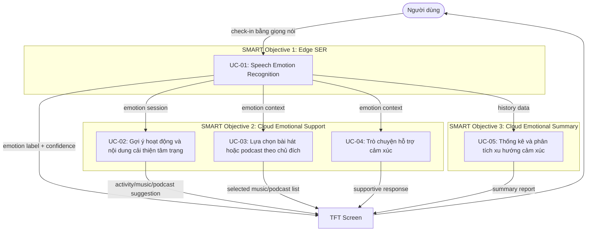

*Mô tả chart: Flow chart này cho thấy Objective 1 tạo dữ liệu cảm xúc tại Edge, Objective 2 và Objective 3 dùng Cloud để xử lý nâng cao, còn mọi kết quả đều quay về TFT screen để người dùng theo dõi.*

### Overall Use Case Diagram

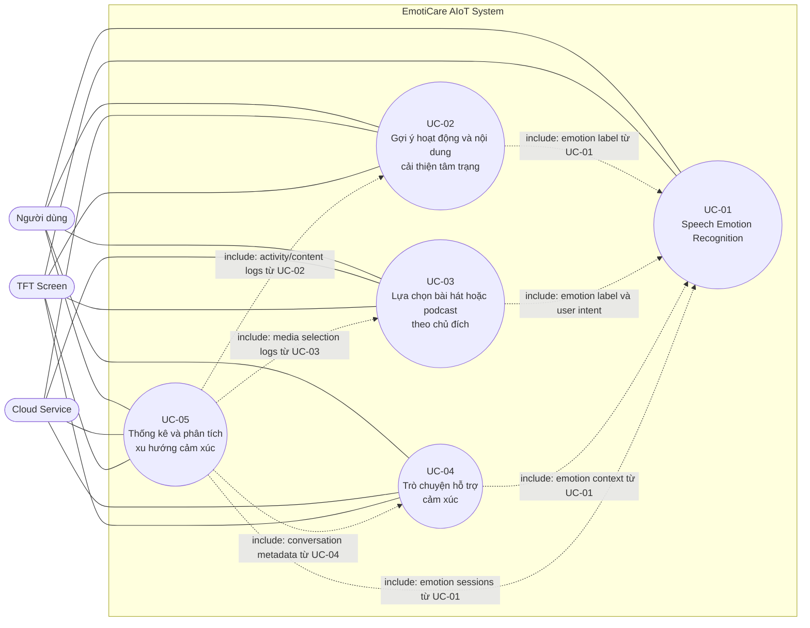

*Mô tả diagram: Use case diagram này mô tả các tác nhân chính gồm người dùng, Cloud Service và TFT Screen; trong đó chỉ UC-01 chạy tại Edge, còn UC-02, UC-03, UC-04 và UC-05 cần Cloud phối hợp.*

---

## 3.2. SMART Objective 1: Phát hiện và phân loại trạng thái cảm xúc của người dùng bằng Speech Emotion Recognition trong vòng 15 giây sau mỗi lần tương tác bằng giọng nói hợp lệ, đồng thời lưu lại kết quả của từng phiên để phục vụ theo dõi cảm xúc theo thời gian

Objective 1 là nền tảng của toàn bộ hệ thống. Đây là objective duy nhất bắt buộc chạy được tại Edge Device khi mất Internet. Kết quả được hiển thị ngay trên TFT và được lưu vào local cache để đồng bộ cloud sau.

### 3.2.1. Use Case UC-01: Speech Emotion Recognition

* **Input:** Giọng nói của người dùng.
* **Output:** Trạng thái cảm xúc, ví dụ: vui vẻ, bình thường, căng thẳng, buồn bã, tức giận, mệt mỏi.

**Mô tả:** Thiết bị sử dụng bài toán **Speech Emotion Recognition (SER)** để phân tích tín hiệu lời nói và suy luận trạng thái cảm xúc. Pipeline SER gồm thu âm có chủ đích, tiền xử lý, trích xuất Log-Mel Spectrogram, MFCC, pitch, energy hoặc embedding âm thanh, sau đó đưa vào mô hình phân loại đã được tối ưu cho edge. Kết quả được hiển thị trên TFT và lưu thành emotion session.

**Ý nghĩa của use case:** UC-01 giúp người dùng gọi tên trạng thái cảm xúc hiện tại mà không cần nhập nhật ký thủ công. Việc đặt use case là Speech Emotion Recognition làm rõ nguồn nhận diện chính là tín hiệu lời nói.

**Vai trò trong objective:** UC-01 là điểm bắt đầu của vòng lặp chăm sóc cảm xúc, nơi giọng nói được chuyển thành emotion label, confidence score và emotion session trong giới hạn 15 giây.

| Trường | Nội dung |
| ------ | -------- |
| Use case ID | UC-01 |
| Tên use case | Speech Emotion Recognition |
| Tác nhân chính | Người dùng |
| Tác nhân phụ | Edge Device, TFT Screen |
| Mục tiêu | Xác định trạng thái cảm xúc hiện tại sau một lần tương tác bằng giọng nói |
| Tiền điều kiện | Thiết bị đã bật, microphone sẵn sàng, người dùng chủ động kích hoạt check-in |
| Kích hoạt | Người dùng nhấn nút Check-in và nói một câu hoặc một đoạn chia sẻ ngắn |
| Luồng chính | 1. Người dùng kích hoạt thu âm. 2. Thiết bị hiển thị trạng thái đang nghe trên TFT. 3. Thiết bị ghi âm trong thời lượng giới hạn. 4. Edge AI tiền xử lý âm thanh. 5. Hệ thống trích xuất đặc trưng SER. 6. Mô hình SER phân loại cảm xúc và trả confidence. 7. TFT hiển thị kết quả. 8. Hệ thống lưu emotion session vào local cache. |
| Luồng thay thế | Nếu âm thanh quá ngắn, quá nhiễu hoặc confidence thấp, thiết bị yêu cầu người dùng nói lại hoặc lưu kết quả là `uncertain`. Nếu mất Internet, session vẫn được lưu cục bộ. |
| Hậu điều kiện | Emotion session được tạo và sẵn sàng đồng bộ cloud khi có Internet |
| Dữ liệu vào | Audio sample, Log-Mel Spectrogram, MFCC, pitch, energy hoặc embedding âm thanh |
| Dữ liệu ra | Emotion label, confidence score, timestamp, session ID, sync status |
| Mục tiêu hiệu năng | Hoàn tất trong vòng 15 giây |

#### Use Case Diagram

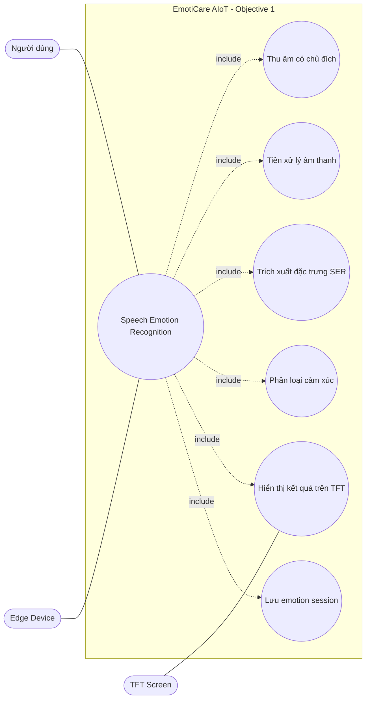

*Mô tả diagram: Use case diagram này cho thấy người dùng tương tác với Edge Device để chạy SER, sau đó kết quả được hiển thị trên TFT và lưu thành emotion session.*

#### Flow Chart

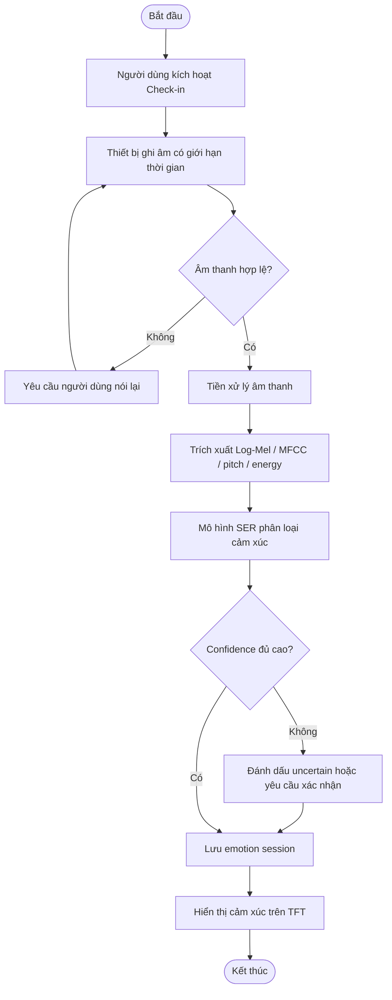

*Mô tả chart: Flow chart này mô tả tuần tự xử lý SER từ lúc người dùng check-in đến khi TFT hiển thị cảm xúc và local cache lưu phiên.*

---

## 3.3. SMART Objective 2: Đề xuất ít nhất một hoạt động hoặc một phản hồi phù hợp thông qua Cloud Service trong vòng 20 giây sau khi hoàn tất nhận diện cảm xúc và thiết bị có Internet, nhằm cải thiện hoặc duy trì trạng thái cảm xúc của người dùng

Objective 2 không chạy độc lập hoàn toàn trên Edge. Sau khi UC-01 tạo emotion label, thiết bị gửi context lên Cloud Service để nhận gợi ý hoạt động hoặc phản hồi hội thoại, sau đó hiển thị kết quả trên TFT.

### 3.3.1. Use Case UC-02: Gợi ý hoạt động và nội dung cải thiện tâm trạng

* **Input:** Trạng thái cảm xúc hiện tại nếu có, chủ đích hỗ trợ nhanh và lịch sử tương tác đã đồng bộ.
* **Output:** Danh sách hoạt động, bài hát và podcast phù hợp hiển thị trên TFT.

**Mô tả:** Cloud Recommendation Service đề xuất hoạt động như hít thở, thiền, thư giãn, vận động nhẹ, nghỉ ngơi hoặc ghi nhật ký cảm xúc; đồng thời đề xuất bài hát và podcast phù hợp với emotion label nếu đã có, chủ đích hỗ trợ nhanh, lịch sử tương tác và feedback trước đó.

**Ý nghĩa của use case:** UC-02 biến nhận biết cảm xúc hoặc nhu cầu hỗ trợ nhanh thành các lựa chọn chăm sóc cụ thể. Người dùng có thể mở Activity trực tiếp từ HOME, hoặc dùng kết quả UC-01 nếu vừa check-in cảm xúc trước đó.

**Vai trò trong objective:** UC-02 là nhánh hỗ trợ nhanh sau nhận diện cảm xúc, trong đó Cloud xử lý recommendation còn TFT hiển thị kết quả ngắn gọn để người dùng chọn.

| Trường | Nội dung |
| ------ | -------- |
| Use case ID | UC-02 |
| Tên use case | Gợi ý hoạt động và nội dung cải thiện tâm trạng |
| Tác nhân chính | Người dùng |
| Tác nhân phụ | Edge Device, Cloud Recommendation Service, TFT Screen |
| Tiền điều kiện | Thiết bị có Internet. Emotion label là tùy chọn; nếu chưa có, Cloud dùng chế độ gợi ý chung an toàn và lịch sử gần nhất. |
| Kích hoạt | Người dùng chọn Activity từ HOME hoặc từ RESULT/SUPPORT |
| Luồng chính | 1. Người dùng chọn Activity. 2. Thiết bị gửi emotion context nếu có, kèm lịch sử gần nhất lên Cloud. 3. Cloud lấy lịch sử hoạt động, nội dung đã nghe và feedback. 4. Cloud chọn hoạt động, bài hát và podcast phù hợp. 5. Cloud trả danh sách rút gọn về Edge Device. 6. TFT hiển thị các card gợi ý theo nhóm. 7. Người dùng chọn, bỏ qua hoặc đánh giá. 8. Thiết bị gửi feedback lên Cloud. |
| Luồng thay thế | Nếu Internet lỗi, TFT hiển thị thông báo cần kết nối Internet để lấy gợi ý cloud. |
| Dữ liệu vào | Optional emotion label, optional confidence score, recent session history, activity feedback, listening history |
| Dữ liệu ra | Activity cards, song cards, podcast cards, reason text, selected/skipped status, feedback score |
| Mục tiêu hiệu năng | Cloud trả kết quả về TFT trong vòng 20 giây |

#### Use Case Diagram

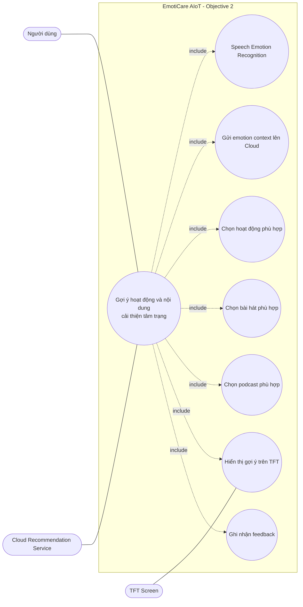

*Mô tả diagram: Use case diagram này thể hiện UC-02 cần Cloud Recommendation Service xử lý đồng thời hoạt động, bài hát và podcast; TFT Screen là nơi người dùng xem và phản hồi gợi ý.*

#### Flow Chart

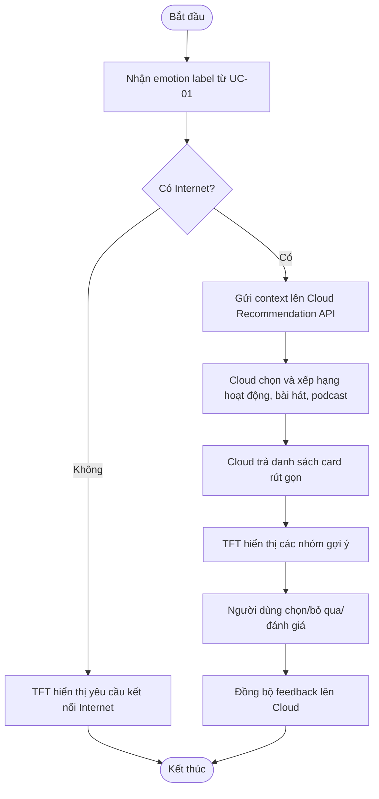

*Mô tả chart: Flow chart này mô tả quá trình lấy gợi ý hoạt động, bài hát và podcast từ Cloud rồi hiển thị kết quả lên TFT, bao gồm cả nhánh khi thiết bị không có Internet.*

### 3.3.2. Use Case UC-03: Lựa chọn bài hát hoặc podcast theo chủ đích

* **Input:** Chủ đích của người dùng, category nội dung mong muốn và emotion label gần nhất nếu có.
* **Output:** Danh sách bài hát hoặc podcast theo category hiển thị trên TFT.

**Mô tả:** Người dùng có thể chủ động chọn nghe bài hát hoặc podcast ngay từ HOME, không bắt buộc phải check-in cảm xúc trước. Cloud Media Recommendation Service phân loại nội dung theo các category như thư giãn, tập trung, ngủ nghỉ, vui vẻ, giảm căng thẳng, truyền cảm hứng, podcast ngắn, podcast thiền, podcast chia sẻ cảm xúc. Nếu có emotion context từ check-in gần nhất thì Cloud dùng để cá nhân hóa; nếu chưa có, Cloud ưu tiên category và chủ đích người dùng chọn.

**Ý nghĩa của use case:** UC-03 cho người dùng quyền chủ động hơn. Thay vì chỉ chờ hệ thống gợi ý, người dùng có thể nói rõ mình muốn nghe nhạc thư giãn, podcast động viên hoặc nội dung giúp tập trung.

**Vai trò trong objective:** UC-03 mở rộng Objective 2 từ hỗ trợ phản ứng theo cảm xúc sang hỗ trợ theo chủ đích, vẫn dùng Cloud để chọn nội dung và TFT để hiển thị danh sách.

| Trường | Nội dung |
| ------ | -------- |
| Use case ID | UC-03 |
| Tên use case | Lựa chọn bài hát hoặc podcast theo chủ đích |
| Tác nhân chính | Người dùng |
| Tác nhân phụ | Edge Device, Cloud Media Recommendation Service, TFT Screen |
| Tiền điều kiện | Thiết bị có Internet và người dùng chọn Music/Podcast Mode |
| Kích hoạt | Người dùng chọn category hoặc nói chủ đích nghe nội dung |
| Luồng chính | 1. Người dùng chọn Music/Podcast từ HOME hoặc SUPPORT. 2. Người dùng chọn Music, Podcast hoặc Both. 3. Người dùng chọn category hoặc nói chủ đích. 4. Thiết bị gửi category, intent và emotion context nếu có lên Cloud. 5. Cloud lọc danh sách bài hát/podcast theo category. 6. Cloud xếp hạng nội dung phù hợp. 7. TFT hiển thị danh sách rút gọn. 8. Người dùng chọn nội dung để nghe hoặc lưu lại. |
| Luồng thay thế | Nếu Internet lỗi, TFT hiển thị thông báo cần kết nối Cloud để lấy danh sách nội dung. Nếu category không có nội dung, Cloud trả category gần nhất. |
| Dữ liệu vào | User intent, selected category, optional emotion label, optional confidence score, listening history |
| Dữ liệu ra | Song list, podcast list, category, reason text, selected media item |
| Mục tiêu hiệu năng | Danh sách nội dung hiển thị trên TFT trong vòng 20 giây |

#### Category nội dung

| Category | Nội dung phù hợp | Ví dụ mục đích |
| -------- | ---------------- | -------------- |
| Thư giãn | Nhạc nhẹ, ambient, podcast thở chậm | Giảm căng thẳng |
| Tập trung | Nhạc không lời, white noise, podcast hướng dẫn tập trung | Học tập/làm việc |
| Ngủ nghỉ | Nhạc chậm, sleep story, podcast thiền ngủ | Chuẩn bị nghỉ ngơi |
| Vui vẻ | Nhạc tích cực, podcast truyền cảm hứng | Duy trì cảm xúc tốt |
| Xoa dịu buồn bã | Nhạc ấm, podcast chia sẻ cảm xúc | Cảm thấy được đồng hành |
| Giải tỏa tức giận | Nhạc grounding, podcast kiểm soát cảm xúc | Tạm dừng và hạ nhịp |
| Phục hồi năng lượng | Nhạc nhẹ có nhịp vừa, podcast self-care | Khi mệt mỏi |

#### Use Case Diagram

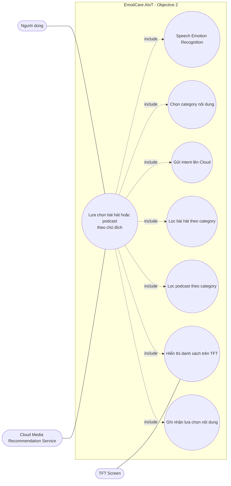

*Mô tả diagram: Use case diagram này mô tả nhánh người dùng chủ động chọn bài hát hoặc podcast theo category; Cloud lọc và xếp hạng nội dung, còn TFT hiển thị danh sách rút gọn.*

#### Flow Chart

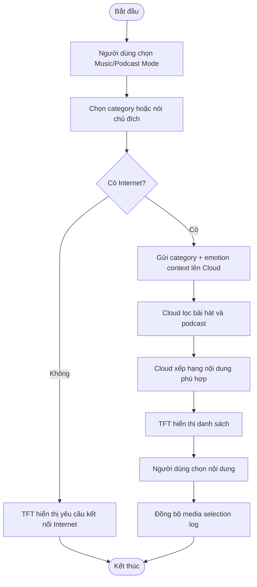

*Mô tả chart: Flow chart này mô tả quá trình người dùng chủ động chọn category bài hát/podcast, Cloud trả danh sách phù hợp và thiết bị ghi nhận lựa chọn.*

### 3.3.3. Use Case UC-04: Trò chuyện hỗ trợ cảm xúc

* **Input:** Giọng nói hoặc câu hỏi của người dùng cùng emotion context.
* **Output:** Phản hồi đồng cảm hiển thị trên TFT.

**Mô tả:** Người dùng có thể mở Conversation Mode trực tiếp từ HOME hoặc sau khi check-in cảm xúc. Thiết bị gửi nội dung chia sẻ của người dùng lên Cloud Conversation Service; nếu có emotion context thì gửi kèm để phản hồi phù hợp hơn. Cloud tạo phản hồi đồng cảm, kiểm tra an toàn, rút gọn nội dung và trả về thiết bị để hiển thị trên TFT.

**Ý nghĩa của use case:** UC-04 phù hợp khi người dùng cần được lắng nghe và phản hồi hơn là chỉ nhận một danh sách hoạt động hoặc nội dung nghe.

**Vai trò trong objective:** UC-04 là nhánh hỗ trợ bằng hội thoại, dùng Cloud để tạo phản hồi linh hoạt nhưng vẫn ràng buộc an toàn.

| Trường | Nội dung |
| ------ | -------- |
| Use case ID | UC-04 |
| Tên use case | Trò chuyện hỗ trợ cảm xúc |
| Tác nhân chính | Người dùng |
| Tác nhân phụ | Edge Device, Cloud Conversation Service, TFT Screen |
| Tiền điều kiện | Thiết bị có Internet và người dùng chọn Conversation Mode. Emotion label là tùy chọn; nếu chưa có, Cloud dùng câu chia sẻ hiện tại làm ngữ cảnh chính. |
| Kích hoạt | Người dùng nói tiếp, đặt câu hỏi hoặc yêu cầu thiết bị trò chuyện |
| Luồng chính | 1. Người dùng chọn Conversation từ HOME hoặc SUPPORT. 2. Người dùng chia sẻ bằng giọng nói. 3. Edge Device gửi nội dung chia sẻ và emotion context nếu có lên Cloud. 4. Cloud tạo phản hồi đồng cảm. 5. Safety Filter kiểm tra phản hồi. 6. Cloud trả phản hồi rút gọn. 7. TFT hiển thị phản hồi. 8. Metadata được đồng bộ nếu người dùng cho phép. |
| Luồng thay thế | Nếu phát hiện tín hiệu nguy cấp, Cloud trả thông điệp khuyên liên hệ người thân, chuyên gia hoặc dịch vụ hỗ trợ phù hợp. |
| Dữ liệu vào | User utterance, optional emotion label, optional confidence score, conversation context |
| Dữ liệu ra | Empathetic response, suggested next action, safety flag |
| Mục tiêu hiệu năng | Phản hồi đầu tiên hiển thị trên TFT trong vòng 20 giây |

#### Use Case Diagram

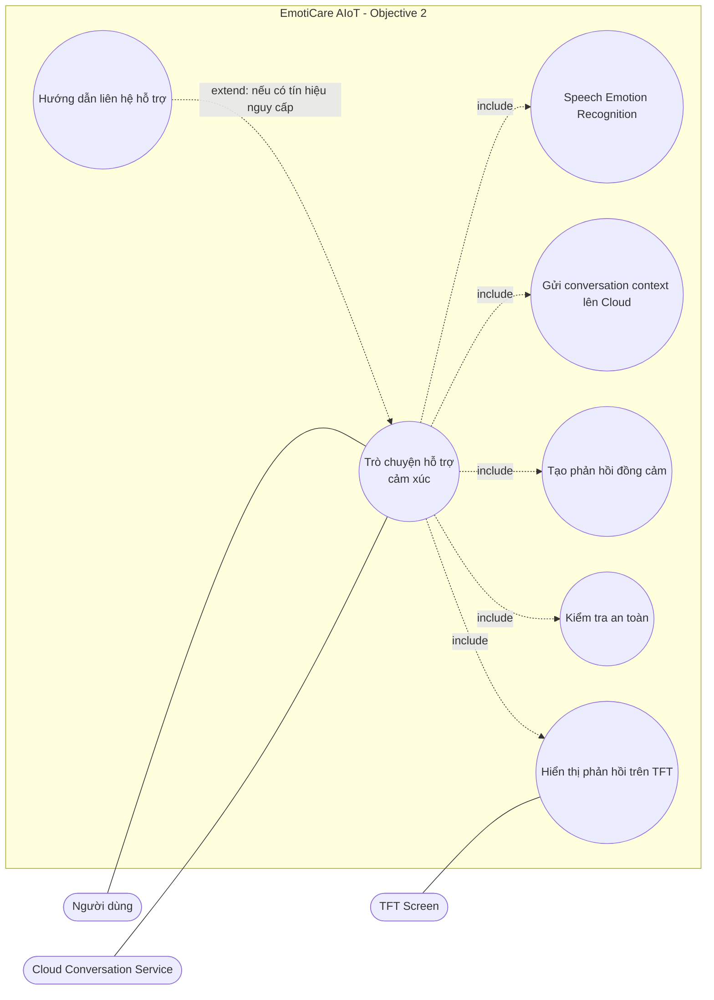

*Mô tả diagram: Use case diagram này nhấn mạnh Cloud Conversation Service là tác nhân xử lý phản hồi, còn TFT hiển thị câu trả lời đã được rút gọn và kiểm tra an toàn.*

#### Flow Chart

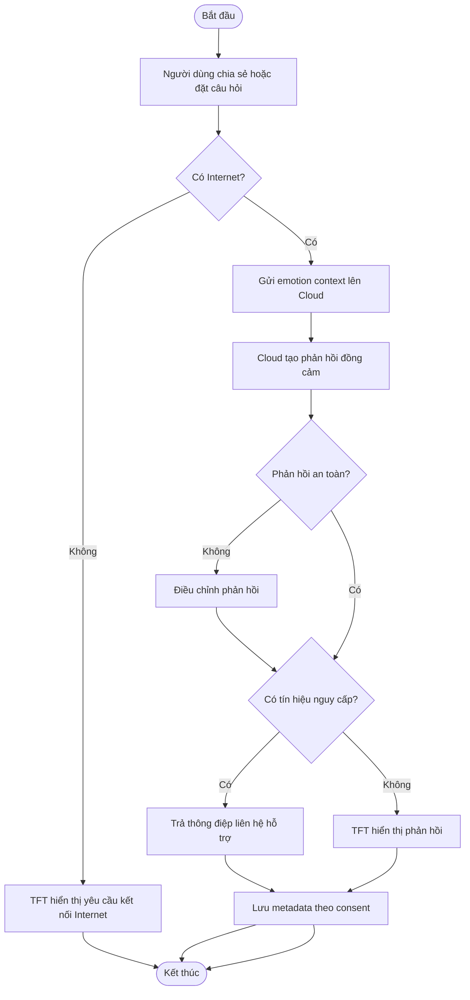

*Mô tả chart: Flow chart này mô tả luồng hội thoại cloud-assisted, bao gồm kiểm tra Internet, safety filter và nhánh xử lý tín hiệu nguy cấp.*

---

## 3.4. SMART Objective 3: Tự động tạo tóm tắt thống kê và phân tích cảm xúc theo ngày, tuần, tháng và năm trên Cloud Service, sau đó trả kết quả rút gọn về TFT screen trong vòng 180 giây sau khi người dùng yêu cầu hoặc sau một chu kỳ đồng bộ

Objective 3 giúp người dùng theo dõi dài hạn trực tiếp trên thiết bị. Cloud xử lý tổng hợp dữ liệu, còn thiết bị hiển thị phiên bản rút gọn phù hợp với màn hình TFT.

### 3.4.1. Use Case UC-05: Thống kê và phân tích xu hướng cảm xúc

* **Input:** Lịch sử cảm xúc, activity logs, media selection logs và conversation metadata đã đồng bộ.
* **Output:** Báo cáo rút gọn theo ngày, tuần, tháng và năm hiển thị trên TFT.

**Mô tả:** Cloud Report Engine tổng hợp dữ liệu cảm xúc theo nhiều mốc thời gian, tính tỷ lệ cảm xúc, xu hướng thay đổi và hiệu quả hoạt động. Kết quả được nén thành các thẻ thông tin ngắn để hiển thị trên TFT.

**Ý nghĩa của use case:** UC-05 biến các phiên cảm xúc rời rạc thành bức tranh dài hạn, giúp người dùng theo dõi xu hướng ngay trên thiết bị phần cứng.

**Vai trò trong objective:** UC-05 là phần tổng hợp dữ liệu dài hạn của hệ thống, dùng Cloud cho xử lý nặng và TFT cho hiển thị.

| Trường | Nội dung |
| ------ | -------- |
| Use case ID | UC-05 |
| Tên use case | Thống kê và phân tích xu hướng cảm xúc |
| Tác nhân chính | Người dùng |
| Tác nhân phụ | Edge Device, Cloud Report Engine, TFT Screen |
| Tiền điều kiện | Có dữ liệu đã đồng bộ lên Cloud |
| Kích hoạt | Người dùng mở Report từ HOME/TFT hoặc thiết bị hoàn tất một chu kỳ đồng bộ |
| Luồng chính | 1. Người dùng chọn Report từ HOME. 2. TFT hiển thị lựa chọn ngày, tháng hoặc năm. 3. Người dùng chọn period cần xem. 4. Thiết bị gửi yêu cầu report theo period. 5. Cloud Report Engine lấy emotion sessions và logs. 6. Cloud tính phân bố cảm xúc. 7. Cloud phân tích xu hướng và hiệu quả hoạt động/nội dung. 8. Cloud tạo report rút gọn. 9. Thiết bị nhận report và hiển thị kết quả trên TFT. |
| Luồng thay thế | Nếu dữ liệu quá ít, Cloud trả report `limited_data` và TFT hiển thị khuyến nghị check-in thêm. |
| Dữ liệu vào | Emotion sessions, activity logs, media selection logs, conversation metadata, selected period |
| Dữ liệu ra | TFT report cards, trend summary, activity effectiveness, data quality |
| Mục tiêu hiệu năng | Báo cáo rút gọn hiển thị trên TFT trong vòng 180 giây |

#### Use Case Diagram

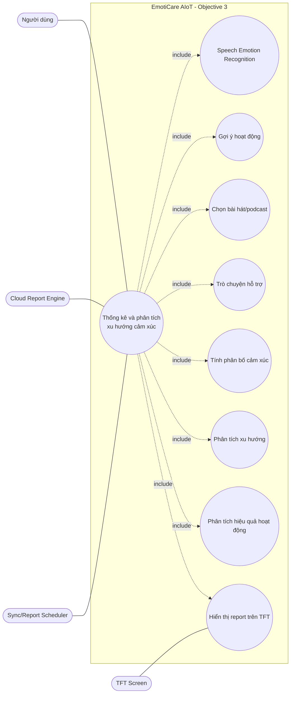

*Mô tả diagram: Use case diagram này cho thấy Cloud Report Engine tổng hợp dữ liệu từ các use case trước và trả báo cáo rút gọn về TFT Screen.*

#### Flow Chart

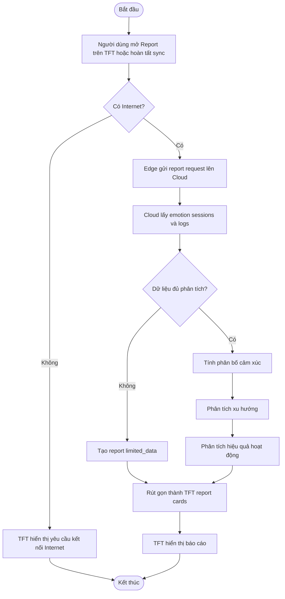

*Mô tả chart: Flow chart này mô tả cách thiết bị yêu cầu Cloud tạo báo cáo và nhận lại các thẻ tóm tắt để hiển thị trên TFT.*

## 3.5. Bảng tổng hợp use case

| ID | Use case | Input | Output | Xử lý chính |
| -- | -------- | ----- | ------ | ----------- |
| UC-01 | Speech Emotion Recognition | Giọng nói người dùng | Emotion label, confidence, emotion session | Edge AI |
| UC-02 | Gợi ý hoạt động và nội dung cải thiện tâm trạng | Emotion label và lịch sử đã đồng bộ | Hoạt động, bài hát, podcast trên TFT | Cloud + TFT |
| UC-03 | Lựa chọn bài hát hoặc podcast theo chủ đích | Chủ đích, category và emotion context | Danh sách bài hát/podcast trên TFT | Cloud + TFT |
| UC-04 | Trò chuyện hỗ trợ cảm xúc | Giọng nói/câu hỏi và emotion context | Phản hồi đồng cảm trên TFT | Cloud + TFT |
| UC-05 | Thống kê và phân tích xu hướng cảm xúc | Lịch sử cảm xúc, hoạt động và nội dung đã chọn | Báo cáo rút gọn trên TFT | Cloud + TFT |
