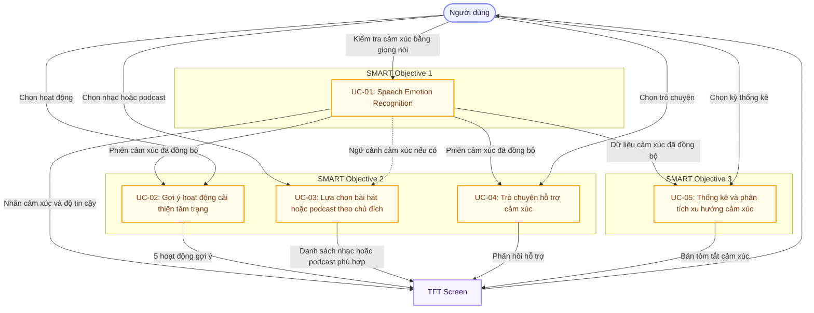

# 03. Mục tiêu

## 3.1. Tổng quan

Ba SMART objective của EmotiCare AIoT tạo thành một vòng lặp vận hành trên thiết bị, trong đó TFT là giao diện theo dõi chính, Edge AI xử lý tác vụ nhận diện cảm xúc cốt lõi, còn Cloud hỗ trợ các chức năng cần dữ liệu dài hạn hoặc nội dung phong phú hơn.

| SMART Objective   | Mô tả đầy đủ                                                                                                                                                                                                               | Use case liên quan  | Vai trò trong vòng lặp                                                               |
| ----------------- | -------------------------------------------------------------------------------------------------------------------------------------------------------------------------------------------------------------------------- | ------------------- | ------------------------------------------------------------------------------------ |
| SMART Objective 1 | Phát hiện và phân loại trạng thái cảm xúc của người dùng trong vòng 30 giây sau mỗi lần tương tác bằng giọng nói hợp lệ, đồng thời lưu lại kết quả của từng phiên để phục vụ theo dõi và phân tích cảm xúc theo thời gian. | UC-01               | Tạo emotion session làm dữ liệu nền cho các chức năng hỗ trợ và báo cáo              |
| SMART Objective 2 | Đề xuất ít nhất một hoạt động, bài hát, podcast hoặc một phản hồi đồng cảm phù hợp trong vòng 20 giây khi người dùng yêu cầu hỗ trợ và thiết bị có Internet.                                                               | UC-02, UC-03, UC-04 | Biến dữ liệu cảm xúc hoặc nhu cầu trực tiếp từ HOME thành hành động hỗ trợ cụ thể    |
| SMART Objective 3 | Tạo tóm tắt thống kê và phân tích cảm xúc theo ngày, tuần và tháng trên Cloud Service, sau đó trả kết quả rút gọn về TFT screen trong vòng 180 giây sau khi người dùng yêu cầu. | UC-05 | Giúp người dùng nhìn lại xu hướng cảm xúc và hiệu quả của hoạt động/nội dung đã chọn |

### Bảng liên kết giá trị mang lại với yêu cầu

| Value proposition                                                  | SMART objective   | Use case | Giá trị người dùng mong đợi                                                               |
| ------------------------------------------------------------------ | ----------------- | -------- | ----------------------------------------------------------------------------------------- |
| Người dùng nhận biết cảm xúc nhanh mà không cần nhập liệu thủ công | SMART Objective 1 | UC-01    | Người dùng có emotion label và confidence ngay trên TFT sau một lần check-in ngắn         |
| Người dùng nhận hỗ trợ phù hợp khi đang cần điều chỉnh cảm xúc     | SMART Objective 2 | UC-02    | Người dùng nhận 5 hoạt động gợi ý mà không phải tự tìm                                    |
| Người dùng chủ động chọn nội dung nghe theo mục đích               | SMART Objective 2 | UC-03    | Người dùng chọn category và nhận danh sách bài hát/podcast phù hợp                        |
| Người dùng có kênh trò chuyện ngắn, đồng cảm và an toàn            | SMART Objective 2 | UC-04    | Người dùng nhận phản hồi ngắn gọn, không phán xét, có safety filter                       |
| Người dùng nhìn lại xu hướng cảm xúc dài hạn trên thiết bị         | SMART Objective 3 | UC-05    | Người dùng xem report cards theo ngày/tuần/tháng ngay trên TFT                            |

### Sơ đồ luồng mục tiêu tổng thể

```mermaid
flowchart TD
    User(["Người dùng"])
    TFT["TFT Screen"]

    subgraph O1["SMART Objective 1"]
        UC1["UC-01: Speech Emotion Recognition"]
    end

    subgraph O2["SMART Objective 2"]
        UC2["UC-02: Gợi ý hoạt động cải thiện tâm trạng"]
        UC3["UC-03: Lựa chọn bài hát hoặc podcast theo chủ đích"]
        UC4["UC-04: Trò chuyện hỗ trợ cảm xúc"]
    end

    subgraph O3["SMART Objective 3"]
        UC5["UC-05: Thống kê và phân tích xu hướng cảm xúc"]
    end

    User -->|"Kiểm tra cảm xúc bằng giọng nói"| UC1
    UC1 -->|"Nhãn cảm xúc và độ tin cậy"| TFT
    UC1 -->|"Phiên cảm xúc đã đồng bộ"| UC2
    User -->|"Chọn hoạt động"| UC2
    User -->|"Chọn nhạc hoặc podcast"| UC3
    UC1 -.->|"Ngữ cảnh cảm xúc nếu có"| UC3
    UC1 -->|"Phiên cảm xúc đã đồng bộ"| UC4
    User -->|"Chọn trò chuyện"| UC4
    UC1 -->|"Dữ liệu cảm xúc đã đồng bộ"| UC5
    User -->|"Chọn kỳ thống kê"| UC5
    UC2 -->|"5 hoạt động gợi ý"| TFT
    UC3 -->|"Danh sách nhạc hoặc podcast phù hợp"| TFT
    UC4 -->|"Phản hồi hỗ trợ"| TFT
    UC5 -->|"Bản tóm tắt cảm xúc"| TFT
    TFT --> User


    classDef userNode stroke:#818cf8,fill:#eef2ff,stroke-width:2px,color:#1e1b4b
    classDef edgeNode stroke:#a78bfa,fill:#f5f3ff,stroke-width:2px,color:#2e1065
    classDef cacheNode stroke:#2dd4bf,fill:#f0fdfa,stroke-width:2px,color:#0d5a57
    classDef cloudNode stroke:#38bdf8,fill:#f0f9ff,stroke-width:2px,color:#0c3d67
    classDef serviceNode stroke:#4ade80,fill:#f0fdf4,stroke-width:2px,color:#1a3a1a
    classDef actionNode stroke:#f59e0b,fill:#fffbeb,stroke-width:2px,color:#78350f
    class User userNode
    class TFT edgeNode
    class UC1,UC2,UC3,UC4,UC5 actionNode
```

*Mô tả sơ đồ: Mục tiêu 1 tạo dữ liệu cảm xúc tại thiết bị. Mục tiêu 2 và Mục tiêu 3 dùng máy chủ khi cần; người dùng có thể mở nhạc, podcast hoặc báo cáo trực tiếp, còn hoạt động và trò chuyện cần một phiên cảm xúc đã đồng bộ.*

---

## 3.2. SMART Objective 1: Phát hiện và phân loại trạng thái cảm xúc của người dùng bằng Speech Emotion Recognition trong vòng 30 giây sau mỗi lần tương tác bằng giọng nói hợp lệ, đồng thời lưu lại kết quả của từng phiên để phục vụ theo dõi cảm xúc theo thời gian

Objective 1 là nền tảng của toàn bộ hệ thống. Đây là objective duy nhất chạy được tại Edge Device khi mất Internet. Kết quả được hiển thị ngay trên TFT; firmware lưu trạng thái check-in đã xác nhận gần nhất cục bộ và chỉ thử đồng bộ ngay khi check-in nếu Wi-Fi và pairing sẵn sàng.

### 3.2.1. Tình huống sử dụng UC-01: Nhận diện cảm xúc bằng giọng nói

- **Input:** Giọng nói của người dùng.
- **Output:** Một trong tám nhãn SER hiện tại: `angry`, `calm`, `disgust`, `fearful`, `happy`, `neutral`, `sad`, `surprised`; confidence và trạng thái low-confidence nếu có.

**Mô tả:** Thiết bị sử dụng bài toán **Speech Emotion Recognition (SER)** để phân tích tín hiệu lời nói và suy luận trạng thái cảm xúc. Pipeline SER gồm thu âm có chủ đích, tiền xử lý, trích xuất Log-Mel Spectrogram, MFCC, pitch, energy hoặc embedding âm thanh, sau đó đưa vào mô hình phân loại đã được tối ưu cho edge. Kết quả được hiển thị trên TFT và lưu thành emotion session.

**Ý nghĩa của use case:** UC-01 giúp người dùng gọi tên trạng thái cảm xúc hiện tại mà không cần nhập nhật ký thủ công. Việc đặt use case là Speech Emotion Recognition làm rõ nguồn nhận diện chính là tín hiệu lời nói.

**Vai trò trong objective:** UC-01 là điểm bắt đầu của vòng lặp chăm sóc cảm xúc, nơi giọng nói được chuyển thành emotion label, confidence score và emotion session trong giới hạn 30 giây.

| Trường             | Nội dung                                                                                                                                                                                                                                                                                                                              |
| ------------------ | ------------------------------------------------------------------------------------------------------------------------------------------------------------------------------------------------------------------------------------------------------------------------------------------------------------------------------------- |
| Use case ID        | UC-01                                                                                                                                                                                                                                                                                                                                 |
| Tên use case       | Speech Emotion Recognition                                                                                                                                                                                                                                                                                                            |
| Tác nhân chính     | Người dùng                                                                                                                                                                                                                                                                                                                            |
| Tác nhân phụ       | Edge Device, TFT Screen                                                                                                                                                                                                                                                                                                               |
| Mục tiêu           | Xác định trạng thái cảm xúc hiện tại sau một lần tương tác bằng giọng nói                                                                                                                                                                                                                                                             |
| Tiền điều kiện     | Thiết bị đã bật, microphone sẵn sàng, người dùng chủ động kích hoạt check-in                                                                                                                                                                                                                                                          |
| Kích hoạt          | Người dùng nhấn nút Check-in và nói một câu hoặc một đoạn chia sẻ ngắn                                                                                                                                                                                                                                                                |
| Luồng chính        | 1. Người dùng kích hoạt thu âm. 2. Thiết bị hiển thị trạng thái đang nghe trên TFT. 3. Thiết bị ghi âm trong thời lượng giới hạn. 4. Edge AI tiền xử lý âm thanh. 5. Hệ thống trích xuất đặc trưng SER. 6. Mô hình SER phân loại cảm xúc và trả confidence. 7. TFT hiển thị kết quả. 8. Sau khi người dùng xác nhận, firmware lưu trạng thái emotion gần nhất vào bộ nhớ cục bộ. |
| Luồng thay thế     | Nếu âm thanh quá ngắn hoặc quá nhiễu, thiết bị yêu cầu người dùng nói lại. Nếu confidence thấp, UI đánh dấu low-confidence, vẫn giữ nhãn dự đoán và yêu cầu người dùng xác nhận lại. Nếu mất Internet, firmware chỉ lưu trạng thái check-in đã xác nhận gần nhất cục bộ. |
| Hậu điều kiện      | Khi online, firmware đồng bộ session ngay sau khi người dùng xác nhận; khi offline, chưa có hàng đợi session và retry tự động. |
| Dữ liệu vào        | Audio sample, Log-Mel Spectrogram, MFCC, pitch, energy hoặc embedding âm thanh                                                                                                                                                                                                                                                        |
| Dữ liệu ra         | Emotion label, confidence score, timestamp; khi đồng bộ thành công, Cloud trả session ID                                                                                                                                                                                                                                               |
| Mục tiêu hiệu năng | Hoàn tất trong vòng 30 giây |

#### Cách nhận diện cảm xúc

Thiết bị thu một đoạn giọng nói ngắn, kiểm tra chất lượng âm thanh và nhận diện một trong tám trạng thái cảm xúc. Toàn bộ bước này thực hiện ngay trên thiết bị, không cần Internet và không tự gửi âm thanh kiểm tra lên máy chủ.

Nếu kết quả chưa đủ tin cậy, màn hình vẫn hiển thị cảm xúc dự đoán nhưng mời người dùng xác nhận lại. Chi tiết về mô hình nhận diện và dữ liệu tham khảo được lưu trong tài liệu kỹ thuật riêng của nhóm.

#### Sơ đồ luồng

```mermaid
flowchart LR
    Start([Bắt đầu])
    Activate["Người dùng kích hoạt Check-in"]
    Record["Thiết bị ghi âm có giới hạn thời gian"]
    Valid{"Âm thanh hợp lệ?"}
    Retry["Yêu cầu người dùng nói lại"]
    Preprocess["Tiền xử lý âm thanh"]
    Feature["Trích xuất Log-Mel / MFCC / pitch / energy"]
    Infer["Mô hình SER phân loại cảm xúc"]
    Confidence{"Confidence đủ cao?"}
    Uncertain["Giữ nhãn dự đoán và yêu cầu xác nhận"]
    Save["Lưu trạng thái emotion đã xác nhận"]
    Display["Hiển thị cảm xúc trên TFT"]
    End([Kết thúc])

    Start --> Activate --> Record --> Valid
    Valid -- "Không" --> Retry --> Record
    Valid -- "Có" --> Preprocess --> Feature --> Infer --> Confidence
    Confidence -- "Không" --> Uncertain --> Save
    Confidence -- "Có" --> Save
    Save --> Display --> End


    classDef userNode stroke:#818cf8,fill:#eef2ff,stroke-width:2px,color:#1e1b4b
    classDef edgeNode stroke:#a78bfa,fill:#f5f3ff,stroke-width:2px,color:#2e1065
    classDef cacheNode stroke:#2dd4bf,fill:#f0fdfa,stroke-width:2px,color:#0d5a57
    classDef cloudNode stroke:#38bdf8,fill:#f0f9ff,stroke-width:2px,color:#0c3d67
    classDef serviceNode stroke:#4ade80,fill:#f0fdf4,stroke-width:2px,color:#1a3a1a
    classDef actionNode stroke:#f59e0b,fill:#fffbeb,stroke-width:2px,color:#78350f
    class Display edgeNode
    class Record serviceNode
    class Start,Activate,Valid,Retry,Preprocess,Feature,Infer,Confidence,Uncertain,Save,End actionNode
```

*Mô tả chart: Flow chart này mô tả tuần tự xử lý SER từ lúc người dùng check-in đến khi TFT hiển thị cảm xúc và firmware lưu trạng thái emotion đã xác nhận gần nhất.*

---

## 3.3. SMART Objective 2: Đề xuất ít nhất một hoạt động, bài hát, podcast hoặc một phản hồi phù hợp thông qua Cloud Service trong vòng 20 giây sau khi người dùng yêu cầu hỗ trợ và thiết bị có Internet, nhằm cải thiện hoặc duy trì trạng thái cảm xúc của người dùng

Objective 2 không chạy độc lập hoàn toàn trên Edge. Sau khi UC-01 tạo emotion label, thiết bị gửi context lên Cloud Service để nhận gợi ý hoạt động hoặc phản hồi hội thoại, sau đó hiển thị kết quả trên TFT.

### 3.3.1. Tình huống sử dụng UC-02: Gợi ý hoạt động cải thiện tâm trạng

- **Input:** Trạng thái cảm xúc hiện tại nếu có, chủ đích hỗ trợ nhanh và lịch sử tương tác đã đồng bộ.
- **Output:** Năm thẻ hoạt động phù hợp hiển thị trên TFT.

**Mô tả:** Cloud Recommendation Service đề xuất năm hoạt động ngắn, an toàn và phù hợp với emotion label của một emotion session đã đồng bộ, lịch sử tương tác và feedback trước đó. Danh sách hoạt động có thể gồm hít thở, grounding, nghỉ ngơi, vận động nhẹ, ghi nhật ký cảm xúc hoặc kết nối với người thân. Gợi ý bài hát và podcast thuộc UC-03.

**Ý nghĩa của use case:** UC-02 biến một emotion session đã đồng bộ thành các lựa chọn chăm sóc cụ thể. Người dùng có thể mở Activity từ HOME sau khi đã check-in; thiết bị dùng session gần nhất thuộc thiết bị để gọi Cloud.

**Vai trò trong objective:** UC-02 là nhánh hỗ trợ nhanh sau nhận diện cảm xúc, trong đó Cloud xử lý recommendation còn TFT hiển thị kết quả ngắn gọn để người dùng chọn.

| Trường             | Nội dung                                                                                                                                                                                                                                                                                                                                                                                       |
| ------------------ | ---------------------------------------------------------------------------------------------------------------------------------------------------------------------------------------------------------------------------------------------------------------------------------------------------------------------------------------------------------------------------------------------- |
| Use case ID        | UC-02                                                                                                                                                                                                                                                                                                                                                                                          |
| Tên use case       | Gợi ý hoạt động cải thiện tâm trạng                                                                                                                                                                                                                                                                                                                                                            |
| Tác nhân chính     | Người dùng                                                                                                                                                                                                                                                                                                                                                                                     |
| Tác nhân phụ       | Edge Device, Cloud Recommendation Service, TFT Screen                                                                                                                                                                                                                                                                                                                                          |
| Tiền điều kiện     | Thiết bị có Internet và có một emotion session đã được đồng bộ thuộc thiết bị. |
| Kích hoạt          | Người dùng chọn Activity từ HOME, RESULT hoặc SUPPORT sau khi check-in. |
| Luồng chính        | 1. Người dùng chọn Activity. 2. Thiết bị gửi `session_id` của emotion session đã đồng bộ lên Cloud. 3. Cloud lấy emotion label, lịch sử hoạt động và feedback. 4. Cloud chọn, xếp hạng năm hoạt động phù hợp. 5. Cloud trả năm activity card về Edge Device. 6. TFT hiển thị các card gợi ý. 7. Người dùng chọn, bỏ qua hoặc đánh giá. 8. Thiết bị gửi feedback lên Cloud. |
| Luồng thay thế     | Nếu Internet lỗi, TFT hiển thị thông báo cần kết nối Internet để lấy gợi ý cloud.                                                                                                                                                                                                                                                                                                              |
| Dữ liệu vào        | `session_id`, emotion label của session, activity feedback |
| Dữ liệu ra         | 5 activity cards, reason text, selected/skipped status, feedback score                                                                                                                                                                                                                                                                                                                          |
| Mục tiêu hiệu năng | Cloud trả kết quả về TFT trong vòng 20 giây                                                                                                                                                                                                                                                                                                                                                    |

#### Cách chọn hoạt động

Máy chủ chọn năm hoạt động ngắn, an toàn và phù hợp với cảm xúc hiện tại. Các lần lựa chọn và đánh giá trước đó được dùng để ưu tiên gợi ý hữu ích, đồng thời tránh lặp lại quá nhiều một hoạt động.

#### Sơ đồ luồng

```mermaid
flowchart LR
    Start([Bắt đầu])
    Emotion["Nhận emotion label từ UC-01"]
    Online{"Có Internet?"}
    NeedNet["TFT hiển thị yêu cầu kết nối Internet"]
    Send["Gửi context lên Cloud Recommendation API"]
    Rank["Cloud chọn và xếp hạng 5 hoạt động"]
    Return["Cloud trả danh sách card rút gọn"]
    Display["TFT hiển thị 5 activity card"]
    Feedback["Người dùng chọn/bỏ qua/đánh giá"]
    Save["Đồng bộ feedback lên Cloud"]
    End([Kết thúc])

    Start --> Emotion --> Online
    Online -- "Không" --> NeedNet --> End
    Online -- "Có" --> Send --> Rank --> Return --> Display --> Feedback --> Save --> End


    classDef userNode stroke:#818cf8,fill:#eef2ff,stroke-width:2px,color:#1e1b4b
    classDef edgeNode stroke:#a78bfa,fill:#f5f3ff,stroke-width:2px,color:#2e1065
    classDef cacheNode stroke:#2dd4bf,fill:#f0fdfa,stroke-width:2px,color:#0d5a57
    classDef cloudNode stroke:#38bdf8,fill:#f0f9ff,stroke-width:2px,color:#0c3d67
    classDef serviceNode stroke:#4ade80,fill:#f0fdf4,stroke-width:2px,color:#1a3a1a
    classDef actionNode stroke:#f59e0b,fill:#fffbeb,stroke-width:2px,color:#78350f
    class Display edgeNode
    class Feedback cloudNode
    class Start,Emotion,Online,NeedNet,Send,Rank,Return,Save,End actionNode
```

*Mô tả chart: Flow chart này mô tả quá trình lấy năm gợi ý hoạt động từ Cloud rồi hiển thị kết quả lên TFT, bao gồm cả nhánh khi thiết bị không có Internet.*

### 3.3.2. Tình huống sử dụng UC-03: Lựa chọn bài hát hoặc podcast theo chủ đích

- **Input:** Chủ đích của người dùng, category nội dung mong muốn và emotion label gần nhất nếu có.
- **Output:** Danh sách bài hát hoặc podcast theo category hiển thị trên TFT.

**Mô tả:** Người dùng có thể chủ động chọn nghe bài hát hoặc podcast ngay từ HOME, không bắt buộc phải check-in cảm xúc trước. Cloud Media Recommendation Service phân loại nội dung theo bảy category mã hóa: `relax`, `focus`, `sleep`, `happy`, `sad_support`, `anger_release`, `energy_recover`. Nếu có emotion context từ check-in gần nhất thì Cloud dùng để lọc nội dung; nếu chưa có, Cloud ưu tiên category và chủ đích người dùng chọn.

**Ý nghĩa của use case:** UC-03 cho người dùng quyền chủ động hơn. Thay vì chỉ chờ hệ thống gợi ý, người dùng có thể nói rõ mình muốn nghe nhạc thư giãn, podcast động viên hoặc nội dung giúp tập trung.

**Vai trò trong objective:** UC-03 mở rộng Objective 2 từ hỗ trợ phản ứng theo cảm xúc sang hỗ trợ theo chủ đích, vẫn dùng Cloud để chọn nội dung và TFT để hiển thị danh sách.

#### Cách chọn nội dung nghe

Người dùng có thể chọn theo mục đích, chẳng hạn thư giãn, tập trung hoặc nghỉ ngơi. Máy chủ ưu tiên nội dung phù hợp với mục đích và cảm xúc hiện tại, có xét đến những lựa chọn trước đó để danh sách đa dạng hơn.

| Trường             | Nội dung                                                                                                                                                                                                                                                                                                                                                                                                |
| ------------------ | ------------------------------------------------------------------------------------------------------------------------------------------------------------------------------------------------------------------------------------------------------------------------------------------------------------------------------------------------------------------------------------------------------- |
| Use case ID        | UC-03                                                                                                                                                                                                                                                                                                                                                                                                   |
| Tên use case       | Lựa chọn bài hát hoặc podcast theo chủ đích                                                                                                                                                                                                                                                                                                                                                             |
| Tác nhân chính     | Người dùng                                                                                                                                                                                                                                                                                                                                                                                              |
| Tác nhân phụ       | Edge Device, Cloud Media Recommendation Service, TFT Screen                                                                                                                                                                                                                                                                                                                                             |
| Tiền điều kiện     | Thiết bị có Internet và người dùng chọn Music/Podcast Mode                                                                                                                                                                                                                                                                                                                                              |
| Kích hoạt          | Người dùng chọn category hoặc nói chủ đích nghe nội dung                                                                                                                                                                                                                                                                                                                                                |
| Luồng chính        | 1. Người dùng chọn Music/Podcast từ HOME hoặc SUPPORT. 2. Người dùng chọn Music, Podcast hoặc Both. 3. Người dùng chọn category hoặc nói chủ đích. 4. Thiết bị gửi category, intent và emotion context nếu có lên Cloud. 5. Cloud lọc danh sách bài hát/podcast theo category. 6. Cloud xếp hạng nội dung phù hợp. 7. TFT hiển thị danh sách rút gọn. 8. Người dùng chọn nội dung để nghe hoặc lưu lại. |
| Luồng thay thế     | Nếu Internet lỗi, TFT hiển thị thông báo cần kết nối Cloud để lấy danh sách nội dung. Nếu category không có nội dung, Cloud trả category gần nhất.                                                                                                                                                                                                                                                      |
| Dữ liệu vào        | User intent, selected category, optional emotion label, optional confidence score, listening history                                                                                                                                                                                                                                                                                                    |
| Dữ liệu ra         | Song list, podcast list, category, reason text, selected media item                                                                                                                                                                                                                                                                                                                                     |
| Mục tiêu hiệu năng | Danh sách nội dung hiển thị trên TFT trong vòng 20 giây                                                                                                                                                                                                                                                                                                                                                 |

#### Nhóm nội dung

| Category            | Nội dung phù hợp                                         | Ví dụ mục đích          |
| ------------------- | -------------------------------------------------------- | ----------------------- |
| Thư giãn            | Nhạc nhẹ, ambient, podcast thở chậm                      | Giảm căng thẳng         |
| Tập trung           | Nhạc không lời, white noise, podcast hướng dẫn tập trung | Học tập/làm việc        |
| Ngủ nghỉ            | Nhạc chậm, sleep story, podcast thiền ngủ                | Chuẩn bị nghỉ ngơi      |
| Vui vẻ              | Nhạc tích cực, podcast truyền cảm hứng                   | Duy trì cảm xúc tốt     |
| Xoa dịu buồn bã     | Nhạc ấm, podcast chia sẻ cảm xúc                         | Cảm thấy được đồng hành |
| Giải tỏa tức giận   | Nhạc grounding, podcast kiểm soát cảm xúc                | Tạm dừng và hạ nhịp     |
| Phục hồi năng lượng | Nhạc nhẹ có nhịp vừa, podcast self-care                  | Khi mệt mỏi             |

#### Sơ đồ luồng

```mermaid
flowchart LR
    Start([Bắt đầu])
    SelectMode["Người dùng chọn Music/Podcast Mode"]
    ChooseCategory["Chọn category hoặc nói chủ đích"]
    Online{"Có Internet?"}
    NeedNet["TFT hiển thị yêu cầu kết nối Internet"]
    Send["Gửi category + emotion context lên Cloud"]
    Filter["Cloud lọc bài hát và podcast"]
    Rank["Cloud xếp hạng nội dung phù hợp"]
    Display["TFT hiển thị danh sách"]
    SelectItem["Người dùng chọn nội dung"]
    Save["Đồng bộ media selection log"]
    End([Kết thúc])

    Start --> SelectMode --> ChooseCategory --> Online
    Online -->|Không| NeedNet --> End
    Online -->|Có| Send --> Filter --> Rank --> Display --> SelectItem --> Save --> End

    classDef userNode stroke:#818cf8,fill:#eef2ff,stroke-width:2px,color:#1e1b4b
    classDef edgeNode stroke:#a78bfa,fill:#f5f3ff,stroke-width:2px,color:#2e1065
    classDef cacheNode stroke:#2dd4bf,fill:#f0fdfa,stroke-width:2px,color:#0d5a57
    classDef cloudNode stroke:#38bdf8,fill:#f0f9ff,stroke-width:2px,color:#0c3d67
    classDef serviceNode stroke:#4ade80,fill:#f0fdf4,stroke-width:2px,color:#1a3a1a
    classDef actionNode stroke:#f59e0b,fill:#fffbeb,stroke-width:2px,color:#78350f
    class Display edgeNode
    class Start,SelectMode,ChooseCategory,Online,NeedNet,Send,Filter,Rank,SelectItem,Save,End actionNode
```

*Mô tả chart: Flow chart này mô tả quá trình người dùng chủ động chọn category bài hát/podcast, Cloud trả danh sách phù hợp và thiết bị ghi nhận lựa chọn.*

### 3.3.3. Tình huống sử dụng UC-04: Trò chuyện hỗ trợ cảm xúc

- **Input:** PCM 16-bit 16 kHz tối đa 10 giây và `session_id` của emotion session đã đồng bộ.
- **Output:** Transcript, phản hồi đồng cảm hiển thị trên TFT và audio response nếu TTS khả dụng.

**Mô tả:** Người dùng mở Conversation Mode sau một check-in đã đồng bộ. Firmware ghi và gửi PCM 16-bit, 16 kHz tối đa 10 giây tới Cloud Voice Conversation API; Server chấp nhận tối đa 30 giây, dùng Whisper để chuyển giọng nói thành transcript, tạo phản hồi đồng cảm và trả PCM phản hồi TTS nếu khả dụng. Audio đầu vào chỉ xử lý tạm thời, không được lưu; transcript tóm tắt và phản hồi được lưu trong lịch sử hội thoại.

**Ý nghĩa của use case:** UC-04 phù hợp khi người dùng cần được lắng nghe và phản hồi hơn là chỉ nhận một danh sách hoạt động hoặc nội dung nghe.

**Vai trò trong objective:** UC-04 là nhánh hỗ trợ bằng hội thoại, dùng Cloud để tạo phản hồi linh hoạt nhưng vẫn ràng buộc an toàn.

| Trường             | Nội dung                                                                                                                                                                                                                                                                                                                                            |
| ------------------ | --------------------------------------------------------------------------------------------------------------------------------------------------------------------------------------------------------------------------------------------------------------------------------------------------------------------------------------------------- |
| Use case ID        | UC-04                                                                                                                                                                                                                                                                                                                                               |
| Tên use case       | Trò chuyện hỗ trợ cảm xúc                                                                                                                                                                                                                                                                                                                           |
| Tác nhân chính     | Người dùng                                                                                                                                                                                                                                                                                                                                          |
| Tác nhân phụ       | Edge Device, Cloud Conversation Service, TFT Screen                                                                                                                                                                                                                                                                                                 |
| Tiền điều kiện     | Thiết bị có Internet, người dùng chọn Conversation Mode và có emotion session đã đồng bộ thuộc thiết bị. |
| Kích hoạt          | Người dùng nói tiếp, đặt câu hỏi hoặc yêu cầu thiết bị trò chuyện                                                                                                                                                                                                                                                                                   |
| Luồng chính        | 1. Người dùng chọn Conversation từ HOME hoặc SUPPORT. 2. Người dùng chia sẻ bằng giọng nói. 3. Edge Device gửi PCM cùng `session_id` lên Cloud. 4. Cloud chuyển giọng nói thành transcript và kiểm tra safety. 5. Cloud tạo phản hồi đồng cảm. 6. Cloud trả transcript, phản hồi rút gọn và PCM TTS nếu khả dụng. 7. TFT/loa hiển thị hoặc phát phản hồi. 8. Cloud lưu transcript tóm tắt và phản hồi, không lưu audio thô. |
| Luồng thay thế     | Nếu phát hiện tín hiệu nguy cấp, Cloud trả thông điệp khuyên liên hệ người thân, chuyên gia hoặc dịch vụ hỗ trợ phù hợp.                                                                                                                                                                                                                            |
| Dữ liệu vào        | PCM 16-bit 16 kHz tối đa 10 giây từ firmware, `session_id` |
| Dữ liệu ra         | Transcript, empathetic response, suggested next action, safety flag, audio response path nếu TTS khả dụng |
| Mục tiêu hiệu năng | Phản hồi đầu tiên hiển thị trên TFT trong vòng 20 giây                                                                                                                                                                                                                                                                                              |

#### An toàn khi trò chuyện

Máy chủ chuyển phần chia sẻ bằng giọng nói thành nội dung văn bản ngắn để tạo phản hồi. Nếu nhận thấy dấu hiệu nguy cấp, hệ thống ưu tiên thông điệp an toàn và khuyến nghị người dùng liên hệ người thân, chuyên gia hoặc dịch vụ hỗ trợ phù hợp. Phản hồi luôn ngắn gọn, đồng cảm và không chẩn đoán y khoa.

#### Sơ đồ luồng

```mermaid
flowchart LR
    Start([Bắt đầu])
    Speech["Người dùng chia sẻ hoặc đặt câu hỏi"]
    Online{"Có Internet?"}
    NeedNet["TFT hiển thị yêu cầu kết nối Internet"]
    Send["Gửi emotion context lên Cloud"]
    Generate["Cloud tạo phản hồi đồng cảm"]
    Safety{"Phản hồi an toàn?"}
    Rewrite["Điều chỉnh phản hồi"]
    Crisis{"Có tín hiệu nguy cấp?"}
    Support["Trả thông điệp liên hệ hỗ trợ"]
    Reply["TFT hiển thị phản hồi"]
    Save["Lưu transcript tóm tắt và phản hồi; không lưu audio"]
    End([Kết thúc])

    Start --> Speech --> Online
    Online -- "Không" --> NeedNet --> End
    Online -- "Có" --> Send --> Generate --> Safety
    Safety -- "Không" --> Rewrite --> Crisis
    Safety -- "Có" --> Crisis
    Crisis -- "Có" --> Support --> Save --> End
    Crisis -- "Không" --> Reply --> Save --> End


    classDef userNode stroke:#818cf8,fill:#eef2ff,stroke-width:2px,color:#1e1b4b
    classDef edgeNode stroke:#a78bfa,fill:#f5f3ff,stroke-width:2px,color:#2e1065
    classDef cacheNode stroke:#2dd4bf,fill:#f0fdfa,stroke-width:2px,color:#0d5a57
    classDef cloudNode stroke:#38bdf8,fill:#f0f9ff,stroke-width:2px,color:#0c3d67
    classDef serviceNode stroke:#4ade80,fill:#f0fdf4,stroke-width:2px,color:#1a3a1a
    classDef actionNode stroke:#f59e0b,fill:#fffbeb,stroke-width:2px,color:#78350f
    class Safety serviceNode
    class Start,Speech,Online,NeedNet,Send,Generate,Rewrite,Crisis,Support,Reply,Save,End actionNode
```

*Mô tả chart: Flow chart này mô tả luồng hội thoại cloud-assisted, bao gồm kiểm tra Internet, safety filter và nhánh xử lý tín hiệu nguy cấp.*

---

## 3.4. SMART Objective 3: Tạo tóm tắt thống kê và phân tích cảm xúc theo ngày, tuần và tháng trên Cloud Service, sau đó trả kết quả rút gọn về TFT screen trong vòng 180 giây sau khi người dùng yêu cầu

Objective 3 giúp người dùng theo dõi dài hạn trực tiếp trên thiết bị. Cloud xử lý tổng hợp dữ liệu, còn thiết bị hiển thị phiên bản rút gọn phù hợp với màn hình TFT.

### 3.4.1. Tình huống sử dụng UC-05: Thống kê và phân tích xu hướng cảm xúc

- **Input:** Lịch sử cảm xúc, activity logs, media selection logs và conversation metadata đã đồng bộ.
- **Output:** Báo cáo rút gọn theo ngày, tuần và tháng hiển thị trên TFT.

**Mô tả:** Cloud Report Engine tổng hợp dữ liệu cảm xúc theo nhiều mốc thời gian, tính tỷ lệ cảm xúc, xu hướng thay đổi và hiệu quả hoạt động. Kết quả được nén thành các thẻ thông tin ngắn để hiển thị trên TFT.

**Ý nghĩa của use case:** UC-05 biến các phiên cảm xúc rời rạc thành bức tranh dài hạn, giúp người dùng theo dõi xu hướng ngay trên thiết bị phần cứng.

**Vai trò trong objective:** UC-05 là phần tổng hợp dữ liệu dài hạn của hệ thống, dùng Cloud cho xử lý nặng và TFT cho hiển thị.

| Trường             | Nội dung                                                                                                                                                                                                                                                                                                                                                                                             |
| ------------------ | ---------------------------------------------------------------------------------------------------------------------------------------------------------------------------------------------------------------------------------------------------------------------------------------------------------------------------------------------------------------------------------------------------- |
| Use case ID        | UC-05                                                                                                                                                                                                                                                                                                                                                                                                |
| Tên use case       | Thống kê và phân tích xu hướng cảm xúc                                                                                                                                                                                                                                                                                                                                                               |
| Tác nhân chính     | Người dùng                                                                                                                                                                                                                                                                                                                                                                                           |
| Tác nhân phụ       | Edge Device, Cloud Report Engine, TFT Screen                                                                                                                                                                                                                                                                                                                                                         |
| Tiền điều kiện     | Có dữ liệu đã đồng bộ lên Cloud                                                                                                                                                                                                                                                                                                                                                                      |
| Kích hoạt          | Người dùng mở Report từ HOME/TFT và chọn period. |
| Luồng chính        | 1. Người dùng chọn Report từ HOME. 2. TFT hiển thị lựa chọn ngày, tuần hoặc tháng. 3. Người dùng chọn period cần xem. 4. Thiết bị gửi yêu cầu report theo period. 5. Cloud Report Engine lấy emotion sessions và logs. 6. Cloud tính phân bố cảm xúc. 7. Cloud phân tích xu hướng và hiệu quả hoạt động/nội dung. 8. Cloud tạo report rút gọn. 9. Thiết bị nhận report và hiển thị kết quả trên TFT. |
| Luồng thay thế     | Nếu dữ liệu quá ít, Cloud trả report `limited_data` và TFT hiển thị khuyến nghị check-in thêm.                                                                                                                                                                                                                                                                                                       |
| Dữ liệu vào        | Emotion sessions, activity logs, media selection logs, conversation metadata, selected period                                                                                                                                                                                                                                                                                                        |
| Dữ liệu ra         | TFT report cards, trend summary, activity effectiveness, data quality                                                                                                                                                                                                                                                                                                                                |
| Mục tiêu hiệu năng | Báo cáo rút gọn hiển thị trên TFT trong vòng 180 giây                                                                                                                                                                                                                                                                                                                                                |

#### Cách tạo báo cáo

Máy chủ tổng hợp các lần kiểm tra cảm xúc theo ngày, tuần hoặc tháng. Báo cáo cho biết phân bố cảm xúc, xu hướng thay đổi và mức độ sử dụng các chức năng hỗ trợ. Nếu chưa có đủ ba lần kiểm tra trong kỳ, hệ thống thông báo rằng dữ liệu chưa đủ thay vì đưa ra nhận định chắc chắn.

Phần diễn giải, nếu có, chỉ giúp người dùng hiểu số liệu bằng vài câu ngắn và không đưa ra chẩn đoán y khoa.

#### Sơ đồ luồng

```mermaid
flowchart LR
    Start([Bắt đầu])
    Trigger["Người dùng mở Report trên TFT và chọn period"]
    Online{"Có Internet?"}
    NeedNet["TFT hiển thị yêu cầu kết nối Internet"]
    Request["Edge gửi report request lên Cloud"]
    Load["Cloud lấy emotion sessions và logs"]
    Enough{"Dữ liệu đủ phân tích?"}
    Limited["Tạo report limited_data"]
    Aggregate["Tính phân bố cảm xúc"]
    Trend["Phân tích xu hướng"]
    Effect["Phân tích hiệu quả hoạt động"]
    Compact["Rút gọn thành TFT report cards"]
    Display["TFT hiển thị báo cáo"]
    End([Kết thúc])

    Start --> Trigger --> Online
    Online -- "Không" --> NeedNet --> End
    Online -- "Có" --> Request --> Load --> Enough
    Enough -- "Không" --> Limited --> Compact
    Enough -- "Có" --> Aggregate --> Trend --> Effect --> Compact
    Compact --> Display --> End


    classDef userNode stroke:#818cf8,fill:#eef2ff,stroke-width:2px,color:#1e1b4b
    classDef edgeNode stroke:#a78bfa,fill:#f5f3ff,stroke-width:2px,color:#2e1065
    classDef cacheNode stroke:#2dd4bf,fill:#f0fdfa,stroke-width:2px,color:#0d5a57
    classDef cloudNode stroke:#38bdf8,fill:#f0f9ff,stroke-width:2px,color:#0c3d67
    classDef serviceNode stroke:#4ade80,fill:#f0fdf4,stroke-width:2px,color:#1a3a1a
    classDef actionNode stroke:#f59e0b,fill:#fffbeb,stroke-width:2px,color:#78350f
    class Display edgeNode
    class Start,Trigger,Online,NeedNet,Request,Load,Enough,Limited,Aggregate,Trend,Effect,Compact,End actionNode
```

*Mô tả chart: Flow chart này mô tả cách thiết bị yêu cầu Cloud tạo báo cáo và nhận lại các thẻ tóm tắt để hiển thị trên TFT.*

## 3.5. Liên kết mục tiêu và tình huống sử dụng

| Mục tiêu | Tình huống sử dụng | Kết quả chính |
| -------- | ------------------ | ------------- |
| Mục tiêu 1 | UC-01: Nhận diện cảm xúc bằng giọng nói | Thiết bị cho biết nhãn cảm xúc và độ tin cậy; khi có kết nối, kết quả được đồng bộ lên máy chủ. |
| Mục tiêu 2 | UC-02, UC-03, UC-04 | Thiết bị nhận gợi ý hoạt động, nội dung nghe hoặc phản hồi trò chuyện phù hợp. |
| Mục tiêu 3 | UC-05 | Thiết bị nhận bản tóm tắt cảm xúc theo ngày, tuần hoặc tháng. |

Chi tiết đầu vào, đầu ra và mục tiêu thời gian của từng tình huống sử dụng được tập hợp tại Phụ lục 9.2.
