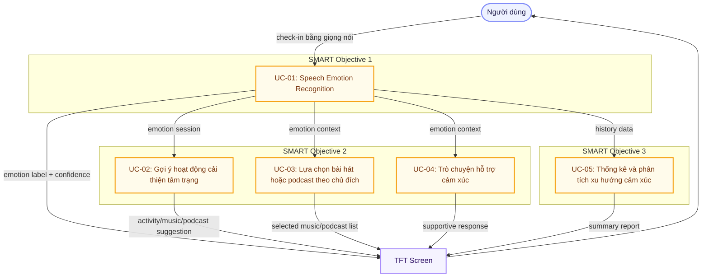

# 03. Mục tiêu

## 3.1. Tổng quan

Ba SMART objective của EmotiCare AIoT tạo thành một vòng lặp vận hành trên thiết bị, trong đó TFT là giao diện theo dõi chính, Edge AI xử lý tác vụ nhận diện cảm xúc cốt lõi, còn Cloud hỗ trợ các chức năng cần dữ liệu dài hạn hoặc nội dung phong phú hơn.

| SMART Objective   | Mô tả đầy đủ                                                                                                                                                                                                               | Use case liên quan  | Vai trò trong vòng lặp                                                               |
| ----------------- | -------------------------------------------------------------------------------------------------------------------------------------------------------------------------------------------------------------------------- | ------------------- | ------------------------------------------------------------------------------------ |
| SMART Objective 1 | Phát hiện và phân loại trạng thái cảm xúc của người dùng trong vòng 15 giây sau mỗi lần tương tác bằng giọng nói hợp lệ, đồng thời lưu lại kết quả của từng phiên để phục vụ theo dõi và phân tích cảm xúc theo thời gian. | UC-01               | Tạo emotion session làm dữ liệu nền cho các chức năng hỗ trợ và báo cáo              |
| SMART Objective 2 | Đề xuất ít nhất một hoạt động, bài hát, podcast hoặc một phản hồi đồng cảm phù hợp trong vòng 20 giây khi người dùng yêu cầu hỗ trợ và thiết bị có Internet.                                                               | UC-02, UC-03, UC-04 | Biến dữ liệu cảm xúc hoặc nhu cầu trực tiếp từ HOME thành hành động hỗ trợ cụ thể    |
| SMART Objective 3 | Tự động tạo tóm tắt thống kê và phân tích cảm xúc theo ngày, tuần và tháng trên Cloud Service, sau đó trả kết quả rút gọn về TFT screen trong vòng 180 giây sau khi người dùng yêu cầu hoặc sau một chu kỳ đồng bộ.        | UC-05               | Giúp người dùng nhìn lại xu hướng cảm xúc và hiệu quả của hoạt động/nội dung đã chọn |

### Bảng liên kết giá trị mang lại với yêu cầu

| Value proposition                                                  | SMART objective   | Use case | Giá trị người dùng mong đợi                                                               |
| ------------------------------------------------------------------ | ----------------- | -------- | ----------------------------------------------------------------------------------------- |
| Người dùng nhận biết cảm xúc nhanh mà không cần nhập liệu thủ công | SMART Objective 1 | UC-01    | Người dùng có emotion label và confidence ngay trên TFT sau một lần check-in ngắn         |
| Người dùng nhận hỗ trợ phù hợp khi đang cần điều chỉnh cảm xúc     | SMART Objective 2 | UC-02    | Người dùng nhận 5 hoạt động gợi ý mà không phải tự tìm                                    |
| Người dùng chủ động chọn nội dung nghe theo mục đích               | SMART Objective 2 | UC-03    | Người dùng chọn category và nhận danh sách bài hát/podcast phù hợp                        |
| Người dùng có kênh trò chuyện ngắn, đồng cảm và an toàn            | SMART Objective 2 | UC-04    | Người dùng nhận phản hồi ngắn gọn, không phán xét, có safety filter                       |
| Người dùng nhìn lại xu hướng cảm xúc dài hạn trên thiết bị         | SMART Objective 3 | UC-05    | Người dùng xem report cards theo ngày/tuần/tháng ngay trên TFT                            |

### Sơ đồ luồng mục tiêu tổng thể

```mermaid
flowchart TD
    User(["Người dùng"])
    TFT["TFT Screen"]

    subgraph O1["SMART Objective 1"]
        UC1["UC-01: Speech Emotion Recognition"]
    end

    subgraph O2["SMART Objective 2"]
        UC2["UC-02: Gợi ý hoạt động cải thiện tâm trạng"]
        UC3["UC-03: Lựa chọn bài hát hoặc podcast theo chủ đích"]
        UC4["UC-04: Trò chuyện hỗ trợ cảm xúc"]
    end

    subgraph O3["SMART Objective 3"]
        UC5["UC-05: Thống kê và phân tích xu hướng cảm xúc"]
    end

    User -->|"check-in bằng giọng nói"| UC1
    UC1 -->|"emotion label + confidence"| TFT
    UC1 -->|"emotion session"| UC2
    UC1 -->|"emotion context"| UC3
    UC1 -->|"emotion context"| UC4
    UC1 -->|"history data"| UC5
    UC2 -->|"activity/music/podcast suggestion"| TFT
    UC3 -->|"selected music/podcast list"| TFT
    UC4 -->|"supportive response"| TFT
    UC5 -->|"summary report"| TFT
    TFT --> User


    classDef userNode stroke:#818cf8,fill:#eef2ff,stroke-width:2px,color:#1e1b4b
    classDef edgeNode stroke:#a78bfa,fill:#f5f3ff,stroke-width:2px,color:#2e1065
    classDef cacheNode stroke:#2dd4bf,fill:#f0fdfa,stroke-width:2px,color:#0d5a57
    classDef cloudNode stroke:#38bdf8,fill:#f0f9ff,stroke-width:2px,color:#0c3d67
    classDef serviceNode stroke:#4ade80,fill:#f0fdf4,stroke-width:2px,color:#1a3a1a
    classDef actionNode stroke:#f59e0b,fill:#fffbeb,stroke-width:2px,color:#78350f
    class User userNode
    class TFT edgeNode
    class UC1,UC2,UC3,UC4,UC5 actionNode
```

*Mô tả chart: Flow chart này cho thấy Objective 1 tạo dữ liệu cảm xúc tại Edge, Objective 2 và Objective 3 dùng Cloud để xử lý nâng cao, còn mọi kết quả đều quay về TFT screen để người dùng theo dõi.*

---

## 3.2. SMART Objective 1: Phát hiện và phân loại trạng thái cảm xúc của người dùng bằng Speech Emotion Recognition trong vòng 15 giây sau mỗi lần tương tác bằng giọng nói hợp lệ, đồng thời lưu lại kết quả của từng phiên để phục vụ theo dõi cảm xúc theo thời gian

Objective 1 là nền tảng của toàn bộ hệ thống. Đây là objective duy nhất bắt buộc chạy được tại Edge Device khi mất Internet. Kết quả được hiển thị ngay trên TFT và được lưu vào local cache để đồng bộ cloud sau.

### 3.2.1. Tình huống sử dụng UC-01: Nhận diện cảm xúc bằng giọng nói

- **Input:** Giọng nói của người dùng.
- **Output:** Trạng thái cảm xúc, ví dụ: vui vẻ, bình thường, căng thẳng, buồn bã, tức giận, mệt mỏi.

**Mô tả:** Thiết bị sử dụng bài toán **Speech Emotion Recognition (SER)** để phân tích tín hiệu lời nói và suy luận trạng thái cảm xúc. Pipeline SER gồm thu âm có chủ đích, tiền xử lý, trích xuất Log-Mel Spectrogram, MFCC, pitch, energy hoặc embedding âm thanh, sau đó đưa vào mô hình phân loại đã được tối ưu cho edge. Kết quả được hiển thị trên TFT và lưu thành emotion session.

**Ý nghĩa của use case:** UC-01 giúp người dùng gọi tên trạng thái cảm xúc hiện tại mà không cần nhập nhật ký thủ công. Việc đặt use case là Speech Emotion Recognition làm rõ nguồn nhận diện chính là tín hiệu lời nói.

**Vai trò trong objective:** UC-01 là điểm bắt đầu của vòng lặp chăm sóc cảm xúc, nơi giọng nói được chuyển thành emotion label, confidence score và emotion session trong giới hạn 15 giây.

| Trường             | Nội dung                                                                                                                                                                                                                                                                                                                              |
| ------------------ | ------------------------------------------------------------------------------------------------------------------------------------------------------------------------------------------------------------------------------------------------------------------------------------------------------------------------------------- |
| Use case ID        | UC-01                                                                                                                                                                                                                                                                                                                                 |
| Tên use case       | Speech Emotion Recognition                                                                                                                                                                                                                                                                                                            |
| Tác nhân chính     | Người dùng                                                                                                                                                                                                                                                                                                                            |
| Tác nhân phụ       | Edge Device, TFT Screen                                                                                                                                                                                                                                                                                                               |
| Mục tiêu           | Xác định trạng thái cảm xúc hiện tại sau một lần tương tác bằng giọng nói                                                                                                                                                                                                                                                             |
| Tiền điều kiện     | Thiết bị đã bật, microphone sẵn sàng, người dùng chủ động kích hoạt check-in                                                                                                                                                                                                                                                          |
| Kích hoạt          | Người dùng nhấn nút Check-in và nói một câu hoặc một đoạn chia sẻ ngắn                                                                                                                                                                                                                                                                |
| Luồng chính        | 1. Người dùng kích hoạt thu âm. 2. Thiết bị hiển thị trạng thái đang nghe trên TFT. 3. Thiết bị ghi âm trong thời lượng giới hạn. 4. Edge AI tiền xử lý âm thanh. 5. Hệ thống trích xuất đặc trưng SER. 6. Mô hình SER phân loại cảm xúc và trả confidence. 7. TFT hiển thị kết quả. 8. Hệ thống lưu emotion session vào local cache. |
| Luồng thay thế     | Nếu âm thanh quá ngắn, quá nhiễu hoặc confidence thấp, thiết bị yêu cầu người dùng nói lại hoặc lưu kết quả là `uncertain`. Nếu mất Internet, session vẫn được lưu cục bộ.                                                                                                                                                            |
| Hậu điều kiện      | Emotion session được tạo và sẵn sàng đồng bộ cloud khi có Internet                                                                                                                                                                                                                                                                    |
| Dữ liệu vào        | Audio sample, Log-Mel Spectrogram, MFCC, pitch, energy hoặc embedding âm thanh                                                                                                                                                                                                                                                        |
| Dữ liệu ra         | Emotion label, confidence score, timestamp, session ID, sync status                                                                                                                                                                                                                                                                   |
| Mục tiêu hiệu năng | Hoàn tất trong vòng 15 giây                                                                                                                                                                                                                                                                                                           |

#### Kỹ thuật SER triển khai tại Edge

SER chạy theo pipeline `PCM/WAV mono → trích xuất đặc trưng → phân loại → nhãn cảm xúc`. Đầu vào là PCM có dấu 16-bit, một kênh và tối thiểu 2.048 mẫu. Thu âm, kiểm tra chất lượng và suy luận chạy trong task thông thường của ESP32, không chạy trong ISR; workspace được cấp phát tĩnh để không làm tràn stack FreeRTOS. Suy luận không phụ thuộc Internet và không tự tải audio thô lên Cloud.

Schema `ravdess-mfcc45-v1` gồm 45 đặc trưng: trung bình/độ lệch chuẩn của 13 MFCC, 12 chroma, RMS, zero-crossing rate, spectral centroid, bandwidth, rolloff, flatness và contrast. Tập huấn luyện dùng 1.440 mẫu RAVDESS Audio-only Speech với tám nhãn gốc `neutral`, `calm`, `happy`, `sad`, `angry`, `fearful`, `disgust`, `surprised`; nhãn nội bộ phải được ánh xạ rõ, còn mẫu nhiễu hoặc thiếu tin cậy trả `uncertain`.

Mô hình tham chiếu là Extra Trees 100 cây, `float32`, `class_weight=balanced`, seed 42; đánh giá bằng accuracy, macro F1 trên tập 80/20 có phân tầng và tập actor-held-out (actor 21–24). Mô hình được xuất C/C++ bằng emlearn; bản gọn ESP32 dùng Random Forest độc lập và phải được đánh giá lại. nguồn [13]–[14].

#### Sơ đồ luồng

```mermaid
flowchart LR
    Start([Bắt đầu])
    Activate["Người dùng kích hoạt Check-in"]
    Record["Thiết bị ghi âm có giới hạn thời gian"]
    Valid{"Âm thanh hợp lệ?"}
    Retry["Yêu cầu người dùng nói lại"]
    Preprocess["Tiền xử lý âm thanh"]
    Feature["Trích xuất Log-Mel / MFCC / pitch / energy"]
    Infer["Mô hình SER phân loại cảm xúc"]
    Confidence{"Confidence đủ cao?"}
    Uncertain["Đánh dấu uncertain hoặc yêu cầu xác nhận"]
    Save["Lưu emotion session"]
    Display["Hiển thị cảm xúc trên TFT"]
    End([Kết thúc])

    Start --> Activate --> Record --> Valid
    Valid -- "Không" --> Retry --> Record
    Valid -- "Có" --> Preprocess --> Feature --> Infer --> Confidence
    Confidence -- "Không" --> Uncertain --> Save
    Confidence -- "Có" --> Save
    Save --> Display --> End


    classDef userNode stroke:#818cf8,fill:#eef2ff,stroke-width:2px,color:#1e1b4b
    classDef edgeNode stroke:#a78bfa,fill:#f5f3ff,stroke-width:2px,color:#2e1065
    classDef cacheNode stroke:#2dd4bf,fill:#f0fdfa,stroke-width:2px,color:#0d5a57
    classDef cloudNode stroke:#38bdf8,fill:#f0f9ff,stroke-width:2px,color:#0c3d67
    classDef serviceNode stroke:#4ade80,fill:#f0fdf4,stroke-width:2px,color:#1a3a1a
    classDef actionNode stroke:#f59e0b,fill:#fffbeb,stroke-width:2px,color:#78350f
    class Display edgeNode
    class Record serviceNode
    class Start,Activate,Valid,Retry,Preprocess,Feature,Infer,Confidence,Uncertain,Save,End actionNode
```

*Mô tả chart: Flow chart này mô tả tuần tự xử lý SER từ lúc người dùng check-in đến khi TFT hiển thị cảm xúc và local cache lưu phiên.*

---

## 3.3. SMART Objective 2: Đề xuất ít nhất một hoạt động hoặc một phản hồi phù hợp thông qua Cloud Service trong vòng 20 giây sau khi hoàn tất nhận diện cảm xúc và thiết bị có Internet, nhằm cải thiện hoặc duy trì trạng thái cảm xúc của người dùng

Objective 2 không chạy độc lập hoàn toàn trên Edge. Sau khi UC-01 tạo emotion label, thiết bị gửi context lên Cloud Service để nhận gợi ý hoạt động hoặc phản hồi hội thoại, sau đó hiển thị kết quả trên TFT.

### 3.3.1. Tình huống sử dụng UC-02: Gợi ý hoạt động cải thiện tâm trạng

- **Input:** Trạng thái cảm xúc hiện tại nếu có, chủ đích hỗ trợ nhanh và lịch sử tương tác đã đồng bộ.
- **Output:** Năm thẻ hoạt động phù hợp hiển thị trên TFT.

**Mô tả:** Cloud Recommendation Service đề xuất năm hoạt động ngắn, an toàn và phù hợp với emotion label nếu đã có, chủ đích hỗ trợ nhanh, lịch sử tương tác và feedback trước đó. Danh sách hoạt động có thể gồm hít thở, grounding, nghỉ ngơi, vận động nhẹ, ghi nhật ký cảm xúc hoặc kết nối với người thân. Gợi ý bài hát và podcast thuộc UC-03.

**Ý nghĩa của use case:** UC-02 biến nhận biết cảm xúc hoặc nhu cầu hỗ trợ nhanh thành các lựa chọn chăm sóc cụ thể. Người dùng có thể mở Activity trực tiếp từ HOME, hoặc dùng kết quả UC-01 nếu vừa check-in cảm xúc trước đó.

**Vai trò trong objective:** UC-02 là nhánh hỗ trợ nhanh sau nhận diện cảm xúc, trong đó Cloud xử lý recommendation còn TFT hiển thị kết quả ngắn gọn để người dùng chọn.

| Trường             | Nội dung                                                                                                                                                                                                                                                                                                                                                                                       |
| ------------------ | ---------------------------------------------------------------------------------------------------------------------------------------------------------------------------------------------------------------------------------------------------------------------------------------------------------------------------------------------------------------------------------------------- |
| Use case ID        | UC-02                                                                                                                                                                                                                                                                                                                                                                                          |
| Tên use case       | Gợi ý hoạt động cải thiện tâm trạng                                                                                                                                                                                                                                                                                                                                                            |
| Tác nhân chính     | Người dùng                                                                                                                                                                                                                                                                                                                                                                                     |
| Tác nhân phụ       | Edge Device, Cloud Recommendation Service, TFT Screen                                                                                                                                                                                                                                                                                                                                          |
| Tiền điều kiện     | Thiết bị có Internet. Emotion label là tùy chọn; nếu chưa có, Cloud dùng chế độ gợi ý chung an toàn và lịch sử gần nhất.                                                                                                                                                                                                                                                                       |
| Kích hoạt          | Người dùng chọn Activity từ HOME hoặc từ RESULT/SUPPORT                                                                                                                                                                                                                                                                                                                                        |
| Luồng chính        | 1. Người dùng chọn Activity. 2. Thiết bị gửi emotion context nếu có, kèm lịch sử gần nhất lên Cloud. 3. Cloud lấy lịch sử hoạt động và feedback. 4. Cloud chọn, xếp hạng năm hoạt động phù hợp. 5. Cloud trả năm activity card về Edge Device. 6. TFT hiển thị các card gợi ý. 7. Người dùng chọn, bỏ qua hoặc đánh giá. 8. Thiết bị gửi feedback lên Cloud. |
| Luồng thay thế     | Nếu Internet lỗi, TFT hiển thị thông báo cần kết nối Internet để lấy gợi ý cloud.                                                                                                                                                                                                                                                                                                              |
| Dữ liệu vào        | Optional emotion label, optional confidence score, recent session history, activity feedback                                                                                                                                                                                                                                                                                                    |
| Dữ liệu ra         | 5 activity cards, reason text, selected/skipped status, feedback score                                                                                                                                                                                                                                                                                                                          |
| Mục tiêu hiệu năng | Cloud trả kết quả về TFT trong vòng 20 giây                                                                                                                                                                                                                                                                                                                                                    |

#### Kỹ thuật gợi ý hành động

Danh mục có mười hoạt động: `breathing`, `grounding`, `rest`, `rest_water`, `movement`, `journaling`, `body_scan`, `task_reset`, `gratitude`, `reach_out`. Mỗi cảm xúc có tám ứng viên ưu tiên riêng. Hệ thống luôn trả năm card, với `score_action(a) = 0,70 × emotion_priority(a) + 0,30 × personal_feedback(a) − 0,25 × recent_exposure(a)`. Feedback kết hợp tỷ lệ đã chọn (45%) và rating chuẩn hóa quanh mức 3 (55%), tăng dần độ tin cậy trong ba feedback đầu; `recent_exposure` phạt hoạt động xuất hiện trong hai lần gợi ý gần nhất. Cách này giữ an toàn theo cảm xúc nhưng luân phiên được hoạt động, và lý do trên card cho biết khi có phản hồi tích cực hoặc cần làm mới gợi ý.

#### Sơ đồ luồng

```mermaid
flowchart LR
    Start([Bắt đầu])
    Emotion["Nhận emotion label từ UC-01"]
    Online{"Có Internet?"}
    NeedNet["TFT hiển thị yêu cầu kết nối Internet"]
    Send["Gửi context lên Cloud Recommendation API"]
    Rank["Cloud chọn và xếp hạng 5 hoạt động"]
    Return["Cloud trả danh sách card rút gọn"]
    Display["TFT hiển thị 5 activity card"]
    Feedback["Người dùng chọn/bỏ qua/đánh giá"]
    Save["Đồng bộ feedback lên Cloud"]
    End([Kết thúc])

    Start --> Emotion --> Online
    Online -- "Không" --> NeedNet --> End
    Online -- "Có" --> Send --> Rank --> Return --> Display --> Feedback --> Save --> End


    classDef userNode stroke:#818cf8,fill:#eef2ff,stroke-width:2px,color:#1e1b4b
    classDef edgeNode stroke:#a78bfa,fill:#f5f3ff,stroke-width:2px,color:#2e1065
    classDef cacheNode stroke:#2dd4bf,fill:#f0fdfa,stroke-width:2px,color:#0d5a57
    classDef cloudNode stroke:#38bdf8,fill:#f0f9ff,stroke-width:2px,color:#0c3d67
    classDef serviceNode stroke:#4ade80,fill:#f0fdf4,stroke-width:2px,color:#1a3a1a
    classDef actionNode stroke:#f59e0b,fill:#fffbeb,stroke-width:2px,color:#78350f
    class Display edgeNode
    class Feedback cloudNode
    class Start,Emotion,Online,NeedNet,Send,Rank,Return,Save,End actionNode
```

*Mô tả chart: Flow chart này mô tả quá trình lấy năm gợi ý hoạt động từ Cloud rồi hiển thị kết quả lên TFT, bao gồm cả nhánh khi thiết bị không có Internet.*

### 3.3.2. Tình huống sử dụng UC-03: Lựa chọn bài hát hoặc podcast theo chủ đích

- **Input:** Chủ đích của người dùng, category nội dung mong muốn và emotion label gần nhất nếu có.
- **Output:** Danh sách bài hát hoặc podcast theo category hiển thị trên TFT.

**Mô tả:** Người dùng có thể chủ động chọn nghe bài hát hoặc podcast ngay từ HOME, không bắt buộc phải check-in cảm xúc trước. Cloud Media Recommendation Service phân loại nội dung theo các category như thư giãn, tập trung, ngủ nghỉ, vui vẻ, giảm căng thẳng, truyền cảm hứng, podcast ngắn, podcast thiền, podcast chia sẻ cảm xúc. Nếu có emotion context từ check-in gần nhất thì Cloud dùng để cá nhân hóa; nếu chưa có, Cloud ưu tiên category và chủ đích người dùng chọn.

**Ý nghĩa của use case:** UC-03 cho người dùng quyền chủ động hơn. Thay vì chỉ chờ hệ thống gợi ý, người dùng có thể nói rõ mình muốn nghe nhạc thư giãn, podcast động viên hoặc nội dung giúp tập trung.

**Vai trò trong objective:** UC-03 mở rộng Objective 2 từ hỗ trợ phản ứng theo cảm xúc sang hỗ trợ theo chủ đích, vẫn dùng Cloud để chọn nội dung và TFT để hiển thị danh sách.

#### Kỹ thuật gợi ý nhạc và podcast

Có hai luồng. Luồng theo chủ đích lọc theo `category → user_intent → emotion_label`, chỉ xét media đang bật và xếp hạng theo `(ưu tiên category, feedback, tiêu đề)`. Luồng gợi ý nhạc/podcast theo cảm xúc dùng hybrid ranker: 56% mức phù hợp cảm xúc, 22% sở thích từng item, 12% sở thích category, 10% độ mới. Feedback giảm theo half-life 45 ngày, rating 3 là trung tính và có shrinkage; item vừa nghe bị phạt trong 14 ngày. MMR chọn danh sách cuối với `0,86 × relevance − 0,14 × similarity`, phạt trùng category 0,70 và creator 0,30 để tăng đa dạng.

| Trường             | Nội dung                                                                                                                                                                                                                                                                                                                                                                                                |
| ------------------ | ------------------------------------------------------------------------------------------------------------------------------------------------------------------------------------------------------------------------------------------------------------------------------------------------------------------------------------------------------------------------------------------------------- |
| Use case ID        | UC-03                                                                                                                                                                                                                                                                                                                                                                                                   |
| Tên use case       | Lựa chọn bài hát hoặc podcast theo chủ đích                                                                                                                                                                                                                                                                                                                                                             |
| Tác nhân chính     | Người dùng                                                                                                                                                                                                                                                                                                                                                                                              |
| Tác nhân phụ       | Edge Device, Cloud Media Recommendation Service, TFT Screen                                                                                                                                                                                                                                                                                                                                             |
| Tiền điều kiện     | Thiết bị có Internet và người dùng chọn Music/Podcast Mode                                                                                                                                                                                                                                                                                                                                              |
| Kích hoạt          | Người dùng chọn category hoặc nói chủ đích nghe nội dung                                                                                                                                                                                                                                                                                                                                                |
| Luồng chính        | 1. Người dùng chọn Music/Podcast từ HOME hoặc SUPPORT. 2. Người dùng chọn Music, Podcast hoặc Both. 3. Người dùng chọn category hoặc nói chủ đích. 4. Thiết bị gửi category, intent và emotion context nếu có lên Cloud. 5. Cloud lọc danh sách bài hát/podcast theo category. 6. Cloud xếp hạng nội dung phù hợp. 7. TFT hiển thị danh sách rút gọn. 8. Người dùng chọn nội dung để nghe hoặc lưu lại. |
| Luồng thay thế     | Nếu Internet lỗi, TFT hiển thị thông báo cần kết nối Cloud để lấy danh sách nội dung. Nếu category không có nội dung, Cloud trả category gần nhất.                                                                                                                                                                                                                                                      |
| Dữ liệu vào        | User intent, selected category, optional emotion label, optional confidence score, listening history                                                                                                                                                                                                                                                                                                    |
| Dữ liệu ra         | Song list, podcast list, category, reason text, selected media item                                                                                                                                                                                                                                                                                                                                     |
| Mục tiêu hiệu năng | Danh sách nội dung hiển thị trên TFT trong vòng 20 giây                                                                                                                                                                                                                                                                                                                                                 |

#### Nhóm nội dung

| Category            | Nội dung phù hợp                                         | Ví dụ mục đích          |
| ------------------- | -------------------------------------------------------- | ----------------------- |
| Thư giãn            | Nhạc nhẹ, ambient, podcast thở chậm                      | Giảm căng thẳng         |
| Tập trung           | Nhạc không lời, white noise, podcast hướng dẫn tập trung | Học tập/làm việc        |
| Ngủ nghỉ            | Nhạc chậm, sleep story, podcast thiền ngủ                | Chuẩn bị nghỉ ngơi      |
| Vui vẻ              | Nhạc tích cực, podcast truyền cảm hứng                   | Duy trì cảm xúc tốt     |
| Xoa dịu buồn bã     | Nhạc ấm, podcast chia sẻ cảm xúc                         | Cảm thấy được đồng hành |
| Giải tỏa tức giận   | Nhạc grounding, podcast kiểm soát cảm xúc                | Tạm dừng và hạ nhịp     |
| Phục hồi năng lượng | Nhạc nhẹ có nhịp vừa, podcast self-care                  | Khi mệt mỏi             |

#### Sơ đồ luồng

```mermaid
flowchart LR
    Start([Bắt đầu])
    SelectMode["Người dùng chọn Music/Podcast Mode"]
    ChooseCategory["Chọn category hoặc nói chủ đích"]
    Online{"Có Internet?"}
    NeedNet["TFT hiển thị yêu cầu kết nối Internet"]
    Send["Gửi category + emotion context lên Cloud"]
    Filter["Cloud lọc bài hát và podcast"]
    Rank["Cloud xếp hạng nội dung phù hợp"]
    Display["TFT hiển thị danh sách"]
    SelectItem["Người dùng chọn nội dung"]
    Save["Đồng bộ media selection log"]
    End([Kết thúc])

    Start --> SelectMode --> ChooseCategory --> Online
    Online -->|Không| NeedNet --> End
    Online -->|Có| Send --> Filter --> Rank --> Display --> SelectItem --> Save --> End

    classDef userNode stroke:#818cf8,fill:#eef2ff,stroke-width:2px,color:#1e1b4b
    classDef edgeNode stroke:#a78bfa,fill:#f5f3ff,stroke-width:2px,color:#2e1065
    classDef cacheNode stroke:#2dd4bf,fill:#f0fdfa,stroke-width:2px,color:#0d5a57
    classDef cloudNode stroke:#38bdf8,fill:#f0f9ff,stroke-width:2px,color:#0c3d67
    classDef serviceNode stroke:#4ade80,fill:#f0fdf4,stroke-width:2px,color:#1a3a1a
    classDef actionNode stroke:#f59e0b,fill:#fffbeb,stroke-width:2px,color:#78350f
    class Display edgeNode
    class Start,SelectMode,ChooseCategory,Online,NeedNet,Send,Filter,Rank,SelectItem,Save,End actionNode
```

*Mô tả chart: Flow chart này mô tả quá trình người dùng chủ động chọn category bài hát/podcast, Cloud trả danh sách phù hợp và thiết bị ghi nhận lựa chọn.*

### 3.3.3. Tình huống sử dụng UC-04: Trò chuyện hỗ trợ cảm xúc

- **Input:** Giọng nói hoặc câu hỏi của người dùng cùng emotion context.
- **Output:** Phản hồi đồng cảm hiển thị trên TFT.

**Mô tả:** Người dùng có thể mở Conversation Mode trực tiếp từ HOME hoặc sau khi check-in cảm xúc. Thiết bị gửi nội dung chia sẻ của người dùng lên Cloud Conversation Service; nếu có emotion context thì gửi kèm để phản hồi phù hợp hơn. Cloud tạo phản hồi đồng cảm, kiểm tra an toàn, rút gọn nội dung và trả về thiết bị để hiển thị trên TFT.

**Ý nghĩa của use case:** UC-04 phù hợp khi người dùng cần được lắng nghe và phản hồi hơn là chỉ nhận một danh sách hoạt động hoặc nội dung nghe.

**Vai trò trong objective:** UC-04 là nhánh hỗ trợ bằng hội thoại, dùng Cloud để tạo phản hồi linh hoạt nhưng vẫn ràng buộc an toàn.

| Trường             | Nội dung                                                                                                                                                                                                                                                                                                                                            |
| ------------------ | --------------------------------------------------------------------------------------------------------------------------------------------------------------------------------------------------------------------------------------------------------------------------------------------------------------------------------------------------- |
| Use case ID        | UC-04                                                                                                                                                                                                                                                                                                                                               |
| Tên use case       | Trò chuyện hỗ trợ cảm xúc                                                                                                                                                                                                                                                                                                                           |
| Tác nhân chính     | Người dùng                                                                                                                                                                                                                                                                                                                                          |
| Tác nhân phụ       | Edge Device, Cloud Conversation Service, TFT Screen                                                                                                                                                                                                                                                                                                 |
| Tiền điều kiện     | Thiết bị có Internet và người dùng chọn Conversation Mode. Emotion label là tùy chọn; nếu chưa có, Cloud dùng câu chia sẻ hiện tại làm ngữ cảnh chính.                                                                                                                                                                                              |
| Kích hoạt          | Người dùng nói tiếp, đặt câu hỏi hoặc yêu cầu thiết bị trò chuyện                                                                                                                                                                                                                                                                                   |
| Luồng chính        | 1. Người dùng chọn Conversation từ HOME hoặc SUPPORT. 2. Người dùng chia sẻ bằng giọng nói. 3. Edge Device gửi nội dung chia sẻ và emotion context nếu có lên Cloud. 4. Cloud tạo phản hồi đồng cảm. 5. Safety Filter kiểm tra phản hồi. 6. Cloud trả phản hồi rút gọn. 7. TFT hiển thị phản hồi. 8. Metadata được đồng bộ nếu người dùng cho phép. |
| Luồng thay thế     | Nếu phát hiện tín hiệu nguy cấp, Cloud trả thông điệp khuyên liên hệ người thân, chuyên gia hoặc dịch vụ hỗ trợ phù hợp.                                                                                                                                                                                                                            |
| Dữ liệu vào        | User utterance, optional emotion label, optional confidence score, conversation context                                                                                                                                                                                                                                                             |
| Dữ liệu ra         | Empathetic response, suggested next action, safety flag                                                                                                                                                                                                                                                                                             |
| Mục tiêu hiệu năng | Phản hồi đầu tiên hiển thị trên TFT trong vòng 20 giây                                                                                                                                                                                                                                                                                              |

#### Kỹ thuật LLM và an toàn hội thoại

Cloud xác thực phiên, sau đó dùng bộ lọc từ khóa xác định `high`, `medium`, `low` hoặc `none`. Mức `high`/`medium` không gọi LLM mà trả mẫu phản hồi an toàn cùng `next_action`; nội dung nguy cấp được che trước khi lưu. Với `low`/`none`, Gemini hoặc Groq nhận prompt gồm emotion label và nội dung người dùng, tạo phản hồi tiếng Việt ngắn, không chẩn đoán, chỉ nêu một bước nhỏ và một câu hỏi mở. Kết quả giới hạn 500 ký tự; bản ghi âm quá dài/lặp được yêu cầu nói lại thay vì gửi sang LLM.

#### Sơ đồ luồng

```mermaid
flowchart LR
    Start([Bắt đầu])
    Speech["Người dùng chia sẻ hoặc đặt câu hỏi"]
    Online{"Có Internet?"}
    NeedNet["TFT hiển thị yêu cầu kết nối Internet"]
    Send["Gửi emotion context lên Cloud"]
    Generate["Cloud tạo phản hồi đồng cảm"]
    Safety{"Phản hồi an toàn?"}
    Rewrite["Điều chỉnh phản hồi"]
    Crisis{"Có tín hiệu nguy cấp?"}
    Support["Trả thông điệp liên hệ hỗ trợ"]
    Reply["TFT hiển thị phản hồi"]
    Save["Lưu metadata theo consent"]
    End([Kết thúc])

    Start --> Speech --> Online
    Online -- "Không" --> NeedNet --> End
    Online -- "Có" --> Send --> Generate --> Safety
    Safety -- "Không" --> Rewrite --> Crisis
    Safety -- "Có" --> Crisis
    Crisis -- "Có" --> Support --> Save --> End
    Crisis -- "Không" --> Reply --> Save --> End


    classDef userNode stroke:#818cf8,fill:#eef2ff,stroke-width:2px,color:#1e1b4b
    classDef edgeNode stroke:#a78bfa,fill:#f5f3ff,stroke-width:2px,color:#2e1065
    classDef cacheNode stroke:#2dd4bf,fill:#f0fdfa,stroke-width:2px,color:#0d5a57
    classDef cloudNode stroke:#38bdf8,fill:#f0f9ff,stroke-width:2px,color:#0c3d67
    classDef serviceNode stroke:#4ade80,fill:#f0fdf4,stroke-width:2px,color:#1a3a1a
    classDef actionNode stroke:#f59e0b,fill:#fffbeb,stroke-width:2px,color:#78350f
    class Safety serviceNode
    class Start,Speech,Online,NeedNet,Send,Generate,Rewrite,Crisis,Support,Reply,Save,End actionNode
```

*Mô tả chart: Flow chart này mô tả luồng hội thoại cloud-assisted, bao gồm kiểm tra Internet, safety filter và nhánh xử lý tín hiệu nguy cấp.*

---

## 3.4. SMART Objective 3: Tự động tạo tóm tắt thống kê và phân tích cảm xúc theo ngày, tuần và tháng trên Cloud Service, sau đó trả kết quả rút gọn về TFT screen trong vòng 180 giây sau khi người dùng yêu cầu hoặc sau một chu kỳ đồng bộ

Objective 3 giúp người dùng theo dõi dài hạn trực tiếp trên thiết bị. Cloud xử lý tổng hợp dữ liệu, còn thiết bị hiển thị phiên bản rút gọn phù hợp với màn hình TFT.

### 3.4.1. Tình huống sử dụng UC-05: Thống kê và phân tích xu hướng cảm xúc

- **Input:** Lịch sử cảm xúc, activity logs, media selection logs và conversation metadata đã đồng bộ.
- **Output:** Báo cáo rút gọn theo ngày, tuần và tháng hiển thị trên TFT.

**Mô tả:** Cloud Report Engine tổng hợp dữ liệu cảm xúc theo nhiều mốc thời gian, tính tỷ lệ cảm xúc, xu hướng thay đổi và hiệu quả hoạt động. Kết quả được nén thành các thẻ thông tin ngắn để hiển thị trên TFT.

**Ý nghĩa của use case:** UC-05 biến các phiên cảm xúc rời rạc thành bức tranh dài hạn, giúp người dùng theo dõi xu hướng ngay trên thiết bị phần cứng.

**Vai trò trong objective:** UC-05 là phần tổng hợp dữ liệu dài hạn của hệ thống, dùng Cloud cho xử lý nặng và TFT cho hiển thị.

| Trường             | Nội dung                                                                                                                                                                                                                                                                                                                                                                                             |
| ------------------ | ---------------------------------------------------------------------------------------------------------------------------------------------------------------------------------------------------------------------------------------------------------------------------------------------------------------------------------------------------------------------------------------------------- |
| Use case ID        | UC-05                                                                                                                                                                                                                                                                                                                                                                                                |
| Tên use case       | Thống kê và phân tích xu hướng cảm xúc                                                                                                                                                                                                                                                                                                                                                               |
| Tác nhân chính     | Người dùng                                                                                                                                                                                                                                                                                                                                                                                           |
| Tác nhân phụ       | Edge Device, Cloud Report Engine, TFT Screen                                                                                                                                                                                                                                                                                                                                                         |
| Tiền điều kiện     | Có dữ liệu đã đồng bộ lên Cloud                                                                                                                                                                                                                                                                                                                                                                      |
| Kích hoạt          | Người dùng mở Report từ HOME/TFT hoặc thiết bị hoàn tất một chu kỳ đồng bộ                                                                                                                                                                                                                                                                                                                           |
| Luồng chính        | 1. Người dùng chọn Report từ HOME. 2. TFT hiển thị lựa chọn ngày, tuần hoặc tháng. 3. Người dùng chọn period cần xem. 4. Thiết bị gửi yêu cầu report theo period. 5. Cloud Report Engine lấy emotion sessions và logs. 6. Cloud tính phân bố cảm xúc. 7. Cloud phân tích xu hướng và hiệu quả hoạt động/nội dung. 8. Cloud tạo report rút gọn. 9. Thiết bị nhận report và hiển thị kết quả trên TFT. |
| Luồng thay thế     | Nếu dữ liệu quá ít, Cloud trả report `limited_data` và TFT hiển thị khuyến nghị check-in thêm.                                                                                                                                                                                                                                                                                                       |
| Dữ liệu vào        | Emotion sessions, activity logs, media selection logs, conversation metadata, selected period                                                                                                                                                                                                                                                                                                        |
| Dữ liệu ra         | TFT report cards, trend summary, activity effectiveness, data quality                                                                                                                                                                                                                                                                                                                                |
| Mục tiêu hiệu năng | Báo cáo rút gọn hiển thị trên TFT trong vòng 180 giây                                                                                                                                                                                                                                                                                                                                                |

#### Kỹ thuật thống kê và tạo báo cáo

Báo cáo dùng thống kê xác định, LLM không quyết định số liệu. Kỳ hỗ trợ là `daily`, `weekly`, `monthly`; session được chọn theo `client_created_at` rồi dự phòng `created_at`, luôn cùng `user_id` và `device_id`. Phân bố là tỷ lệ số phiên từng nhãn. Nhóm cần hỗ trợ gồm `stressed`, `angry`, `sad`, `tired`; xu hướng so sánh nửa đầu/nửa cuối kỳ, với `delta ≤ −0,15` là cải thiện và `delta ≥ 0,15` là cần chú ý.

Ngưỡng báo cáo đầy đủ là ba phiên. Dưới ngưỡng trả `limited_data`; từ ngưỡng trở lên trả `enough_data` cùng các thẻ hiệu quả gợi ý, hoạt động, media và hội thoại. LLM, nếu được gọi, chỉ diễn giải số liệu đã chốt thành 2–3 câu tiếng Việt, không chẩn đoán y khoa.

#### Sơ đồ luồng

```mermaid
flowchart LR
    Start([Bắt đầu])
    Trigger["Người dùng mở Report trên TFT hoặc hoàn tất sync"]
    Online{"Có Internet?"}
    NeedNet["TFT hiển thị yêu cầu kết nối Internet"]
    Request["Edge gửi report request lên Cloud"]
    Load["Cloud lấy emotion sessions và logs"]
    Enough{"Dữ liệu đủ phân tích?"}
    Limited["Tạo report limited_data"]
    Aggregate["Tính phân bố cảm xúc"]
    Trend["Phân tích xu hướng"]
    Effect["Phân tích hiệu quả hoạt động"]
    Compact["Rút gọn thành TFT report cards"]
    Display["TFT hiển thị báo cáo"]
    End([Kết thúc])

    Start --> Trigger --> Online
    Online -- "Không" --> NeedNet --> End
    Online -- "Có" --> Request --> Load --> Enough
    Enough -- "Không" --> Limited --> Compact
    Enough -- "Có" --> Aggregate --> Trend --> Effect --> Compact
    Compact --> Display --> End


    classDef userNode stroke:#818cf8,fill:#eef2ff,stroke-width:2px,color:#1e1b4b
    classDef edgeNode stroke:#a78bfa,fill:#f5f3ff,stroke-width:2px,color:#2e1065
    classDef cacheNode stroke:#2dd4bf,fill:#f0fdfa,stroke-width:2px,color:#0d5a57
    classDef cloudNode stroke:#38bdf8,fill:#f0f9ff,stroke-width:2px,color:#0c3d67
    classDef serviceNode stroke:#4ade80,fill:#f0fdf4,stroke-width:2px,color:#1a3a1a
    classDef actionNode stroke:#f59e0b,fill:#fffbeb,stroke-width:2px,color:#78350f
    class Display edgeNode
    class Start,Trigger,Online,NeedNet,Request,Load,Enough,Limited,Aggregate,Trend,Effect,Compact,End actionNode
```

*Mô tả chart: Flow chart này mô tả cách thiết bị yêu cầu Cloud tạo báo cáo và nhận lại các thẻ tóm tắt để hiển thị trên TFT.*

## 3.5. Bảng tổng hợp tình huống sử dụng

| ID    | Use case                                        | Input                                          | Output                                     | Xử lý chính |
| ----- | ----------------------------------------------- | ---------------------------------------------- | ------------------------------------------ | ----------- |
| UC-01 | Speech Emotion Recognition                      | Giọng nói người dùng                           | Emotion label, confidence, emotion session | Edge AI     |
| UC-02 | Gợi ý hoạt động cải thiện tâm trạng             | Emotion label và lịch sử đã đồng bộ            | 5 activity card trên TFT                   | Cloud + TFT |
| UC-03 | Lựa chọn bài hát hoặc podcast theo chủ đích     | Chủ đích, category và emotion context          | Danh sách bài hát/podcast trên TFT         | Cloud + TFT |
| UC-04 | Trò chuyện hỗ trợ cảm xúc                       | Giọng nói/câu hỏi và emotion context           | Phản hồi đồng cảm trên TFT                 | Cloud + TFT |
| UC-05 | Thống kê và phân tích xu hướng cảm xúc          | Lịch sử cảm xúc, hoạt động và nội dung đã chọn | Báo cáo rút gọn trên TFT                   | Cloud + TFT |
