# 04. Edge AI

## 4.1. Vai trò của Edge AI trong Speech Emotion Recognition

Edge AI của EmotiCare AIoT tập trung vào bài toán **Speech Emotion Recognition (SER)**: nhận diện cảm xúc từ tín hiệu giọng nói. Thay vì dựa vào văn bản người dùng nhập hoặc dữ liệu sinh hoạt như giấc ngủ, hệ thống sử dụng âm thanh lời nói làm nguồn dữ liệu chính để suy luận trạng thái cảm xúc.

Edge AI phục vụ trực tiếp SMART Objective 1 và cung cấp emotion context cho Objective 2, Objective 3. Kết quả SER gồm `emotion_label`, `confidence_score`, `session_id`, timestamp và trạng thái đồng bộ. Các chức năng gợi ý, hội thoại và báo cáo không chạy hoàn toàn trên Edge; chúng cần Internet/Cloud Service và chỉ hiển thị kết quả cuối cùng trên TFT.

## 4.2. Cơ sở tham khảo kỹ thuật

Thiết kế SER của EmotiCare AIoT tham khảo ba nhóm nguồn:

| Nguồn | Giá trị tham khảo cho hệ thống |
| ----- | ------------------------------ |
| Bài tổng quan trên PubMed Central | Cung cấp bối cảnh học thuật về bài toán nhận diện cảm xúc từ lời nói và các hướng tiếp cận phổ biến trong SER |
| RAVDESS Emotional Speech Audio trên Kaggle | Cung cấp tập dữ liệu giọng nói cảm xúc có nhãn, phù hợp để huấn luyện/thử nghiệm prototype SER |
| Bài arXiv "Emotion Recognition from Speech" | So sánh các đặc trưng Log-Mel Spectrogram, MFCC, pitch, energy và các mô hình LSTM, CNN, HMM, DNN trên RAVDESS |

Từ các nguồn này, đặc tả chọn hướng thiết kế thực tế cho prototype:

* Dùng RAVDESS làm tập dữ liệu tham khảo chính cho nhãn cảm xúc và cấu trúc dữ liệu huấn luyện.
* Ưu tiên đặc trưng phổ thời gian như **Log-Mel Spectrogram** và **MFCC**.
* Bổ sung đặc trưng prosody như **pitch** và **energy** để hỗ trợ phân biệt cảm xúc.
* Ưu tiên mô hình CNN nhỏ hoặc CNN kết hợp lớp tuần tự nhẹ nếu cần, vì phù hợp hơn cho tối ưu edge so với mô hình quá lớn.
* Đánh giá mô hình bằng accuracy, confusion matrix và latency thay vì chỉ nhìn vào accuracy offline.

## 4.3. RAVDESS và ánh xạ nhãn cảm xúc

RAVDESS là tập dữ liệu âm thanh cảm xúc được sử dụng rộng rãi cho Speech Emotion Recognition. Dataset có các nhãn cảm xúc như neutral, calm, happy, sad, angry, fearful, disgust và surprised. Vì EmotiCare AIoT hướng đến chăm sóc cảm xúc hằng ngày, hệ thống ánh xạ nhãn nghiên cứu sang nhãn sản phẩm như sau:

| Nhãn RAVDESS / SER | Nhãn sản phẩm | Ý nghĩa trong EmotiCare AIoT |
| ------------------ | ------------- | ----------------------------- |
| neutral | Bình thường | Người dùng đang ở trạng thái ổn định |
| calm | Bình thường / thư giãn | Có thể duy trì trạng thái hiện tại |
| happy | Vui vẻ | Cảm xúc tích cực, nên củng cố thói quen tốt |
| sad | Buồn bã | Cần phản hồi đồng cảm hoặc hoạt động nhẹ |
| angry | Tức giận | Cần gợi ý tạm dừng, thở chậm, tránh phản ứng vội |
| fearful | Căng thẳng | Cần hỗ trợ giảm áp lực hoặc grounding |
| disgust | Khó chịu | Có thể gộp vào căng thẳng/tức giận tùy confidence |
| surprised | Không chắc chắn / kích hoạt cao | Cần xác nhận thêm nếu không đủ ngữ cảnh |
| tired | Mệt mỏi | Nhãn mở rộng của sản phẩm, cần dữ liệu bổ sung ngoài RAVDESS hoặc fine-tuning riêng |

## 4.4. Dữ liệu đầu vào và đầu ra

| Nhóm dữ liệu | Mô tả | Bắt buộc |
| ------------ | ----- | -------- |
| Audio sample | Đoạn giọng nói ngắn sau khi người dùng kích hoạt check-in | Có |
| Sampling rate | Tần số lấy mẫu thống nhất cho pipeline, ví dụ 16 kHz hoặc 22.05 kHz | Có |
| Log-Mel Spectrogram | Biểu diễn năng lượng theo thang Mel qua thời gian | Có trong hướng CNN |
| MFCC | Đặc trưng cepstral phổ biến trong xử lý tiếng nói | Nên có |
| Pitch | Cao độ giọng nói | Nên có |
| Energy | Năng lượng âm thanh | Nên có |
| Metadata | session_id, device_id, started_at, completed_at | Có |

| Đầu ra | Mô tả |
| ------ | ----- |
| emotion_label | Nhãn cảm xúc sau ánh xạ sang taxonomy của sản phẩm |
| confidence_score | Độ tin cậy của mô hình |
| top_k_predictions | Danh sách nhãn có xác suất cao nhất, dùng cho debug hoặc kiểm tra nội bộ |
| quality_flag | clean, noisy, too_short, low_confidence |
| inference_latency_ms | Thời gian xử lý trên thiết bị |

## 4.5. Pipeline SER trên Edge Device

```mermaid
flowchart LR
    Start([Người dùng kích hoạt Check-in])
    Capture["Thu âm có giới hạn thời gian"]
    Resample["Chuẩn hóa sample rate và mono channel"]
    VAD["Voice Activity Detection"]
    Denoise["Giảm nhiễu và chuẩn hóa âm lượng"]
    Segment{"Đoạn nói đủ dài?"}
    Retry["Yêu cầu người dùng nói lại"]
    Feature["Trích xuất Log-Mel, MFCC, pitch, energy"]
    Model["Mô hình SER đã tối ưu cho edge"]
    Confidence{"Confidence đạt ngưỡng?"}
    Label["Trả emotion label"]
    Uncertain["Gắn nhãn không chắc chắn"]
    Cache["Lưu emotion session"]
    Support["Chuyển emotion context cho gợi ý/trò chuyện"]
    End([Hoàn tất])

    Start --> Capture --> Resample --> VAD --> Denoise --> Segment
    Segment -- "Không" --> Retry --> Capture
    Segment -- "Có" --> Feature --> Model --> Confidence
    Confidence -- "Có" --> Label --> Cache --> Support --> End
    Confidence -- "Không" --> Uncertain --> Cache --> Support --> End


    classDef userNode stroke:#818cf8,fill:#eef2ff,stroke-width:2px,color:#1e1b4b
    classDef edgeNode stroke:#a78bfa,fill:#f5f3ff,stroke-width:2px,color:#2e1065
    classDef cacheNode stroke:#2dd4bf,fill:#f0fdfa,stroke-width:2px,color:#0d5a57
    classDef cloudNode stroke:#38bdf8,fill:#f0f9ff,stroke-width:2px,color:#0c3d67
    classDef serviceNode stroke:#4ade80,fill:#f0fdf4,stroke-width:2px,color:#1a3a1a
    classDef actionNode stroke:#f59e0b,fill:#fffbeb,stroke-width:2px,color:#78350f
    class Cache cacheNode
    class Start,Capture,Resample,VAD,Denoise,Segment,Retry,Feature,Model,Confidence,Label,Uncertain,Support,End actionNode
```

*Mô tả chart: Flow chart này mô tả pipeline Edge AI cho Speech Emotion Recognition, từ thu âm đến lưu emotion session và chuyển emotion context cho các chức năng cloud-assisted.*

## 4.6. Đặc trưng âm thanh

| Đặc trưng | Vai trò | Ghi chú triển khai |
| --------- | ------- | ------------------ |
| Log-Mel Spectrogram | Biểu diễn phổ thời gian phù hợp cho CNN | Bài arXiv ghi nhận Log-Mel là đặc trưng hiệu quả trong thử nghiệm với CNN trên RAVDESS |
| MFCC | Đặc trưng tiếng nói kinh điển | Hữu ích cho baseline hoặc mô hình nhẹ |
| Pitch | Mô tả cao độ | Hỗ trợ nhận biết kích hoạt cảm xúc như tức giận/căng thẳng |
| Energy | Mô tả cường độ | Hỗ trợ phân biệt giọng yếu, mạnh, kích động |
| Delta/Delta-delta | Biến thiên theo thời gian | Có thể bổ sung nếu tài nguyên cho phép |
| Duration/Pause ratio | Kiểm tra chất lượng đoạn nói | Hỗ trợ quality flag và retry |

## 4.7. Mô hình đề xuất

| Phương án | Mô tả | Khi sử dụng |
| --------- | ----- | ----------- |
| MFCC + classifier nhẹ | Baseline đơn giản, dễ chạy trên thiết bị | Prototype sớm hoặc phần cứng hạn chế |
| Log-Mel + 2D CNN nhỏ | Chuyển spectrogram thành đầu vào dạng ảnh cho CNN | Phương án chính cho prototype SER |
| CNN + LSTM/GRU nhẹ | CNN trích xuất đặc trưng, lớp tuần tự học biến thiên thời gian | Khi cần cải thiện trên câu nói dài hơn |
| Server-side training, edge-side inference | Huấn luyện trên máy/server, chuyển model tối ưu sang thiết bị | Phù hợp với workflow AIoT |

Mô hình triển khai trên edge cần được tối ưu bằng quantization hoặc định dạng inference nhẹ nếu phần cứng hạn chế. Với ESP32-S3, có thể cân nhắc TensorFlow Lite Micro hoặc chia tách: edge trích xuất đặc trưng và chạy model nhỏ, server dùng cho huấn luyện/cập nhật model.

## 4.8. Tập nhãn sản phẩm

| Nhãn sản phẩm | Nguồn học chính | Ghi chú |
| ------------- | --------------- | ------- |
| Vui vẻ | happy | Có thể học từ RAVDESS |
| Bình thường | neutral, calm | Gộp hai nhãn ổn định |
| Căng thẳng | fearful, surprised, một phần disgust | Cần tinh chỉnh bằng dữ liệu thực tế của sản phẩm |
| Buồn bã | sad | Có thể học từ RAVDESS |
| Tức giận | angry | Có thể học từ RAVDESS |
| Mệt mỏi | dữ liệu mở rộng | RAVDESS không đại diện trực tiếp; prototype có thể dùng rule/feedback hoặc thu thêm dữ liệu |
| Không chắc chắn | confidence thấp hoặc tín hiệu nhiễu | Không phải cảm xúc, là trạng thái chất lượng suy luận |

## 4.9. Logic confidence và quality flag

| Điều kiện | Hành vi hệ thống |
| --------- | ---------------- |
| `confidence_score >= 0.75` và `quality_flag = clean` | Hiển thị emotion label và chuyển sang hỗ trợ |
| `0.50 <= confidence_score < 0.75` | Hiển thị dạng "có thể là..." và cho phép người dùng xác nhận |
| `confidence_score < 0.50` | Gắn nhãn không chắc chắn, không dùng để kết luận xu hướng mạnh |
| `quality_flag = too_short` | Yêu cầu ghi âm lại |
| `quality_flag = noisy` | Cảnh báo môi trường nhiễu và đề xuất nói gần microphone hơn |

## 4.10. Đánh giá mô hình

| Chỉ số | Mục đích |
| ------ | -------- |
| Accuracy | Đánh giá tổng thể trên tập test |
| Confusion matrix | Xem các cặp cảm xúc dễ nhầm, ví dụ calm-neutral hoặc angry-fearful |
| Macro F1-score | Tránh mô hình thiên lệch về lớp nhiều dữ liệu |
| Latency | Đảm bảo inference hoàn tất trong 15 giây trên thiết bị |
| Model size | Đảm bảo model phù hợp bộ nhớ phần cứng |
| Robustness test | Kiểm tra với nhiễu nền, khoảng cách microphone và câu nói ngắn |

## 4.11. Lưu trữ cục bộ

| Trường | Mô tả |
| ------ | ----- |
| session_id | UUID hoặc ID sinh tại thiết bị |
| device_id | ID thiết bị |
| user_id | ID người dùng đã liên kết |
| emotion_label | Kết quả phân loại sau ánh xạ nhãn |
| confidence_score | Độ tin cậy |
| quality_flag | clean, noisy, too_short, low_confidence |
| inference_latency_ms | Thời gian xử lý |
| created_at | Thời điểm tạo session |
| audio_saved | Mặc định `false` |
| sync_status | pending, synced hoặc failed |

## 4.12. Yêu cầu riêng tư và an toàn

* Thiết bị phải hiển thị rõ trạng thái đang ghi âm.
* Không upload âm thanh thô mặc định.
* Dataset nghiên cứu như RAVDESS chỉ dùng cho huấn luyện/thử nghiệm mô hình, không đại diện đầy đủ cho mọi người dùng thực tế.
* Kết quả SER là suy luận xác suất, không phải kết luận chắc chắn về trạng thái tâm lý.
* Kết quả Edge AI chỉ hỗ trợ tự nhận thức, không phải chẩn đoán y khoa.
