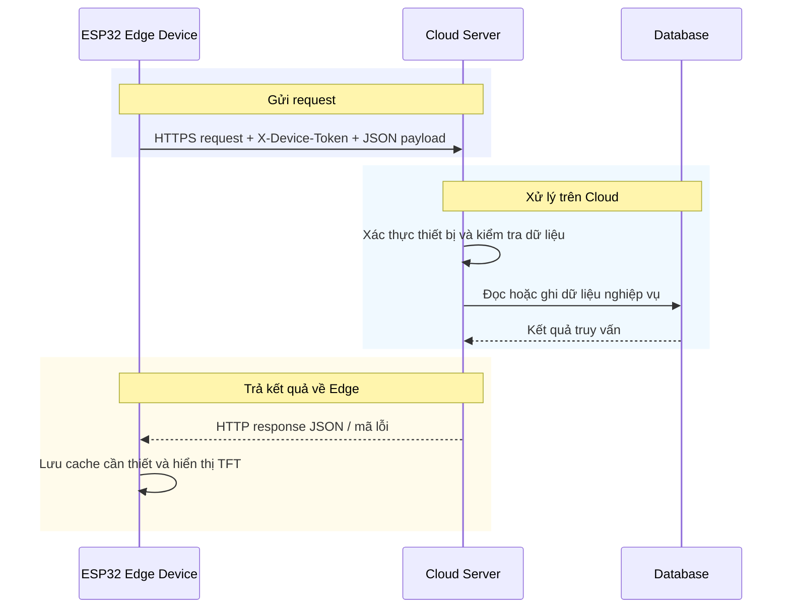

# 04. Kết nối thiết bị và máy chủ

Chương này mô tả cách ESP32 Edge Device kết nối Cloud Server, đồng bộ dữ liệu và gọi API cho năm tình huống sử dụng. Logic thuật toán vẫn được trình bày trực tiếp tại từng use case trong Chương 03.

## 4.1. Quy trình kết nối và trao đổi dữ liệu giữa Edge Device và Cloud Server

Sơ đồ kết nối tuân theo mô hình request/response: ESP32 Edge Device gửi HTTP request qua Wi-Fi đến Cloud Server; Server xác thực, xử lý nghiệp vụ và truy vấn cơ sở dữ liệu; sau đó trả JSON response về thiết bị. TFT chỉ hiển thị dữ liệu rút gọn, còn dữ liệu lịch sử và cấu hình được lưu tại Cloud.

### 4.1.1. Thiết lập kết nối và xác thực

Sau pairing, Edge lưu device token an toàn và gửi token qua header `X-Device-Token` cho mọi API cần xác thực. Khi chưa có mạng, UC-01 tiếp tục chạy cục bộ và firmware lưu trạng thái emotion đã xác nhận gần nhất; các UC Cloud hiển thị trạng thái offline. Firmware hiện chỉ thử đồng bộ ngay khi người dùng xác nhận check-in và có Wi-Fi/pairing, chưa có hàng đợi hoặc retry tự động cho session chưa đồng bộ. Server vẫn chống tạo trùng theo cặp `device_id + client_session_id` cho mỗi request sync nhận được.

### 4.1.2. Chu trình request/response

Thiết bị tạo payload JSON theo schema của use case, đặt timeout và chỉ gửi khi người dùng kích hoạt hoặc có dữ liệu cần đồng bộ. Server xác thực token, xác nhận session thuộc đúng device khi có `session_id`, xử lý request rồi trả status code và JSON card/dữ liệu. Edge chỉ giữ trường cần hiển thị; response thành công được cập nhật lên TFT, còn lỗi `401`, `404`, `422`, `503` được chuyển thành thông báo ngắn và thao tác thử lại.

### 4.1.3. Đồng bộ, lưu trữ và quyền riêng tư

Cloud lưu session, request và report theo `user_id`/`device_id`. UC-01 chỉ gửi metadata nhận diện, không gửi audio thô. UC-04 Voice Conversation gửi PCM tạm thời để STT; Server không lưu audio thô mà chỉ lưu transcript tóm tắt và phản hồi. Các thao tác feedback hoạt động/media chưa được triển khai trên TFT hiện tại.

## 4.2. Thông tin trao đổi của năm tình huống sử dụng

Phần này là nguồn mô tả chuẩn về dữ liệu trao đổi giữa thiết bị và máy chủ. Phụ lục 9.6 chỉ dùng để tra cứu nhanh các đường dẫn. Mọi yêu cầu có xác thực dùng header `X-Device-Token`. Trừ API ghép thiết bị, máy chủ xác thực token trước khi kiểm tra quyền sở hữu phiên hoặc dữ liệu liên quan. Khi có lỗi, máy chủ trả mã phù hợp cho token không hợp lệ, phiên không tồn tại, dữ liệu gửi lên không hợp lệ hoặc dịch vụ AI tạm thời không sẵn sàng.

| UC | API chính | Request schema tối thiểu | Response/dữ liệu chính |
| --- | --- | --- | --- |
| UC-01 | `POST /api/emotion-sessions/sync` | `sessions[]`: `client_session_id`, `emotion_label`, `confidence_score`, `quality_flag`, `inference_latency_ms`, `client_created_at` | `received_count`, `received_ids`; lưu `emotion_sessions` theo `user_id`, `device_id` |
| UC-02 | `POST /api/recommendations/request`; `POST /api/feedback/activity` | Request: `session_id`. Feedback: `recommendation_id`, `activity_type`, `selected`, `feedback_score` 1–5 | `recommendation_id`, `emotion_label`, 5 activity cards; lưu `recommendation_requests`, `activity_feedback` |
| UC-03 | `GET /api/media/library`; `POST /api/media/recommendations` | Firmware chọn `Music` hoặc `Podcast`, tải catalog từ library rồi dùng emotion context gần nhất khi gọi recommendation | Danh sách media gồm `media_id`, `title`, `category`, `duration_sec`, `source_url`; mục khớp recommendation được gắn ưu tiên AI |
| UC-04 | `POST /api/conversations/voice?session_id=<UUID>&sample_rate=16000`; `POST /api/conversations/respond`; `GET /api/conversations/history` | Voice request từ firmware: body PCM 16-bit, `Content-Type: application/octet-stream`, tối đa 10 giây; Server chấp nhận tối đa 30 giây. Text request thay thế: `session_id`, `user_message?` tối đa 500 ký tự | Voice response: `conversation_id`, `transcript`, `reply_text`, `safety_flag`, `next_action`, `audio_path?`; lưu transcript tóm tắt và response trong `conversation_requests` |
| UC-05 | `GET /api/statistics/day`; `GET /api/statistics/week`; `GET /api/statistics/month`; `POST /api/statistics/{period}/explain` | Firmware chọn path theo period `day`, `week` hoặc `month`; request explain không có body | Firmware đọc trường `emotion_distribution` để vẽ tám thanh tỷ lệ cảm xúc. Diễn giải AI được lấy riêng từ trường `explanation` của API `/explain`; khi không lấy được thống kê hợp lệ, firmware dùng bảng fallback cục bộ. |

### 4.2.1. Quy ước schema và thẻ TFT

Các định danh là UUID chuỗi. `feedback_score` nằm trong 1–5; `confidence_score` nằm trong 0–1. Tất cả timestamp API dùng ISO 8601 UTC. Card trả về TFT luôn có `title`, `body` hoặc dữ liệu hiển thị tương đương, `reason` khi là gợi ý và `action_id` để thiết bị gắn thao tác. Các API đồng bộ mặc định không gửi audio thô; ngoại lệ là UC-04 Voice Conversation, dùng body PCM tạm thời cho STT.
