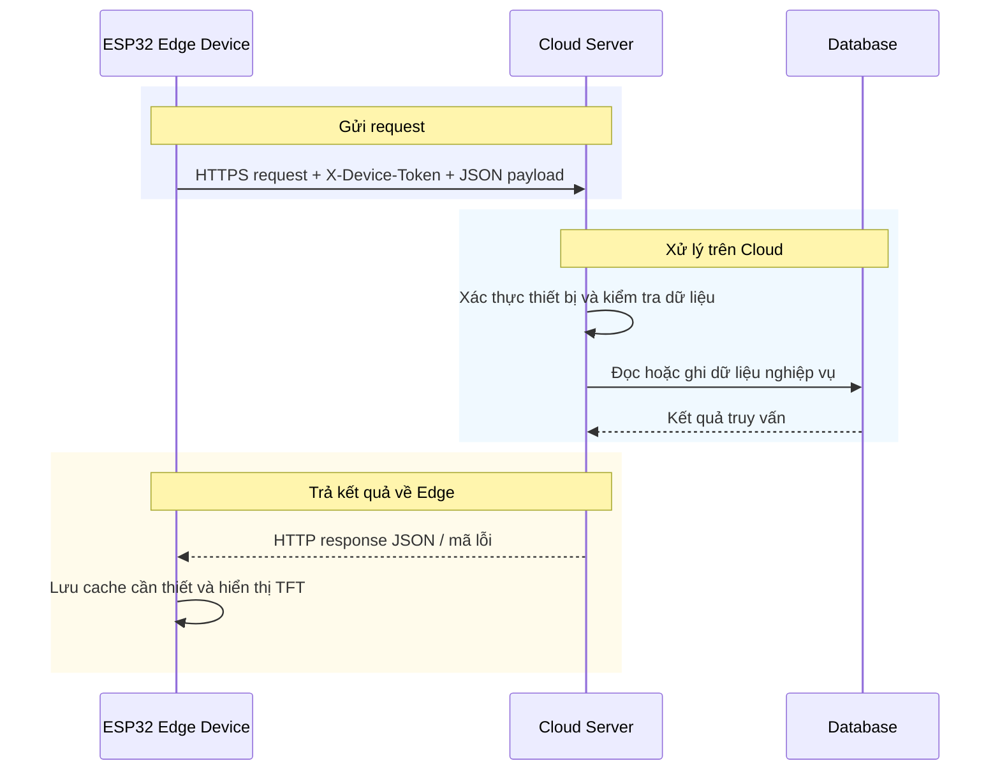

# 04. Kết nối Edge–Server và API

Chương này mô tả cách ESP32 Edge Device kết nối Cloud Server, đồng bộ dữ liệu và gọi API cho năm tình huống sử dụng. Logic thuật toán vẫn được trình bày trực tiếp tại từng use case trong Chương 03.

## 4.1. Quy trình kết nối và trao đổi dữ liệu giữa Edge Device và Cloud Server

Sơ đồ kết nối tuân theo mô hình request/response: ESP32 Edge Device gửi HTTP request qua Wi-Fi đến Cloud Server; Server xác thực, xử lý nghiệp vụ và truy vấn cơ sở dữ liệu; sau đó trả JSON response về thiết bị. TFT chỉ hiển thị dữ liệu rút gọn, còn dữ liệu lịch sử và cấu hình được lưu tại Cloud.

### 4.1.1. Thiết lập kết nối và xác thực

Sau pairing, Edge lưu device token an toàn và gửi token qua header `X-Device-Token` cho mọi API cần xác thực. Khi chưa có mạng, UC-01 tiếp tục chạy cục bộ và ghi `emotion_session` vào cache; các UC Cloud hiển thị trạng thái offline. Khi mạng trở lại, thiết bị gửi lại dữ liệu chưa đồng bộ với `client_session_id` để Server chống tạo trùng theo cặp `device_id + client_session_id`.

### 4.1.2. Chu trình request/response

Thiết bị tạo payload JSON theo schema của use case, đặt timeout và chỉ gửi khi người dùng kích hoạt hoặc có dữ liệu cần đồng bộ. Server xác thực token, xác nhận session thuộc đúng device khi có `session_id`, xử lý request rồi trả status code và JSON card/dữ liệu. Edge chỉ giữ trường cần hiển thị; response thành công được cập nhật lên TFT, còn lỗi `401`, `404`, `422`, `503` được chuyển thành thông báo ngắn và thao tác thử lại.

### 4.1.3. Đồng bộ, lưu trữ và quyền riêng tư

Cloud lưu session, request, feedback và report theo `user_id`/`device_id`. Audio thô không được đồng bộ mặc định; UC-01 chỉ gửi metadata nhận diện. Dữ liệu nguy cấp trong hội thoại được che trước khi lưu. Thiết bị gửi feedback sau khi người dùng chọn/đánh giá hoạt động hoặc media; Server dùng feedback cho cá nhân hóa và thống kê ở các request sau.

## 4.2. API và schema dữ liệu của 5 use case

Mọi request có xác thực dùng header `X-Device-Token`. Trừ API pairing, Server xác thực token trước khi kiểm tra quyền sở hữu session hoặc dữ liệu liên quan. Response lỗi dùng `401` (token không hợp lệ), `404` (không có session/tài nguyên thuộc device), `422` (payload không đúng schema) hoặc `503` (dịch vụ AI tạm thời không sẵn sàng).

| UC | API chính | Request schema tối thiểu | Response/dữ liệu chính |
| --- | --- | --- | --- |
| UC-01 | `POST /api/emotion-sessions/sync` | `sessions[]`: `client_session_id`, `emotion_label`, `confidence_score`, `quality_flag`, `inference_latency_ms`, `client_created_at` | `received_count`, `received_ids`; lưu `emotion_sessions` theo `user_id`, `device_id` |
| UC-02 | `POST /api/recommendations/request`; `POST /api/feedback/activity` | Request: `session_id`. Feedback: `recommendation_id`, `activity_type`, `selected`, `feedback_score` 1–5 | `recommendation_id`, `emotion_label`, 5 activity cards; lưu `recommendation_requests`, `activity_feedback` |
| UC-03 | `GET /api/media/categories`; `POST /api/media/recommendations`; `POST /api/media/music/recommend`; `POST /api/media/podcast/recommend`; `POST /api/feedback/media` | Media request: `category?`, `media_type?`, `emotion_label?`, `user_intent?`. Feedback: `session_id`, `media_item_id`, `feedback_score` 1–5 | Media cards gồm `media_id`, `media_type`, `title`, `creator`, `category`, `duration_sec`, `source_url`, `reason`; lưu `media_selection_logs` |
| UC-04 | `POST /api/conversations/respond`; `GET /api/conversations/history` | Request: `session_id`, `user_message?` tối đa 500 ký tự | `conversation_id`, `safety_flag`, response card (`title`, `body`, `severity`, `next_action`); lưu `conversation_requests` |
| UC-05 | `GET /api/reports/tft-summary?period=daily|weekly|monthly`; `POST /api/reports/generate` | Query hoặc request: `period` là `daily`, `weekly` hoặc `monthly` | Report card gồm phân bố cảm xúc, xu hướng và hiệu quả gợi ý; lưu `tft_reports` |

### 4.2.1. Quy ước schema và thẻ TFT

Các định danh là UUID chuỗi. `feedback_score` nằm trong 1–5; `confidence_score` nằm trong 0–1. Tất cả timestamp API dùng ISO 8601 UTC. Card trả về TFT luôn có `title`, `body` hoặc dữ liệu hiển thị tương đương, `reason` khi là gợi ý và `action_id` để thiết bị gắn thao tác. Thiết bị không gửi audio thô trong bất cứ schema đồng bộ mặc định nào.
