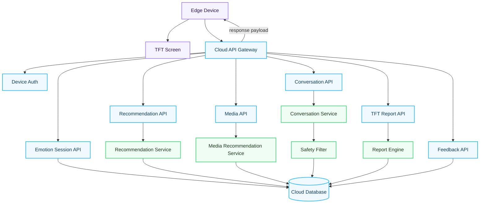
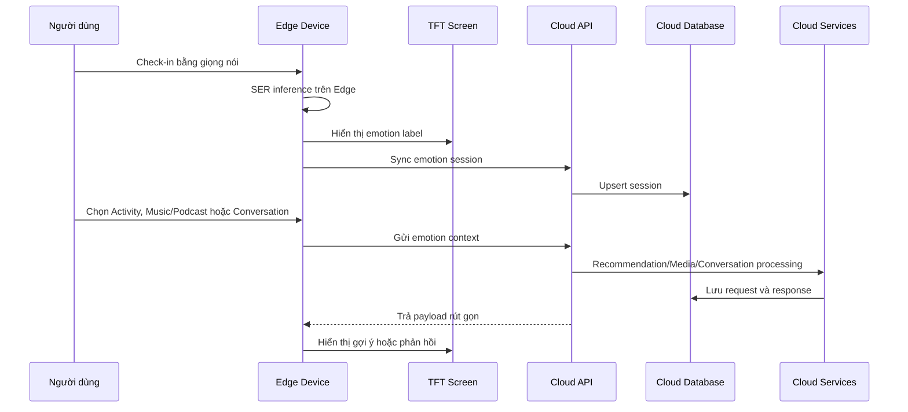
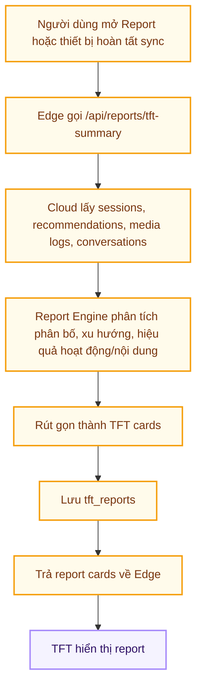

# 05. Internet Service

## 5.1. Tổng quan

Internet Service của EmotiCare AIoT phục vụ trực tiếp cho thiết bị phần cứng. Vai trò của cloud là hỗ trợ các chức năng vượt quá khả năng xử lý cục bộ của thiết bị sinh viên: gợi ý hoạt động, trò chuyện hỗ trợ, lưu trữ dài hạn, phân tích xu hướng và tạo báo cáo rút gọn để trả về TFT screen.

Ngoại trừ **Objective 1 - Speech Emotion Recognition** chạy trên Edge AI, các chức năng còn lại đều cần phối hợp Internet/Cloud:

| Objective | Xử lý chính | Ghi chú |
| --------- | ----------- | ------- |
| Objective 1 | Edge AI | Nhận diện cảm xúc trong 15 giây, vẫn hoạt động offline |
| Objective 2 | Cloud Service + TFT | Recommendation, media selection và conversation cần Internet, kết quả hiển thị trên TFT |
| Objective 3 | Cloud Report Engine + TFT | Báo cáo được tổng hợp trên cloud và trả về TFT |

## 5.2. Kiến trúc Internet Service

*Mô tả diagram: Sơ đồ mô tả Cloud Service như backend cho thiết bị phần cứng; Edge Device gọi API, Cloud xử lý dữ liệu và trả payload rút gọn để hiển thị trên TFT.*

## 5.3. Thiết kế database

### 5.3.1. Bảng `users`

| Cột | Kiểu | Ràng buộc | Mô tả |
| --- | ---- | --------- | ----- |
| id | UUID | PK | ID người dùng |
| name | VARCHAR(120) | NOT NULL | Tên hiển thị trên thiết bị |
| pairing_code | VARCHAR(20) | UNIQUE | Mã ghép thiết bị |
| consent_audio_storage | BOOLEAN | DEFAULT false | Có cho phép lưu audio thô hay không |
| created_at | TIMESTAMP | NOT NULL | Thời điểm tạo |
| updated_at | TIMESTAMP | NOT NULL | Thời điểm cập nhật |

### 5.3.2. Bảng `devices`

| Cột | Kiểu | Ràng buộc | Mô tả |
| --- | ---- | --------- | ----- |
| id | UUID | PK | ID thiết bị |
| user_id | UUID | FK users.id | Chủ sở hữu |
| name | VARCHAR(120) | NOT NULL | Tên thiết bị |
| device_token_hash | VARCHAR(255) | NOT NULL | Token xác thực thiết bị đã hash |
| firmware_version | VARCHAR(50) | NULL | Phiên bản firmware |
| last_seen_at | TIMESTAMP | NULL | Lần online gần nhất |
| status | VARCHAR(30) | NOT NULL | online, offline, disabled |
| created_at | TIMESTAMP | NOT NULL | Thời điểm đăng ký |

### 5.3.3. Bảng `emotion_sessions`

| Cột | Kiểu | Ràng buộc | Mô tả |
| --- | ---- | --------- | ----- |
| id | UUID | PK | ID phiên trên cloud |
| client_session_id | VARCHAR(80) | UNIQUE | ID sinh từ Edge để chống trùng khi retry |
| user_id | UUID | FK users.id | Người dùng |
| device_id | UUID | FK devices.id | Thiết bị |
| emotion_label | VARCHAR(50) | NOT NULL | Nhãn cảm xúc |
| confidence_score | DECIMAL(4,3) | NOT NULL | Độ tin cậy |
| quality_flag | VARCHAR(30) | NOT NULL | clean, noisy, too_short, low_confidence |
| inference_latency_ms | INT | NULL | Thời gian inference trên Edge |
| client_created_at | TIMESTAMP | NOT NULL | Timestamp từ thiết bị |
| created_at | TIMESTAMP | NOT NULL | Timestamp cloud |

### 5.3.4. Bảng `recommendation_requests`

| Cột | Kiểu | Ràng buộc | Mô tả |
| --- | ---- | --------- | ----- |
| id | UUID | PK | ID yêu cầu |
| session_id | UUID | FK emotion_sessions.id | Phiên cảm xúc liên quan |
| request_payload | JSONB | NOT NULL | Emotion context và cấu hình |
| response_payload | JSONB | NOT NULL | Danh sách hoạt động, bài hát và podcast rút gọn cho TFT |
| status | VARCHAR(30) | NOT NULL | success, failed, limited |
| created_at | TIMESTAMP | NOT NULL | Thời điểm tạo |

### 5.3.5. Bảng `activity_feedback`

| Cột | Kiểu | Ràng buộc | Mô tả |
| --- | ---- | --------- | ----- |
| id | UUID | PK | ID feedback |
| recommendation_id | UUID | FK recommendation_requests.id | Gợi ý liên quan |
| activity_type | VARCHAR(50) | NOT NULL | breathing, rest, movement, journaling |
| selected | BOOLEAN | DEFAULT false | Người dùng có chọn hay không |
| feedback_score | INT | NULL | Đánh giá 1-5 |
| created_at | TIMESTAMP | NOT NULL | Thời điểm tạo |

### 5.3.6. Bảng `conversation_requests`

| Cột | Kiểu | Ràng buộc | Mô tả |
| --- | ---- | --------- | ----- |
| id | UUID | PK | ID hội thoại |
| session_id | UUID | FK emotion_sessions.id | Phiên cảm xúc liên quan |
| user_message_summary | TEXT | NULL | Tóm tắt input nếu được phép |
| response_text | VARCHAR(500) | NOT NULL | Phản hồi rút gọn cho TFT |
| safety_flag | VARCHAR(50) | NOT NULL | none, low, medium, high |
| created_at | TIMESTAMP | NOT NULL | Thời điểm tạo |

### 5.3.7. Bảng `tft_reports`

| Cột | Kiểu | Ràng buộc | Mô tả |
| --- | ---- | --------- | ----- |
| id | UUID | PK | ID báo cáo |
| user_id | UUID | FK users.id | Người dùng |
| period_type | VARCHAR(20) | NOT NULL | daily, weekly, monthly, yearly |
| period_start | DATE | NOT NULL | Ngày bắt đầu |
| period_end | DATE | NOT NULL | Ngày kết thúc |
| tft_cards | JSONB | NOT NULL | Các thẻ nội dung ngắn để hiển thị trên TFT |
| emotion_distribution | JSONB | NOT NULL | Tỷ lệ cảm xúc |
| trend_summary | VARCHAR(500) | NULL | Tóm tắt xu hướng |
| data_quality | VARCHAR(30) | NOT NULL | enough_data, limited_data |
| generated_at | TIMESTAMP | NOT NULL | Thời điểm tạo |

## 5.4. API cho Edge Device

| Endpoint | Method | Mục đích | Trả về cho TFT |
| -------- | ------ | ------- | -------------- |
| `/api/devices/pair` | POST | Ghép thiết bị với user bằng pairing code | Trạng thái ghép thiết bị |
| `/api/devices/heartbeat` | POST | Cập nhật trạng thái online và firmware | Server time, config version |
| `/api/emotion-sessions/sync` | POST | Đồng bộ emotion sessions từ Edge | Danh sách session đã nhận |
| `/api/recommendations/request` | POST | Yêu cầu Cloud gợi ý hoạt động, bài hát và podcast | 1-5 mixed recommendation cards |
| `/api/media/categories` | GET | Lấy danh sách category bài hát/podcast | Danh sách category rút gọn |
| `/api/media/recommendations` | POST | Lấy bài hát/podcast theo chủ đích và category | Song/podcast cards |
| `/api/conversations/respond` | POST | Yêu cầu Cloud tạo phản hồi hỗ trợ | 1 response card |
| `/api/feedback/activity` | POST | Gửi lựa chọn/đánh giá hoạt động | Trạng thái đã lưu |
| `/api/feedback/media` | POST | Gửi lựa chọn/đánh giá bài hát hoặc podcast | Trạng thái đã lưu |
| `/api/reports/tft-summary` | GET | Lấy report rút gọn theo period | 3-5 TFT report cards |
| `/api/reports/generate` | POST | Yêu cầu tạo report mới | Job status hoặc report cards |
| `/api/device-config` | GET | Lấy cấu hình rút gọn cho thiết bị | Threshold, labels, text templates |

## 5.5. Media database và categories

### 5.5.1. Bảng `media_items`

| Cột | Kiểu | Ràng buộc | Mô tả |
| --- | ---- | --------- | ----- |
| id | UUID | PK | ID nội dung |
| media_type | VARCHAR(20) | NOT NULL | song, podcast |
| title | VARCHAR(160) | NOT NULL | Tên bài hát hoặc podcast |
| creator | VARCHAR(160) | NULL | Nghệ sĩ, tác giả hoặc kênh |
| category | VARCHAR(50) | NOT NULL | relax, focus, sleep, happy, sad_support, anger_release, energy_recover |
| duration_sec | INT | NULL | Thời lượng nội dung |
| source_url | TEXT | NULL | URL nguồn nếu có |
| enabled | BOOLEAN | DEFAULT true | Nội dung có được gợi ý hay không |

### 5.5.2. Bảng `media_selection_logs`

| Cột | Kiểu | Ràng buộc | Mô tả |
| --- | ---- | --------- | ----- |
| id | UUID | PK | ID log |
| session_id | UUID | FK emotion_sessions.id | Phiên cảm xúc liên quan |
| media_item_id | UUID | FK media_items.id | Nội dung được chọn |
| user_intent | VARCHAR(120) | NULL | Chủ đích người dùng nhập/chọn |
| selected_category | VARCHAR(50) | NOT NULL | Category đã chọn |
| feedback_score | INT | NULL | Đánh giá 1-5 |
| created_at | TIMESTAMP | NOT NULL | Thời điểm tạo |

### 5.5.3. Media categories

| Category | Loại nội dung | Trường hợp sử dụng |
| -------- | ------------- | ------------------ |
| relax | Nhạc nhẹ, ambient, podcast thở chậm | Khi căng thẳng |
| focus | Nhạc không lời, white noise, podcast tập trung | Khi cần học/làm việc |
| sleep | Nhạc chậm, sleep story, podcast thiền ngủ | Khi cần nghỉ ngơi |
| happy | Nhạc tích cực, podcast truyền cảm hứng | Khi muốn duy trì năng lượng tốt |
| sad_support | Nhạc ấm, podcast chia sẻ cảm xúc | Khi buồn bã |
| anger_release | Nhạc grounding, podcast kiểm soát cảm xúc | Khi tức giận |
| energy_recover | Nhạc nhẹ có nhịp vừa, podcast self-care | Khi mệt mỏi |

## 5.6. Flow tương tác Edge-Cloud-TFT

*Mô tả diagram: Sequence diagram này mô tả cách thiết bị chạy SER tại Edge, đồng bộ dữ liệu lên Cloud, nhận gợi ý hoạt động, bài hát, podcast hoặc phản hồi hỗ trợ từ Cloud và hiển thị lại trên TFT.*

## 5.7. Flow tạo báo cáo TFT

*Mô tả chart: Flow chart này cho thấy báo cáo được xử lý trên Cloud, bao gồm cả hoạt động, bài hát và podcast đã chọn; kết quả cuối cùng là các thẻ ngắn để hiển thị trên TFT screen.*

## 5.8. Quy tắc triển khai API

* Edge API phải dùng device token hoặc signed request.
* Các endpoint phải trả lỗi ngắn gọn để TFT có thể hiển thị.
* `/api/emotion-sessions/sync` phải idempotent theo `device_id + client_session_id`.
* Cloud response cho TFT nên giới hạn 1-5 cards, mỗi card có `title`, `body`, `severity` và `action_id` nếu cần.
* Khi mất Internet, Objective 2 và Objective 3 không tạo kết quả mới; TFT hiển thị trạng thái chờ kết nối.
