# 00. Giới thiệu

## 0.1. Thông tin tài liệu

Tài liệu này mô tả đặc tả sản phẩm **EmotiCare AIoT - Intelligent Emotional Companion**, một thiết bị AIoT thông minh có vai trò đồng hành, nhận biết và hỗ trợ người dùng chăm sóc sức khỏe cảm xúc trong đời sống hằng ngày. Tài liệu được dùng làm cơ sở thống nhất giữa nhóm phát triển phần cứng, Edge AI, server/cloud service, TFT screen và tài liệu hướng dẫn sử dụng.

| Trường thông tin | Giá trị |
| ---------------- | ------- |
| Tên sản phẩm | EmotiCare AIoT |
| Tên đầy đủ | EmotiCare AIoT - Intelligent Emotional Companion |
| Tên tiếng Việt | Thiết bị AIoT thông minh đồng hành và chăm sóc sức khỏe cảm xúc |
| Loại tài liệu | AIoT Product Specification |
| Môn học | Introduction to Smart Device Programming |
| Lớp | 23CLC02 |
| Phiên bản | 3.1 |
| Ngày cập nhật | 25/06/2026 |

## 0.2. Định vị sản phẩm

**EmotiCare AIoT** là thiết bị AIoT ứng dụng trí tuệ nhân tạo nhằm hỗ trợ người dùng nhận biết, thấu hiểu và quản lý cảm xúc trong cuộc sống hằng ngày. Thiết bị nhận diện trạng thái cảm xúc thông qua giọng nói, đưa ra gợi ý hoặc tương tác phù hợp để cải thiện tâm trạng, đồng thời thống kê và phân tích xu hướng cảm xúc theo ngày, tuần, tháng và năm.

Điểm khác biệt của sản phẩm là cách tiếp cận **Edge-first nhưng Cloud-assisted**: tác vụ nhận diện cảm xúc cốt lõi được xử lý trực tiếp trên thiết bị để giảm độ trễ và tăng tính riêng tư, trong khi các chức năng gợi ý hoạt động, trò chuyện hỗ trợ và báo cáo dài hạn phối hợp với Internet/Cloud Service. Toàn bộ kết quả theo dõi, báo cáo và trạng thái đồng bộ được hiển thị trên TFT screen của thiết bị.

> **EmotiCare AIoT - Understand your feelings, care for your mind.**

## 0.3. Mục đích sản phẩm

EmotiCare AIoT giúp người dùng chủ động chăm sóc sức khỏe tinh thần bằng cách:

* Nhận diện cảm xúc trong vòng 15 giây sau mỗi lần tương tác bằng giọng nói hợp lệ.
* Đưa ra ít nhất một hoạt động, bài hát, podcast hoặc một phản hồi đồng cảm trong vòng 20 giây sau khi có kết quả cảm xúc và có Internet.
* Lưu lại từng phiên cảm xúc để người dùng có thể nhìn lại lịch sử của mình.
* Tạo tóm tắt cảm xúc theo ngày, tuần, tháng và năm trong vòng 180 giây sau khi người dùng yêu cầu hoặc sau một chu kỳ đồng bộ.
* Phân tích hiệu quả của các hoạt động, bài hát và podcast cải thiện tâm trạng để gợi ý ngày càng phù hợp hơn.

## 0.4. Thông tin thành viên

| STT | Thành viên | MSSV | Số điện thoại | Email |
| --- | ---------- | ---- | ------------- | ----- |
| 1 | Trần Hải Đức | 23127173 | 0916821170 | thduc23@clc.fitus.edu.vn |
| 2 | Nguyễn Trọng Tài | 23127008 | 0377425510 | nttai23@clc.fitus.edu.vn |
| 3 | Nguyễn Công Chiến | 23127331 | 0369314655 | ncchien23@clc.fitus.edu.vn |
| 4 | Phạm Nguyễn Gia Bảo | 20127119 | 0926127333 | pngbao20@clc.fitus.edu.vn |

## 0.5. Phạm vi cập nhật đặc tả

| Hạng mục | Đặc tả trước | Đặc tả cập nhật |
| -------- | ------------ | --------------- |
| Định hướng sản phẩm | Thiết bị thông minh cá nhân với nhiều chức năng rời rạc | Thiết bị đồng hành cảm xúc tập trung vào nhận diện, hỗ trợ và phân tích cảm xúc |
| Objective 1 | Theo dõi phiên học/tác vụ cá nhân | Speech Emotion Recognition trên Edge Device trong 15 giây |
| Objective 2 | Tạo báo cáo cho một nhóm chức năng khác | Cloud-assisted recommendation, media selection và conversation trong 20 giây |
| Objective 3 | Giao diện web theo dõi phiên sử dụng | Báo cáo cảm xúc hiển thị trên TFT theo ngày, tuần, tháng, năm trong 180 giây |
| Edge AI | Xử lý cục bộ cho một tác vụ giới hạn | Phân tích đặc trưng giọng nói và ngữ cảnh sức khỏe cảm xúc tại thiết bị |
| Internet Service | Đồng bộ và giao diện web cơ bản | Thiết kế DB, API, cloud recommendation/conversation/report service và flow Edge-Cloud-TFT |
| User Manual | Hướng dẫn theo luồng cũ | Hướng dẫn theo luồng phần cứng mới của EmotiCare AIoT |

## 0.6. Lịch sử phiên bản

| Phiên bản | Ngày | Người cập nhật | Nội dung |
| --------- | ---- | -------------- | -------- |
| 1.0 | 26/05/2026 | Project team | Khởi tạo đặc tả thiết bị thông minh |
| 2.0 | 13/06/2026 | Project team | Cập nhật đặc tả theo hướng sản phẩm trước đó |
| 3.0 | 25/06/2026 | Project team | Chuyển đổi đặc tả sang EmotiCare AIoT |
| 3.1 | 25/06/2026 | Project team | Viết lại có dấu, chi tiết hóa background, objective, Edge AI, Internet Service, screen flow và user manual |

## 0.7. Cấu trúc tài liệu

| Chương | Nội dung |
| ------ | -------- |
| 01. Background | Bối cảnh, nguồn cảm hứng từ EMO, vấn đề, người dùng mục tiêu và sơ đồ suy ra mục tiêu |
| 02. Architecture & Hardware | Kiến trúc Edge-Server, thành phần phần cứng và luồng dữ liệu hệ thống |
| 03. Objectives | SMART objective, use case, input/output, bảng use case và Mermaid diagram |
| 04. EdgeAI | Thiết kế Edge AI cho Speech Emotion Recognition, dữ liệu đầu vào, đặc trưng âm thanh, mô hình và đánh giá |
| 05. Internet Service | Thiết kế database, API và flow tương tác giữa Edge Device, Cloud Service và TFT screen |
| 06. Functional Requirement | Yêu cầu chức năng được truy vết theo objective và use case |
| 07. Non-Functional Requirement | Yêu cầu phi chức năng về hiệu năng, bảo mật, riêng tư, độ tin cậy và an toàn cảm xúc |
| 08. User Manual | Hướng dẫn sử dụng thiết bị phần cứng, TFT screen và đồng bộ Internet |
| 09. Conclusion | Tổng kết, lợi ích, giới hạn và hướng phát triển |
| 10. Appendix & Reference | Thuật ngữ, bảng dữ liệu, API summary và tài liệu tham khảo |

---

# 01. Background

## 1.1. Bối cảnh

Trong học tập, công việc và sinh hoạt cá nhân, cảm xúc của người dùng thay đổi liên tục nhưng thường không được ghi nhận một cách có hệ thống. Nhiều người chỉ nhận ra mình đang căng thẳng, buồn bã hoặc kiệt sức khi cảm xúc tiêu cực đã kéo dài. Ngược lại, những giai đoạn tích cực cũng dễ bị bỏ qua nên người dùng khó biết thói quen nào thật sự giúp mình cân bằng hơn.

Các ứng dụng ghi nhật ký cảm xúc trên điện thoại có thể hỗ trợ theo dõi tâm trạng, nhưng chúng phụ thuộc nhiều vào việc người dùng chủ động mở ứng dụng, tự nhập dữ liệu và tự đánh giá cảm xúc. Điều này tạo ra rào cản sử dụng hằng ngày, đặc biệt với người đang mệt mỏi hoặc căng thẳng. EmotiCare AIoT được thiết kế để giảm rào cản đó bằng một thiết bị vật lý đặt trong không gian cá nhân, cho phép người dùng thực hiện một lần check-in ngắn bằng giọng nói.

### 1.1.1. Thực trạng

Theo báo cáo **World mental health report: Transforming mental health for all** của World Health Organization, nhu cầu chăm sóc sức khỏe tinh thần trên toàn cầu đang ở mức cao, trong khi khả năng đáp ứng của các hệ thống hỗ trợ còn chưa tương xứng [10]. Điều này cho thấy các giải pháp hỗ trợ nhẹ, dễ tiếp cận và có thể dùng thường xuyên trong đời sống hằng ngày là một hướng bổ sung cần thiết, đặc biệt với nhóm người dùng chưa cần can thiệp y tế nhưng cần theo dõi cảm xúc và giảm căng thẳng sớm.

National Institute of Mental Health cũng nhấn mạnh rằng sức khỏe tinh thần bao gồm cả sức khỏe cảm xúc, tâm lý và xã hội; self-care có thể hỗ trợ duy trì sức khỏe tinh thần và hỗ trợ quá trình hồi phục khi người dùng gặp vấn đề tâm lý [9]. Với bối cảnh sinh viên và người đi làm thường chịu áp lực học tập, công việc, giao tiếp và nhịp sống nhanh, việc có một thiết bị giúp ghi nhận cảm xúc ngắn gọn, không phán xét và không yêu cầu thao tác phức tạp có ý nghĩa thực tiễn.

Từ thực trạng này, EmotiCare AIoT không được định vị như thiết bị chẩn đoán bệnh lý. Sản phẩm tập trung vào ba nhu cầu gần với đời sống hơn: giúp người dùng nhận biết cảm xúc hiện tại, nhận gợi ý chăm sóc phù hợp ngay trên thiết bị và xem lại xu hướng cảm xúc theo thời gian.

### 1.1.2. Sản phẩm tương tự

Trên thị trường đã có một số sản phẩm đi theo hướng thiết bị đồng hành cảm xúc hoặc robot xã hội. Tuy nhiên, mỗi sản phẩm có trọng tâm khác nhau, từ giải trí, đồng hành cho người lớn tuổi đến hỗ trợ thói quen sống. EmotiCare AIoT kế thừa ý tưởng tương tác gần gũi của nhóm sản phẩm này nhưng tập trung hẹp hơn vào **Speech Emotion Recognition**, gợi ý chăm sóc cảm xúc và báo cáo cảm xúc trên TFT.

| Sản phẩm tương tự | Mô tả ngắn | Điểm liên quan đến EmotiCare AIoT | Khác biệt của EmotiCare AIoT |
| ----------------- | ---------- | -------------------------------- | ---------------------------- |
| EMO - LivingAI | EMO là AI desktop pet có tính cách riêng, có thể ở bên cạnh người dùng, nhận biết âm thanh/người dùng, di chuyển trên bàn, nhảy theo nhạc, chơi game và hỗ trợ một số tác vụ như báo thức, thời tiết [11]. | Gợi cảm hứng về một thiết bị để bàn có cá tính, tạo cảm giác hiện diện và tương tác thân thiện. | EmotiCare AIoT không tập trung vào giải trí/nhân vật hóa, mà tập trung vào nhận diện cảm xúc bằng giọng nói, lưu emotion session và phân tích xu hướng cảm xúc. |
| ElliQ | ElliQ là companion robot hướng đến người lớn tuổi, hỗ trợ wellness, nhắc thuốc, gợi ý vận động nhẹ, kết nối xã hội, giải trí và giảm cô đơn [12]. | Cho thấy giá trị của thiết bị chủ động trò chuyện, nhắc nhở và hỗ trợ cảm xúc trong không gian cá nhân. | EmotiCare AIoT hướng đến prototype sinh viên, dùng TFT làm giao diện chính, SER chạy tại Edge và Cloud chỉ hỗ trợ gợi ý, media, hội thoại và báo cáo rút gọn. |

Từ việc tham khảo các sản phẩm trên, EmotiCare AIoT chọn một phạm vi khả thi hơn cho đồ án: không xây dựng robot xã hội phức tạp, không cố thay thế người chăm sóc, mà tạo một thiết bị AIoT nhỏ có khả năng lắng nghe một lượt check-in, phân loại cảm xúc, đề xuất hoạt động/bài hát/podcast phù hợp và giúp người dùng nhìn lại dữ liệu cảm xúc ngay trên màn hình phần cứng.

## 1.2. Nguồn cảm hứng từ EMO

Nguồn cảm hứng ban đầu của sản phẩm đến từ hình ảnh **EMO**, một thiết bị/robot để bàn có tính cách thân thiện, biết phản hồi lại người dùng và tạo cảm giác có một người bạn nhỏ trong không gian sống. Điểm hấp dẫn của EMO không chỉ nằm ở phần cứng, màn hình hay chuyển động, mà ở cảm giác thiết bị có thể hiện diện, phản hồi và làm cho tương tác công nghệ trở nên gần gũi hơn.

EmotiCare AIoT kế thừa tinh thần đó nhưng chuyển trọng tâm từ sự dễ thương và giải trí sang **chăm sóc cảm xúc có dữ liệu**. Thiết bị không chỉ phản ứng bằng biểu cảm hoặc câu nói ngắn, mà còn:

* Lắng nghe một tương tác giọng nói có chủ đích.
* Nhận diện trạng thái cảm xúc bằng Edge AI.
* Đưa ra phản hồi đồng cảm, hoạt động cải thiện tâm trạng hoặc nội dung nghe phù hợp như bài hát/podcast.
* Ghi nhận lịch sử cảm xúc để người dùng thấy được xu hướng của chính mình.
* Tạo báo cáo theo thời gian để hỗ trợ xây dựng lối sống cân bằng hơn.

Vì vậy, EmotiCare AIoT được định vị như một **Intelligent Emotional Companion**: không thay thế con người hay chuyên gia sức khỏe tinh thần, nhưng đóng vai trò một điểm chạm nhẹ nhàng, thường xuyên và riêng tư để người dùng quan tâm đến cảm xúc của mình.

## 1.3. Vấn đề cần giải quyết

| Vấn đề | Hệ quả | Cách EmotiCare AIoT giải quyết |
| ------ | ------ | ------------------------------- |
| Người dùng ít ghi nhận cảm xúc hằng ngày | Không thấy được xu hướng cảm xúc dài hạn | Check-in bằng giọng nói và lưu emotion session |
| Cảm xúc tiêu cực kéo dài khó được phát hiện sớm | Người dùng dễ rơi vào trạng thái căng thẳng, buồn bã hoặc mệt mỏi kéo dài | Báo cáo theo ngày, tuần, tháng, năm và phát hiện chuỗi cảm xúc tiêu cực |
| Gợi ý chăm sóc tinh thần thường chung chung | Người dùng khó biết hoạt động hoặc nội dung nghe nào phù hợp với mình | Gợi ý theo cảm xúc hiện tại, chủ đích, lịch sử feedback và phân tích hiệu quả hoạt động/nội dung |
| Dữ liệu giọng nói nhạy cảm | Người dùng lo ngại quyền riêng tư | Ưu tiên Edge AI, không upload âm thanh thô mặc định |
| Thiết bị hỗ trợ tinh thần dễ bị hiểu nhầm là thiết bị y tế | Rủi ro kỳ vọng sai | Đặc tả rõ sản phẩm chỉ hỗ trợ tự chăm sóc, không chẩn đoán hoặc điều trị |

Từ các vấn đề trên, có thể thấy EmotiCare AIoT cần được đặt cạnh các sản phẩm tương tự để làm rõ khoảng trống sản phẩm mà đồ án hướng đến. Các sản phẩm như EMO hoặc ElliQ đã chứng minh rằng thiết bị vật lý có thể tạo cảm giác đồng hành tốt hơn một giao diện phần mềm thuần túy, nhưng chúng chưa trùng hoàn toàn với mục tiêu của EmotiCare AIoT.

| Tiêu chí so sánh | EMO - LivingAI [11] | ElliQ [12] | EmotiCare AIoT |
| ---------------- | ------------------- | ---------- | -------------- |
| Nhóm người dùng chính | Người dùng phổ thông muốn có AI desktop pet để giải trí và tương tác thân thiện | Người lớn tuổi cần đồng hành, nhắc nhở, kết nối xã hội và hỗ trợ wellness | Sinh viên, người đi làm và người quan tâm đến mental wellness |
| Trọng tâm sản phẩm | Tạo cảm giác thú cưng để bàn có cá tính, biết phản hồi, di chuyển, nhảy theo nhạc và hỗ trợ tác vụ đơn giản | Companion robot chủ động trò chuyện, nhắc thuốc, gợi ý vận động, kết nối gia đình/người chăm sóc | Thiết bị AIoT nhận diện cảm xúc qua giọng nói, gợi ý chăm sóc cảm xúc và theo dõi xu hướng trên TFT |
| Nhận diện cảm xúc | Có tương tác thông minh và biểu cảm, nhưng không tập trung vào Speech Emotion Recognition làm use case chính | Có hội thoại và wellness support, nhưng không tập trung vào SER cục bộ trên thiết bị phần cứng sinh viên | UC-01 tập trung vào Speech Emotion Recognition chạy tại Edge |
| Gợi ý chăm sóc cảm xúc | Thiên về giải trí, nhạc, game và phản hồi kiểu thú cưng | Thiên về thói quen sống, nhắc nhở, vận động nhẹ, kết nối xã hội | Gợi ý hoạt động, bài hát, podcast và phản hồi đồng cảm dựa trên emotion context |
| Theo dõi dài hạn | Không phải trọng tâm chính của sản phẩm | Có hỗ trợ caregiver/wellness theo định hướng người lớn tuổi | Báo cáo cảm xúc theo ngày, tuần, tháng, năm hiển thị trực tiếp trên TFT |
| Quyền riêng tư âm thanh | Không phải điểm nhấn chính trong đặc tả đồ án | Có chính sách bảo mật và kết nối Cloud theo hệ sinh thái riêng | Không upload âm thanh thô mặc định; ưu tiên Edge AI cho tác vụ nhận diện cảm xúc |
| Phù hợp phạm vi đồ án | Sản phẩm thương mại có cơ khí, nhân vật hóa và trải nghiệm giải trí phức tạp | Sản phẩm thương mại có dịch vụ Cloud, caregiver app và vận hành dài hạn | Prototype khả thi hơn: Edge SER, Cloud API, TFT screen, database và flow Edge-Cloud-TFT |

Như vậy, EmotiCare AIoT không cố cạnh tranh trực tiếp với robot đồng hành thương mại. Sản phẩm chọn một lát cắt hẹp và rõ hơn: **nhận diện cảm xúc bằng giọng nói, hỗ trợ chăm sóc cảm xúc theo ngữ cảnh và tạo dữ liệu theo dõi dài hạn trên chính thiết bị phần cứng**.

## 1.4. Người dùng mục tiêu

| Nhóm người dùng | Nhu cầu chính | Giá trị sản phẩm |
| --------------- | ------------- | ---------------- |
| Sinh viên | Theo dõi căng thẳng, mệt mỏi, áp lực học tập | Check-in nhanh, gợi ý nghỉ ngơi, xem lại xu hướng cảm xúc |
| Người đi làm | Quản lý stress trong ngày làm việc | Nhận biết thời điểm căng thẳng và chọn hoạt động phục hồi |
| Người quan tâm đến mental wellness | Xây dựng thói quen chăm sóc tinh thần | Báo cáo định kỳ và theo dõi hiệu quả thói quen |
| Gia đình/người chăm sóc | Muốn có góc nhìn tổng quan nếu người dùng đồng ý chia sẻ | Báo cáo tổng quan không xâm phạm nội dung riêng tư |

## 1.5. Mục đích sản phẩm

Mục đích của **EmotiCare AIoT** là tạo ra một thiết bị AIoT đồng hành cảm xúc có thể giúp người dùng dừng lại, nhận biết trạng thái cảm xúc của mình và lựa chọn cách chăm sóc phù hợp ngay trong đời sống hằng ngày. Sản phẩm không hướng đến việc thay thế chuyên gia sức khỏe tinh thần, mà đóng vai trò như một điểm chạm nhẹ nhàng, riêng tư và dễ tiếp cận để người dùng hình thành thói quen quan sát cảm xúc.

Về mặt trải nghiệm, EmotiCare AIoT tập trung vào ba giá trị chính:

| Giá trị | Ý nghĩa đối với người dùng | Cách sản phẩm hỗ trợ |
| ------- | -------------------------- | -------------------- |
| Nhận biết cảm xúc | Người dùng biết mình đang vui vẻ, bình thường, căng thẳng, buồn bã, tức giận hoặc mệt mỏi | Check-in bằng giọng nói và nhận diện cảm xúc bằng Edge AI |
| Hỗ trợ đúng lúc | Người dùng nhận được một hành động nhỏ, một nội dung nghe phù hợp hoặc một phản hồi đồng cảm khi cần | Cloud gợi ý hoạt động, bài hát, podcast hoặc phản hồi hội thoại, sau đó hiển thị trên TFT |
| Hiểu xu hướng dài hạn | Người dùng nhìn lại sự thay đổi cảm xúc theo thời gian và biết hoạt động/nội dung nào có hiệu quả | Cloud tổng hợp emotion sessions, activity feedback, media selection logs và trả báo cáo rút gọn về TFT |

Từ góc nhìn sản phẩm, mục đích này giúp EmotiCare AIoT khác với một ứng dụng nhật ký cảm xúc thông thường. Thiết bị ưu tiên thao tác ngắn trên phần cứng, xử lý nhận diện cảm xúc tại Edge để giảm phụ thuộc Internet cho tác vụ cốt lõi, và chỉ dùng Cloud cho các phần cần dữ liệu dài hạn hoặc nội dung phong phú hơn như gợi ý, hội thoại và báo cáo.

Do đó, mục đích sản phẩm có thể tóm tắt như sau: **giúp người dùng nhận biết cảm xúc hiện tại, nhận hỗ trợ phù hợp trong thời điểm đó và theo dõi xu hướng cảm xúc lâu dài ngay trên thiết bị TFT**.

## 1.6. Từ mục đích sản phẩm suy ra 3 mục tiêu

Mục đích cốt lõi của EmotiCare AIoT là giúp người dùng **nhận biết cảm xúc**, **được hỗ trợ đúng lúc** và **hiểu xu hướng cảm xúc theo thời gian**. Từ mục đích này, sản phẩm được tách thành ba SMART objective liên kết thành một vòng lặp hoàn chỉnh.

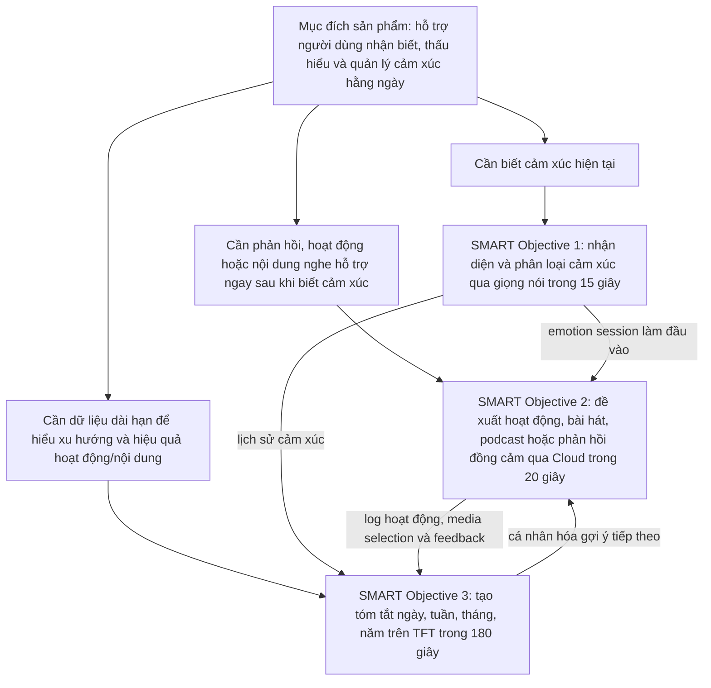

*Mô tả diagram: Sơ đồ cho thấy mục đích chăm sóc cảm xúc được tách thành ba mục tiêu liên kết nhau: Edge AI nhận diện cảm xúc, Cloud hỗ trợ phản hồi/gợi ý, và Cloud tổng hợp báo cáo để hiển thị lại trên TFT screen.*

## 1.7. Phạm vi sản phẩm

### Trong phạm vi

* Thu âm khi người dùng chủ động kích hoạt tương tác.
* Nhận diện cảm xúc từ giọng nói bằng Edge AI.
* Phân loại các trạng thái: vui vẻ, bình thường, căng thẳng, buồn bã, tức giận, mệt mỏi và nhóm mở rộng.
* Đề xuất hoạt động cải thiện hoặc duy trì tâm trạng.
* Đề xuất bài hát hoặc podcast theo cảm xúc hiện tại, category và chủ đích của người dùng.
* Trò chuyện hỗ trợ cảm xúc với phản hồi đồng cảm và an toàn.
* Lưu emotion session, recommendation log, media selection log và feedback.
* Tạo báo cáo cảm xúc theo ngày, tuần, tháng, năm.
* Hiển thị trên TFT screen về phân bố cảm xúc, xu hướng và hiệu quả hoạt động/nội dung.

### Ngoài phạm vi

* Chẩn đoán bệnh lý tâm thần.
* Thay thế bác sĩ, nhà tâm lý học hoặc dịch vụ khẩn cấp.
* Thu âm liên tục khi người dùng chưa kích hoạt.
* Chia sẻ dữ liệu cảm xúc cho bên thứ ba khi chưa có sự đồng ý.
* Đưa ra kết luận y khoa dựa trên giọng nói hoặc dữ liệu sinh hoạt.

## 1.8. Tiêu chí thành công

| Tiêu chí | Mục tiêu |
| -------- | -------- |
| Tốc độ nhận diện | Kết quả cảm xúc trong vòng 15 giây sau tương tác giọng nói hợp lệ |
| Tốc độ hỗ trợ | Ít nhất một hoạt động, bài hát, podcast hoặc một phản hồi trong vòng 20 giây sau khi có kết quả cảm xúc và có Internet |
| Tốc độ báo cáo | Tóm tắt báo cáo được trả về TFT screen trong vòng 180 giây sau yêu cầu hoặc chu kỳ đồng bộ |
| Tính liên tục dữ liệu | Mỗi phiên có timestamp, session ID, emotion label và sync status |
| Tính riêng tư | Không upload âm thanh thô mặc định; ưu tiên xử lý cục bộ |
| Giá trị người dùng | Người dùng hiểu được xu hướng cảm xúc và hoạt động/nội dung nào có hiệu quả với mình |

---

# 02. Architecture & Hardware

## 2.1. Tổng quan kiến trúc

EmotiCare AIoT sử dụng kiến trúc **Edge-Cloud-TFT**. Edge Device chịu trách nhiệm tương tác trực tiếp với người dùng, thu âm khi được kích hoạt, chạy Speech Emotion Recognition và hiển thị kết quả trên TFT screen. Cloud Service chịu trách nhiệm cho các chức năng còn lại: gợi ý hoạt động, gợi ý/chọn bài hát hoặc podcast, trò chuyện hỗ trợ, lưu trữ dài hạn, tổng hợp báo cáo và trả kết quả về thiết bị để hiển thị trên TFT.

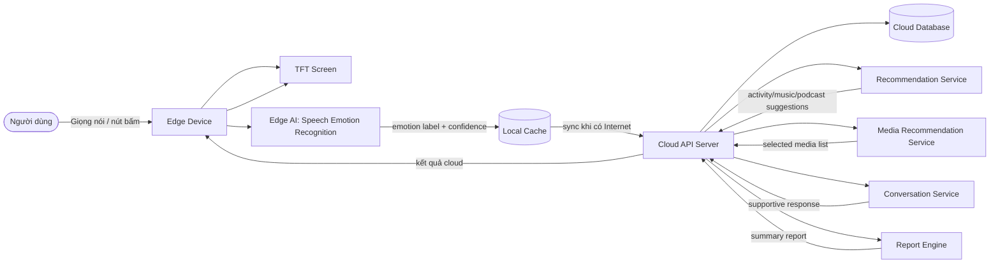

*Mô tả diagram: Sơ đồ thể hiện Objective 1 chạy trên Edge AI, còn Objective 2 và Objective 3 phối hợp với Cloud Service; mọi kết quả cuối cùng được trả về Edge Device và hiển thị trên TFT screen.*

## 2.2. Thành phần chính

| Thành phần | Vai trò | Ghi chú |
| ---------- | ------- | ------- |
| Edge Device | Thiết bị phần cứng đặt gần người dùng | Điều khiển microphone, nút bấm, Wi-Fi, cache và TFT screen |
| TFT Screen | Giao diện theo dõi chính | Hiển thị cảm xúc hiện tại, gợi ý, phản hồi, báo cáo và trạng thái đồng bộ |
| Edge AI SER Engine | Nhận diện cảm xúc từ giọng nói | Chỉ Objective 1 chạy cục bộ |
| Local Cache | Lưu dữ liệu tạm | Giữ emotion session pending khi mất Internet |
| Cloud API Server | Cổng giao tiếp giữa thiết bị và cloud | Nhận sync, trả gợi ý, phản hồi, báo cáo và cấu hình |
| Recommendation Service | Gợi ý hoạt động, bài hát và podcast | Dùng emotion label, lịch sử và feedback để trả các card phù hợp |
| Media Recommendation Service | Lựa chọn bài hát/podcast theo chủ đích | Dùng category, media type, intent và emotion context để xếp hạng nội dung |
| Conversation Service | Tạo phản hồi đồng cảm | Dùng emotion context và input người dùng, có safety filter |
| Report Engine | Tạo báo cáo | Tổng hợp emotion sessions, activity logs, media selection logs và conversation metadata |
| Cloud Database | Lưu dữ liệu dài hạn | Lưu user, device, session, recommendation, media item, conversation và report |

## 2.3. Thành phần phần cứng đề xuất

Giá dưới đây là **ước tính cho prototype sinh viên**, có thể thay đổi theo nhà cung cấp, thời điểm mua, phí vận chuyển và việc nhóm dùng module chính hãng hay module tương đương. Đơn vị tiền tệ dùng trong bảng là VND.

| Phần cứng | Vai trò | Yêu cầu tối thiểu | Giá tham khảo | Ref |
| --------- | ------- | ----------------- | ------------- | --- |
| ESP32-S3 hoặc vi điều khiển tương đương | Bộ điều khiển chính | Có Wi-Fi, đủ tài nguyên cho inference nhẹ hoặc điều phối module inference | 180.000 - 350.000 | [13] |
| INMP441 I2S Microphone | Thu giọng nói | Thu âm ở khoảng cách gần, phục vụ SER | 25.000 - 70.000 | [5] |
| TFT/OLED Display | Màn hình theo dõi chính | Hiển thị menu, cảm xúc, gợi ý, hội thoại ngắn, báo cáo và trạng thái sync | 120.000 - 320.000 | [14] |
| 5 nút vật lý hoặc touch input | Điều hướng | Mode, Action, Start/Confirm, Next, Back | 10.000 - 50.000 | [15] |
| Speaker/Buzzer | Phản hồi âm thanh | Báo hiệu bắt đầu/kết thúc thu âm hoặc có kết quả mới | 10.000 - 60.000 | [16] |
| Flash/Local storage | Cache offline | Lưu session pending khi mất Internet; có thể dùng flash sẵn trên ESP32-S3 hoặc thêm microSD/flash ngoài | 0 - 100.000 | [13], [17] |
| Wi-Fi | Kết nối Internet | Bắt buộc cho Objective 2 và Objective 3; tích hợp sẵn nếu dùng ESP32-S3 | 0 | [13] |

## 2.4. Dự đoán chi phí tổng

Chi phí tổng được chia thành hai mức để phù hợp với thực tế triển khai đồ án:

| Hạng mục | Chi phí thấp | Chi phí cao | Ghi chú |
| -------- | ------------ | ----------- | ------- |
| Các linh kiện chính trong bảng 2.3 | 345.000 | 950.000 | Bao gồm MCU, microphone, màn hình, nút, buzzer, storage nếu cần |
| Dây jumper, breadboard/PCB thử nghiệm, điện trở, header | 50.000 | 150.000 | Phục vụ đấu nối prototype |
| Nguồn cấp USB, pin hoặc adapter nếu cần demo độc lập | 50.000 | 200.000 | Có thể bằng 0 nếu dùng nguồn USB từ laptop |
| Vỏ hộp/mica/in 3D cơ bản | 50.000 | 250.000 | Tùy mức hoàn thiện phần cứng |
| Dự phòng hỏng linh kiện và phát sinh | 50.000 | 150.000 | Nên có vì prototype thường cần mua thay thế |
| **Tổng dự đoán** | **545.000** | **1.700.000** | Khoảng chi phí hợp lý cho một prototype sinh viên |

Nếu nhóm muốn giảm chi phí, phương án tối thiểu là dùng ESP32-S3 có sẵn flash/Wi-Fi, dùng buzzer thay vì speaker, dùng nút vật lý rời và chưa làm vỏ hoàn thiện. Nếu nhóm muốn demo tốt hơn, nên ưu tiên màn hình TFT rõ hơn, microphone ổn định hơn và vỏ thiết bị chắc chắn để trải nghiệm EmotiCare AIoT giống một thiết bị thật hơn.

## 2.5. Luồng dữ liệu tổng quát

| Bước | Mô tả | Dữ liệu sinh ra |
| ---- | ----- | --------------- |
| 1 | Người dùng nhấn Check-in và nói với thiết bị | Audio sample |
| 2 | Edge AI xử lý SER trên thiết bị | Emotion label, confidence |
| 3 | Thiết bị hiển thị cảm xúc hiện tại trên TFT | Current emotion screen |
| 4 | Thiết bị đồng bộ emotion session lên Cloud khi có Internet | Synced emotion session |
| 5 | Cloud Recommendation Service, Media Recommendation Service hoặc Conversation Service xử lý yêu cầu hỗ trợ | Activity suggestion, song/podcast list hoặc supportive response |
| 6 | Thiết bị nhận kết quả cloud và hiển thị trên TFT | Support screen |
| 7 | Cloud Report Engine tổng hợp dữ liệu theo ngày/tuần/tháng/năm | Report summary |
| 8 | Thiết bị nhận báo cáo rút gọn và hiển thị trên TFT | Report screen |

## 2.6. Nguyên tắc thiết kế

| Nguyên tắc | Cách áp dụng |
| ---------- | ------------ |
| Edge cho nhận diện cốt lõi | SER chạy tại thiết bị để vẫn có kết quả cảm xúc khi mất Internet |
| Cloud cho hỗ trợ nâng cao | Gợi ý hoạt động, bài hát/podcast, trò chuyện và báo cáo dùng Internet/Cloud |
| TFT là giao diện chính | Người dùng theo dõi trực tiếp trên màn hình thiết bị |
| Chịu lỗi offline | Khi offline, thiết bị vẫn nhận diện và lưu session pending nhưng chưa tạo hỗ trợ cloud |
| An toàn cảm xúc | Cloud response phải qua safety filter, không chẩn đoán y khoa |

## 2.7. Ràng buộc triển khai

* Objective 1 phải hoạt động trên Edge Device.
* Objective 2 và Objective 3 cần Internet để gọi Cloud API.
* Thiết bị phải hiển thị rõ trạng thái `Offline`, `Sync pending`, `Waiting cloud` và `Cloud result ready`.
* Mỗi kết quả cloud phải được rút gọn để phù hợp với TFT screen.
* API đồng bộ phải idempotent để tránh tạo trùng session khi retry.

---

# 03. Objectives

## 3.1. Tổng quan

Ba SMART objective của EmotiCare AIoT tạo thành một vòng lặp vận hành trên thiết bị, trong đó TFT là giao diện theo dõi chính, Edge AI xử lý tác vụ nhận diện cảm xúc cốt lõi, còn Cloud hỗ trợ các chức năng cần dữ liệu dài hạn hoặc nội dung phong phú hơn.

| SMART Objective | Mô tả đầy đủ | Use case liên quan | Vai trò trong vòng lặp |
| --------------- | ------------ | ------------------ | ---------------------- |
| SMART Objective 1 | Phát hiện và phân loại trạng thái cảm xúc của người dùng trong vòng 15 giây sau mỗi lần tương tác bằng giọng nói hợp lệ, đồng thời lưu lại kết quả của từng phiên để phục vụ theo dõi và phân tích cảm xúc theo thời gian. | UC-01 | Tạo emotion session làm dữ liệu nền cho các chức năng hỗ trợ và báo cáo |
| SMART Objective 2 | Đề xuất ít nhất một hoạt động, bài hát, podcast hoặc một phản hồi đồng cảm phù hợp trong vòng 20 giây khi người dùng yêu cầu hỗ trợ và thiết bị có Internet. | UC-02, UC-03, UC-04 | Biến dữ liệu cảm xúc hoặc nhu cầu trực tiếp từ HOME thành hành động hỗ trợ cụ thể |
| SMART Objective 3 | Tự động tạo tóm tắt thống kê và phân tích cảm xúc theo ngày, tháng và năm trên Cloud Service, sau đó trả kết quả rút gọn về TFT screen trong vòng 180 giây sau khi người dùng yêu cầu hoặc sau một chu kỳ đồng bộ. | UC-05 | Giúp người dùng nhìn lại xu hướng cảm xúc và hiệu quả của hoạt động/nội dung đã chọn |

### Overall Objective Flow Chart

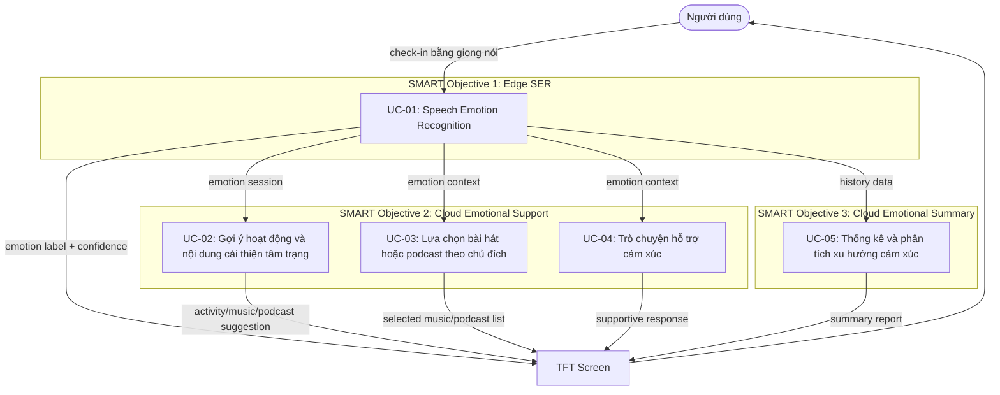

*Mô tả chart: Flow chart này cho thấy Objective 1 tạo dữ liệu cảm xúc tại Edge, Objective 2 và Objective 3 dùng Cloud để xử lý nâng cao, còn mọi kết quả đều quay về TFT screen để người dùng theo dõi.*

### Overall Use Case Diagram

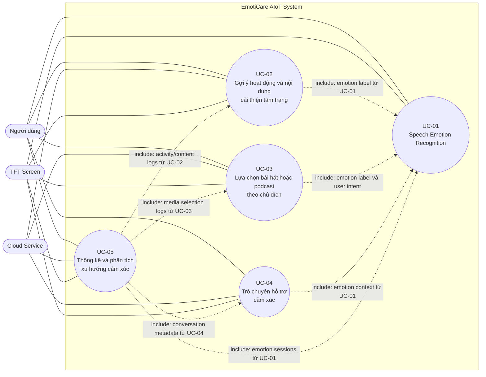

*Mô tả diagram: Use case diagram này mô tả các tác nhân chính gồm người dùng, Cloud Service và TFT Screen; trong đó chỉ UC-01 chạy tại Edge, còn UC-02, UC-03, UC-04 và UC-05 cần Cloud phối hợp.*

---

## 3.2. SMART Objective 1: Phát hiện và phân loại trạng thái cảm xúc của người dùng bằng Speech Emotion Recognition trong vòng 15 giây sau mỗi lần tương tác bằng giọng nói hợp lệ, đồng thời lưu lại kết quả của từng phiên để phục vụ theo dõi cảm xúc theo thời gian

Objective 1 là nền tảng của toàn bộ hệ thống. Đây là objective duy nhất bắt buộc chạy được tại Edge Device khi mất Internet. Kết quả được hiển thị ngay trên TFT và được lưu vào local cache để đồng bộ cloud sau.

### 3.2.1. Use Case UC-01: Speech Emotion Recognition

* **Input:** Giọng nói của người dùng.
* **Output:** Trạng thái cảm xúc, ví dụ: vui vẻ, bình thường, căng thẳng, buồn bã, tức giận, mệt mỏi.

**Mô tả:** Thiết bị sử dụng bài toán **Speech Emotion Recognition (SER)** để phân tích tín hiệu lời nói và suy luận trạng thái cảm xúc. Pipeline SER gồm thu âm có chủ đích, tiền xử lý, trích xuất Log-Mel Spectrogram, MFCC, pitch, energy hoặc embedding âm thanh, sau đó đưa vào mô hình phân loại đã được tối ưu cho edge. Kết quả được hiển thị trên TFT và lưu thành emotion session.

**Ý nghĩa của use case:** UC-01 giúp người dùng gọi tên trạng thái cảm xúc hiện tại mà không cần nhập nhật ký thủ công. Việc đặt use case là Speech Emotion Recognition làm rõ nguồn nhận diện chính là tín hiệu lời nói.

**Vai trò trong objective:** UC-01 là điểm bắt đầu của vòng lặp chăm sóc cảm xúc, nơi giọng nói được chuyển thành emotion label, confidence score và emotion session trong giới hạn 15 giây.

| Trường | Nội dung |
| ------ | -------- |
| Use case ID | UC-01 |
| Tên use case | Speech Emotion Recognition |
| Tác nhân chính | Người dùng |
| Tác nhân phụ | Edge Device, TFT Screen |
| Mục tiêu | Xác định trạng thái cảm xúc hiện tại sau một lần tương tác bằng giọng nói |
| Tiền điều kiện | Thiết bị đã bật, microphone sẵn sàng, người dùng chủ động kích hoạt check-in |
| Kích hoạt | Người dùng nhấn nút Check-in và nói một câu hoặc một đoạn chia sẻ ngắn |
| Luồng chính | 1. Người dùng kích hoạt thu âm. 2. Thiết bị hiển thị trạng thái đang nghe trên TFT. 3. Thiết bị ghi âm trong thời lượng giới hạn. 4. Edge AI tiền xử lý âm thanh. 5. Hệ thống trích xuất đặc trưng SER. 6. Mô hình SER phân loại cảm xúc và trả confidence. 7. TFT hiển thị kết quả. 8. Hệ thống lưu emotion session vào local cache. |
| Luồng thay thế | Nếu âm thanh quá ngắn, quá nhiễu hoặc confidence thấp, thiết bị yêu cầu người dùng nói lại hoặc lưu kết quả là `uncertain`. Nếu mất Internet, session vẫn được lưu cục bộ. |
| Hậu điều kiện | Emotion session được tạo và sẵn sàng đồng bộ cloud khi có Internet |
| Dữ liệu vào | Audio sample, Log-Mel Spectrogram, MFCC, pitch, energy hoặc embedding âm thanh |
| Dữ liệu ra | Emotion label, confidence score, timestamp, session ID, sync status |
| Mục tiêu hiệu năng | Hoàn tất trong vòng 15 giây |

#### Use Case Diagram

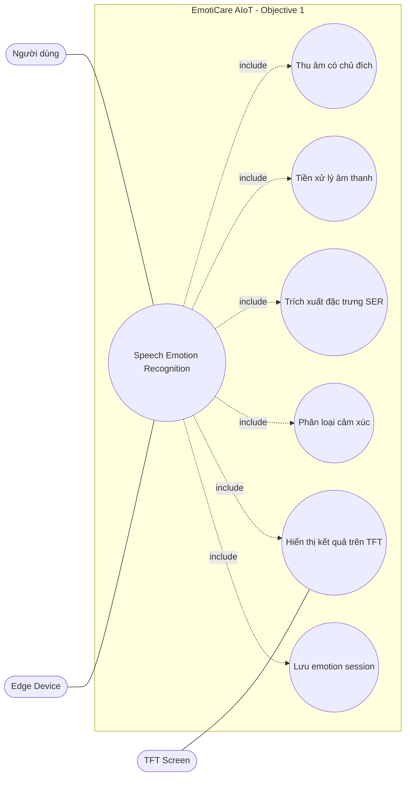

*Mô tả diagram: Use case diagram này cho thấy người dùng tương tác với Edge Device để chạy SER, sau đó kết quả được hiển thị trên TFT và lưu thành emotion session.*

#### Flow Chart

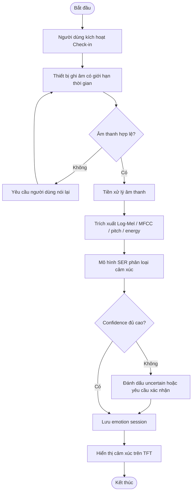

*Mô tả chart: Flow chart này mô tả tuần tự xử lý SER từ lúc người dùng check-in đến khi TFT hiển thị cảm xúc và local cache lưu phiên.*

---

## 3.3. SMART Objective 2: Đề xuất ít nhất một hoạt động hoặc một phản hồi phù hợp thông qua Cloud Service trong vòng 20 giây sau khi hoàn tất nhận diện cảm xúc và thiết bị có Internet, nhằm cải thiện hoặc duy trì trạng thái cảm xúc của người dùng

Objective 2 không chạy độc lập hoàn toàn trên Edge. Sau khi UC-01 tạo emotion label, thiết bị gửi context lên Cloud Service để nhận gợi ý hoạt động hoặc phản hồi hội thoại, sau đó hiển thị kết quả trên TFT.

### 3.3.1. Use Case UC-02: Gợi ý hoạt động và nội dung cải thiện tâm trạng

* **Input:** Trạng thái cảm xúc hiện tại nếu có, chủ đích hỗ trợ nhanh và lịch sử tương tác đã đồng bộ.
* **Output:** Danh sách hoạt động, bài hát và podcast phù hợp hiển thị trên TFT.

**Mô tả:** Cloud Recommendation Service đề xuất hoạt động như hít thở, thiền, thư giãn, vận động nhẹ, nghỉ ngơi hoặc ghi nhật ký cảm xúc; đồng thời đề xuất bài hát và podcast phù hợp với emotion label nếu đã có, chủ đích hỗ trợ nhanh, lịch sử tương tác và feedback trước đó.

**Ý nghĩa của use case:** UC-02 biến nhận biết cảm xúc hoặc nhu cầu hỗ trợ nhanh thành các lựa chọn chăm sóc cụ thể. Người dùng có thể mở Activity trực tiếp từ HOME, hoặc dùng kết quả UC-01 nếu vừa check-in cảm xúc trước đó.

**Vai trò trong objective:** UC-02 là nhánh hỗ trợ nhanh sau nhận diện cảm xúc, trong đó Cloud xử lý recommendation còn TFT hiển thị kết quả ngắn gọn để người dùng chọn.

| Trường | Nội dung |
| ------ | -------- |
| Use case ID | UC-02 |
| Tên use case | Gợi ý hoạt động và nội dung cải thiện tâm trạng |
| Tác nhân chính | Người dùng |
| Tác nhân phụ | Edge Device, Cloud Recommendation Service, TFT Screen |
| Tiền điều kiện | Thiết bị có Internet. Emotion label là tùy chọn; nếu chưa có, Cloud dùng chế độ gợi ý chung an toàn và lịch sử gần nhất. |
| Kích hoạt | Người dùng chọn Activity từ HOME hoặc từ RESULT/SUPPORT |
| Luồng chính | 1. Người dùng chọn Activity. 2. Thiết bị gửi emotion context nếu có, kèm lịch sử gần nhất lên Cloud. 3. Cloud lấy lịch sử hoạt động, nội dung đã nghe và feedback. 4. Cloud chọn hoạt động, bài hát và podcast phù hợp. 5. Cloud trả danh sách rút gọn về Edge Device. 6. TFT hiển thị các card gợi ý theo nhóm. 7. Người dùng chọn, bỏ qua hoặc đánh giá. 8. Thiết bị gửi feedback lên Cloud. |
| Luồng thay thế | Nếu Internet lỗi, TFT hiển thị thông báo cần kết nối Internet để lấy gợi ý cloud. |
| Dữ liệu vào | Optional emotion label, optional confidence score, recent session history, activity feedback, listening history |
| Dữ liệu ra | Activity cards, song cards, podcast cards, reason text, selected/skipped status, feedback score |
| Mục tiêu hiệu năng | Cloud trả kết quả về TFT trong vòng 20 giây |

#### Use Case Diagram

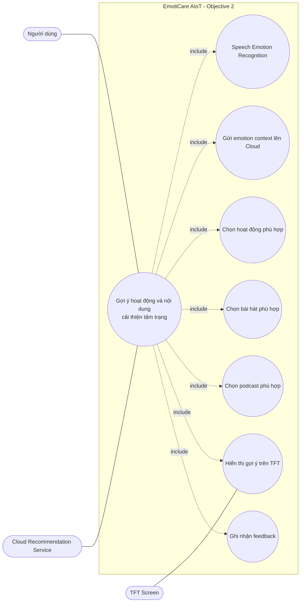

*Mô tả diagram: Use case diagram này thể hiện UC-02 cần Cloud Recommendation Service xử lý đồng thời hoạt động, bài hát và podcast; TFT Screen là nơi người dùng xem và phản hồi gợi ý.*

#### Flow Chart

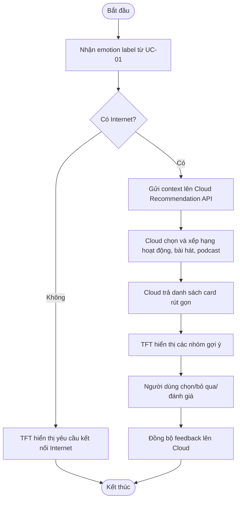

*Mô tả chart: Flow chart này mô tả quá trình lấy gợi ý hoạt động, bài hát và podcast từ Cloud rồi hiển thị kết quả lên TFT, bao gồm cả nhánh khi thiết bị không có Internet.*

### 3.3.2. Use Case UC-03: Lựa chọn bài hát hoặc podcast theo chủ đích

* **Input:** Chủ đích của người dùng, category nội dung mong muốn và emotion label gần nhất nếu có.
* **Output:** Danh sách bài hát hoặc podcast theo category hiển thị trên TFT.

**Mô tả:** Người dùng có thể chủ động chọn nghe bài hát hoặc podcast ngay từ HOME, không bắt buộc phải check-in cảm xúc trước. Cloud Media Recommendation Service phân loại nội dung theo các category như thư giãn, tập trung, ngủ nghỉ, vui vẻ, giảm căng thẳng, truyền cảm hứng, podcast ngắn, podcast thiền, podcast chia sẻ cảm xúc. Nếu có emotion context từ check-in gần nhất thì Cloud dùng để cá nhân hóa; nếu chưa có, Cloud ưu tiên category và chủ đích người dùng chọn.

**Ý nghĩa của use case:** UC-03 cho người dùng quyền chủ động hơn. Thay vì chỉ chờ hệ thống gợi ý, người dùng có thể nói rõ mình muốn nghe nhạc thư giãn, podcast động viên hoặc nội dung giúp tập trung.

**Vai trò trong objective:** UC-03 mở rộng Objective 2 từ hỗ trợ phản ứng theo cảm xúc sang hỗ trợ theo chủ đích, vẫn dùng Cloud để chọn nội dung và TFT để hiển thị danh sách.

| Trường | Nội dung |
| ------ | -------- |
| Use case ID | UC-03 |
| Tên use case | Lựa chọn bài hát hoặc podcast theo chủ đích |
| Tác nhân chính | Người dùng |
| Tác nhân phụ | Edge Device, Cloud Media Recommendation Service, TFT Screen |
| Tiền điều kiện | Thiết bị có Internet và người dùng chọn Music/Podcast Mode |
| Kích hoạt | Người dùng chọn category hoặc nói chủ đích nghe nội dung |
| Luồng chính | 1. Người dùng chọn Music/Podcast từ HOME hoặc SUPPORT. 2. Người dùng chọn Music, Podcast hoặc Both. 3. Người dùng chọn category hoặc nói chủ đích. 4. Thiết bị gửi category, intent và emotion context nếu có lên Cloud. 5. Cloud lọc danh sách bài hát/podcast theo category. 6. Cloud xếp hạng nội dung phù hợp. 7. TFT hiển thị danh sách rút gọn. 8. Người dùng chọn nội dung để nghe hoặc lưu lại. |
| Luồng thay thế | Nếu Internet lỗi, TFT hiển thị thông báo cần kết nối Cloud để lấy danh sách nội dung. Nếu category không có nội dung, Cloud trả category gần nhất. |
| Dữ liệu vào | User intent, selected category, optional emotion label, optional confidence score, listening history |
| Dữ liệu ra | Song list, podcast list, category, reason text, selected media item |
| Mục tiêu hiệu năng | Danh sách nội dung hiển thị trên TFT trong vòng 20 giây |

#### Category nội dung

| Category | Nội dung phù hợp | Ví dụ mục đích |
| -------- | ---------------- | -------------- |
| Thư giãn | Nhạc nhẹ, ambient, podcast thở chậm | Giảm căng thẳng |
| Tập trung | Nhạc không lời, white noise, podcast hướng dẫn tập trung | Học tập/làm việc |
| Ngủ nghỉ | Nhạc chậm, sleep story, podcast thiền ngủ | Chuẩn bị nghỉ ngơi |
| Vui vẻ | Nhạc tích cực, podcast truyền cảm hứng | Duy trì cảm xúc tốt |
| Xoa dịu buồn bã | Nhạc ấm, podcast chia sẻ cảm xúc | Cảm thấy được đồng hành |
| Giải tỏa tức giận | Nhạc grounding, podcast kiểm soát cảm xúc | Tạm dừng và hạ nhịp |
| Phục hồi năng lượng | Nhạc nhẹ có nhịp vừa, podcast self-care | Khi mệt mỏi |

#### Use Case Diagram

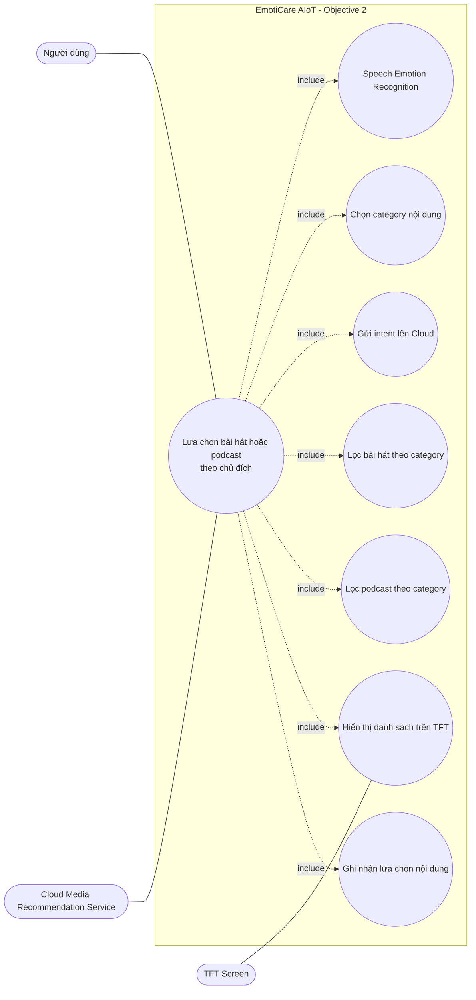

*Mô tả diagram: Use case diagram này mô tả nhánh người dùng chủ động chọn bài hát hoặc podcast theo category; Cloud lọc và xếp hạng nội dung, còn TFT hiển thị danh sách rút gọn.*

#### Flow Chart

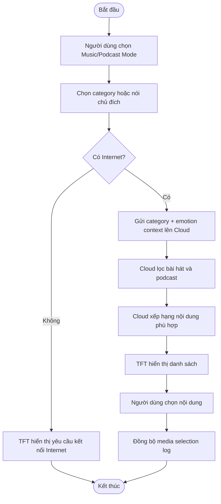

*Mô tả chart: Flow chart này mô tả quá trình người dùng chủ động chọn category bài hát/podcast, Cloud trả danh sách phù hợp và thiết bị ghi nhận lựa chọn.*

### 3.3.3. Use Case UC-04: Trò chuyện hỗ trợ cảm xúc

* **Input:** Giọng nói hoặc câu hỏi của người dùng cùng emotion context.
* **Output:** Phản hồi đồng cảm hiển thị trên TFT.

**Mô tả:** Người dùng có thể mở Conversation Mode trực tiếp từ HOME hoặc sau khi check-in cảm xúc. Thiết bị gửi nội dung chia sẻ của người dùng lên Cloud Conversation Service; nếu có emotion context thì gửi kèm để phản hồi phù hợp hơn. Cloud tạo phản hồi đồng cảm, kiểm tra an toàn, rút gọn nội dung và trả về thiết bị để hiển thị trên TFT.

**Ý nghĩa của use case:** UC-04 phù hợp khi người dùng cần được lắng nghe và phản hồi hơn là chỉ nhận một danh sách hoạt động hoặc nội dung nghe.

**Vai trò trong objective:** UC-04 là nhánh hỗ trợ bằng hội thoại, dùng Cloud để tạo phản hồi linh hoạt nhưng vẫn ràng buộc an toàn.

| Trường | Nội dung |
| ------ | -------- |
| Use case ID | UC-04 |
| Tên use case | Trò chuyện hỗ trợ cảm xúc |
| Tác nhân chính | Người dùng |
| Tác nhân phụ | Edge Device, Cloud Conversation Service, TFT Screen |
| Tiền điều kiện | Thiết bị có Internet và người dùng chọn Conversation Mode. Emotion label là tùy chọn; nếu chưa có, Cloud dùng câu chia sẻ hiện tại làm ngữ cảnh chính. |
| Kích hoạt | Người dùng nói tiếp, đặt câu hỏi hoặc yêu cầu thiết bị trò chuyện |
| Luồng chính | 1. Người dùng chọn Conversation từ HOME hoặc SUPPORT. 2. Người dùng chia sẻ bằng giọng nói. 3. Edge Device gửi nội dung chia sẻ và emotion context nếu có lên Cloud. 4. Cloud tạo phản hồi đồng cảm. 5. Safety Filter kiểm tra phản hồi. 6. Cloud trả phản hồi rút gọn. 7. TFT hiển thị phản hồi. 8. Metadata được đồng bộ nếu người dùng cho phép. |
| Luồng thay thế | Nếu phát hiện tín hiệu nguy cấp, Cloud trả thông điệp khuyên liên hệ người thân, chuyên gia hoặc dịch vụ hỗ trợ phù hợp. |
| Dữ liệu vào | User utterance, optional emotion label, optional confidence score, conversation context |
| Dữ liệu ra | Empathetic response, suggested next action, safety flag |
| Mục tiêu hiệu năng | Phản hồi đầu tiên hiển thị trên TFT trong vòng 20 giây |

#### Use Case Diagram

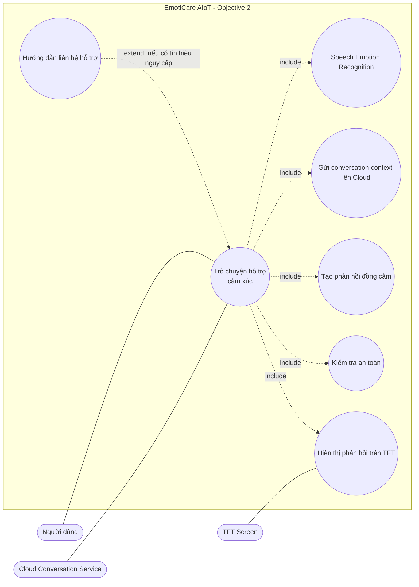

*Mô tả diagram: Use case diagram này nhấn mạnh Cloud Conversation Service là tác nhân xử lý phản hồi, còn TFT hiển thị câu trả lời đã được rút gọn và kiểm tra an toàn.*

#### Flow Chart

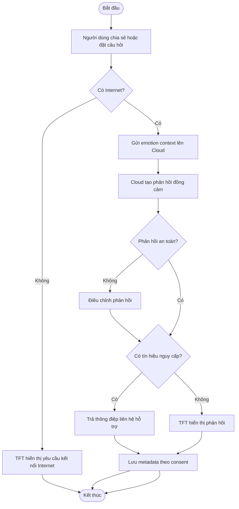

*Mô tả chart: Flow chart này mô tả luồng hội thoại cloud-assisted, bao gồm kiểm tra Internet, safety filter và nhánh xử lý tín hiệu nguy cấp.*

---

## 3.4. SMART Objective 3: Tự động tạo tóm tắt thống kê và phân tích cảm xúc theo ngày, tuần, tháng và năm trên Cloud Service, sau đó trả kết quả rút gọn về TFT screen trong vòng 180 giây sau khi người dùng yêu cầu hoặc sau một chu kỳ đồng bộ

Objective 3 giúp người dùng theo dõi dài hạn trực tiếp trên thiết bị. Cloud xử lý tổng hợp dữ liệu, còn thiết bị hiển thị phiên bản rút gọn phù hợp với màn hình TFT.

### 3.4.1. Use Case UC-05: Thống kê và phân tích xu hướng cảm xúc

* **Input:** Lịch sử cảm xúc, activity logs, media selection logs và conversation metadata đã đồng bộ.
* **Output:** Báo cáo rút gọn theo ngày, tuần, tháng và năm hiển thị trên TFT.

**Mô tả:** Cloud Report Engine tổng hợp dữ liệu cảm xúc theo nhiều mốc thời gian, tính tỷ lệ cảm xúc, xu hướng thay đổi và hiệu quả hoạt động. Kết quả được nén thành các thẻ thông tin ngắn để hiển thị trên TFT.

**Ý nghĩa của use case:** UC-05 biến các phiên cảm xúc rời rạc thành bức tranh dài hạn, giúp người dùng theo dõi xu hướng ngay trên thiết bị phần cứng.

**Vai trò trong objective:** UC-05 là phần tổng hợp dữ liệu dài hạn của hệ thống, dùng Cloud cho xử lý nặng và TFT cho hiển thị.

| Trường | Nội dung |
| ------ | -------- |
| Use case ID | UC-05 |
| Tên use case | Thống kê và phân tích xu hướng cảm xúc |
| Tác nhân chính | Người dùng |
| Tác nhân phụ | Edge Device, Cloud Report Engine, TFT Screen |
| Tiền điều kiện | Có dữ liệu đã đồng bộ lên Cloud |
| Kích hoạt | Người dùng mở Report từ HOME/TFT hoặc thiết bị hoàn tất một chu kỳ đồng bộ |
| Luồng chính | 1. Người dùng chọn Report từ HOME. 2. TFT hiển thị lựa chọn ngày, tháng hoặc năm. 3. Người dùng chọn period cần xem. 4. Thiết bị gửi yêu cầu report theo period. 5. Cloud Report Engine lấy emotion sessions và logs. 6. Cloud tính phân bố cảm xúc. 7. Cloud phân tích xu hướng và hiệu quả hoạt động/nội dung. 8. Cloud tạo report rút gọn. 9. Thiết bị nhận report và hiển thị kết quả trên TFT. |
| Luồng thay thế | Nếu dữ liệu quá ít, Cloud trả report `limited_data` và TFT hiển thị khuyến nghị check-in thêm. |
| Dữ liệu vào | Emotion sessions, activity logs, media selection logs, conversation metadata, selected period |
| Dữ liệu ra | TFT report cards, trend summary, activity effectiveness, data quality |
| Mục tiêu hiệu năng | Báo cáo rút gọn hiển thị trên TFT trong vòng 180 giây |

#### Use Case Diagram

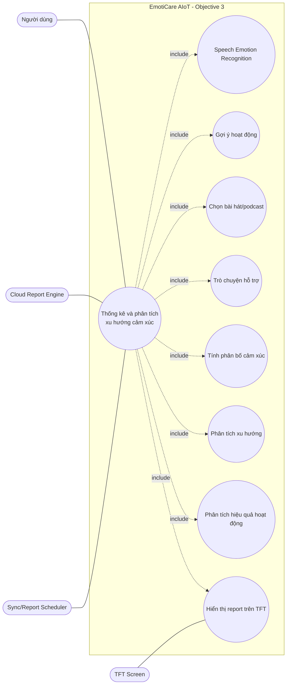

*Mô tả diagram: Use case diagram này cho thấy Cloud Report Engine tổng hợp dữ liệu từ các use case trước và trả báo cáo rút gọn về TFT Screen.*

#### Flow Chart

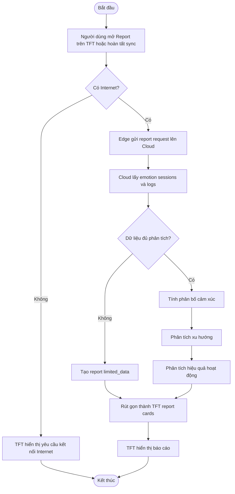

*Mô tả chart: Flow chart này mô tả cách thiết bị yêu cầu Cloud tạo báo cáo và nhận lại các thẻ tóm tắt để hiển thị trên TFT.*

## 3.5. Bảng tổng hợp use case

| ID | Use case | Input | Output | Xử lý chính |
| -- | -------- | ----- | ------ | ----------- |
| UC-01 | Speech Emotion Recognition | Giọng nói người dùng | Emotion label, confidence, emotion session | Edge AI |
| UC-02 | Gợi ý hoạt động và nội dung cải thiện tâm trạng | Emotion label và lịch sử đã đồng bộ | Hoạt động, bài hát, podcast trên TFT | Cloud + TFT |
| UC-03 | Lựa chọn bài hát hoặc podcast theo chủ đích | Chủ đích, category và emotion context | Danh sách bài hát/podcast trên TFT | Cloud + TFT |
| UC-04 | Trò chuyện hỗ trợ cảm xúc | Giọng nói/câu hỏi và emotion context | Phản hồi đồng cảm trên TFT | Cloud + TFT |
| UC-05 | Thống kê và phân tích xu hướng cảm xúc | Lịch sử cảm xúc, hoạt động và nội dung đã chọn | Báo cáo rút gọn trên TFT | Cloud + TFT |

---

# 04. Edge AI

## 4.1. Vai trò của Edge AI trong Speech Emotion Recognition

Edge AI của EmotiCare AIoT tập trung vào bài toán **Speech Emotion Recognition (SER)**: nhận diện cảm xúc từ tín hiệu giọng nói. Thay vì dựa vào văn bản người dùng nhập hoặc dữ liệu sinh hoạt như giấc ngủ, hệ thống sử dụng âm thanh lời nói làm nguồn dữ liệu chính để suy luận trạng thái cảm xúc.

Edge AI phục vụ trực tiếp SMART Objective 1 và cung cấp emotion context cho Objective 2, Objective 3. Kết quả SER gồm `emotion_label`, `confidence_score`, `session_id`, timestamp và trạng thái đồng bộ. Các chức năng gợi ý, hội thoại và báo cáo không chạy hoàn toàn trên Edge; chúng cần Internet/Cloud Service và chỉ hiển thị kết quả cuối cùng trên TFT.

## 4.2. Cơ sở tham khảo kỹ thuật

Thiết kế SER của EmotiCare AIoT tham khảo ba nhóm nguồn:

| Nguồn | Giá trị tham khảo cho hệ thống |
| ----- | ------------------------------ |
| Bài tổng quan trên PubMed Central | Cung cấp bối cảnh học thuật về bài toán nhận diện cảm xúc từ lời nói và các hướng tiếp cận phổ biến trong SER |
| RAVDESS Emotional Speech Audio trên Kaggle | Cung cấp tập dữ liệu giọng nói cảm xúc có nhãn, phù hợp để huấn luyện/thử nghiệm prototype SER |
| Bài arXiv "Emotion Recognition from Speech" | So sánh các đặc trưng Log-Mel Spectrogram, MFCC, pitch, energy và các mô hình LSTM, CNN, HMM, DNN trên RAVDESS |

Từ các nguồn này, đặc tả chọn hướng thiết kế thực tế cho prototype:

* Dùng RAVDESS làm tập dữ liệu tham khảo chính cho nhãn cảm xúc và cấu trúc dữ liệu huấn luyện.
* Ưu tiên đặc trưng phổ thời gian như **Log-Mel Spectrogram** và **MFCC**.
* Bổ sung đặc trưng prosody như **pitch** và **energy** để hỗ trợ phân biệt cảm xúc.
* Ưu tiên mô hình CNN nhỏ hoặc CNN kết hợp lớp tuần tự nhẹ nếu cần, vì phù hợp hơn cho tối ưu edge so với mô hình quá lớn.
* Đánh giá mô hình bằng accuracy, confusion matrix và latency thay vì chỉ nhìn vào accuracy offline.

## 4.3. RAVDESS và ánh xạ nhãn cảm xúc

RAVDESS là tập dữ liệu âm thanh cảm xúc được sử dụng rộng rãi cho Speech Emotion Recognition. Dataset có các nhãn cảm xúc như neutral, calm, happy, sad, angry, fearful, disgust và surprised. Vì EmotiCare AIoT hướng đến chăm sóc cảm xúc hằng ngày, hệ thống ánh xạ nhãn nghiên cứu sang nhãn sản phẩm như sau:

| Nhãn RAVDESS / SER | Nhãn sản phẩm | Ý nghĩa trong EmotiCare AIoT |
| ------------------ | ------------- | ----------------------------- |
| neutral | Bình thường | Người dùng đang ở trạng thái ổn định |
| calm | Bình thường / thư giãn | Có thể duy trì trạng thái hiện tại |
| happy | Vui vẻ | Cảm xúc tích cực, nên củng cố thói quen tốt |
| sad | Buồn bã | Cần phản hồi đồng cảm hoặc hoạt động nhẹ |
| angry | Tức giận | Cần gợi ý tạm dừng, thở chậm, tránh phản ứng vội |
| fearful | Căng thẳng | Cần hỗ trợ giảm áp lực hoặc grounding |
| disgust | Khó chịu | Có thể gộp vào căng thẳng/tức giận tùy confidence |
| surprised | Không chắc chắn / kích hoạt cao | Cần xác nhận thêm nếu không đủ ngữ cảnh |
| tired | Mệt mỏi | Nhãn mở rộng của sản phẩm, cần dữ liệu bổ sung ngoài RAVDESS hoặc fine-tuning riêng |

## 4.4. Dữ liệu đầu vào và đầu ra

| Nhóm dữ liệu | Mô tả | Bắt buộc |
| ------------ | ----- | -------- |
| Audio sample | Đoạn giọng nói ngắn sau khi người dùng kích hoạt check-in | Có |
| Sampling rate | Tần số lấy mẫu thống nhất cho pipeline, ví dụ 16 kHz hoặc 22.05 kHz | Có |
| Log-Mel Spectrogram | Biểu diễn năng lượng theo thang Mel qua thời gian | Có trong hướng CNN |
| MFCC | Đặc trưng cepstral phổ biến trong xử lý tiếng nói | Nên có |
| Pitch | Cao độ giọng nói | Nên có |
| Energy | Năng lượng âm thanh | Nên có |
| Metadata | session_id, device_id, started_at, completed_at | Có |

| Đầu ra | Mô tả |
| ------ | ----- |
| emotion_label | Nhãn cảm xúc sau ánh xạ sang taxonomy của sản phẩm |
| confidence_score | Độ tin cậy của mô hình |
| top_k_predictions | Danh sách nhãn có xác suất cao nhất, dùng cho debug hoặc kiểm tra nội bộ |
| quality_flag | clean, noisy, too_short, low_confidence |
| inference_latency_ms | Thời gian xử lý trên thiết bị |

## 4.5. Pipeline SER trên Edge Device

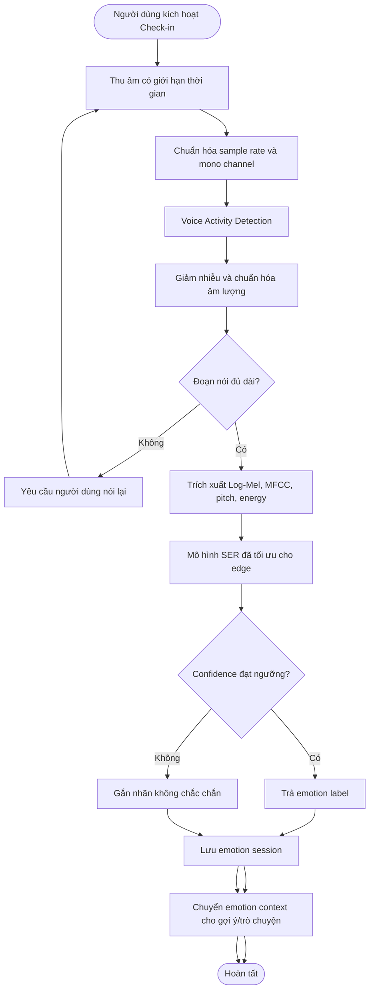

*Mô tả chart: Flow chart này mô tả pipeline Edge AI cho Speech Emotion Recognition, từ thu âm đến lưu emotion session và chuyển emotion context cho các chức năng cloud-assisted.*

## 4.6. Đặc trưng âm thanh

| Đặc trưng | Vai trò | Ghi chú triển khai |
| --------- | ------- | ------------------ |
| Log-Mel Spectrogram | Biểu diễn phổ thời gian phù hợp cho CNN | Bài arXiv ghi nhận Log-Mel là đặc trưng hiệu quả trong thử nghiệm với CNN trên RAVDESS |
| MFCC | Đặc trưng tiếng nói kinh điển | Hữu ích cho baseline hoặc mô hình nhẹ |
| Pitch | Mô tả cao độ | Hỗ trợ nhận biết kích hoạt cảm xúc như tức giận/căng thẳng |
| Energy | Mô tả cường độ | Hỗ trợ phân biệt giọng yếu, mạnh, kích động |
| Delta/Delta-delta | Biến thiên theo thời gian | Có thể bổ sung nếu tài nguyên cho phép |
| Duration/Pause ratio | Kiểm tra chất lượng đoạn nói | Hỗ trợ quality flag và retry |

## 4.7. Mô hình đề xuất

| Phương án | Mô tả | Khi sử dụng |
| --------- | ----- | ----------- |
| MFCC + classifier nhẹ | Baseline đơn giản, dễ chạy trên thiết bị | Prototype sớm hoặc phần cứng hạn chế |
| Log-Mel + 2D CNN nhỏ | Chuyển spectrogram thành đầu vào dạng ảnh cho CNN | Phương án chính cho prototype SER |
| CNN + LSTM/GRU nhẹ | CNN trích xuất đặc trưng, lớp tuần tự học biến thiên thời gian | Khi cần cải thiện trên câu nói dài hơn |
| Server-side training, edge-side inference | Huấn luyện trên máy/server, chuyển model tối ưu sang thiết bị | Phù hợp với workflow AIoT |

Mô hình triển khai trên edge cần được tối ưu bằng quantization hoặc định dạng inference nhẹ nếu phần cứng hạn chế. Với ESP32-S3, có thể cân nhắc TensorFlow Lite Micro hoặc chia tách: edge trích xuất đặc trưng và chạy model nhỏ, server dùng cho huấn luyện/cập nhật model.

## 4.8. Tập nhãn sản phẩm

| Nhãn sản phẩm | Nguồn học chính | Ghi chú |
| ------------- | --------------- | ------- |
| Vui vẻ | happy | Có thể học từ RAVDESS |
| Bình thường | neutral, calm | Gộp hai nhãn ổn định |
| Căng thẳng | fearful, surprised, một phần disgust | Cần tinh chỉnh bằng dữ liệu thực tế của sản phẩm |
| Buồn bã | sad | Có thể học từ RAVDESS |
| Tức giận | angry | Có thể học từ RAVDESS |
| Mệt mỏi | dữ liệu mở rộng | RAVDESS không đại diện trực tiếp; prototype có thể dùng rule/feedback hoặc thu thêm dữ liệu |
| Không chắc chắn | confidence thấp hoặc tín hiệu nhiễu | Không phải cảm xúc, là trạng thái chất lượng suy luận |

## 4.9. Logic confidence và quality flag

| Điều kiện | Hành vi hệ thống |
| --------- | ---------------- |
| `confidence_score >= 0.75` và `quality_flag = clean` | Hiển thị emotion label và chuyển sang hỗ trợ |
| `0.50 <= confidence_score < 0.75` | Hiển thị dạng "có thể là..." và cho phép người dùng xác nhận |
| `confidence_score < 0.50` | Gắn nhãn không chắc chắn, không dùng để kết luận xu hướng mạnh |
| `quality_flag = too_short` | Yêu cầu ghi âm lại |
| `quality_flag = noisy` | Cảnh báo môi trường nhiễu và đề xuất nói gần microphone hơn |

## 4.10. Đánh giá mô hình

| Chỉ số | Mục đích |
| ------ | -------- |
| Accuracy | Đánh giá tổng thể trên tập test |
| Confusion matrix | Xem các cặp cảm xúc dễ nhầm, ví dụ calm-neutral hoặc angry-fearful |
| Macro F1-score | Tránh mô hình thiên lệch về lớp nhiều dữ liệu |
| Latency | Đảm bảo inference hoàn tất trong 15 giây trên thiết bị |
| Model size | Đảm bảo model phù hợp bộ nhớ phần cứng |
| Robustness test | Kiểm tra với nhiễu nền, khoảng cách microphone và câu nói ngắn |

## 4.11. Lưu trữ cục bộ

| Trường | Mô tả |
| ------ | ----- |
| session_id | UUID hoặc ID sinh tại thiết bị |
| device_id | ID thiết bị |
| user_id | ID người dùng đã liên kết |
| emotion_label | Kết quả phân loại sau ánh xạ nhãn |
| confidence_score | Độ tin cậy |
| quality_flag | clean, noisy, too_short, low_confidence |
| inference_latency_ms | Thời gian xử lý |
| created_at | Thời điểm tạo session |
| audio_saved | Mặc định `false` |
| sync_status | pending, synced hoặc failed |

## 4.12. Yêu cầu riêng tư và an toàn

* Thiết bị phải hiển thị rõ trạng thái đang ghi âm.
* Không upload âm thanh thô mặc định.
* Dataset nghiên cứu như RAVDESS chỉ dùng cho huấn luyện/thử nghiệm mô hình, không đại diện đầy đủ cho mọi người dùng thực tế.
* Kết quả SER là suy luận xác suất, không phải kết luận chắc chắn về trạng thái tâm lý.
* Kết quả Edge AI chỉ hỗ trợ tự nhận thức, không phải chẩn đoán y khoa.

---

# 05. Internet Service

## 5.1. Tổng quan

Internet Service của EmotiCare AIoT phục vụ trực tiếp cho thiết bị phần cứng. Vai trò của cloud là hỗ trợ các chức năng vượt quá khả năng xử lý cục bộ của thiết bị sinh viên: gợi ý hoạt động, trò chuyện hỗ trợ, lưu trữ dài hạn, phân tích xu hướng và tạo báo cáo rút gọn để trả về TFT screen.

Ngoại trừ **Objective 1 - Speech Emotion Recognition** chạy trên Edge AI, các chức năng còn lại đều cần phối hợp Internet/Cloud:

| Objective | Xử lý chính | Ghi chú |
| --------- | ----------- | ------- |
| Objective 1 | Edge AI | Nhận diện cảm xúc trong 15 giây, vẫn hoạt động offline |
| Objective 2 | Cloud Service + TFT | Recommendation, media selection và conversation cần Internet, kết quả hiển thị trên TFT |
| Objective 3 | Cloud Report Engine + TFT | Báo cáo được tổng hợp trên cloud và trả về TFT |

## 5.2. Kiến trúc Internet Service

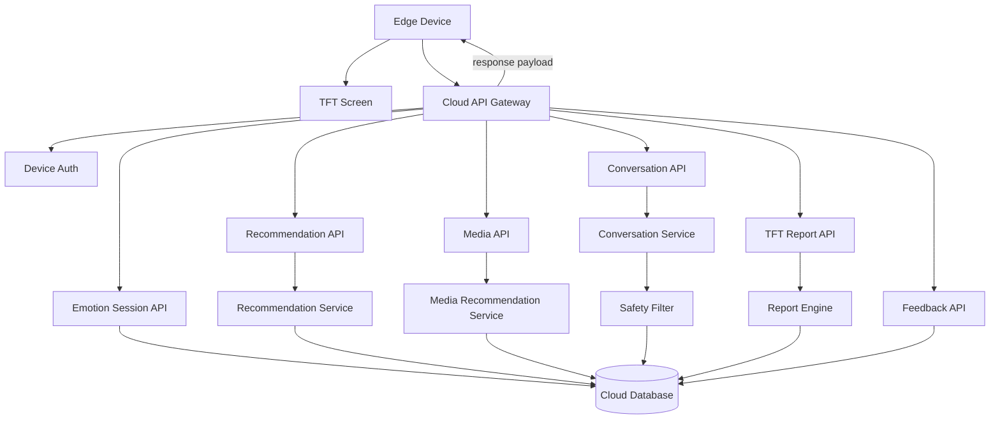

*Mô tả diagram: Sơ đồ mô tả Cloud Service như backend cho thiết bị phần cứng; Edge Device gọi API, Cloud xử lý dữ liệu và trả payload rút gọn để hiển thị trên TFT.*

## 5.3. Thiết kế database

### 5.3.1. Bảng `users`

| Cột | Kiểu | Ràng buộc | Mô tả |
| --- | ---- | --------- | ----- |
| id | UUID | PK | ID người dùng |
| name | VARCHAR(120) | NOT NULL | Tên hiển thị trên thiết bị |
| pairing_code | VARCHAR(20) | UNIQUE | Mã ghép thiết bị |
| consent_audio_storage | BOOLEAN | DEFAULT false | Có cho phép lưu audio thô hay không |
| created_at | TIMESTAMP | NOT NULL | Thời điểm tạo |
| updated_at | TIMESTAMP | NOT NULL | Thời điểm cập nhật |

### 5.3.2. Bảng `devices`

| Cột | Kiểu | Ràng buộc | Mô tả |
| --- | ---- | --------- | ----- |
| id | UUID | PK | ID thiết bị |
| user_id | UUID | FK users.id | Chủ sở hữu |
| name | VARCHAR(120) | NOT NULL | Tên thiết bị |
| device_token_hash | VARCHAR(255) | NOT NULL | Token xác thực thiết bị đã hash |
| firmware_version | VARCHAR(50) | NULL | Phiên bản firmware |
| last_seen_at | TIMESTAMP | NULL | Lần online gần nhất |
| status | VARCHAR(30) | NOT NULL | online, offline, disabled |
| created_at | TIMESTAMP | NOT NULL | Thời điểm đăng ký |

### 5.3.3. Bảng `emotion_sessions`

| Cột | Kiểu | Ràng buộc | Mô tả |
| --- | ---- | --------- | ----- |
| id | UUID | PK | ID phiên trên cloud |
| client_session_id | VARCHAR(80) | UNIQUE | ID sinh từ Edge để chống trùng khi retry |
| user_id | UUID | FK users.id | Người dùng |
| device_id | UUID | FK devices.id | Thiết bị |
| emotion_label | VARCHAR(50) | NOT NULL | Nhãn cảm xúc |
| confidence_score | DECIMAL(4,3) | NOT NULL | Độ tin cậy |
| quality_flag | VARCHAR(30) | NOT NULL | clean, noisy, too_short, low_confidence |
| inference_latency_ms | INT | NULL | Thời gian inference trên Edge |
| client_created_at | TIMESTAMP | NOT NULL | Timestamp từ thiết bị |
| created_at | TIMESTAMP | NOT NULL | Timestamp cloud |

### 5.3.4. Bảng `recommendation_requests`

| Cột | Kiểu | Ràng buộc | Mô tả |
| --- | ---- | --------- | ----- |
| id | UUID | PK | ID yêu cầu |
| session_id | UUID | FK emotion_sessions.id | Phiên cảm xúc liên quan |
| request_payload | JSONB | NOT NULL | Emotion context và cấu hình |
| response_payload | JSONB | NOT NULL | Danh sách hoạt động, bài hát và podcast rút gọn cho TFT |
| status | VARCHAR(30) | NOT NULL | success, failed, limited |
| created_at | TIMESTAMP | NOT NULL | Thời điểm tạo |

### 5.3.5. Bảng `activity_feedback`

| Cột | Kiểu | Ràng buộc | Mô tả |
| --- | ---- | --------- | ----- |
| id | UUID | PK | ID feedback |
| recommendation_id | UUID | FK recommendation_requests.id | Gợi ý liên quan |
| activity_type | VARCHAR(50) | NOT NULL | breathing, rest, movement, journaling |
| selected | BOOLEAN | DEFAULT false | Người dùng có chọn hay không |
| feedback_score | INT | NULL | Đánh giá 1-5 |
| created_at | TIMESTAMP | NOT NULL | Thời điểm tạo |

### 5.3.6. Bảng `conversation_requests`

| Cột | Kiểu | Ràng buộc | Mô tả |
| --- | ---- | --------- | ----- |
| id | UUID | PK | ID hội thoại |
| session_id | UUID | FK emotion_sessions.id | Phiên cảm xúc liên quan |
| user_message_summary | TEXT | NULL | Tóm tắt input nếu được phép |
| response_text | VARCHAR(500) | NOT NULL | Phản hồi rút gọn cho TFT |
| safety_flag | VARCHAR(50) | NOT NULL | none, low, medium, high |
| created_at | TIMESTAMP | NOT NULL | Thời điểm tạo |

### 5.3.7. Bảng `tft_reports`

| Cột | Kiểu | Ràng buộc | Mô tả |
| --- | ---- | --------- | ----- |
| id | UUID | PK | ID báo cáo |
| user_id | UUID | FK users.id | Người dùng |
| period_type | VARCHAR(20) | NOT NULL | daily, weekly, monthly, yearly |
| period_start | DATE | NOT NULL | Ngày bắt đầu |
| period_end | DATE | NOT NULL | Ngày kết thúc |
| tft_cards | JSONB | NOT NULL | Các thẻ nội dung ngắn để hiển thị trên TFT |
| emotion_distribution | JSONB | NOT NULL | Tỷ lệ cảm xúc |
| trend_summary | VARCHAR(500) | NULL | Tóm tắt xu hướng |
| data_quality | VARCHAR(30) | NOT NULL | enough_data, limited_data |
| generated_at | TIMESTAMP | NOT NULL | Thời điểm tạo |

## 5.4. API cho Edge Device

| Endpoint | Method | Mục đích | Trả về cho TFT |
| -------- | ------ | ------- | -------------- |
| `/api/devices/pair` | POST | Ghép thiết bị với user bằng pairing code | Trạng thái ghép thiết bị |
| `/api/devices/heartbeat` | POST | Cập nhật trạng thái online và firmware | Server time, config version |
| `/api/emotion-sessions/sync` | POST | Đồng bộ emotion sessions từ Edge | Danh sách session đã nhận |
| `/api/recommendations/request` | POST | Yêu cầu Cloud gợi ý hoạt động, bài hát và podcast | 1-5 mixed recommendation cards |
| `/api/media/categories` | GET | Lấy danh sách category bài hát/podcast | Danh sách category rút gọn |
| `/api/media/recommendations` | POST | Lấy bài hát/podcast theo chủ đích và category | Song/podcast cards |
| `/api/conversations/respond` | POST | Yêu cầu Cloud tạo phản hồi hỗ trợ | 1 response card |
| `/api/feedback/activity` | POST | Gửi lựa chọn/đánh giá hoạt động | Trạng thái đã lưu |
| `/api/feedback/media` | POST | Gửi lựa chọn/đánh giá bài hát hoặc podcast | Trạng thái đã lưu |
| `/api/reports/tft-summary` | GET | Lấy report rút gọn theo period | 3-5 TFT report cards |
| `/api/reports/generate` | POST | Yêu cầu tạo report mới | Job status hoặc report cards |
| `/api/device-config` | GET | Lấy cấu hình rút gọn cho thiết bị | Threshold, labels, text templates |

## 5.5. Media database và categories

### 5.5.1. Bảng `media_items`

| Cột | Kiểu | Ràng buộc | Mô tả |
| --- | ---- | --------- | ----- |
| id | UUID | PK | ID nội dung |
| media_type | VARCHAR(20) | NOT NULL | song, podcast |
| title | VARCHAR(160) | NOT NULL | Tên bài hát hoặc podcast |
| creator | VARCHAR(160) | NULL | Nghệ sĩ, tác giả hoặc kênh |
| category | VARCHAR(50) | NOT NULL | relax, focus, sleep, happy, sad_support, anger_release, energy_recover |
| duration_sec | INT | NULL | Thời lượng nội dung |
| source_url | TEXT | NULL | URL nguồn nếu có |
| enabled | BOOLEAN | DEFAULT true | Nội dung có được gợi ý hay không |

### 5.5.2. Bảng `media_selection_logs`

| Cột | Kiểu | Ràng buộc | Mô tả |
| --- | ---- | --------- | ----- |
| id | UUID | PK | ID log |
| session_id | UUID | FK emotion_sessions.id | Phiên cảm xúc liên quan |
| media_item_id | UUID | FK media_items.id | Nội dung được chọn |
| user_intent | VARCHAR(120) | NULL | Chủ đích người dùng nhập/chọn |
| selected_category | VARCHAR(50) | NOT NULL | Category đã chọn |
| feedback_score | INT | NULL | Đánh giá 1-5 |
| created_at | TIMESTAMP | NOT NULL | Thời điểm tạo |

### 5.5.3. Media categories

| Category | Loại nội dung | Trường hợp sử dụng |
| -------- | ------------- | ------------------ |
| relax | Nhạc nhẹ, ambient, podcast thở chậm | Khi căng thẳng |
| focus | Nhạc không lời, white noise, podcast tập trung | Khi cần học/làm việc |
| sleep | Nhạc chậm, sleep story, podcast thiền ngủ | Khi cần nghỉ ngơi |
| happy | Nhạc tích cực, podcast truyền cảm hứng | Khi muốn duy trì năng lượng tốt |
| sad_support | Nhạc ấm, podcast chia sẻ cảm xúc | Khi buồn bã |
| anger_release | Nhạc grounding, podcast kiểm soát cảm xúc | Khi tức giận |
| energy_recover | Nhạc nhẹ có nhịp vừa, podcast self-care | Khi mệt mỏi |

## 5.6. Flow tương tác Edge-Cloud-TFT

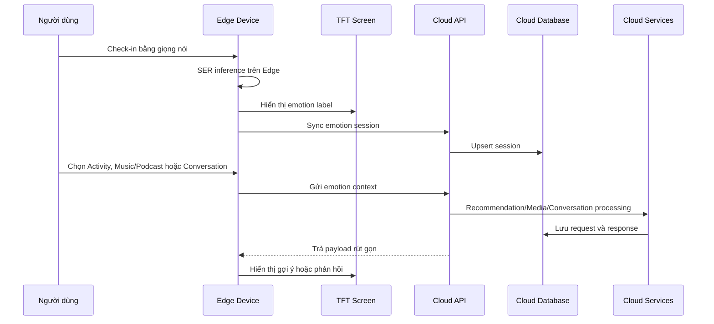

*Mô tả diagram: Sequence diagram này mô tả cách thiết bị chạy SER tại Edge, đồng bộ dữ liệu lên Cloud, nhận gợi ý hoạt động, bài hát, podcast hoặc phản hồi hỗ trợ từ Cloud và hiển thị lại trên TFT.*

## 5.7. Flow tạo báo cáo TFT

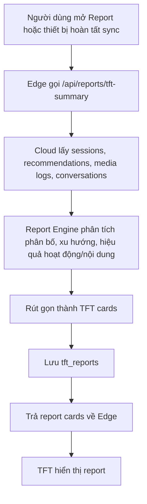

*Mô tả chart: Flow chart này cho thấy báo cáo được xử lý trên Cloud, bao gồm cả hoạt động, bài hát và podcast đã chọn; kết quả cuối cùng là các thẻ ngắn để hiển thị trên TFT screen.*

## 5.8. Quy tắc triển khai API

* Edge API phải dùng device token hoặc signed request.
* Các endpoint phải trả lỗi ngắn gọn để TFT có thể hiển thị.
* `/api/emotion-sessions/sync` phải idempotent theo `device_id + client_session_id`.
* Cloud response cho TFT nên giới hạn 1-5 cards, mỗi card có `title`, `body`, `severity` và `action_id` nếu cần.
* Khi mất Internet, Objective 2 và Objective 3 không tạo kết quả mới; TFT hiển thị trạng thái chờ kết nối.

---

# 06. Functional Requirement

## 6.1. Tổng quan

Yêu cầu chức năng của EmotiCare AIoT được cập nhật theo phạm vi mới: người dùng theo dõi toàn bộ trên TFT screen, Objective 1 chạy bằng Edge AI, còn Objective 2 và Objective 3 phối hợp Internet/Cloud.

* **UC-01:** Speech Emotion Recognition trên Edge Device.
* **UC-02:** Gợi ý hoạt động, bài hát và podcast cải thiện tâm trạng qua Cloud Recommendation Service.
* **UC-03:** Lựa chọn bài hát hoặc podcast theo chủ đích qua Cloud Media Recommendation Service.
* **UC-04:** Trò chuyện hỗ trợ cảm xúc qua Cloud Conversation Service.
* **UC-05:** Thống kê và phân tích xu hướng cảm xúc qua Cloud Report Engine, hiển thị trên TFT.

## 6.2. Nhóm chức năng nhận diện cảm xúc trên Edge

| ID | Yêu cầu chức năng | Use case liên quan | Độ ưu tiên |
| -- | ----------------- | ------------------ | ---------- |
| FR-01 | Hệ thống phải cho phép người dùng kích hoạt phiên check-in bằng nút vật lý hoặc thao tác tương đương trên thiết bị. | UC-01 | Must |
| FR-02 | Thiết bị phải hiển thị rõ trạng thái đang ghi âm trên TFT trong suốt thời gian thu giọng nói. | UC-01 | Must |
| FR-03 | Thiết bị phải ghi âm trong thời lượng giới hạn và tự dừng khi đủ dữ liệu hoặc hết thời gian. | UC-01 | Must |
| FR-04 | Edge AI phải tiền xử lý âm thanh, giảm nhiễu cơ bản và trích xuất đặc trưng SER như Log-Mel Spectrogram, MFCC, pitch hoặc energy. | UC-01 | Must |
| FR-05 | Mô hình SER phải phân loại cảm xúc thành các nhóm sản phẩm: vui vẻ, bình thường, căng thẳng, buồn bã, tức giận, mệt mỏi hoặc không chắc chắn. | UC-01 | Must |
| FR-06 | Hệ thống phải trả kết quả cảm xúc trên TFT trong vòng 15 giây sau khi nhận được giọng nói hợp lệ. | UC-01 | Must |
| FR-07 | Hệ thống phải lưu emotion session gồm session ID, user ID, device ID, emotion label, confidence score, quality flag, timestamp và sync status. | UC-01 | Must |
| FR-08 | Nếu dữ liệu âm thanh không hợp lệ hoặc confidence thấp, hệ thống phải yêu cầu người dùng nói lại hoặc đánh dấu kết quả là không chắc chắn. | UC-01 | Should |

## 6.3. Nhóm chức năng đồng bộ nền tảng

| ID | Yêu cầu chức năng | Use case liên quan | Độ ưu tiên |
| -- | ----------------- | ------------------ | ---------- |
| FR-09 | Edge Device phải lưu tạm emotion sessions khi mất Internet. | UC-01, UC-05 | Must |
| FR-10 | Edge Device phải đồng bộ các session pending lên Cloud khi Internet khả dụng. | UC-02, UC-03, UC-04, UC-05 | Must |
| FR-11 | API đồng bộ phải xử lý idempotent theo `device_id + client_session_id` để tránh tạo trùng session. | UC-05 | Must |
| FR-12 | TFT phải hiển thị trạng thái Online, Offline, Sync pending, Waiting cloud và Cloud result ready. | UC-02, UC-03, UC-04, UC-05 | Must |
| FR-13 | Thiết bị phải gửi heartbeat định kỳ để Cloud biết trạng thái thiết bị. | UC-02, UC-03, UC-04, UC-05 | Should |

## 6.4. Nhóm chức năng gợi ý hoạt động và nội dung qua Cloud

| ID | Yêu cầu chức năng | Use case liên quan | Độ ưu tiên |
| -- | ----------------- | ------------------ | ---------- |
| FR-14 | Khi có Internet, thiết bị phải cho phép người dùng mở Activity từ HOME hoặc sau check-in; thiết bị gửi emotion context lên Cloud Recommendation API nếu có. | UC-02 | Must |
| FR-15 | Cloud phải trả ít nhất một recommendation card phù hợp với emotion label hiện tại. | UC-02 | Must |
| FR-16 | Recommendation card phải được rút gọn để hiển thị được trên TFT, gồm title, type, body ngắn, reason text và action ID nếu có. | UC-02 | Must |
| FR-17 | Kết quả gợi ý phải hiển thị trên TFT trong vòng 20 giây sau khi UC-01 hoàn tất và thiết bị có Internet. | UC-02 | Must |
| FR-18 | Người dùng phải có thể chọn, bỏ qua hoặc đánh giá hoạt động, bài hát hoặc podcast được gợi ý trên thiết bị. | UC-02 | Should |
| FR-19 | Thiết bị phải gửi feedback hoạt động/nội dung lên Cloud để phục vụ cá nhân hóa sau này. | UC-02, UC-05 | Should |
| FR-20 | Nếu không có Internet, TFT phải thông báo rằng chức năng gợi ý cần kết nối Cloud. | UC-02 | Must |

## 6.5. Nhóm chức năng lựa chọn bài hát hoặc podcast theo chủ đích

| ID | Yêu cầu chức năng | Use case liên quan | Độ ưu tiên |
| -- | ----------------- | ------------------ | ---------- |
| FR-21 | Khi có Internet, thiết bị phải cho phép người dùng mở Music/Podcast Mode trực tiếp từ HOME hoặc từ màn hình SUPPORT. | UC-03 | Must |
| FR-22 | TFT phải hiển thị danh sách category nội dung gồm thư giãn, tập trung, ngủ nghỉ, vui vẻ, xoa dịu buồn bã, giải tỏa tức giận và phục hồi năng lượng. | UC-03 | Must |
| FR-23 | Thiết bị phải gửi category, media type, user intent và emotion context nếu có lên Cloud Media Recommendation API. | UC-03 | Must |
| FR-24 | Cloud Media Recommendation Service phải lọc và xếp hạng bài hát/podcast theo category, emotion label, lịch sử lựa chọn và feedback. | UC-03 | Must |
| FR-25 | TFT phải hiển thị danh sách bài hát/podcast rút gọn, bao gồm title, creator, duration, category và reason text. | UC-03 | Must |
| FR-26 | Người dùng phải có thể chọn nội dung để nghe, lưu lại, bỏ qua hoặc đánh giá sau khi nghe. | UC-03 | Should |
| FR-27 | Thiết bị phải đồng bộ media selection log và media feedback lên Cloud khi có kết nối. | UC-03, UC-05 | Must |

## 6.6. Nhóm chức năng trò chuyện hỗ trợ qua Cloud

| ID | Yêu cầu chức năng | Use case liên quan | Độ ưu tiên |
| -- | ----------------- | ------------------ | ---------- |
| FR-28 | Khi có Internet, thiết bị phải cho phép người dùng mở Conversation Mode trực tiếp từ HOME hoặc sau khi có emotion label. | UC-04 | Must |
| FR-29 | Thiết bị phải gửi user utterance và emotion context lên Cloud Conversation API. | UC-04 | Must |
| FR-30 | Cloud Conversation Service phải tạo phản hồi đồng cảm, ngắn gọn và phù hợp với TFT. | UC-04 | Must |
| FR-31 | Phản hồi đầu tiên phải hiển thị trên TFT trong vòng 20 giây sau khi nhận input hợp lệ và có Internet. | UC-04 | Must |
| FR-32 | Cloud phải áp dụng safety filter để tránh chẩn đoán y khoa, phán xét người dùng hoặc đưa lời khuyên nguy hiểm. | UC-04 | Must |
| FR-33 | Khi phát hiện tín hiệu nguy cấp, Cloud phải trả thông điệp khuyên liên hệ người thân, chuyên gia hoặc dịch vụ hỗ trợ phù hợp. | UC-04 | Must |
| FR-34 | Hệ thống chỉ lưu nội dung tóm tắt hội thoại khi người dùng cho phép. | UC-04 | Must |

## 6.7. Nhóm chức năng báo cáo trên TFT qua Cloud

| ID | Yêu cầu chức năng | Use case liên quan | Độ ưu tiên |
| -- | ----------------- | ------------------ | ---------- |
| FR-35 | Thiết bị phải cho phép người dùng mở Report từ HOME và chọn report period trên TFT: ngày, tháng hoặc năm. | UC-05 | Must |
| FR-36 | Thiết bị phải gọi Cloud Report API để lấy báo cáo rút gọn theo period đã chọn. | UC-05 | Must |
| FR-37 | Cloud Report Engine phải tính tỷ lệ từng cảm xúc, xu hướng thay đổi, hiệu quả hoạt động và hiệu quả nội dung đã nghe dựa trên dữ liệu đã đồng bộ. | UC-05 | Must |
| FR-38 | Cloud phải trả report dưới dạng TFT cards, mỗi card ngắn gọn và có thể đọc trên màn hình nhỏ; prototype có thể hiển thị dữ liệu giả lập khi chưa đủ dữ liệu thật. | UC-05 | Must |
| FR-39 | Báo cáo rút gọn phải hiển thị trên TFT trong vòng 180 giây sau khi người dùng yêu cầu hoặc sau chu kỳ đồng bộ. | UC-05 | Must |
| FR-40 | Nếu dữ liệu chưa đủ, Cloud phải trả trạng thái `limited_data` và TFT phải hiển thị thông báo khuyến nghị check-in thêm. | UC-05 | Must |
| FR-41 | Thiết bị phải lưu bản report gần nhất để người dùng xem lại nhanh khi mất Internet. | UC-05 | Should |

## 6.8. Nhóm chức năng quản lý dữ liệu người dùng

| ID | Yêu cầu chức năng | Use case liên quan | Độ ưu tiên |
| -- | ----------------- | ------------------ | ---------- |
| FR-42 | Hệ thống phải liên kết mỗi thiết bị với đúng một tài khoản người dùng tại một thời điểm. | UC-02, UC-03, UC-04, UC-05 | Must |
| FR-43 | Người dùng phải có thể xem lịch sử cảm xúc rút gọn trên TFT theo các phiên gần nhất. | UC-05 | Should |
| FR-44 | Người dùng phải có cơ chế xóa dữ liệu cục bộ trên thiết bị. | UC-01, UC-05 | Should |
| FR-45 | Hệ thống phải lưu consent của người dùng liên quan đến dữ liệu âm thanh, hội thoại và lựa chọn nội dung. | UC-03, UC-04, UC-05 | Must |

## 6.9. Traceability Matrix

| Objective | Use case | Functional requirements |
| --------- | -------- | ----------------------- |
| SMART Objective 1 | UC-01 | FR-01 đến FR-09, FR-44 |
| SMART Objective 2 | UC-02 | FR-12 đến FR-20, FR-42 |
| SMART Objective 2 | UC-03 | FR-12, FR-21 đến FR-27, FR-42, FR-45 |
| SMART Objective 2 | UC-04 | FR-12, FR-28 đến FR-34, FR-42, FR-45 |
| SMART Objective 3 | UC-05 | FR-09 đến FR-13, FR-35 đến FR-45 |

---

# 07. Non-Functional Requirement

## 7.1. Tổng quan

Non-functional requirements được điều chỉnh theo phạm vi mới: TFT screen là giao diện theo dõi chính, Objective 1 chạy trên Edge, Objective 2 và 3 cần Cloud. Vì nhóm phát triển là sinh viên, các mục tiêu hiệu năng được đặt ở mức khả thi cho prototype.

## 7.2. Hiệu năng

| ID | Yêu cầu | Mục tiêu | Độ ưu tiên |
| -- | ------ | -------- | ---------- |
| NFR-01 | Độ trễ Speech Emotion Recognition | Không quá 15 giây sau tương tác giọng nói hợp lệ | Must |
| NFR-02 | Độ trễ gợi ý hoạt động/nội dung cloud-assisted | Không quá 20 giây sau khi người dùng yêu cầu hỗ trợ và có Internet; nếu có emotion label thì dùng để cá nhân hóa | Must |
| NFR-03 | Độ trễ phản hồi hội thoại cloud-assisted | Không quá 20 giây sau khi có input hợp lệ và có Internet | Must |
| NFR-04 | Độ trễ danh sách bài hát/podcast theo chủ đích | Không quá 20 giây sau khi người dùng chọn category và có Internet | Must |
| NFR-05 | Độ trễ tạo báo cáo TFT | Không quá 180 giây sau yêu cầu hoặc chu kỳ đồng bộ | Must |
| NFR-06 | Độ trễ chuyển màn hình TFT | Thao tác menu phản hồi trong vòng 1 giây | Should |

## 7.3. Độ tin cậy và khả dụng

| ID | Yêu cầu | Mục tiêu | Độ ưu tiên |
| -- | ------ | -------- | ---------- |
| NFR-07 | Hoạt động offline cho Objective 1 | Thiết bị vẫn nhận diện cảm xúc và lưu session khi mất Internet | Must |
| NFR-08 | Phụ thuộc Internet cho Objective 2 và 3 | Khi offline, TFT phải thông báo rõ rằng gợi ý, bài hát/podcast, hội thoại và báo cáo cần Cloud | Must |
| NFR-09 | Không mất dữ liệu pending | Session pending và media feedback pending được giữ cho đến khi sync thành công hoặc bị người dùng xóa | Must |
| NFR-10 | Retry đồng bộ | Thiết bị tự retry khi Internet khả dụng | Should |
| NFR-11 | Idempotency | Server không tạo trùng session khi Edge gửi lại cùng client_session_id | Must |
| NFR-12 | Quan sát trạng thái | TFT hiển thị online/offline, pending count và last sync | Must |

## 7.4. Bảo mật và quyền riêng tư

| ID | Yêu cầu | Mục tiêu | Độ ưu tiên |
| -- | ------ | -------- | ---------- |
| NFR-13 | Không upload audio mặc định | Âm thanh thô không được gửi lên cloud nếu người dùng chưa cho phép | Must |
| NFR-14 | Minh bạch ghi âm | TFT hiển thị rõ khi thiết bị đang nghe/ghi âm | Must |
| NFR-15 | Xác thực thiết bị | Edge API yêu cầu device token hoặc signed request | Must |
| NFR-16 | Phân quyền dữ liệu | Cloud chỉ chấp nhận dữ liệu từ thiết bị đã ghép với user hợp lệ | Must |
| NFR-17 | Xóa dữ liệu cục bộ | Người dùng có cơ chế xóa cache hoặc lịch sử gần trên thiết bị | Should |
| NFR-18 | Bảo mật truyền tải | API dùng HTTPS trong triển khai thực tế | Must |

## 7.5. An toàn cảm xúc

| ID | Yêu cầu | Mục tiêu | Độ ưu tiên |
| -- | ------ | -------- | ---------- |
| NFR-19 | Không chẩn đoán | Hệ thống không tuyên bố chẩn đoán bệnh lý tâm thần | Must |
| NFR-20 | Ngôn ngữ đồng cảm | Phản hồi cloud phải bình tĩnh, tôn trọng và không phán xét | Must |
| NFR-21 | Xử lý tín hiệu nguy cấp | Cloud trả thông điệp liên hệ hỗ trợ phù hợp thay vì tiếp tục hội thoại thông thường | Must |
| NFR-22 | Quyền tự chủ | Người dùng có thể bỏ qua gợi ý, dừng hội thoại, không chọn nội dung nghe hoặc xóa dữ liệu cục bộ | Must |

## 7.6. Khả dụng và trải nghiệm TFT

| ID | Yêu cầu | Mục tiêu | Độ ưu tiên |
| -- | ------ | -------- | ---------- |
| NFR-23 | Thao tác đơn giản | Người dùng bắt đầu check-in bằng một thao tác rõ ràng | Must |
| NFR-24 | Kết quả dễ đọc | Emotion label, confidence, gợi ý và danh sách bài hát/podcast phải vừa màn hình TFT | Must |
| NFR-25 | Screen flow nhất quán | HOME, CHECK-IN, RESULT, SUPPORT, ACTIVITY, MUSIC-PODCAST, CONVERSATION, STATUS, REPORT liên kết rõ | Must |
| NFR-26 | Báo cáo TFT dễ hiểu | Report cards phải ngắn, ưu tiên insight chính thay vì bảng dài | Must |
| NFR-27 | Khả năng tiếp cận | Màu sắc, font và tương phản đủ rõ trên màn hình nhỏ | Should |

## 7.7. Khả năng bảo trì và mở rộng

| ID | Yêu cầu | Mục tiêu | Độ ưu tiên |
| -- | ------ | -------- | ---------- |
| NFR-28 | Pipeline tách module | SER, sync, recommendation, media recommendation, conversation và report có thể cập nhật độc lập | Should |
| NFR-29 | Mở rộng emotion taxonomy | Có thể thêm lớp cảm xúc mới mà không phá vỡ schema chính | Should |
| NFR-30 | Mở rộng thư viện hoạt động/nội dung | Có thể thêm hoạt động, bài hát, podcast hoặc category mới trong Cloud Service | Should |
| NFR-31 | Truy vết yêu cầu | Objective, use case, requirement và API có ID rõ ràng | Should |

---

# 08. User Manual

## 8.1. Tổng quan

EmotiCare AIoT được sử dụng trực tiếp trên thiết bị phần cứng. Toàn bộ cảm xúc hiện tại, gợi ý hoạt động, danh sách bài hát/podcast, phản hồi hội thoại, trạng thái đồng bộ và báo cáo rút gọn được hiển thị trên TFT screen.

Luồng sử dụng chính:

```text
HOME -> CHECK-IN / ACTIVITY / MUSIC-PODCAST / CONVERSATION / REPORT / STATUS
CHECK-IN -> RESULT -> SUPPORT -> ACTIVITY / MUSIC-PODCAST / CONVERSATION
```

## 8.2. Luồng màn hình thiết bị

| Màn hình | Mục đích | Thao tác chính |
| -------- | -------- | -------------- |
| HOME | Xem trạng thái kết nối, cảm xúc gần nhất và số session pending | Chuyển trực tiếp sang Check-in, Activity, Music/Podcast, Conversation, Report hoặc Status |
| CHECK-IN | Ghi âm giọng nói khi người dùng chủ động kích hoạt | Bắt đầu/dừng ghi âm |
| RESULT | Hiển thị emotion label và confidence từ Edge AI | Xem kết quả, chuyển sang hỗ trợ |
| SUPPORT | Chọn hướng hỗ trợ sau khi check-in; các chức năng này cũng có thể mở trực tiếp từ HOME | Chọn Activity, Music/Podcast hoặc Conversation |
| ACTIVITY | Hiển thị gợi ý hoạt động, bài hát và podcast từ Cloud Recommendation Service | Chọn, bỏ qua hoặc đánh giá gợi ý |
| MUSIC-PODCAST | Chọn bài hát hoặc podcast theo chủ đích và category | Chọn category, xem danh sách, chọn nội dung để nghe |
| CONVERSATION | Hiển thị phản hồi từ Cloud Conversation Service | Nói tiếp, nhận phản hồi, kết thúc |
| STATUS | Xem online/offline, pending count, last sync | Thử đồng bộ lại |
| REPORT | Xem tóm tắt ngày/tuần/tháng/năm từ Cloud Report Engine | Chọn period và xem report cards |

## 8.3. Thiết lập lần đầu

| Bước | Hành động | Kết quả mong đợi |
| ---- | --------- | ---------------- |
| 1 | Bật nguồn thiết bị | Màn hình HOME hiển thị tên EmotiCare AIoT |
| 2 | Kết nối Wi-Fi hoặc hotspot | Trạng thái Network chuyển sang Online |
| 3 | Nhập pairing code hoặc quét mã ghép thiết bị theo hướng dẫn của nhóm | Thiết bị được liên kết với user trên Cloud |
| 4 | Kiểm tra microphone | Thiết bị sẵn sàng cho Check-in |
| 5 | Kiểm tra Status | TFT hiển thị Online, last sync và pending count |

## 8.4. Check-in cảm xúc bằng giọng nói

| Bước | Hành động của người dùng | Hành vi của thiết bị |
| ---- | ----------------------- | -------------------- |
| 1 | Từ HOME chọn Check-in | Màn hình chuyển sang CHECK-IN |
| 2 | Nhấn Start và nói một câu ngắn | Thiết bị hiển thị trạng thái đang nghe |
| 3 | Chờ xử lý | Edge AI phân tích giọng nói trong vòng 15 giây |
| 4 | Xem kết quả | TFT hiển thị emotion label và confidence |
| 5 | Chọn bước tiếp theo | Chuyển sang Activity, Music/Podcast hoặc Conversation nếu có Internet; người dùng cũng có thể quay về HOME |

Ví dụ kết quả:

| Trường | Giá trị |
| ------ | ------- |
| Cảm xúc | Căng thẳng |
| Confidence | 0.74 |
| Trạng thái sync | Pending hoặc Synced |
| Gợi ý tiếp theo | Kết nối Cloud để nhận activity, music/podcast hoặc conversation |

## 8.5. Sử dụng gợi ý hoạt động và nội dung qua Cloud

Gợi ý hoạt động và nội dung cần Internet. Người dùng có thể chọn Activity trực tiếp từ HOME mà không cần check-in cảm xúc trước. Nếu đã có emotion label từ phiên check-in gần nhất, thiết bị gửi emotion context lên Cloud; nếu chưa có, Cloud dùng chế độ gợi ý chung an toàn dựa trên lịch sử gần nhất. Kết quả trả về là 1-5 recommendation cards hiển thị trên TFT, có thể là hoạt động, bài hát hoặc podcast phù hợp.

| Cảm xúc | Hoạt động mẫu | Bài hát/podcast mẫu |
| ------- | ------------- | ------------------- |
| Vui vẻ | Ghi lại một điều tích cực, duy trì hoạt động hiện tại | Nhạc tích cực, podcast truyền cảm hứng |
| Bình thường | Vận động nhẹ, uống nước, check-in lại vào cuối ngày | Nhạc nền nhẹ, podcast tập trung |
| Căng thẳng | Hít thở 4-7-8, nghỉ 5 phút, giảm kích thích | Nhạc thư giãn, podcast thở chậm |
| Buồn bã | Viết nhật ký cảm xúc, liên hệ người thân | Nhạc ấm, podcast chia sẻ cảm xúc |
| Tức giận | Tạm dừng, thở chậm, rời khỏi tác nhân gây căng | Nhạc grounding, podcast kiểm soát cảm xúc |
| Mệt mỏi | Nghỉ ngắn, uống nước, giãn cơ | Nhạc nhẹ có nhịp vừa, podcast self-care |

Nếu thiết bị offline, TFT hiển thị thông báo: `Cần Internet để lấy gợi ý từ Cloud`.

## 8.6. Chọn bài hát hoặc podcast theo chủ đích

Music/Podcast Mode dành cho trường hợp người dùng muốn chủ động chọn nội dung thay vì chỉ nhận gợi ý tự động. Người dùng có thể mở Music/Podcast trực tiếp từ HOME, chọn loại nội dung, category và chủ đích ngắn trên TFT; Cloud Media Recommendation Service sẽ trả về danh sách phù hợp. Emotion context chỉ là dữ liệu bổ sung nếu người dùng đã check-in trước đó.

| Category | Nội dung thường gặp | Khi nên chọn |
| -------- | ------------------ | ------------ |
| Thư giãn | Nhạc nhẹ, ambient, podcast thở chậm | Khi căng thẳng |
| Tập trung | Nhạc không lời, white noise, podcast tập trung | Khi học tập hoặc làm việc |
| Ngủ nghỉ | Nhạc chậm, sleep story, podcast thiền ngủ | Khi chuẩn bị nghỉ ngơi |
| Vui vẻ | Nhạc tích cực, podcast truyền cảm hứng | Khi muốn duy trì cảm xúc tốt |
| Xoa dịu buồn bã | Nhạc ấm, podcast chia sẻ cảm xúc | Khi cần cảm giác được đồng hành |
| Giải tỏa tức giận | Nhạc grounding, podcast kiểm soát cảm xúc | Khi cần tạm dừng và hạ nhịp |
| Phục hồi năng lượng | Nhạc nhẹ có nhịp vừa, podcast self-care | Khi mệt mỏi |

| Bước | Hành động | Kết quả |
| ---- | --------- | ------- |
| 1 | Chọn Music/Podcast từ HOME hoặc SUPPORT | Thiết bị kiểm tra Internet |
| 2 | Chọn Music, Podcast hoặc Both | TFT hiển thị danh sách category |
| 3 | Chọn category hoặc nói chủ đích ngắn | Thiết bị gửi intent lên Cloud |
| 4 | Chờ danh sách gợi ý | Cloud trả song/podcast cards |
| 5 | Chọn nội dung để nghe hoặc lưu lại | Thiết bị ghi nhận media selection log |

## 8.7. Sử dụng trò chuyện hỗ trợ cảm xúc qua Cloud

Conversation Mode cũng cần Internet. Người dùng có thể mở Conversation trực tiếp từ HOME mà không cần dự đoán cảm xúc trước. Thiết bị gửi nội dung chia sẻ của người dùng lên Cloud Conversation Service; nếu có emotion context gần nhất thì gửi kèm để phản hồi tinh tế hơn, sau đó hiển thị phản hồi rút gọn trên TFT.

| Bước | Hành động | Kết quả |
| ---- | --------- | ------- |
| 1 | Chọn Conversation từ HOME hoặc SUPPORT | Thiết bị kiểm tra Internet |
| 2 | Chia sẻ ngắn bằng giọng nói | Thiết bị gửi context lên Cloud |
| 3 | Đợi phản hồi | Cloud trả phản hồi trong mục tiêu 20 giây |
| 4 | Đọc phản hồi trên TFT | Người dùng có thể tiếp tục hoặc kết thúc |

Lưu ý: EmotiCare AIoT không thay thế chuyên gia sức khỏe tinh thần. Nếu người dùng có cảm giác nguy hiểm cho bản thân hoặc người khác, cần liên hệ ngay người thân, chuyên gia hoặc dịch vụ hỗ trợ khẩn cấp tại địa phương.

## 8.8. Xem trạng thái đồng bộ

| Trạng thái | Ý nghĩa | Hành động đề xuất |
| ---------- | ------- | ----------------- |
| Online | Thiết bị đang kết nối Cloud | Có thể dùng Activity, Music/Podcast, Conversation và Report |
| Offline | Thiết bị không có Internet | Chỉ Objective 1 hoạt động; dữ liệu lưu pending |
| Pending > 0 | Có session chưa đồng bộ | Kiểm tra Wi-Fi hoặc chọn Sync now |
| Waiting Cloud | Thiết bị đang chờ Cloud trả kết quả | Giữ kết nối và đợi phản hồi |
| Cloud result ready | Có kết quả mới từ Cloud | Mở màn hình tương ứng để xem |

## 8.9. Xem báo cáo trên TFT

Màn hình REPORT có thể mở trực tiếp từ HOME. Người dùng chọn mốc thống kê cần xem, gồm ngày, tháng hoặc năm. Báo cáo được tạo trên Cloud và trả về thành các card ngắn; nếu đang demo hoặc dữ liệu thật chưa đủ, thiết bị có thể hiển thị kết quả giả lập để mô phỏng cách Cloud trả về.

| Lựa chọn trên TFT | Ý nghĩa | Ví dụ period |
| ----------------- | ------- | ------------ |
| Daily | Xem thống kê trong một ngày | 25/06/2026 |
| Monthly | Xem thống kê trong một tháng | 06/2026 |
| Yearly | Xem thống kê trong một năm | 2026 |

| Report card | Nội dung |
| ----------- | -------- |
| Emotion mix | Tỷ lệ cảm xúc chính trong period |
| Trend | Xu hướng tích cực, ổn định hoặc tiêu cực |
| Stress streak | Số phiên căng thẳng/buồn/tức giận liên tiếp nếu có |
| Helpful activity | Hoạt động được đánh giá hữu ích nhất |
| Helpful content | Bài hát hoặc podcast được chọn/đánh giá tích cực |
| Data quality | enough_data hoặc limited_data |

Ví dụ kết quả giả lập trả về trên TFT:

| Period | Emotion mix | Trend | Helpful activity | Helpful content | Data quality |
| ------ | ----------- | ----- | ---------------- | --------------- | ------------ |
| Ngày | Vui vẻ 35%, bình thường 30%, căng thẳng 25%, mệt mỏi 10% | Căng thẳng tăng nhẹ vào buổi tối | Hít thở 4-7-8 | Podcast thở chậm 5 phút | enough_data |
| Tháng | Bình thường 40%, vui vẻ 28%, căng thẳng 20%, buồn bã 8%, mệt mỏi 4% | Cảm xúc ổn định hơn sau tuần 2 | Nghỉ 5 phút khỏi màn hình | Playlist tập trung nhẹ | enough_data |
| Năm | Bình thường 38%, vui vẻ 30%, căng thẳng 22%, buồn bã 6%, tức giận 4% | Xu hướng tích cực tăng trong các tháng gần đây | Vận động nhẹ | Podcast self-care | limited_data |

Nếu thiết bị offline, TFT hiển thị report gần nhất đã cache nếu có, kèm thông báo dữ liệu có thể chưa mới.

## 8.10. Xử lý sự cố

| Vấn đề | Nguyên nhân có thể | Cách xử lý |
| ------ | ------------------ | ---------- |
| Thiết bị không nghe rõ | Microphone bị che hoặc môi trường quá ồn | Nói gần hơn, giảm nhiễu nền |
| Kết quả là không chắc chắn | Câu nói quá ngắn hoặc confidence thấp | Check-in lại bằng câu rõ hơn |
| Không lấy được gợi ý | Thiết bị offline hoặc Cloud timeout | Kiểm tra Wi-Fi và thử lại |
| Không có danh sách bài hát/podcast | Chưa có Internet, category trống hoặc Cloud chưa trả kết quả | Mở Status, đổi category hoặc thử lại |
| Không có phản hồi hội thoại | Internet lỗi hoặc Cloud chưa trả kết quả | Mở Status để xem trạng thái |
| Báo cáo limited data | Chưa đủ session trong kỳ thống kê | Check-in đều hơn trong các ngày tiếp theo |

---

# 09. Conclusion

## 9.1. Tổng kết

EmotiCare AIoT - Intelligent Emotional Companion là một thiết bị AIoT hướng đến việc giúp người dùng nhận biết, chăm sóc và theo dõi cảm xúc trực tiếp trên TFT screen. Sản phẩm được xây dựng quanh ba năng lực chính:

1. Nhận diện cảm xúc bằng Speech Emotion Recognition trên Edge AI.
2. Gửi emotion context lên Cloud để nhận gợi ý hoạt động, bài hát, podcast hoặc phản hồi hội thoại.
3. Tổng hợp xu hướng cảm xúc trên Cloud và trả báo cáo rút gọn về TFT.

Ba năng lực này tạo thành vòng lặp: **check-in -> Edge SER -> hiển thị TFT -> đồng bộ Cloud -> hỗ trợ/báo cáo -> hiển thị TFT**.

## 9.2. Mức độ đáp ứng mục tiêu

| SMART Objective | Cách tài liệu đáp ứng |
| --------------- | --------------------- |
| Objective 1 | UC-01, Edge AI pipeline và FR-01 đến FR-08 mô tả nhận diện cảm xúc trong 15 giây, hiển thị TFT và lưu emotion session |
| Objective 2 | UC-02, UC-03, UC-04 và FR-14 đến FR-34 mô tả gợi ý hoạt động, lựa chọn bài hát/podcast, trò chuyện hỗ trợ qua Cloud và hiển thị trên TFT trong 20 giây |
| Objective 3 | UC-05, Internet Service, DB schema, Report Engine và FR-35 đến FR-45 mô tả báo cáo ngày/tuần/tháng/năm trả về TFT trong 180 giây |

## 9.3. Lợi ích kỳ vọng

| Lợi ích | Mô tả |
| ------- | ----- |
| Tăng tự nhận thức | Người dùng gọi tên được cảm xúc hiện tại thông qua check-in bằng giọng nói |
| Hỗ trợ đúng lúc | Thiết bị hiển thị gợi ý hoạt động, bài hát/podcast hoặc phản hồi Cloud ngay trên TFT |
| Theo dõi dài hạn | TFT hiển thị report cards giúp người dùng nhìn lại xu hướng cảm xúc |
| Phù hợp prototype sinh viên | Edge xử lý phần cốt lõi, Cloud hỗ trợ các phần nặng hơn |
| Riêng tư hơn | Không upload âm thanh thô mặc định; chỉ đồng bộ emotion context cần thiết |

## 9.4. Giới hạn hiện tại

| Giới hạn | Ảnh hưởng |
| -------- | --------- |
| Nhận diện cảm xúc là bài toán xác suất | Kết quả có thể sai khi âm thanh nhiễu, câu nói quá ngắn hoặc cảm xúc phức tạp |
| Objective 2 và 3 phụ thuộc Internet | Khi offline, thiết bị chỉ nhận diện và lưu pending, chưa tạo hỗ trợ cloud mới |
| TFT có không gian hạn chế | Báo cáo và phản hồi phải rút gọn, không phù hợp trình bày bảng dài |
| Không phải thiết bị y tế | Không chẩn đoán, điều trị hoặc thay thế chuyên gia |
| Cá nhân hóa phụ thuộc feedback | Gợi ý sẽ tốt hơn khi người dùng đánh giá hoạt động, bài hát hoặc podcast sau khi trải nghiệm |

## 9.5. Hướng phát triển

| Hướng phát triển | Mô tả |
| ---------------- | ----- |
| Baseline cảm xúc cá nhân | Học ngưỡng cảm xúc riêng của từng người dùng |
| Model update | Cập nhật mô hình SER tối ưu hơn cho Edge Device |
| Cloud recommendation nâng cao | Cá nhân hóa hoạt động, bài hát và podcast dựa trên hiệu quả trong lịch sử |
| TFT visualization tốt hơn | Tối ưu biểu đồ nhỏ, biểu tượng cảm xúc và report cards |
| Tài nguyên hỗ trợ theo khu vực | Gợi ý hotline hoặc dịch vụ hỗ trợ phù hợp với địa phương khi cần |

## 9.6. Kết luận

EmotiCare AIoT không cố gắng thay thế con người trong việc chăm sóc cảm xúc. Sản phẩm đóng vai trò một thiết bị đồng hành nhỏ gọn, cho phép người dùng dừng lại, nhận biết cảm xúc, nhận hỗ trợ từ Cloud khi có Internet và theo dõi xu hướng ngay trên TFT screen.

---

# 10. Appendix & Reference

## 10.1. Thuật ngữ

| Thuật ngữ | Mô tả |
| --------- | ----- |
| EmotiCare AIoT | Thiết bị AIoT thông minh đồng hành và chăm sóc sức khỏe cảm xúc |
| Intelligent Emotional Companion | Định vị sản phẩm như một thiết bị đồng hành cảm xúc thông minh |
| Edge Device | Thiết bị phần cứng đặt gần người dùng, có microphone, TFT screen, nút bấm và Wi-Fi |
| TFT Screen | Màn hình theo dõi chính của sản phẩm trong phiên bản này |
| Edge AI | Mô hình AI chạy cục bộ để xử lý Speech Emotion Recognition |
| Cloud Service | Backend phục vụ recommendation, media selection, conversation, report và đồng bộ dữ liệu |
| Media Recommendation Service | Dịch vụ Cloud chọn bài hát/podcast theo emotion context, category, intent và lịch sử feedback |
| Emotion Session | Bản ghi của một lần check-in cảm xúc |
| Emotion Label | Nhãn cảm xúc như vui vẻ, bình thường, căng thẳng, buồn bã, tức giận, mệt mỏi |
| Confidence Score | Độ tin cậy của kết quả nhận diện cảm xúc |
| Activity Card | Thẻ gợi ý hoạt động rút gọn để hiển thị trên TFT |
| Song Card | Thẻ bài hát rút gọn gồm title, creator, duration, category và reason text |
| Podcast Card | Thẻ podcast rút gọn gồm title, creator, duration, category và reason text |
| Response Card | Thẻ phản hồi hội thoại rút gọn để hiển thị trên TFT |
| TFT Report Card | Thẻ báo cáo ngắn gồm insight chính theo ngày, tuần, tháng hoặc năm |
| Limited Data | Trạng thái báo cáo khi dữ liệu chưa đủ để tạo insight mạnh |

## 10.2. Bảng tham chiếu use case

| ID | Use case | Input | Output | Xử lý chính | Mục tiêu thời gian |
| -- | -------- | ----- | ------ | ----------- | ------------------ |
| UC-01 | Speech Emotion Recognition | Giọng nói người dùng | Emotion label, confidence, emotion session | Edge AI | <= 15 giây |
| UC-02 | Gợi ý hoạt động và nội dung cải thiện tâm trạng | Emotion label nếu có, confidence nếu có và lịch sử đã đồng bộ | Activity cards, song cards, podcast cards trên TFT | Cloud + TFT | <= 20 giây khi có Internet |
| UC-03 | Lựa chọn bài hát hoặc podcast theo chủ đích | Category, media type, user intent và emotion context nếu có | Danh sách bài hát/podcast trên TFT | Cloud + TFT | <= 20 giây khi có Internet |
| UC-04 | Trò chuyện hỗ trợ cảm xúc | Giọng nói/câu hỏi và emotion context nếu có | Response card trên TFT | Cloud + TFT | <= 20 giây khi có Internet |
| UC-05 | Thống kê và phân tích xu hướng cảm xúc | Lịch sử cảm xúc, hoạt động, media logs và conversation metadata | TFT report cards | Cloud + TFT | <= 180 giây |

## 10.3. Emotion session schema

| Trường | Kiểu dữ liệu | Mô tả |
| ------ | ------------ | ----- |
| id | UUID | ID phiên trên cloud |
| client_session_id | UUID/String | ID phiên sinh từ Edge Device |
| user_id | UUID | Người dùng sở hữu session |
| device_id | UUID | Thiết bị tạo session |
| emotion_label | String | Nhãn cảm xúc |
| confidence_score | Decimal | Độ tin cậy từ 0 đến 1 |
| quality_flag | String | clean, noisy, too_short, low_confidence |
| inference_latency_ms | Integer | Thời gian inference trên Edge |
| client_created_at | Timestamp | Thời điểm tạo trên thiết bị |
| sync_status | String | pending, synced, duplicated, rejected |

## 10.4. Thư viện hoạt động mẫu

| Cảm xúc | Nhóm hoạt động | Hoạt động mẫu | Ý nghĩa |
| ------- | -------------- | ------------- | ------- |
| Căng thẳng | Breathing | Hít thở 4-7-8 trong 2 phút | Giảm nhịp căng và tạo khoảng dừng |
| Căng thẳng | Rest | Nghỉ 5 phút khỏi màn hình | Giảm kích thích tức thời |
| Buồn bã | Journaling | Viết 3 câu về cảm xúc hiện tại | Giúp gọi tên cảm xúc |
| Buồn bã | Social | Nhắn tin cho một người tin cậy | Tăng cảm giác được kết nối |
| Tức giận | Grounding | Đếm 10 nhịp thở trước khi phản hồi | Tránh phản ứng vội |
| Mệt mỏi | Rest | Uống nước và giãn cơ nhẹ | Hỗ trợ phục hồi năng lượng |
| Vui vẻ | Reflection | Ghi lại một điều tích cực trong ngày | Củng cố cảm xúc tích cực |
| Bình thường | Maintenance | Vận động nhẹ hoặc check-in cuối ngày | Duy trì thói quen ổn định |

## 10.5. Media category mẫu

| Category | Nội dung thường gặp | Trường hợp sử dụng |
| -------- | ------------------ | ------------------ |
| relax | Nhạc nhẹ, ambient, podcast thở chậm | Khi căng thẳng |
| focus | Nhạc không lời, white noise, podcast tập trung | Khi cần học/làm việc |
| sleep | Nhạc chậm, sleep story, podcast thiền ngủ | Khi cần nghỉ ngơi |
| happy | Nhạc tích cực, podcast truyền cảm hứng | Khi muốn duy trì năng lượng tốt |
| sad_support | Nhạc ấm, podcast chia sẻ cảm xúc | Khi buồn bã |
| anger_release | Nhạc grounding, podcast kiểm soát cảm xúc | Khi tức giận |
| energy_recover | Nhạc nhẹ có nhịp vừa, podcast self-care | Khi mệt mỏi |

## 10.6. API summary cho Edge Device

| Endpoint | Method | Mô tả |
| -------- | ------ | ----- |
| `/api/devices/pair` | POST | Ghép thiết bị với người dùng |
| `/api/devices/heartbeat` | POST | Cập nhật trạng thái online và firmware |
| `/api/emotion-sessions/sync` | POST | Đồng bộ emotion sessions từ Edge |
| `/api/recommendations/request` | POST | Lấy activity cards, song cards và podcast cards từ Cloud |
| `/api/media/categories` | GET | Lấy danh sách category bài hát/podcast |
| `/api/media/recommendations` | POST | Lấy bài hát/podcast theo chủ đích và category |
| `/api/conversations/respond` | POST | Lấy response card từ Cloud |
| `/api/feedback/activity` | POST | Lưu lựa chọn hoặc đánh giá hoạt động |
| `/api/feedback/media` | POST | Lưu lựa chọn hoặc đánh giá bài hát/podcast |
| `/api/reports/tft-summary` | GET | Lấy report cards theo ngày, tuần, tháng hoặc năm |
| `/api/reports/generate` | POST | Yêu cầu Cloud tạo report mới |
| `/api/device-config` | GET | Lấy cấu hình rút gọn cho thiết bị |

## 10.7. Screen flow phần cứng

```text
HOME -> CHECK-IN / ACTIVITY / MUSIC-PODCAST / CONVERSATION / REPORT / STATUS
CHECK-IN -> RESULT -> SUPPORT -> ACTIVITY / MUSIC-PODCAST / CONVERSATION
```

| Màn hình | Chức năng chính |
| -------- | --------------- |
| HOME | Hiển thị trạng thái thiết bị, cảm xúc gần nhất, pending sessions và lối vào nhanh đến Activity, Music/Podcast, Conversation, Report |
| CHECK-IN | Thu giọng nói có chủ đích |
| RESULT | Hiển thị emotion label và confidence |
| SUPPORT | Chọn hướng hỗ trợ: hoạt động, bài hát/podcast hoặc trò chuyện |
| ACTIVITY | Hiển thị activity cards, song cards và podcast cards từ Cloud |
| MUSIC-PODCAST | Chọn category và xem danh sách bài hát/podcast theo chủ đích |
| CONVERSATION | Hiển thị response card từ Cloud |
| STATUS | Kiểm tra online/offline, pending count và last sync |
| REPORT | Chọn ngày/tháng/năm và hiển thị TFT report cards từ Cloud hoặc dữ liệu giả lập khi demo |

## 10.8. Tham chiếu phần cứng

| Component | Vai trò | Ghi chú |
| --------- | ------- | ------- |
| ESP32-S3 hoặc tương đương | Bộ điều khiển chính | Điều khiển UI, Wi-Fi, cache và inference nhẹ |
| INMP441 Microphone | Thu giọng nói | Giao tiếp I2S, phù hợp prototype SER |
| TFT/OLED Display | Theo dõi chính | Cảm xúc, gợi ý, nội dung nghe, phản hồi, trạng thái sync và báo cáo |
| Buttons/Touch | Điều hướng | Mode, Action, Start, Next, Back |
| Speaker/Buzzer | Phản hồi âm thanh | Báo hiệu ghi âm, có kết quả mới hoặc phát nội dung ngắn nếu phần cứng hỗ trợ |
| Flash/Local Storage | Cache | Lưu session pending, media selection log pending và report gần nhất |
| Wi-Fi | Kết nối | Bắt buộc cho Objective 2 và Objective 3 |

## 10.9. References

[1] PubMed Central, bài tham khảo về Speech Emotion Recognition.  
https://pmc.ncbi.nlm.nih.gov/articles/PMC8898841/

[2] RAVDESS Emotional Speech Audio, Kaggle dataset.  
https://www.kaggle.com/datasets/uwrfkaggler/ravdess-emotional-speech-audio

[3] Kannan Venkataramanan and Haresh Rengaraj Rajamohan, "Emotion Recognition from Speech", arXiv:1912.10458.  
https://arxiv.org/abs/1912.10458

[4] ESP32 Series, Espressif Systems.  
https://www.espressif.com/en/products/socs/esp32

[5] INMP441 MEMS Microphone Module, TDK InvenSense.  
https://invensense.tdk.com/products/digital/inmp441/

[6] Mel-frequency cepstrum, Wikipedia.  
https://en.wikipedia.org/wiki/Mel-frequency_cepstrum

[7] Emotion recognition, Wikipedia.  
https://en.wikipedia.org/wiki/Emotion_recognition

[8] World Health Organization - Mental health.  
https://www.who.int/health-topics/mental-health

[9] National Institute of Mental Health - Caring for Your Mental Health.  
https://www.nimh.nih.gov/health/topics/caring-for-your-mental-health

[10] World Health Organization, "World mental health report: Transforming mental health for all", 2022.  
https://www.who.int/publications/i/item/9789240049338

[11] LivingAI, EMO - AI Desktop Pet product page.  
https://living.ai/product/emo/

[12] ElliQ, Companion Robot for Seniors, Older Adults & Aging Loved Ones.  
https://elliq.com/

[13] Espressif Systems, ESP32-S3-DevKitC-1 development board.  
https://www.espressif.com/en/products/devkits/esp32-s3-devkitc-1

[14] Waveshare, 2.4inch LCD Display Module, 240x320, SPI interface.  
https://www.waveshare.com/2.4inch-lcd-module.htm

[15] Adafruit, Tactile Button switch 6mm x 20 pack.  
https://www.adafruit.com/product/367

[16] Adafruit, Piezo Buzzer PS1240.  
https://www.adafruit.com/product/160

[17] Winbond, Serial NOR Flash Memory product family.  
https://www.winbond.com/hq/product/code-storage-flash-memory/serial-nor-flash/
