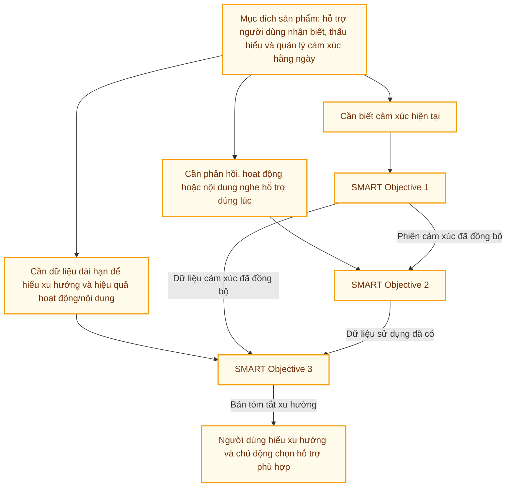
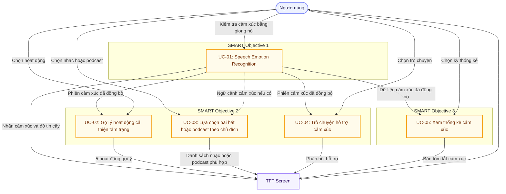
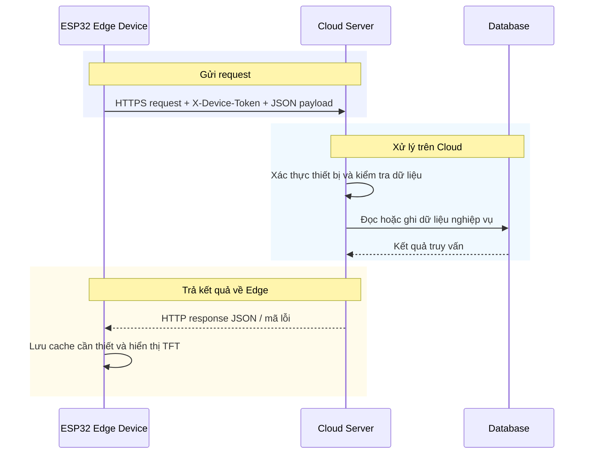
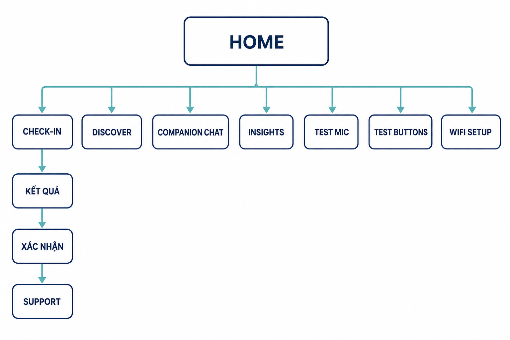

# 00. Giới thiệu

## 0.1. Thông tin tài liệu

Tài liệu này mô tả đặc tả sản phẩm **EmotiCare AIoT - Người bạn đồng hành cảm xúc thông minh**, một thiết bị AIoT thông minh có vai trò đồng hành, nhận biết và hỗ trợ người dùng chăm sóc sức khỏe cảm xúc trong đời sống hằng ngày. Tài liệu là cơ sở thống nhất cho nhóm phát triển phần cứng, Edge AI, máy chủ/dịch vụ Cloud, màn hình TFT và hướng dẫn sử dụng.

| Trường thông tin | Giá trị |
| ---------------- | ------- |
| Tên sản phẩm | EmotiCare AIoT |
| Tên đầy đủ | EmotiCare AIoT - Intelligent Emotional Companion |
| Tên tiếng Việt | Thiết bị AIoT thông minh đồng hành và chăm sóc sức khỏe cảm xúc |
| Loại tài liệu | AIoT Product Specification |
| Môn học | Nhập môn lập trình thiết bị thông minh |
| Lớp | 23CLC02 |
| Phiên bản | 3.5 |
| Ngày cập nhật | 05/08/2026 |

## 0.2. Định vị sản phẩm

**EmotiCare AIoT** là thiết bị AIoT ứng dụng trí tuệ nhân tạo nhằm hỗ trợ người dùng nhận biết, thấu hiểu và quản lý cảm xúc trong cuộc sống hằng ngày. Thiết bị nhận diện trạng thái cảm xúc thông qua giọng nói, đưa ra gợi ý hoặc tương tác phù hợp để cải thiện tâm trạng, đồng thời thống kê và phân tích xu hướng cảm xúc theo ngày, tuần và tháng.

Điểm khác biệt của sản phẩm là cách tiếp cận **ưu tiên xử lý tại thiết bị, có Cloud hỗ trợ**: tác vụ nhận diện cảm xúc cốt lõi được xử lý trực tiếp trên thiết bị để giảm độ trễ và tăng tính riêng tư, trong khi các chức năng gợi ý hoạt động, trò chuyện hỗ trợ và báo cáo dài hạn phối hợp với dịch vụ Internet/Cloud. Toàn bộ kết quả theo dõi, báo cáo và trạng thái đồng bộ được hiển thị trên màn hình TFT của thiết bị.

> **EmotiCare AIoT - Thấu hiểu cảm xúc, chăm sóc tâm trí.**

## 0.3. Vòng đời tài liệu và xác nhận

### 0.3.1. Lịch sử cập nhật

| Phiên bản | Ngày | Người cập nhật | Phase | Nội dung thay đổi |
| --------- | ---- | -------------- | ----- | ----------------- |
| 1.0 | 26/05/2026 | Nhóm dự án | Bản nháp đầu tiên | Khởi tạo đặc tả thiết bị thông minh |
| 2.0 | 13/06/2026 | Nhóm dự án | Cập nhật trong quá trình thực hiện | Cập nhật đặc tả theo hướng sản phẩm trước đó |
| 3.0 | 25/06/2026 | Nhóm dự án | Thiết kế lại sản phẩm | Chuyển đổi đặc tả sang EmotiCare AIoT |
| 3.1 | 25/06/2026 | Nhóm dự án | Hoàn thiện đặc tả | Viết lại có dấu, chi tiết hóa bối cảnh, mục tiêu, Edge AI, dịch vụ Internet, luồng màn hình và hướng dẫn sử dụng |
| 3.2 | 29/06/2026 | Nhóm dự án | Đồng bộ theo SRS | Bổ sung cấu trúc theo mẫu đặc tả yêu cầu phần mềm |
| 3.3 | 29/07/2026 | Hải Đức | Rà soát cấu trúc tài liệu | Điều chỉnh cách trình bày theo hướng logic, khoa học và dễ theo dõi hơn; giảm các phần rối rắm của bản cũ. |
| 3.4 | 05/08/2026 | Hải Đức | Đồng bộ theo sản phẩm thực tế | Cập nhật hướng dẫn sử dụng để khớp với các màn hình và luồng chức năng đã triển khai trên sản phẩm thực tế. |
| 3.5 | 05/08/2026 | Hải Đức | Rà soát consistency | Đồng bộ User Manual, use case, yêu cầu chức năng/phi chức năng, API và phụ lục theo firmware; tái tạo bản đặc tả gộp. |

### 0.3.2. Xác nhận

| Vai trò | Người/nhóm phụ trách | Trách nhiệm xác nhận | Trạng thái |
| ------- | -------------------- | -------------------- | ---------- |
| Chủ sở hữu sản phẩm | Nhóm dự án | Xác nhận phạm vi sản phẩm, mục tiêu và tình huống sử dụng | Chờ xác nhận |
| Phụ trách phần cứng | Nhóm dự án | Xác nhận phần cứng, chi phí mẫu thử và luồng màn hình TFT | Chờ xác nhận |
| Phụ trách Edge AI | Nhóm dự án | Xác nhận quy trình nhận diện cảm xúc bằng giọng nói và yêu cầu riêng tư | Chờ xác nhận |
| Phụ trách Cloud/API | Nhóm dự án | Xác nhận cơ sở dữ liệu, API và luồng Edge-Cloud-TFT | Chờ xác nhận |
| Người phản biện/Giảng viên | Giảng viên phụ trách | Đánh giá tính đầy đủ của đặc tả | Chờ xác nhận |

## 0.4. Đối tượng sử dụng tài liệu

| Đối tượng đọc | Phần nên đọc kỹ | Mục đích sử dụng tài liệu |
| ------------- | --------------- | -------------------------- |
| Nhóm phần cứng | Chương 02, 06, 08 | Chọn linh kiện, thiết kế luồng màn hình TFT và chuẩn bị mẫu thử |
| Nhóm Edge AI | Chương 03, 04, 05 | Xây dựng quy trình SER, xác định đầu vào/đầu ra và tiêu chí đánh giá |
| Nhóm Cloud/API | Chương 03, 04, 05, 08 | Thiết kế cơ sở dữ liệu, API, đồng bộ dữ liệu, phân bố cảm xúc và diễn giải AI |
| Nhóm kiểm thử | Chương 03, 04, 05, 06 | Viết trường hợp kiểm thử theo tình huống sử dụng, yêu cầu chức năng và yêu cầu phi chức năng |
| Giảng viên/reviewer | Toàn bộ tài liệu | Đánh giá tính nhất quán, phạm vi và khả thi của sản phẩm |

## 0.5. Thuật ngữ, tiêu chuẩn và nguyên tắc áp dụng

| Nhóm | Nội dung áp dụng |
| ---- | --------------- |
| Thuật ngữ sử dụng | Thiết bị biên, Edge AI, nhận diện cảm xúc bằng giọng nói, phiên cảm xúc, màn hình Insights và dịch vụ gợi ý nội dung được định nghĩa trong phụ lục |
| Cách tổ chức SRS | Tài liệu được tổ chức theo hướng đặc tả yêu cầu phần mềm: mục đích, phạm vi, bối cảnh, tình huống sử dụng, yêu cầu chức năng, yêu cầu phi chức năng, yêu cầu khác và kế hoạch tiếp theo |
| Cách thiết kế API | Dịch vụ Cloud ưu tiên REST API, phản hồi JSON, mã thiết bị hoặc yêu cầu có chữ ký |
| Định dạng dữ liệu | Dữ liệu trao đổi chính dùng JSON. Audio check-in SER chỉ xử lý tại Edge; riêng Voice Conversation gửi PCM 16-bit tạm thời qua API để STT, không lưu audio thô. Nhật ký/báo cáo có thể xuất dạng CSV hoặc JSON trong các phiên bản sau |
| Nguyên tắc riêng tư | Ưu tiên bảo vệ riêng tư ngay từ thiết kế: xử lý SER tại Edge, chỉ đồng bộ ngữ cảnh cảm xúc và siêu dữ liệu cần thiết |
| Nguyên tắc an toàn | Phản hồi từ Cloud không chẩn đoán y khoa, không thay thế chuyên gia và có bộ lọc an toàn cho tín hiệu nguy cấp |

## 0.6. Cách sử dụng tài liệu này

| Bước | Cách sử dụng |
| ---- | ------------ |
| 1 | Đọc chương 01 để hiểu bối cảnh, mục đích sản phẩm, người dùng mục tiêu và phạm vi |
| 2 | Đọc chương 02 để nắm danh mục, kết nối, chi phí và ràng buộc phần cứng |
| 3 | Đọc chương 03 để hiểu mục tiêu SMART, tình huống sử dụng, đầu vào/đầu ra và sơ đồ |
| 4 | Đọc các phần UC trong chương 03 nếu cần triển khai hoặc đánh giá Edge AI, API Cloud, cơ sở dữ liệu và luồng đồng bộ |
| 5 | Dùng chương 04 và 05 để viết checklist phát triển, trường hợp kiểm thử và tiêu chí nghiệm thu |
| 6 | Dùng chương 06 để demo thao tác trên thiết bị phần cứng/TFT |
| 7 | Dùng chương 08 để tra thuật ngữ, cấu trúc dữ liệu, tóm tắt API, siêu dữ liệu, định dạng dữ liệu và tài liệu tham khảo |

## 0.7. Thông tin thành viên

| STT | Thành viên | MSSV | Số điện thoại | Email |
| --- | ---------- | ---- | ------------- | ----- |
| 1 | Trần Hải Đức | 23127173 | 0916821170 | thduc23@clc.fitus.edu.vn |
| 2 | Nguyễn Trọng Tài | 23127008 | 0377425510 | nttai23@clc.fitus.edu.vn |
| 3 | Nguyễn Công Chiến | 23127331 | 0369314655 | ncchien23@clc.fitus.edu.vn |
| 4 | Phạm Nguyễn Gia Bảo | 20127119 | 0926127333 | pngbao20@clc.fitus.edu.vn |

## 0.8. Phạm vi cập nhật đặc tả

| Hạng mục | Đặc tả trước | Đặc tả cập nhật |
| -------- | ------------ | --------------- |
| Định hướng sản phẩm | Thiết bị thông minh cá nhân với nhiều chức năng rời rạc | Thiết bị đồng hành cảm xúc tập trung vào nhận diện, hỗ trợ và phân tích cảm xúc |
| Mục tiêu 1 | Theo dõi phiên học hoặc tác vụ cá nhân | Nhận diện cảm xúc bằng giọng nói tại thiết bị trong 30 giây |
| Mục tiêu 2 | Tạo báo cáo cho một nhóm chức năng khác | Gợi ý hoạt động, nội dung nghe và trò chuyện qua Internet trong 20 giây |
| Mục tiêu 3 | Giao diện theo dõi phiên sử dụng | Báo cáo cảm xúc hiển thị trên màn hình theo ngày, tuần và tháng trong 180 giây |
| Xử lý tại thiết bị | Xử lý cục bộ cho một tác vụ giới hạn | Phân tích giọng nói và nhận diện cảm xúc ngay trên thiết bị |
| Dịch vụ Internet | Đồng bộ và hỗ trợ các chức năng trực tuyến | Đồng bộ dữ liệu, gợi ý, trò chuyện và báo cáo |
| Hướng dẫn sử dụng | Hướng dẫn theo luồng cũ | Hướng dẫn theo luồng phần cứng mới của EmotiCare AIoT |

## 0.9. Lịch sử phiên bản

| Phiên bản | Ngày | Người cập nhật | Nội dung |
| --------- | ---- | -------------- | -------- |
| 1.0 | 26/05/2026 | Project team | Khởi tạo đặc tả thiết bị thông minh |
| 2.0 | 13/06/2026 | Project team | Cập nhật đặc tả theo hướng sản phẩm trước đó |
| 3.0 | 25/06/2026 | Project team | Chuyển đổi đặc tả sang EmotiCare AIoT |
| 3.1 | 25/06/2026 | Nhóm dự án | Viết lại có dấu, chi tiết hóa bối cảnh, mục tiêu, Edge AI, dịch vụ Internet, luồng màn hình và hướng dẫn sử dụng |
| 3.2 | 29/06/2026 | Nhóm dự án | Bổ sung các phần theo mẫu SRS: đối tượng đọc, xác nhận, cách dùng, giả định, liên kết, siêu dữ liệu và kế hoạch tiếp theo |
| 3.3 | 29/07/2026 | Hải Đức | Điều chỉnh cách trình bày theo hướng logic, khoa học và dễ theo dõi hơn; giảm các phần rối rắm của bản cũ. |
| 3.4 | 05/08/2026 | Hải Đức | Cập nhật hướng dẫn sử dụng để khớp với các màn hình và luồng chức năng đã triển khai trên sản phẩm thực tế. |
| 3.5 | 05/08/2026 | Hải Đức | Đồng bộ User Manual, use case, yêu cầu chức năng/phi chức năng, API và phụ lục theo firmware; tái tạo bản đặc tả gộp. |

## 0.10. Cấu trúc tài liệu

| Chương | Nội dung |
| ------ | -------- |
| 01. Bối cảnh | Bối cảnh, nguồn cảm hứng từ EMO, vấn đề, người dùng mục tiêu và sơ đồ suy ra mục tiêu |
| 02. Phần cứng | Thành phần phần cứng, kết nối, chi phí và ràng buộc triển khai |
| 03. Mục tiêu và tình huống sử dụng | Ba mục tiêu, tình huống sử dụng, dữ liệu chính và sơ đồ luồng |
| 04. Kết nối thiết bị và máy chủ | Quy trình kết nối, đồng bộ dữ liệu và thông tin trao đổi của năm tình huống sử dụng |
| 05. Yêu cầu chức năng | Yêu cầu chức năng được truy vết theo mục tiêu và tình huống sử dụng |
| 06. Yêu cầu phi chức năng | Yêu cầu phi chức năng về hiệu năng, bảo mật, riêng tư, độ tin cậy và an toàn cảm xúc |
| 07. Hướng dẫn sử dụng | Hướng dẫn sử dụng thiết bị phần cứng, màn hình TFT và đồng bộ Internet |
| 08. Kết luận | Tổng kết, lợi ích, giới hạn và hướng phát triển |
| 09. Phụ lục và tài liệu tham khảo | Thuật ngữ, bảng dữ liệu, tóm tắt API và tài liệu tham khảo |

---

# 01. Bối cảnh

## 1.1. Bối cảnh

Trong học tập, công việc và sinh hoạt cá nhân, cảm xúc của người dùng thay đổi liên tục nhưng thường không được ghi nhận một cách có hệ thống. Nhiều người chỉ nhận ra mình đang căng thẳng, buồn bã hoặc kiệt sức khi cảm xúc tiêu cực đã kéo dài. Ngược lại, những giai đoạn tích cực cũng dễ bị bỏ qua nên người dùng khó biết thói quen nào thật sự giúp mình cân bằng hơn.

Các ứng dụng ghi nhật ký cảm xúc trên điện thoại có thể hỗ trợ theo dõi tâm trạng, nhưng chúng phụ thuộc nhiều vào việc người dùng chủ động mở ứng dụng, tự nhập dữ liệu và tự đánh giá cảm xúc. Điều này tạo ra rào cản sử dụng hằng ngày, đặc biệt với người đang mệt mỏi hoặc căng thẳng. EmotiCare AIoT được thiết kế để giảm rào cản đó bằng một thiết bị vật lý đặt trong không gian cá nhân, cho phép người dùng thực hiện một lần check-in ngắn bằng giọng nói.

### 1.1.1. Thực trạng

Theo báo cáo **World mental health report: Transforming mental health for all** của World Health Organization, nhu cầu chăm sóc sức khỏe tinh thần trên toàn cầu đang ở mức cao, trong khi khả năng đáp ứng của các hệ thống hỗ trợ còn chưa tương xứng [10]. Điều này cho thấy các giải pháp hỗ trợ nhẹ, dễ tiếp cận và có thể dùng thường xuyên trong đời sống hằng ngày là một hướng bổ sung cần thiết, đặc biệt với nhóm người dùng chưa cần can thiệp y tế nhưng cần theo dõi cảm xúc và giảm căng thẳng sớm.

National Institute of Mental Health cũng nhấn mạnh rằng sức khỏe tinh thần bao gồm cả sức khỏe cảm xúc, tâm lý và xã hội; self-care có thể hỗ trợ duy trì sức khỏe tinh thần và hỗ trợ quá trình hồi phục khi người dùng gặp vấn đề tâm lý [9]. Với bối cảnh sinh viên và người đi làm thường chịu áp lực học tập, công việc, giao tiếp và nhịp sống nhanh, việc có một thiết bị giúp ghi nhận cảm xúc ngắn gọn, không phán xét và không yêu cầu thao tác phức tạp có ý nghĩa thực tiễn.

Từ thực trạng này, EmotiCare AIoT không được định vị như thiết bị chẩn đoán bệnh lý. Sản phẩm tập trung vào ba nhu cầu gần với đời sống hơn: giúp người dùng nhận biết cảm xúc hiện tại, nhận gợi ý chăm sóc phù hợp ngay trên thiết bị và xem lại xu hướng cảm xúc theo thời gian.

### 1.1.2. Sản phẩm tương tự

Trên thị trường đã có một số sản phẩm đi theo hướng thiết bị đồng hành cảm xúc hoặc robot xã hội. Tuy nhiên, mỗi sản phẩm có trọng tâm khác nhau, từ giải trí, đồng hành cho người lớn tuổi đến hỗ trợ thói quen sống. EmotiCare AIoT kế thừa ý tưởng tương tác gần gũi của nhóm sản phẩm này nhưng tập trung hẹp hơn vào **Speech Emotion Recognition**, gợi ý chăm sóc cảm xúc và báo cáo cảm xúc trên TFT.

| Sản phẩm tương tự | Mô tả ngắn | Điểm liên quan đến EmotiCare AIoT | Khác biệt của EmotiCare AIoT |
| ----------------- | ---------- | -------------------------------- | ---------------------------- |
| EMO - LivingAI | EMO là AI desktop pet có tính cách riêng, có thể ở bên cạnh người dùng, nhận biết âm thanh/người dùng, di chuyển trên bàn, nhảy theo nhạc, chơi game và hỗ trợ một số tác vụ như báo thức, thời tiết [11]. | Gợi cảm hứng về một thiết bị để bàn có cá tính, tạo cảm giác hiện diện và tương tác thân thiện. | EmotiCare AIoT không tập trung vào giải trí/nhân vật hóa, mà tập trung vào nhận diện cảm xúc bằng giọng nói, lưu emotion session và phân tích xu hướng cảm xúc. |
| ElliQ | ElliQ là companion robot hướng đến người lớn tuổi, hỗ trợ wellness, nhắc thuốc, gợi ý vận động nhẹ, kết nối xã hội, giải trí và giảm cô đơn [12]. | Cho thấy giá trị của thiết bị chủ động trò chuyện, nhắc nhở và hỗ trợ cảm xúc trong không gian cá nhân. | EmotiCare AIoT hướng đến prototype sinh viên, dùng TFT làm giao diện chính, SER chạy tại Edge và Cloud chỉ hỗ trợ gợi ý, media, hội thoại và báo cáo rút gọn. |

Từ việc tham khảo các sản phẩm trên, EmotiCare AIoT chọn một phạm vi khả thi hơn cho đồ án: không xây dựng robot xã hội phức tạp, không cố thay thế người chăm sóc, mà tạo một thiết bị AIoT nhỏ có khả năng lắng nghe một lượt check-in, phân loại cảm xúc, đề xuất hoạt động/bài hát/podcast phù hợp và giúp người dùng nhìn lại dữ liệu cảm xúc ngay trên màn hình phần cứng.

## 1.2. Nguồn cảm hứng từ EMO

Nguồn cảm hứng ban đầu của sản phẩm đến từ hình ảnh **EMO**, một thiết bị/robot để bàn có tính cách thân thiện, biết phản hồi lại người dùng và tạo cảm giác có một người bạn nhỏ trong không gian sống. Điểm hấp dẫn của EMO không chỉ nằm ở phần cứng, màn hình hay chuyển động, mà ở cảm giác thiết bị có thể hiện diện, phản hồi và làm cho tương tác công nghệ trở nên gần gũi hơn.

EmotiCare AIoT kế thừa tinh thần đó nhưng chuyển trọng tâm từ sự dễ thương và giải trí sang **chăm sóc cảm xúc có dữ liệu**. Thiết bị không chỉ phản ứng bằng biểu cảm hoặc câu nói ngắn, mà còn:

* Lắng nghe một tương tác giọng nói có chủ đích.
* Nhận diện trạng thái cảm xúc bằng Edge AI.
* Đưa ra phản hồi đồng cảm, hoạt động cải thiện tâm trạng hoặc nội dung nghe phù hợp như bài hát/podcast.
* Ghi nhận lịch sử cảm xúc để người dùng thấy được xu hướng của chính mình.
* Tạo báo cáo theo thời gian để hỗ trợ xây dựng lối sống cân bằng hơn.

Vì vậy, EmotiCare AIoT được định vị như một **Intelligent Emotional Companion**: không thay thế con người hay chuyên gia sức khỏe tinh thần, nhưng đóng vai trò một điểm chạm nhẹ nhàng, thường xuyên và riêng tư để người dùng quan tâm đến cảm xúc của mình.

## 1.3. Vấn đề cần giải quyết

| Vấn đề | Hệ quả | Cách EmotiCare AIoT giải quyết |
| ------ | ------ | ------------------------------- |
| Người dùng ít ghi nhận cảm xúc hằng ngày | Không thấy được xu hướng cảm xúc dài hạn | Check-in bằng giọng nói và lưu emotion session |
| Cảm xúc tiêu cực kéo dài khó được phát hiện sớm | Người dùng dễ rơi vào trạng thái căng thẳng, buồn bã hoặc mệt mỏi kéo dài | Báo cáo theo ngày, tuần, tháng và phát hiện chuỗi cảm xúc tiêu cực |
| Gợi ý chăm sóc tinh thần thường chung chung | Người dùng khó biết hoạt động hoặc nội dung nghe nào phù hợp với mình | Gợi ý theo cảm xúc hiện tại, chủ đích, lịch sử feedback và phân tích hiệu quả hoạt động/nội dung |
| Dữ liệu giọng nói nhạy cảm | Người dùng lo ngại quyền riêng tư | Audio check-in SER xử lý tại Edge; audio Voice Conversation chỉ gửi tạm thời cho STT và không được lưu |
| Thiết bị hỗ trợ tinh thần dễ bị hiểu nhầm là thiết bị y tế | Rủi ro kỳ vọng sai | Đặc tả rõ sản phẩm chỉ hỗ trợ tự chăm sóc, không chẩn đoán hoặc điều trị |

Từ các vấn đề trên, có thể thấy EmotiCare AIoT cần được đặt cạnh các sản phẩm tương tự để làm rõ khoảng trống sản phẩm mà đồ án hướng đến. Các sản phẩm như EMO hoặc ElliQ đã chứng minh rằng thiết bị vật lý có thể tạo cảm giác đồng hành tốt hơn một giao diện phần mềm thuần túy, nhưng chúng chưa trùng hoàn toàn với mục tiêu của EmotiCare AIoT.

| Tiêu chí so sánh | EMO - LivingAI [11] | ElliQ [12] | EmotiCare AIoT |
| ---------------- | ------------------- | ---------- | -------------- |
| Nhóm người dùng chính | Người dùng phổ thông muốn có AI desktop pet để giải trí và tương tác thân thiện | Người lớn tuổi cần đồng hành, nhắc nhở, kết nối xã hội và hỗ trợ wellness | Sinh viên, người đi làm và người quan tâm đến mental wellness |
| Trọng tâm sản phẩm | Tạo cảm giác thú cưng để bàn có cá tính, biết phản hồi, di chuyển, nhảy theo nhạc và hỗ trợ tác vụ đơn giản | Companion robot chủ động trò chuyện, nhắc thuốc, gợi ý vận động, kết nối gia đình/người chăm sóc | Thiết bị AIoT nhận diện cảm xúc qua giọng nói, gợi ý chăm sóc cảm xúc và theo dõi xu hướng trên TFT |
| Nhận diện cảm xúc | Có tương tác thông minh và biểu cảm, nhưng không tập trung vào Speech Emotion Recognition làm use case chính | Có hội thoại và wellness support, nhưng không tập trung vào SER cục bộ trên thiết bị phần cứng sinh viên | UC-01 tập trung vào Speech Emotion Recognition chạy tại Edge |
| Gợi ý chăm sóc cảm xúc | Thiên về giải trí, nhạc, game và phản hồi kiểu thú cưng | Thiên về thói quen sống, nhắc nhở, vận động nhẹ, kết nối xã hội | Gợi ý hoạt động, bài hát, podcast và phản hồi đồng cảm dựa trên emotion context |
| Theo dõi dài hạn | Không phải trọng tâm chính của sản phẩm | Có hỗ trợ caregiver/wellness theo định hướng người lớn tuổi | Báo cáo cảm xúc theo ngày, tuần, tháng hiển thị trực tiếp trên TFT |
| Quyền riêng tư âm thanh | Không phải điểm nhấn chính trong đặc tả đồ án | Có chính sách bảo mật và kết nối Cloud theo hệ sinh thái riêng | Ưu tiên Edge AI cho SER; PCM của Voice Conversation chỉ dùng tạm thời cho STT và không được lưu |
| Phù hợp phạm vi đồ án | Sản phẩm thương mại có cơ khí, nhân vật hóa và trải nghiệm giải trí phức tạp | Sản phẩm thương mại có dịch vụ Cloud, caregiver app và vận hành dài hạn | Prototype khả thi hơn: Edge SER, Cloud API, TFT screen, database và flow Edge-Cloud-TFT |

Như vậy, EmotiCare AIoT không cố cạnh tranh trực tiếp với robot đồng hành thương mại. Sản phẩm chọn một lát cắt hẹp và rõ hơn: **nhận diện cảm xúc bằng giọng nói, hỗ trợ chăm sóc cảm xúc theo ngữ cảnh và tạo dữ liệu theo dõi dài hạn trên chính thiết bị phần cứng**.

## 1.4. Người dùng mục tiêu

| Nhóm người dùng | Nhu cầu chính | Giá trị sản phẩm |
| --------------- | ------------- | ---------------- |
| Sinh viên | Theo dõi căng thẳng, mệt mỏi, áp lực học tập | Check-in nhanh, gợi ý nghỉ ngơi, xem lại xu hướng cảm xúc |
| Người đi làm | Quản lý stress trong ngày làm việc | Nhận biết thời điểm căng thẳng và chọn hoạt động phục hồi |
| Người quan tâm đến mental wellness | Xây dựng thói quen chăm sóc tinh thần | Báo cáo định kỳ và theo dõi hiệu quả thói quen |
| Gia đình/người chăm sóc | Muốn có góc nhìn tổng quan nếu người dùng đồng ý chia sẻ | Báo cáo tổng quan không xâm phạm nội dung riêng tư |

### 1.4.1. User classes, characteristics và quyền truy cập

| User class | Đặc điểm | Quyền truy cập/chức năng | Giới hạn |
| ---------- | -------- | ------------------------ | -------- |
| End User | Người dùng trực tiếp thiết bị hằng ngày | Check-in cảm xúc, xem Support, Discover, Companion Chat, Insights và WiFi Setup | Không truy cập database thô hoặc cấu hình hệ thống |
| Device Owner | Người sở hữu/ghép thiết bị với tài khoản | Pairing device, xem trạng thái sync | Chỉ quản lý thiết bị của chính mình |
| Developer/Admin | Thành viên nhóm phát triển hoặc người vận hành demo | Cấu hình API, kiểm tra log, seed dữ liệu media, chạy test | Audio thô không được lưu bởi các luồng hiện tại |
| Cloud Service | Thành phần backend xử lý request từ Edge | Nhận sync, tạo recommendation, media list, conversation response, phân bố cảm xúc và diễn giải AI | Chỉ xử lý dữ liệu từ device token hợp lệ |
| Tester/Reviewer | Người kiểm thử hoặc đánh giá đồ án | Kiểm thử use case, requirement, screen flow và dữ liệu giả lập | Không thay đổi dữ liệu người dùng thật |

## 1.5. Mục đích sản phẩm

Mục đích của **EmotiCare AIoT** là tạo ra một thiết bị AIoT đồng hành cảm xúc có thể giúp người dùng dừng lại, nhận biết trạng thái cảm xúc của mình và lựa chọn cách chăm sóc phù hợp ngay trong đời sống hằng ngày. Sản phẩm không hướng đến việc thay thế chuyên gia sức khỏe tinh thần, mà đóng vai trò như một điểm chạm nhẹ nhàng, riêng tư và dễ tiếp cận để người dùng hình thành thói quen quan sát cảm xúc.

Về mặt trải nghiệm, EmotiCare AIoT tập trung vào ba giá trị chính:

| Giá trị | Ý nghĩa đối với người dùng | Cách sản phẩm hỗ trợ |
| ------- | -------------------------- | -------------------- |
| Nhận biết cảm xúc | Người dùng biết nhãn cảm xúc nhận diện được: vui vẻ, bình thường, bình tĩnh, buồn bã, tức giận, sợ hãi, ghê sợ hoặc ngạc nhiên | Check-in bằng giọng nói và nhận diện cảm xúc bằng Edge AI |
| Hỗ trợ đúng lúc | Người dùng nhận được một hành động nhỏ, một nội dung nghe phù hợp hoặc một phản hồi đồng cảm khi cần | Cloud gợi ý hoạt động, bài hát, podcast hoặc phản hồi hội thoại, sau đó hiển thị trên TFT |
| Hiểu xu hướng dài hạn | Người dùng nhìn lại sự thay đổi cảm xúc theo thời gian và biết hoạt động/nội dung nào có hiệu quả | Cloud tổng hợp emotion sessions, activity feedback, media selection logs và trả báo cáo rút gọn về TFT |

Từ góc nhìn sản phẩm, mục đích này giúp EmotiCare AIoT khác với một ứng dụng nhật ký cảm xúc thông thường. Thiết bị ưu tiên thao tác ngắn trên phần cứng, xử lý nhận diện cảm xúc tại Edge để giảm phụ thuộc Internet cho tác vụ cốt lõi, và chỉ dùng Cloud cho các phần cần dữ liệu dài hạn hoặc nội dung phong phú hơn như gợi ý, hội thoại và báo cáo.

Do đó, mục đích sản phẩm có thể tóm tắt như sau: **giúp người dùng nhận biết cảm xúc hiện tại, nhận hỗ trợ phù hợp trong thời điểm đó và theo dõi xu hướng cảm xúc lâu dài ngay trên thiết bị TFT**.

## 1.6. Từ mục đích sản phẩm suy ra 3 mục tiêu

Mục đích cốt lõi của EmotiCare AIoT là giúp người dùng **nhận biết cảm xúc**, **được hỗ trợ đúng lúc** và **hiểu xu hướng cảm xúc theo thời gian**. Từ mục đích này, sản phẩm được tách thành ba SMART objective liên kết thành một vòng lặp hoàn chỉnh.

```mermaid
flowchart TD
    Purpose["Mục đích sản phẩm: hỗ trợ người dùng nhận biết, thấu hiểu và quản lý cảm xúc hằng ngày"]

    Need1["Cần biết cảm xúc hiện tại"]
    Need2["Cần phản hồi, hoạt động hoặc nội dung nghe hỗ trợ đúng lúc"]
    Need3["Cần dữ liệu dài hạn để hiểu xu hướng và hiệu quả hoạt động/nội dung"]

    Obj1["SMART Objective 1"]
    Obj2["SMART Objective 2"]
    Obj3["SMART Objective 3"]
    Insight["Người dùng hiểu xu hướng và chủ động chọn hỗ trợ phù hợp"]

    Purpose --> Need1 --> Obj1
    Purpose --> Need2 --> Obj2
    Purpose --> Need3 --> Obj3

    Obj1 -->|"Phiên cảm xúc đã đồng bộ"| Obj2
    Obj1 -->|"Dữ liệu cảm xúc đã đồng bộ"| Obj3
    Obj2 -->|"Dữ liệu sử dụng đã có"| Obj3
    Obj3 -->|"Bản tóm tắt xu hướng"| Insight


    classDef userNode stroke:#818cf8,fill:#eef2ff,stroke-width:2px,color:#1e1b4b
    classDef edgeNode stroke:#a78bfa,fill:#f5f3ff,stroke-width:2px,color:#2e1065
    classDef cacheNode stroke:#2dd4bf,fill:#f0fdfa,stroke-width:2px,color:#0d5a57
    classDef cloudNode stroke:#38bdf8,fill:#f0f9ff,stroke-width:2px,color:#0c3d67
    classDef serviceNode stroke:#4ade80,fill:#f0fdf4,stroke-width:2px,color:#1a3a1a
    classDef actionNode stroke:#f59e0b,fill:#fffbeb,stroke-width:2px,color:#78350f
    class Purpose,Need1,Need2,Need3,Obj1,Obj2,Obj3,Insight actionNode
```

*Mô tả sơ đồ: Mục đích chăm sóc cảm xúc được tách thành ba mục tiêu liên kết nhau: thiết bị nhận diện cảm xúc, máy chủ hỗ trợ gợi ý hoặc trò chuyện, rồi tổng hợp báo cáo để người dùng hiểu xu hướng của mình.*

Ghi chú nội dung đầy đủ của các SMART objective:

| SMART Objective | Nội dung đầy đủ |
| --------------- | --------------- |
| SMART Objective 1 | Phát hiện và phân loại trạng thái cảm xúc của người dùng trong vòng 30 giây sau mỗi lần tương tác bằng giọng nói hợp lệ, đồng thời lưu lại kết quả của từng phiên để phục vụ theo dõi và phân tích cảm xúc theo thời gian. |
| SMART Objective 2 | Đề xuất ít nhất một hoạt động, bài hát, podcast hoặc một phản hồi đồng cảm phù hợp trong vòng 20 giây khi người dùng yêu cầu hỗ trợ và thiết bị có Internet. |
| SMART Objective 3 | Tạo tóm tắt thống kê và phân tích cảm xúc theo ngày, tuần và tháng trên Cloud Service, sau đó trả kết quả rút gọn về TFT screen trong vòng 180 giây sau khi người dùng yêu cầu. |

## 1.7. Phạm vi sản phẩm

### Trong phạm vi

* Thu âm khi người dùng chủ động kích hoạt tương tác.
* Nhận diện cảm xúc từ giọng nói bằng Edge AI.
* Phân loại tám trạng thái RAVDESS hiện có trên Edge: vui vẻ, bình thường, bình tĩnh, buồn bã, tức giận, sợ hãi, ghê sợ và ngạc nhiên.
* Đề xuất hoạt động cải thiện hoặc duy trì tâm trạng.
* Ưu tiên bài hát hoặc podcast theo cảm xúc hiện tại trong danh sách Discover.
* Trò chuyện hỗ trợ cảm xúc với phản hồi đồng cảm và an toàn.
* Lưu emotion session, recommendation log, media selection log và feedback.
* Tạo báo cáo cảm xúc theo ngày, tuần, tháng.
* Hiển thị trên TFT screen phân bố của tám nhãn cảm xúc và diễn giải AI tùy chọn.

### Ngoài phạm vi

* Chẩn đoán bệnh lý tâm thần.
* Thay thế bác sĩ, nhà tâm lý học hoặc dịch vụ khẩn cấp.
* Thu âm liên tục khi người dùng chưa kích hoạt.
* Chia sẻ dữ liệu cảm xúc cho bên thứ ba khi chưa có sự đồng ý.
* Đưa ra kết luận y khoa dựa trên giọng nói hoặc dữ liệu sinh hoạt.

---

# 02. Phần cứng

## 2.1. Vai trò phần cứng

Phần cứng là điểm tương tác trực tiếp với người dùng. Thiết bị thu giọng nói, nhận thao tác nút bấm, hiển thị nội dung ngắn trên TFT, phát tín hiệu âm thanh khi cần và kết nối Wi-Fi. Logic thuật toán được mô tả tại từng tình huống sử dụng ở Chương 03; quy trình Edge–Server và API/schema được tập trung tại Chương 04.

## 2.2. Danh mục phần cứng

| Phần cứng | Vai trò | Giá (VNĐ) |
| --- | --- | ---: |
| ESP32-S AI Thinker | Bộ não trung tâm, xử lý toàn bộ thiết bị và kết nối Wi-Fi | 250.000 |
| LCD TFT ST7789 | Hiển thị menu, cảm xúc, gợi ý, hội thoại và báo cáo | 190.000 |
| INMP441 | Micro thu âm giọng nói qua I2S | 35.000 |
| MAX98357 I2S và loa 3W Class D | Khuếch đại âm thanh và phát loa | 90.000 |
| Module nút bấm 5 cái | Điều hướng màn hình và thao tác trên thiết bị | 30.000 |
| Breadboard | Nối dây, thử nghiệm mạch | 20.000 |
| Dây nối mạch | Kết nối các linh kiện | 30.000 |
| Dây nối nguồn | Cấp nguồn để thiết bị hoạt động | 70.000 |
| Bao bì phần cứng | Hoàn thiện phần bên ngoài của thiết bị | 100.000 |

## 2.3. Kết nối phần cứng

| Nhóm | Kết nối chính | Mục đích |
| --- | --- | --- |
| INMP441 | I2S: SCK, WS, SD | Thu tín hiệu giọng nói |
| LCD TFT ST7789 | SPI: CS, RST, DC, MOSI, SCLK, đèn nền | Hiển thị giao diện |
| Module nút bấm | GPIO | Điều hướng thao tác |
| MAX98357 I2S và loa 3W | I2S | Phát tín hiệu phản hồi và âm thanh |
| Wi-Fi | Tích hợp trên vi điều khiển | Kết nối dịch vụ Cloud |

## 2.4. Tổng chi phí

**Tổng chi phí phần cứng: 815.000 VNĐ.**

Mức giá này là danh mục đã chốt cho mẫu thử. Breadboard và dây nối phục vụ giai đoạn lắp ráp/kiểm tra; bao bì phần cứng dùng để hoàn thiện hình thức thiết bị.

## 2.5. Ràng buộc phần cứng

- Màn hình có không gian hạn chế, vì vậy nội dung cần ngắn và dễ đọc.
- Microphone cần hoạt động tốt trong môi trường demo không quá ồn.
- Wi-Fi là điều kiện để dùng các chức năng Cloud.
- Thiết bị phải hiển thị rõ trạng thái đang ghi âm, kết nối mạng và đồng bộ.
- Mẫu thử không phải thiết bị y tế và không thay thế chuyên gia sức khỏe tinh thần.

---

# 03. Mục tiêu

## 3.1. Tổng quan

Ba SMART objective của EmotiCare AIoT tạo thành một vòng lặp vận hành trên thiết bị, trong đó TFT là giao diện theo dõi chính, Edge AI xử lý tác vụ nhận diện cảm xúc cốt lõi, còn Cloud hỗ trợ các chức năng cần dữ liệu dài hạn hoặc nội dung phong phú hơn.

| SMART Objective   | Mô tả đầy đủ                                                                                                                                                                                                               | Use case liên quan  | Vai trò trong vòng lặp                                                               |
| ----------------- | -------------------------------------------------------------------------------------------------------------------------------------------------------------------------------------------------------------------------- | ------------------- | ------------------------------------------------------------------------------------ |
| SMART Objective 1 | Phát hiện và phân loại trạng thái cảm xúc của người dùng trong vòng 30 giây sau mỗi lần tương tác bằng giọng nói hợp lệ, đồng thời lưu lại kết quả của từng phiên để phục vụ theo dõi và phân tích cảm xúc theo thời gian. | UC-01               | Tạo emotion session làm dữ liệu nền cho các chức năng hỗ trợ và báo cáo              |
| SMART Objective 2 | Đề xuất ít nhất một hoạt động, bài hát, podcast hoặc một phản hồi đồng cảm phù hợp trong vòng 20 giây khi người dùng yêu cầu hỗ trợ và thiết bị có Internet.                                                               | UC-02, UC-03, UC-04 | Biến dữ liệu cảm xúc hoặc nhu cầu trực tiếp từ HOME thành hành động hỗ trợ cụ thể    |
| SMART Objective 3 | Hiển thị phân bố tám nhãn cảm xúc theo ngày, tuần và tháng trên TFT trong vòng 180 giây sau khi người dùng yêu cầu. | UC-05 | Giúp người dùng xem lại tỷ lệ cảm xúc trong từng kỳ và, khi cần, mở phần diễn giải AI |

### Bảng liên kết giá trị mang lại với yêu cầu

| Value proposition                                                  | SMART objective   | Use case | Giá trị người dùng mong đợi                                                               |
| ------------------------------------------------------------------ | ----------------- | -------- | ----------------------------------------------------------------------------------------- |
| Người dùng nhận biết cảm xúc nhanh mà không cần nhập liệu thủ công | SMART Objective 1 | UC-01    | Người dùng có emotion label và confidence ngay trên TFT sau một lần check-in ngắn         |
| Người dùng nhận hỗ trợ phù hợp khi đang cần điều chỉnh cảm xúc     | SMART Objective 2 | UC-02    | Người dùng nhận 5 hoạt động gợi ý mà không phải tự tìm                                    |
| Người dùng duyệt nội dung nghe theo ngữ cảnh cảm xúc               | SMART Objective 2 | UC-03    | Người dùng mở Discover, chọn Music hoặc Podcast và phát mục đã chọn                        |
| Người dùng có kênh trò chuyện ngắn, đồng cảm và an toàn            | SMART Objective 2 | UC-04    | Người dùng nhận phản hồi ngắn gọn, không phán xét, có safety filter                       |
| Người dùng xem thống kê cảm xúc theo kỳ trên thiết bị              | SMART Objective 3 | UC-05    | Người dùng xem biểu đồ tám tỷ lệ cảm xúc theo ngày/tuần/tháng ngay trên TFT              |

### Sơ đồ luồng mục tiêu tổng thể

```mermaid
flowchart TD
    User(["Người dùng"])
    TFT["TFT Screen"]

    subgraph O1["SMART Objective 1"]
        UC1["UC-01: Speech Emotion Recognition"]
    end

    subgraph O2["SMART Objective 2"]
        UC2["UC-02: Gợi ý hoạt động cải thiện tâm trạng"]
        UC3["UC-03: Lựa chọn bài hát hoặc podcast theo chủ đích"]
        UC4["UC-04: Trò chuyện hỗ trợ cảm xúc"]
    end

    subgraph O3["SMART Objective 3"]
        UC5["UC-05: Xem thống kê cảm xúc"]
    end

    User -->|"Kiểm tra cảm xúc bằng giọng nói"| UC1
    UC1 -->|"Nhãn cảm xúc và độ tin cậy"| TFT
    UC1 -->|"Phiên cảm xúc đã đồng bộ"| UC2
    User -->|"Chọn hoạt động"| UC2
    User -->|"Chọn nhạc hoặc podcast"| UC3
    UC1 -.->|"Ngữ cảnh cảm xúc nếu có"| UC3
    UC1 -->|"Phiên cảm xúc đã đồng bộ"| UC4
    User -->|"Chọn trò chuyện"| UC4
    UC1 -->|"Dữ liệu cảm xúc đã đồng bộ"| UC5
    User -->|"Chọn kỳ thống kê"| UC5
    UC2 -->|"5 hoạt động gợi ý"| TFT
    UC3 -->|"Danh sách nhạc hoặc podcast phù hợp"| TFT
    UC4 -->|"Phản hồi hỗ trợ"| TFT
    UC5 -->|"Bản tóm tắt cảm xúc"| TFT
    TFT --> User


    classDef userNode stroke:#818cf8,fill:#eef2ff,stroke-width:2px,color:#1e1b4b
    classDef edgeNode stroke:#a78bfa,fill:#f5f3ff,stroke-width:2px,color:#2e1065
    classDef cacheNode stroke:#2dd4bf,fill:#f0fdfa,stroke-width:2px,color:#0d5a57
    classDef cloudNode stroke:#38bdf8,fill:#f0f9ff,stroke-width:2px,color:#0c3d67
    classDef serviceNode stroke:#4ade80,fill:#f0fdf4,stroke-width:2px,color:#1a3a1a
    classDef actionNode stroke:#f59e0b,fill:#fffbeb,stroke-width:2px,color:#78350f
    class User userNode
    class TFT edgeNode
    class UC1,UC2,UC3,UC4,UC5 actionNode
```

*Mô tả sơ đồ: Mục tiêu 1 tạo dữ liệu cảm xúc tại thiết bị. Mục tiêu 2 và Mục tiêu 3 dùng máy chủ khi cần; người dùng có thể mở nhạc, podcast hoặc báo cáo trực tiếp, còn hoạt động và trò chuyện cần một phiên cảm xúc đã đồng bộ.*

---

## 3.2. SMART Objective 1: Phát hiện và phân loại trạng thái cảm xúc của người dùng bằng Speech Emotion Recognition trong vòng 30 giây sau mỗi lần tương tác bằng giọng nói hợp lệ, đồng thời lưu lại kết quả của từng phiên để phục vụ theo dõi cảm xúc theo thời gian

Objective 1 là nền tảng của toàn bộ hệ thống. Đây là objective duy nhất chạy được tại Edge Device khi mất Internet. Kết quả được hiển thị ngay trên TFT; firmware lưu trạng thái check-in đã xác nhận gần nhất cục bộ và chỉ thử đồng bộ ngay khi check-in nếu Wi-Fi và pairing sẵn sàng.

### 3.2.1. Tình huống sử dụng UC-01: Nhận diện cảm xúc bằng giọng nói

- **Input:** Giọng nói của người dùng.
- **Output:** Một trong tám nhãn SER hiện tại: `angry`, `calm`, `disgust`, `fearful`, `happy`, `neutral`, `sad`, `surprised`; confidence và trạng thái low-confidence nếu có.

**Mô tả:** Thiết bị sử dụng bài toán **Speech Emotion Recognition (SER)** để phân tích tín hiệu lời nói và suy luận trạng thái cảm xúc. Pipeline SER gồm thu âm có chủ đích, tiền xử lý, trích xuất Log-Mel Spectrogram, MFCC, pitch, energy hoặc embedding âm thanh, sau đó đưa vào mô hình phân loại đã được tối ưu cho edge. Kết quả được hiển thị trên TFT và lưu thành emotion session.

**Ý nghĩa của use case:** UC-01 giúp người dùng gọi tên trạng thái cảm xúc hiện tại mà không cần nhập nhật ký thủ công. Việc đặt use case là Speech Emotion Recognition làm rõ nguồn nhận diện chính là tín hiệu lời nói.

**Vai trò trong objective:** UC-01 là điểm bắt đầu của vòng lặp chăm sóc cảm xúc, nơi giọng nói được chuyển thành emotion label, confidence score và emotion session trong giới hạn 30 giây.

| Trường             | Nội dung                                                                                                                                                                                                                                                                                                                              |
| ------------------ | ------------------------------------------------------------------------------------------------------------------------------------------------------------------------------------------------------------------------------------------------------------------------------------------------------------------------------------- |
| Use case ID        | UC-01                                                                                                                                                                                                                                                                                                                                 |
| Tên use case       | Speech Emotion Recognition                                                                                                                                                                                                                                                                                                            |
| Tác nhân chính     | Người dùng                                                                                                                                                                                                                                                                                                                            |
| Tác nhân phụ       | Edge Device, TFT Screen                                                                                                                                                                                                                                                                                                               |
| Mục tiêu           | Xác định trạng thái cảm xúc hiện tại sau một lần tương tác bằng giọng nói                                                                                                                                                                                                                                                             |
| Tiền điều kiện     | Thiết bị đã bật, microphone sẵn sàng, người dùng chủ động kích hoạt check-in                                                                                                                                                                                                                                                          |
| Kích hoạt          | Người dùng nhấn nút Check-in và nói một câu hoặc một đoạn chia sẻ ngắn                                                                                                                                                                                                                                                                |
| Luồng chính        | 1. Người dùng kích hoạt thu âm. 2. Thiết bị hiển thị trạng thái đang nghe trên TFT. 3. Thiết bị ghi âm trong thời lượng giới hạn. 4. Edge AI tiền xử lý âm thanh. 5. Hệ thống trích xuất đặc trưng SER. 6. Mô hình SER phân loại cảm xúc và trả confidence. 7. TFT hiển thị kết quả. 8. Sau khi người dùng xác nhận, firmware lưu trạng thái emotion gần nhất vào bộ nhớ cục bộ. |
| Luồng thay thế     | Nếu âm thanh quá ngắn hoặc quá nhiễu, thiết bị yêu cầu người dùng nói lại. Nếu confidence thấp, UI đánh dấu low-confidence, vẫn giữ nhãn dự đoán và yêu cầu người dùng xác nhận lại. Nếu mất Internet, firmware chỉ lưu trạng thái check-in đã xác nhận gần nhất cục bộ. |
| Hậu điều kiện      | Khi online, firmware đồng bộ session ngay sau khi người dùng xác nhận; khi offline, chưa có hàng đợi session và retry tự động. |
| Dữ liệu vào        | Audio sample, Log-Mel Spectrogram, MFCC, pitch, energy hoặc embedding âm thanh                                                                                                                                                                                                                                                        |
| Dữ liệu ra         | Emotion label, confidence score, timestamp; khi đồng bộ thành công, Cloud trả session ID                                                                                                                                                                                                                                               |
| Mục tiêu hiệu năng | Hoàn tất trong vòng 30 giây |

#### Cách nhận diện cảm xúc

Thiết bị thu một đoạn giọng nói ngắn, kiểm tra chất lượng âm thanh và nhận diện một trong tám trạng thái cảm xúc. Toàn bộ bước này thực hiện ngay trên thiết bị, không cần Internet và không tự gửi âm thanh kiểm tra lên máy chủ.

Nếu kết quả chưa đủ tin cậy, màn hình vẫn hiển thị cảm xúc dự đoán nhưng mời người dùng xác nhận lại. Chi tiết về mô hình nhận diện và dữ liệu tham khảo được lưu trong tài liệu kỹ thuật riêng của nhóm.

#### Sơ đồ luồng

```mermaid
flowchart LR
    Start([Bắt đầu])
    Activate["Người dùng kích hoạt Check-in"]
    Record["Thiết bị ghi âm có giới hạn thời gian"]
    Valid{"Âm thanh hợp lệ?"}
    Retry["Yêu cầu người dùng nói lại"]
    Preprocess["Tiền xử lý âm thanh"]
    Feature["Trích xuất Log-Mel / MFCC / pitch / energy"]
    Infer["Mô hình SER phân loại cảm xúc"]
    Confidence{"Confidence đủ cao?"}
    Uncertain["Giữ nhãn dự đoán và yêu cầu xác nhận"]
    Save["Lưu trạng thái emotion đã xác nhận"]
    Display["Hiển thị cảm xúc trên TFT"]
    End([Kết thúc])

    Start --> Activate --> Record --> Valid
    Valid -- "Không" --> Retry --> Record
    Valid -- "Có" --> Preprocess --> Feature --> Infer --> Confidence
    Confidence -- "Không" --> Uncertain --> Save
    Confidence -- "Có" --> Save
    Save --> Display --> End


    classDef userNode stroke:#818cf8,fill:#eef2ff,stroke-width:2px,color:#1e1b4b
    classDef edgeNode stroke:#a78bfa,fill:#f5f3ff,stroke-width:2px,color:#2e1065
    classDef cacheNode stroke:#2dd4bf,fill:#f0fdfa,stroke-width:2px,color:#0d5a57
    classDef cloudNode stroke:#38bdf8,fill:#f0f9ff,stroke-width:2px,color:#0c3d67
    classDef serviceNode stroke:#4ade80,fill:#f0fdf4,stroke-width:2px,color:#1a3a1a
    classDef actionNode stroke:#f59e0b,fill:#fffbeb,stroke-width:2px,color:#78350f
    class Display edgeNode
    class Record serviceNode
    class Start,Activate,Valid,Retry,Preprocess,Feature,Infer,Confidence,Uncertain,Save,End actionNode
```

*Mô tả chart: Flow chart này mô tả tuần tự xử lý SER từ lúc người dùng check-in đến khi TFT hiển thị cảm xúc và firmware lưu trạng thái emotion đã xác nhận gần nhất.*

---

## 3.3. SMART Objective 2: Đề xuất ít nhất một hoạt động, bài hát, podcast hoặc một phản hồi phù hợp thông qua Cloud Service trong vòng 20 giây sau khi người dùng yêu cầu hỗ trợ và thiết bị có Internet, nhằm cải thiện hoặc duy trì trạng thái cảm xúc của người dùng

Objective 2 không chạy độc lập hoàn toàn trên Edge. Sau khi UC-01 tạo emotion label, thiết bị gửi context lên Cloud Service để nhận gợi ý hoạt động hoặc phản hồi hội thoại, sau đó hiển thị kết quả trên TFT.

### 3.3.1. Tình huống sử dụng UC-02: Gợi ý hoạt động cải thiện tâm trạng

- **Input:** Trạng thái cảm xúc hiện tại nếu có, chủ đích hỗ trợ nhanh và lịch sử tương tác đã đồng bộ.
- **Output:** Năm thẻ hoạt động phù hợp hiển thị trên TFT.

**Mô tả:** Cloud Recommendation Service đề xuất năm hoạt động ngắn, an toàn và phù hợp với emotion label của một emotion session đã đồng bộ, lịch sử tương tác và feedback trước đó. Danh sách hoạt động có thể gồm hít thở, grounding, nghỉ ngơi, vận động nhẹ, ghi nhật ký cảm xúc hoặc kết nối với người thân. Gợi ý bài hát và podcast thuộc UC-03.

**Ý nghĩa của use case:** UC-02 đưa người dùng từ kết quả Check-In đã xác nhận đến danh sách hoạt động hỗ trợ. Firmware ưu tiên dùng session gần nhất để gọi Cloud và có fallback cục bộ khi không lấy được dữ liệu.

**Vai trò trong objective:** UC-02 là nhánh hỗ trợ nhanh sau nhận diện cảm xúc, trong đó Cloud xử lý recommendation còn TFT hiển thị kết quả ngắn gọn để người dùng chọn.

| Trường             | Nội dung                                                                                                                                                                                                                                                                                                                                                                                       |
| ------------------ | ---------------------------------------------------------------------------------------------------------------------------------------------------------------------------------------------------------------------------------------------------------------------------------------------------------------------------------------------------------------------------------------------- |
| Use case ID        | UC-02                                                                                                                                                                                                                                                                                                                                                                                          |
| Tên use case       | Gợi ý hoạt động cải thiện tâm trạng                                                                                                                                                                                                                                                                                                                                                            |
| Tác nhân chính     | Người dùng                                                                                                                                                                                                                                                                                                                                                                                     |
| Tác nhân phụ       | Edge Device, Cloud Recommendation Service, TFT Screen                                                                                                                                                                                                                                                                                                                                          |
| Tiền điều kiện     | Thiết bị có Internet và có một emotion session đã được đồng bộ thuộc thiết bị. |
| Kích hoạt          | Sau khi xác nhận Check-In, người dùng nhấn S2/S3 để mở Support. |
| Luồng chính        | 1. Firmware dùng session gần nhất để gọi API recommendation. 2. Nếu nhận được danh sách, TFT hiển thị các hoạt động. 3. Người dùng dùng S4/S5 để duyệt và S2/S3 để mở chi tiết. |
| Luồng thay thế     | Nếu API không có kết quả, Support hiển thị một hoạt động fallback theo cảm xúc hiện tại. |
| Luồng thay thế     | Nếu Internet lỗi, TFT hiển thị thông báo cần kết nối Internet để lấy gợi ý cloud.                                                                                                                                                                                                                                                                                                              |
| Dữ liệu vào        | `session_id`, emotion label của session, activity feedback |
| Dữ liệu ra         | 5 activity cards, reason text, selected/skipped status, feedback score                                                                                                                                                                                                                                                                                                                          |
| Mục tiêu hiệu năng | Cloud trả kết quả về TFT trong vòng 20 giây                                                                                                                                                                                                                                                                                                                                                    |

#### Cách chọn hoạt động

Máy chủ có thể trả danh sách hoạt động phù hợp với cảm xúc hiện tại. Firmware hiển thị các hoạt động nhận được; nếu không lấy được danh sách, nó dùng một hoạt động fallback cục bộ. TFT hiện không có thao tác chọn, bỏ qua hoặc đánh giá để cá nhân hóa.

#### Sơ đồ luồng

```mermaid
flowchart LR
    Start([Bắt đầu])
    Emotion["Nhận emotion label từ UC-01"]
    Online{"Có API recommendation?"}
    NeedNet["Firmware dùng hoạt động fallback"]
    Send["Gửi context lên Cloud Recommendation API"]
    Rank["Cloud trả danh sách hoạt động"]
    Return["Cloud trả danh sách card rút gọn"]
    Display["TFT hiển thị danh sách hoạt động"]
    Detail["Người dùng mở chi tiết hoạt động"]
    End([Kết thúc])

    Start --> Emotion --> Online
    Online -- "Không" --> NeedNet --> Display
    Online -- "Có" --> Send --> Rank --> Return --> Display --> Detail --> End


    classDef userNode stroke:#818cf8,fill:#eef2ff,stroke-width:2px,color:#1e1b4b
    classDef edgeNode stroke:#a78bfa,fill:#f5f3ff,stroke-width:2px,color:#2e1065
    classDef cacheNode stroke:#2dd4bf,fill:#f0fdfa,stroke-width:2px,color:#0d5a57
    classDef cloudNode stroke:#38bdf8,fill:#f0f9ff,stroke-width:2px,color:#0c3d67
    classDef serviceNode stroke:#4ade80,fill:#f0fdf4,stroke-width:2px,color:#1a3a1a
    classDef actionNode stroke:#f59e0b,fill:#fffbeb,stroke-width:2px,color:#78350f
    class Display edgeNode
    class Start,Emotion,Online,NeedNet,Send,Rank,Return,Detail,End actionNode
```

*Mô tả chart: Flow chart này mô tả quá trình lấy năm gợi ý hoạt động từ Cloud rồi hiển thị kết quả lên TFT, bao gồm cả nhánh khi thiết bị không có Internet.*

### 3.3.2. Tình huống sử dụng UC-03: Lựa chọn bài hát hoặc podcast theo chủ đích

- **Input:** Loại nội dung người dùng chọn (`Music` hoặc `Podcast`) và emotion label gần nhất nếu có.
- **Output:** Danh sách Music hoặc Podcast có các mục AI được ưu tiên.

**Mô tả:** Người dùng mở Discover từ HOME rồi chọn Music hoặc Podcast. Firmware tải catalog, dùng emotion context gần nhất để nhận diện các mục AI ưu tiên và đưa chúng lên đầu danh sách. Nếu chưa check-in, thiết bị dùng ngữ cảnh `Neutral (default)`; nếu không tải được catalog mới, firmware dùng danh sách fallback cục bộ.

**Ý nghĩa của use case:** UC-03 cho người dùng quyền chủ động hơn. Thay vì chỉ chờ hệ thống gợi ý, người dùng có thể nói rõ mình muốn nghe nhạc thư giãn, podcast động viên hoặc nội dung giúp tập trung.

**Vai trò trong objective:** UC-03 mở rộng Objective 2 từ hỗ trợ phản ứng theo cảm xúc sang hỗ trợ theo chủ đích, vẫn dùng Cloud để chọn nội dung và TFT để hiển thị danh sách.

#### Cách chọn nội dung nghe

Người dùng có thể chọn theo mục đích, chẳng hạn thư giãn, tập trung hoặc nghỉ ngơi. Máy chủ ưu tiên nội dung phù hợp với mục đích và cảm xúc hiện tại, có xét đến những lựa chọn trước đó để danh sách đa dạng hơn.

| Trường             | Nội dung                                                                                                                                                                                                                                                                                                                                                                                                |
| ------------------ | ------------------------------------------------------------------------------------------------------------------------------------------------------------------------------------------------------------------------------------------------------------------------------------------------------------------------------------------------------------------------------------------------------- |
| Use case ID        | UC-03                                                                                                                                                                                                                                                                                                                                                                                                   |
| Tên use case       | Lựa chọn bài hát hoặc podcast theo chủ đích                                                                                                                                                                                                                                                                                                                                                             |
| Tác nhân chính     | Người dùng                                                                                                                                                                                                                                                                                                                                                                                              |
| Tác nhân phụ       | Edge Device, Cloud Media Recommendation Service, TFT Screen                                                                                                                                                                                                                                                                                                                                             |
| Tiền điều kiện     | Thiết bị có Internet và người dùng chọn Music/Podcast Mode                                                                                                                                                                                                                                                                                                                                              |
| Kích hoạt          | Người dùng chọn Discover từ HOME. |
| Luồng chính        | 1. Người dùng chọn Music hoặc Podcast. 2. TFT hiển thị danh sách cuộn tối đa bốn mục. 3. Người dùng dùng S4/S5 để duyệt. 4. Người dùng nhấn S3 để phát mục đang chọn hoặc S2 để dừng. |
| Luồng thay thế     | Nếu không tải được catalog hoặc recommendation, firmware dùng dữ liệu fallback cục bộ; mục không có URL phát hiển thị lỗi không thể phát. |
| Dữ liệu vào        | `media_type` và emotion context gần nhất nếu có |
| Dữ liệu ra         | Danh sách title, category, duration, trạng thái ưu tiên AI và URL phát của mục được chọn |
| Mục tiêu hiệu năng | Danh sách nội dung hiển thị trên TFT trong vòng 20 giây                                                                                                                                                                                                                                                                                                                                                 |

#### Nhóm nội dung

| Category            | Nội dung phù hợp                                         | Ví dụ mục đích          |
| ------------------- | -------------------------------------------------------- | ----------------------- |
| Thư giãn            | Nhạc nhẹ, ambient, podcast thở chậm                      | Giảm căng thẳng         |
| Tập trung           | Nhạc không lời, white noise, podcast hướng dẫn tập trung | Học tập/làm việc        |
| Ngủ nghỉ            | Nhạc chậm, sleep story, podcast thiền ngủ                | Chuẩn bị nghỉ ngơi      |
| Vui vẻ              | Nhạc tích cực, podcast truyền cảm hứng                   | Duy trì cảm xúc tốt     |
| Xoa dịu buồn bã     | Nhạc ấm, podcast chia sẻ cảm xúc                         | Cảm thấy được đồng hành |
| Giải tỏa tức giận   | Nhạc grounding, podcast kiểm soát cảm xúc                | Tạm dừng và hạ nhịp     |
| Phục hồi năng lượng | Nhạc nhẹ có nhịp vừa, podcast self-care                  | Khi mệt mỏi             |

#### Sơ đồ luồng

```mermaid
flowchart LR
    Start([Bắt đầu])
    SelectMode["Người dùng mở Discover và chọn Music hoặc Podcast"]
    Load["Firmware tải catalog"]
    Recommend["Gọi recommendation theo emotion context"]
    Fallback["Dùng catalog fallback nếu API lỗi"]
    Display["TFT hiển thị danh sách"]
    SelectItem["Người dùng chọn nội dung"]
    Play["Phát hoặc dừng nội dung được chọn"]
    End([Kết thúc])

    Start --> SelectMode --> Load
    Load --> Recommend --> Display --> SelectItem --> Play --> End
    Load --> Fallback --> Display

    classDef userNode stroke:#818cf8,fill:#eef2ff,stroke-width:2px,color:#1e1b4b
    classDef edgeNode stroke:#a78bfa,fill:#f5f3ff,stroke-width:2px,color:#2e1065
    classDef cacheNode stroke:#2dd4bf,fill:#f0fdfa,stroke-width:2px,color:#0d5a57
    classDef cloudNode stroke:#38bdf8,fill:#f0f9ff,stroke-width:2px,color:#0c3d67
    classDef serviceNode stroke:#4ade80,fill:#f0fdf4,stroke-width:2px,color:#1a3a1a
    classDef actionNode stroke:#f59e0b,fill:#fffbeb,stroke-width:2px,color:#78350f
    class Display edgeNode
    class Start,SelectMode,Load,Recommend,Fallback,SelectItem,Play,End actionNode
```

*Mô tả chart: Flow chart này mô tả việc mở Discover, tải danh sách, ưu tiên mục AI theo cảm xúc và phát nội dung đã chọn.*

### 3.3.3. Tình huống sử dụng UC-04: Trò chuyện hỗ trợ cảm xúc

- **Input:** PCM 16-bit 16 kHz tối đa 10 giây và `session_id` của emotion session đã đồng bộ.
- **Output:** Transcript, phản hồi đồng cảm hiển thị trên TFT và audio response nếu TTS khả dụng.

**Mô tả:** Người dùng mở Conversation Mode sau một check-in đã đồng bộ. Firmware ghi và gửi PCM 16-bit, 16 kHz tối đa 10 giây tới Cloud Voice Conversation API; Server chấp nhận tối đa 30 giây, dùng Whisper để chuyển giọng nói thành transcript, tạo phản hồi đồng cảm và trả PCM phản hồi TTS nếu khả dụng. Audio đầu vào chỉ xử lý tạm thời, không được lưu; transcript tóm tắt và phản hồi được lưu trong lịch sử hội thoại.

**Ý nghĩa của use case:** UC-04 phù hợp khi người dùng cần được lắng nghe và phản hồi hơn là chỉ nhận một danh sách hoạt động hoặc nội dung nghe.

**Vai trò trong objective:** UC-04 là nhánh hỗ trợ bằng hội thoại, dùng Cloud để tạo phản hồi linh hoạt nhưng vẫn ràng buộc an toàn.

| Trường             | Nội dung                                                                                                                                                                                                                                                                                                                                            |
| ------------------ | --------------------------------------------------------------------------------------------------------------------------------------------------------------------------------------------------------------------------------------------------------------------------------------------------------------------------------------------------- |
| Use case ID        | UC-04                                                                                                                                                                                                                                                                                                                                               |
| Tên use case       | Trò chuyện hỗ trợ cảm xúc                                                                                                                                                                                                                                                                                                                           |
| Tác nhân chính     | Người dùng                                                                                                                                                                                                                                                                                                                                          |
| Tác nhân phụ       | Edge Device, Cloud Conversation Service, TFT Screen                                                                                                                                                                                                                                                                                                 |
| Tiền điều kiện     | Thiết bị có Internet, người dùng chọn Conversation Mode và có emotion session đã đồng bộ thuộc thiết bị. |
| Kích hoạt          | Người dùng nói tiếp, đặt câu hỏi hoặc yêu cầu thiết bị trò chuyện                                                                                                                                                                                                                                                                                   |
| Luồng chính        | 1. Người dùng chọn Conversation từ HOME hoặc SUPPORT. 2. Người dùng chia sẻ bằng giọng nói. 3. Edge Device gửi PCM cùng `session_id` lên Cloud. 4. Cloud chuyển giọng nói thành transcript và kiểm tra safety. 5. Cloud tạo phản hồi đồng cảm. 6. Cloud trả transcript, phản hồi rút gọn và PCM TTS nếu khả dụng. 7. TFT/loa hiển thị hoặc phát phản hồi. 8. Cloud lưu transcript tóm tắt và phản hồi, không lưu audio thô. |
| Luồng thay thế     | Nếu phát hiện tín hiệu nguy cấp, Cloud trả thông điệp khuyên liên hệ người thân, chuyên gia hoặc dịch vụ hỗ trợ phù hợp.                                                                                                                                                                                                                            |
| Dữ liệu vào        | PCM 16-bit 16 kHz tối đa 10 giây từ firmware, `session_id` |
| Dữ liệu ra         | Transcript, empathetic response, suggested next action, safety flag, audio response path nếu TTS khả dụng |
| Mục tiêu hiệu năng | Phản hồi đầu tiên hiển thị trên TFT trong vòng 20 giây                                                                                                                                                                                                                                                                                              |

#### An toàn khi trò chuyện

Máy chủ chuyển phần chia sẻ bằng giọng nói thành nội dung văn bản ngắn để tạo phản hồi. Nếu nhận thấy dấu hiệu nguy cấp, hệ thống ưu tiên thông điệp an toàn và khuyến nghị người dùng liên hệ người thân, chuyên gia hoặc dịch vụ hỗ trợ phù hợp. Phản hồi luôn ngắn gọn, đồng cảm và không chẩn đoán y khoa.

#### Sơ đồ luồng

```mermaid
flowchart LR
    Start([Bắt đầu])
    Speech["Người dùng chia sẻ hoặc đặt câu hỏi"]
    Online{"Có Internet?"}
    NeedNet["TFT hiển thị yêu cầu kết nối Internet"]
    Send["Gửi emotion context lên Cloud"]
    Generate["Cloud tạo phản hồi đồng cảm"]
    Safety{"Phản hồi an toàn?"}
    Rewrite["Điều chỉnh phản hồi"]
    Crisis{"Có tín hiệu nguy cấp?"}
    Support["Trả thông điệp liên hệ hỗ trợ"]
    Reply["TFT hiển thị phản hồi"]
    Save["Lưu transcript tóm tắt và phản hồi; không lưu audio"]
    End([Kết thúc])

    Start --> Speech --> Online
    Online -- "Không" --> NeedNet --> End
    Online -- "Có" --> Send --> Generate --> Safety
    Safety -- "Không" --> Rewrite --> Crisis
    Safety -- "Có" --> Crisis
    Crisis -- "Có" --> Support --> Save --> End
    Crisis -- "Không" --> Reply --> Save --> End


    classDef userNode stroke:#818cf8,fill:#eef2ff,stroke-width:2px,color:#1e1b4b
    classDef edgeNode stroke:#a78bfa,fill:#f5f3ff,stroke-width:2px,color:#2e1065
    classDef cacheNode stroke:#2dd4bf,fill:#f0fdfa,stroke-width:2px,color:#0d5a57
    classDef cloudNode stroke:#38bdf8,fill:#f0f9ff,stroke-width:2px,color:#0c3d67
    classDef serviceNode stroke:#4ade80,fill:#f0fdf4,stroke-width:2px,color:#1a3a1a
    classDef actionNode stroke:#f59e0b,fill:#fffbeb,stroke-width:2px,color:#78350f
    class Safety serviceNode
    class Start,Speech,Online,NeedNet,Send,Generate,Rewrite,Crisis,Support,Reply,Save,End actionNode
```

*Mô tả chart: Flow chart này mô tả luồng hội thoại cloud-assisted, bao gồm kiểm tra Internet, safety filter và nhánh xử lý tín hiệu nguy cấp.*

---

## 3.4. SMART Objective 3: Hiển thị phân bố cảm xúc theo ngày, tuần và tháng trên TFT trong vòng 180 giây sau khi người dùng yêu cầu

Objective 3 giúp người dùng theo dõi dài hạn trực tiếp trên thiết bị. Cloud xử lý tổng hợp dữ liệu, còn thiết bị hiển thị phiên bản rút gọn phù hợp với màn hình TFT.

### 3.4.1. Tình huống sử dụng UC-05: Xem thống kê cảm xúc

- **Input:** Kỳ thống kê được chọn và dữ liệu phân bố cảm xúc do API trả về.
- **Output:** Biểu đồ tám tỷ lệ cảm xúc theo ngày, tuần hoặc tháng; diễn giải AI là chế độ xem tùy chọn.

**Mô tả:** Firmware gọi API thống kê theo kỳ đã chọn và đọc trường `emotion_distribution` để vẽ tám thanh tỷ lệ cảm xúc trên TFT. Khi người dùng nhấn S1, firmware gọi API diễn giải để hiển thị `explanation`. Nếu không nhận được dữ liệu thống kê hợp lệ, firmware sử dụng bảng fallback cục bộ.

**Ý nghĩa của use case:** UC-05 giúp người dùng xem phân bố của tám nhãn cảm xúc theo từng kỳ ngay trên thiết bị phần cứng.

**Vai trò trong objective:** UC-05 là phần tổng hợp dữ liệu dài hạn của hệ thống, dùng Cloud cho xử lý nặng và TFT cho hiển thị.

| Trường             | Nội dung                                                                                                                                                                                                                                                                                                                                                                                             |
| ------------------ | ---------------------------------------------------------------------------------------------------------------------------------------------------------------------------------------------------------------------------------------------------------------------------------------------------------------------------------------------------------------------------------------------------- |
| Use case ID        | UC-05                                                                                                                                                                                                                                                                                                                                                                                                |
| Tên use case       | Xem thống kê cảm xúc                                                                                                                                                                                                                                                                                                                                                                                |
| Tác nhân chính     | Người dùng                                                                                                                                                                                                                                                                                                                                                                                           |
| Tác nhân phụ       | Edge Device, Cloud Report Engine, TFT Screen                                                                                                                                                                                                                                                                                                                                                         |
| Tiền điều kiện     | Không có; firmware có bảng fallback khi API không khả dụng. |
| Kích hoạt          | Người dùng mở Insights từ HOME/TFT và chọn kỳ. |
| Luồng chính        | 1. Người dùng mở Insights từ HOME. 2. TFT hiển thị `Day`, `Week`, `Month`. 3. Người dùng đổi kỳ bằng S2/S4 hoặc S3. 4. Firmware gọi `GET /api/statistics/{period}`. 5. Firmware đọc `emotion_distribution`. 6. TFT hiển thị tám thanh tỷ lệ cảm xúc. 7. Người dùng có thể nhấn S1 để gọi API `/explain` và xem diễn giải AI. |
| Luồng thay thế     | Nếu API lỗi, thiếu `emotion_distribution` hoặc trường này rỗng, firmware hiển thị bảng fallback cục bộ. Nếu API diễn giải lỗi, màn hình AI assessment hiển thị thông báo kiểm tra Wi-Fi và máy chủ. |
| Dữ liệu vào        | Kỳ được chọn và `emotion_distribution` gồm các nhãn `angry`, `calm`, `disgust`, `fearful`, `happy`, `neutral`, `sad`, `surprised` |
| Dữ liệu ra         | Tám thanh tỷ lệ cảm xúc, dòng `Period: <kỳ> | AI-analyzed` và, khi được yêu cầu, văn bản `explanation` |
| Mục tiêu hiệu năng | Biểu đồ thống kê hiển thị trên TFT trong vòng 180 giây                                                                                                                                                                                                                                                                                                                                              |

#### Cách tạo báo cáo

Máy chủ trả phân bố cảm xúc cho kỳ ngày, tuần hoặc tháng. Firmware dùng trực tiếp các giá trị trả về để hiển thị các thanh phần trăm; không hiển thị trend summary, mức độ hiệu quả hoạt động/nội dung hoặc trạng thái `limited_data` trong màn hình Insights hiện tại.

Phần diễn giải, nếu có, chỉ giúp người dùng hiểu số liệu bằng vài câu ngắn và không đưa ra chẩn đoán y khoa.

#### Sơ đồ luồng

```mermaid
flowchart LR
    Start([Bắt đầu])
    Trigger["Người dùng mở Insights và chọn kỳ"]
    Request["Firmware gọi API thống kê"]
    Valid{"Có emotion_distribution hợp lệ?"}
    Fallback["Dùng bảng fallback cục bộ"]
    Chart["Vẽ tám thanh tỷ lệ cảm xúc"]
    AiView{"Người dùng nhấn S1?"}
    Explain["Gọi API /explain"]
    Display["TFT hiển thị biểu đồ hoặc diễn giải AI"]
    End([Kết thúc])

    Start --> Trigger --> Request --> Valid
    Valid -- "Không" --> Fallback --> Chart
    Valid -- "Có" --> Chart
    Chart --> AiView
    AiView -- "Không" --> Display --> End
    AiView -- "Có" --> Explain --> Display


    classDef userNode stroke:#818cf8,fill:#eef2ff,stroke-width:2px,color:#1e1b4b
    classDef edgeNode stroke:#a78bfa,fill:#f5f3ff,stroke-width:2px,color:#2e1065
    classDef cacheNode stroke:#2dd4bf,fill:#f0fdfa,stroke-width:2px,color:#0d5a57
    classDef cloudNode stroke:#38bdf8,fill:#f0f9ff,stroke-width:2px,color:#0c3d67
    classDef serviceNode stroke:#4ade80,fill:#f0fdf4,stroke-width:2px,color:#1a3a1a
    classDef actionNode stroke:#f59e0b,fill:#fffbeb,stroke-width:2px,color:#78350f
    class Display edgeNode
    class Start,Trigger,Request,Valid,Fallback,Chart,AiView,Explain,End actionNode
```

*Mô tả chart: Flow chart này mô tả cách firmware lấy phân bố cảm xúc, dùng fallback khi cần và mở chế độ diễn giải AI theo yêu cầu.*

## 3.5. Liên kết mục tiêu và tình huống sử dụng

| Mục tiêu | Tình huống sử dụng | Kết quả chính |
| -------- | ------------------ | ------------- |
| Mục tiêu 1 | UC-01: Nhận diện cảm xúc bằng giọng nói | Thiết bị cho biết nhãn cảm xúc và độ tin cậy; khi có kết nối, kết quả được đồng bộ lên máy chủ. |
| Mục tiêu 2 | UC-02, UC-03, UC-04 | Thiết bị nhận gợi ý hoạt động, nội dung nghe hoặc phản hồi trò chuyện phù hợp. |
| Mục tiêu 3 | UC-05 | Thiết bị nhận bản tóm tắt cảm xúc theo ngày, tuần hoặc tháng. |

Chi tiết đầu vào, đầu ra và mục tiêu thời gian của từng tình huống sử dụng được tập hợp tại Phụ lục 9.2.

---

# 04. Kết nối thiết bị và máy chủ

Chương này mô tả cách ESP32 Edge Device kết nối Cloud Server, đồng bộ dữ liệu và gọi API cho năm tình huống sử dụng. Logic thuật toán vẫn được trình bày trực tiếp tại từng use case trong Chương 03.

## 4.1. Quy trình kết nối và trao đổi dữ liệu giữa Edge Device và Cloud Server

Sơ đồ kết nối tuân theo mô hình request/response: ESP32 Edge Device gửi HTTP request qua Wi-Fi đến Cloud Server; Server xác thực, xử lý nghiệp vụ và truy vấn cơ sở dữ liệu; sau đó trả JSON response về thiết bị. TFT chỉ hiển thị dữ liệu rút gọn, còn dữ liệu lịch sử và cấu hình được lưu tại Cloud.

```mermaid
sequenceDiagram
    participant E as ESP32 Edge Device
    participant S as Cloud Server
    participant D as Database

    rect rgb(238, 242, 255)
        Note over E,S: Gửi request
        E->>S: HTTPS request + X-Device-Token + JSON payload
    end

    rect rgb(240, 249, 255)
        Note over S,D: Xử lý trên Cloud
        S->>S: Xác thực thiết bị và kiểm tra dữ liệu
        S->>D: Đọc hoặc ghi dữ liệu nghiệp vụ
        D-->>S: Kết quả truy vấn
    end

    rect rgb(255, 251, 235)
        Note over E,S: Trả kết quả về Edge
        S-->>E: HTTP response JSON / mã lỗi
        E->>E: Lưu cache cần thiết và hiển thị TFT
    end
```

### 4.1.1. Thiết lập kết nối và xác thực

Sau pairing, Edge lưu device token an toàn và gửi token qua header `X-Device-Token` cho mọi API cần xác thực. Khi chưa có mạng, UC-01 tiếp tục chạy cục bộ và firmware lưu trạng thái emotion đã xác nhận gần nhất; các UC Cloud hiển thị trạng thái offline. Firmware hiện chỉ thử đồng bộ ngay khi người dùng xác nhận check-in và có Wi-Fi/pairing, chưa có hàng đợi hoặc retry tự động cho session chưa đồng bộ. Server vẫn chống tạo trùng theo cặp `device_id + client_session_id` cho mỗi request sync nhận được.

### 4.1.2. Chu trình request/response

Thiết bị tạo payload JSON theo schema của use case, đặt timeout và chỉ gửi khi người dùng kích hoạt hoặc có dữ liệu cần đồng bộ. Server xác thực token, xác nhận session thuộc đúng device khi có `session_id`, xử lý request rồi trả status code và JSON card/dữ liệu. Edge chỉ giữ trường cần hiển thị; response thành công được cập nhật lên TFT, còn lỗi `401`, `404`, `422`, `503` được chuyển thành thông báo ngắn và thao tác thử lại.

### 4.1.3. Đồng bộ, lưu trữ và quyền riêng tư

Cloud lưu session, request và report theo `user_id`/`device_id`. UC-01 chỉ gửi metadata nhận diện, không gửi audio thô. UC-04 Voice Conversation gửi PCM tạm thời để STT; Server không lưu audio thô mà chỉ lưu transcript tóm tắt và phản hồi. Các thao tác feedback hoạt động/media chưa được triển khai trên TFT hiện tại.

## 4.2. Thông tin trao đổi của năm tình huống sử dụng

Phần này là nguồn mô tả chuẩn về dữ liệu trao đổi giữa thiết bị và máy chủ. Phụ lục 9.6 chỉ dùng để tra cứu nhanh các đường dẫn. Mọi yêu cầu có xác thực dùng header `X-Device-Token`. Trừ API ghép thiết bị, máy chủ xác thực token trước khi kiểm tra quyền sở hữu phiên hoặc dữ liệu liên quan. Khi có lỗi, máy chủ trả mã phù hợp cho token không hợp lệ, phiên không tồn tại, dữ liệu gửi lên không hợp lệ hoặc dịch vụ AI tạm thời không sẵn sàng.

| UC | API chính | Request schema tối thiểu | Response/dữ liệu chính |
| --- | --- | --- | --- |
| UC-01 | `POST /api/emotion-sessions/sync` | `sessions[]`: `client_session_id`, `emotion_label`, `confidence_score`, `quality_flag`, `inference_latency_ms`, `client_created_at` | `received_count`, `received_ids`; lưu `emotion_sessions` theo `user_id`, `device_id` |
| UC-02 | `POST /api/recommendations/request`; `POST /api/feedback/activity` | Request: `session_id`. Feedback: `recommendation_id`, `activity_type`, `selected`, `feedback_score` 1–5 | `recommendation_id`, `emotion_label`, 5 activity cards; lưu `recommendation_requests`, `activity_feedback` |
| UC-03 | `GET /api/media/library`; `POST /api/media/recommendations` | Firmware chọn `Music` hoặc `Podcast`, tải catalog từ library rồi dùng emotion context gần nhất khi gọi recommendation | Danh sách media gồm `media_id`, `title`, `category`, `duration_sec`, `source_url`; mục khớp recommendation được gắn ưu tiên AI |
| UC-04 | `POST /api/conversations/voice?session_id=<UUID>&sample_rate=16000`; `POST /api/conversations/respond`; `GET /api/conversations/history` | Voice request từ firmware: body PCM 16-bit, `Content-Type: application/octet-stream`, tối đa 10 giây; Server chấp nhận tối đa 30 giây. Text request thay thế: `session_id`, `user_message?` tối đa 500 ký tự | Voice response: `conversation_id`, `transcript`, `reply_text`, `safety_flag`, `next_action`, `audio_path?`; lưu transcript tóm tắt và response trong `conversation_requests` |
| UC-05 | `GET /api/statistics/day`; `GET /api/statistics/week`; `GET /api/statistics/month`; `POST /api/statistics/{period}/explain` | Firmware chọn path theo period `day`, `week` hoặc `month`; request explain không có body | Firmware đọc trường `emotion_distribution` để vẽ tám thanh tỷ lệ cảm xúc. Diễn giải AI được lấy riêng từ trường `explanation` của API `/explain`; khi không lấy được thống kê hợp lệ, firmware dùng bảng fallback cục bộ. |

### 4.2.1. Quy ước schema và thẻ TFT

Các định danh là UUID chuỗi. `feedback_score` nằm trong 1–5; `confidence_score` nằm trong 0–1. Tất cả timestamp API dùng ISO 8601 UTC. Card trả về TFT luôn có `title`, `body` hoặc dữ liệu hiển thị tương đương, `reason` khi là gợi ý và `action_id` để thiết bị gắn thao tác. Các API đồng bộ mặc định không gửi audio thô; ngoại lệ là UC-04 Voice Conversation, dùng body PCM tạm thời cho STT.

---

# 05. Yêu cầu chức năng

## 5.1. Tổng quan

Yêu cầu chức năng của EmotiCare AIoT tập trung vào trải nghiệm trên màn hình thiết bị. Mục tiêu 1 được xử lý ngay trên thiết bị; Mục tiêu 2 và Mục tiêu 3 cần kết nối Internet để nhận hỗ trợ từ máy chủ.

* **UC-01:** Nhận diện cảm xúc bằng giọng nói tại thiết bị.
* **UC-02:** Gợi ý hoạt động cải thiện tâm trạng từ máy chủ.
* **UC-03:** Lựa chọn bài hát hoặc podcast theo chủ đích.
* **UC-04:** Trò chuyện hỗ trợ cảm xúc.
* **UC-05:** Thống kê và phân tích xu hướng cảm xúc trên màn hình thiết bị.

## 5.2. Nhóm chức năng nhận diện cảm xúc trên Edge

| ID | Yêu cầu chức năng | Use case liên quan | Độ ưu tiên |
| -- | ----------------- | ------------------ | ---------- |
| FR-01 | Hệ thống phải cho phép người dùng kích hoạt phiên check-in bằng nút vật lý hoặc thao tác tương đương trên thiết bị. | UC-01 | Bắt buộc |
| FR-02 | Thiết bị phải hiển thị rõ trạng thái đang ghi âm trên TFT trong suốt thời gian thu giọng nói. | UC-01 | Bắt buộc |
| FR-03 | Thiết bị phải ghi âm trong thời lượng giới hạn và tự dừng khi đủ dữ liệu hoặc hết thời gian. | UC-01 | Bắt buộc |
| FR-04 | Edge AI phải tiền xử lý âm thanh, giảm nhiễu cơ bản và trích xuất đặc trưng SER như Log-Mel Spectrogram, MFCC, pitch hoặc energy. | UC-01 | Bắt buộc |
| FR-05 | Mô hình SER trên firmware phải phân loại thành tám nhãn RAVDESS: `angry`, `calm`, `disgust`, `fearful`, `happy`, `neutral`, `sad`, `surprised`; UI đánh dấu low-confidence để người dùng xác nhận lại. | UC-01 | Bắt buộc |
| FR-06 | Hệ thống phải trả kết quả cảm xúc trên TFT trong vòng 30 giây sau khi nhận được giọng nói hợp lệ. | UC-01 | Bắt buộc |
| FR-07 | Cloud phải lưu emotion session gồm ID Cloud, `client_session_id`, user ID, device ID, emotion label, confidence score, quality flag, `inference_latency_ms` nếu có, `client_created_at` và `created_at`. | UC-01 | Bắt buộc |
| FR-08 | Nếu dữ liệu âm thanh không hợp lệ hoặc confidence thấp, hệ thống phải yêu cầu người dùng nói lại hoặc đánh dấu kết quả là không chắc chắn. | UC-01 | Nên làm |

## 5.3. Nhóm chức năng đồng bộ dữ liệu

| ID | Yêu cầu chức năng | Use case liên quan | Độ ưu tiên |
| -- | ----------------- | ------------------ | ---------- |
| FR-09 | Khi mất Internet, firmware lưu trạng thái emotion đã xác nhận gần nhất vào bộ nhớ cục bộ; trạng thái mới ghi đè trạng thái cũ. | UC-01 | Bắt buộc |
| FR-10 | Firmware chỉ thử đồng bộ emotion session ngay lúc người dùng xác nhận check-in và Wi-Fi/pairing khả dụng; hàng đợi session pending và retry tự động chưa được triển khai. | UC-01 | Bắt buộc |
| FR-11 | API đồng bộ phải xử lý idempotent theo `device_id + client_session_id` để tránh tạo trùng session. | UC-01 | Bắt buộc |
| FR-12 | TFT phải hiển thị trạng thái mạng hiện có: `Online`, `Unpaired`, `Setup AP` hoặc `Offline`. | UC-01 đến UC-05 | Bắt buộc |
| FR-13 | Khi khởi động với Wi-Fi và pairing hợp lệ, firmware phải gọi heartbeat để xác minh máy chủ và cập nhật trạng thái thiết bị. | UC-01 đến UC-05 | Nên làm |

## 5.4. Nhóm chức năng gợi ý hoạt động qua máy chủ

| ID | Yêu cầu chức năng | Use case liên quan | Độ ưu tiên |
| -- | ----------------- | ------------------ | ---------- |
| FR-14 | Sau khi người dùng xác nhận kết quả check-in, thiết bị phải cho phép mở Support và gửi session gần nhất lên Cloud Recommendation API khi có thể. | UC-02 | Bắt buộc |
| FR-15 | Cloud có thể trả danh sách recommendation card phù hợp với emotion label; khi không có kết quả, firmware phải dùng hoạt động fallback cục bộ. | UC-02 | Bắt buộc |
| FR-16 | Recommendation card phải được rút gọn để hiển thị được trên TFT, gồm title, type, body ngắn, reason text và action ID nếu có. | UC-02 | Bắt buộc |
| FR-17 | Kết quả gợi ý phải hiển thị trên TFT trong vòng 20 giây sau khi UC-01 hoàn tất và thiết bị có Internet. | UC-02 | Bắt buộc |
| FR-18 | Người dùng phải có thể duyệt danh sách và mở chi tiết hoạt động được gợi ý trên thiết bị. | UC-02 | Bắt buộc |
| FR-19 | Việc bỏ qua hoặc đánh giá hoạt động để cá nhân hóa chưa được triển khai trên TFT. | UC-02 | Out of scope |
| FR-20 | Nếu không có Internet hoặc Cloud lỗi, TFT phải tiếp tục hiển thị hoạt động fallback cục bộ. | UC-02 | Bắt buộc |

## 5.5. Nhóm chức năng lựa chọn bài hát hoặc podcast theo chủ đích

| ID | Yêu cầu chức năng | Use case liên quan | Độ ưu tiên |
| -- | ----------------- | ------------------ | ---------- |
| FR-21 | Thiết bị phải cho phép người dùng mở Discover từ HOME và chọn một trong hai danh sách Music hoặc Podcast. | UC-03 | Bắt buộc |
| FR-22 | Discover phải hiển thị hai lựa chọn Music và Podcast, kèm ngữ cảnh cảm xúc gần nhất hoặc `Neutral (default)`. | UC-03 | Bắt buộc |
| FR-23 | Firmware phải lấy catalog Music/Podcast và, khi có cảm xúc, dùng emotion context để ưu tiên các mục do AI đề xuất. | UC-03 | Bắt buộc |
| FR-24 | Cloud Media Recommendation Service phải lọc và xếp hạng bài hát/podcast theo category, emotion label, lịch sử lựa chọn và feedback. | UC-03 | Bắt buộc |
| FR-25 | TFT phải hiển thị danh sách cuộn Music/Podcast gồm title, category, duration và nhãn `AI` cho mục được ưu tiên. | UC-03 | Bắt buộc |
| FR-26 | Người dùng phải có thể chọn nội dung để phát bằng S3 và dừng bằng S2. | UC-03 | Bắt buộc |
| FR-27 | Lưu media selection log hoặc media feedback trên TFT chưa được triển khai. | UC-03 | Out of scope |

## 5.6. Nhóm chức năng trò chuyện hỗ trợ qua máy chủ

| ID | Yêu cầu chức năng | Use case liên quan | Độ ưu tiên |
| -- | ----------------- | ------------------ | ---------- |
| FR-28 | Thiết bị phải cho phép người dùng mở Companion Chat trực tiếp từ HOME; nếu chưa có session check-in, firmware thử tạo session `neutral` trước khi gửi audio. | UC-04 | Bắt buộc |
| FR-29 | Firmware phải gửi PCM 16-bit, 16 kHz tối đa 10 giây cùng `session_id` lên Cloud Voice Conversation API; Server chuyển âm thanh thành transcript trước khi tạo phản hồi. | UC-04 | Bắt buộc |
| FR-30 | Cloud Conversation Service phải tạo phản hồi đồng cảm, ngắn gọn và phù hợp với TFT. | UC-04 | Bắt buộc |
| FR-31 | Phản hồi đầu tiên phải hiển thị trên TFT trong vòng 20 giây sau khi nhận input hợp lệ và có Internet. | UC-04 | Bắt buộc |
| FR-32 | Cloud phải áp dụng safety filter để tránh chẩn đoán y khoa, phán xét người dùng hoặc đưa lời khuyên nguy hiểm. | UC-04 | Bắt buộc |
| FR-33 | Khi phát hiện tín hiệu nguy cấp, Cloud phải trả thông điệp khuyên liên hệ người thân, chuyên gia hoặc dịch vụ hỗ trợ phù hợp. | UC-04 | Bắt buộc |
| FR-34 | Cloud chỉ lưu transcript tóm tắt và phản hồi hội thoại; audio PCM đầu vào không được lưu. | UC-04 | Bắt buộc |

## 5.7. Nhóm chức năng báo cáo trên màn hình qua máy chủ

| ID | Yêu cầu chức năng | Use case liên quan | Độ ưu tiên |
| -- | ----------------- | ------------------ | ---------- |
| FR-35 | Thiết bị phải cho phép người dùng mở Insights từ HOME và chọn kỳ `Day`, `Week` hoặc `Month` trên TFT. | UC-05 | Bắt buộc |
| FR-36 | Firmware phải gọi `GET /api/statistics/day`, `/week` hoặc `/month` để lấy báo cáo rút gọn theo period đã chọn. | UC-05 | Bắt buộc |
| FR-37 | Firmware phải đọc `emotion_distribution` gồm tám nhãn cảm xúc để hiển thị thanh tỷ lệ; phần diễn giải AI được lấy riêng qua API `/explain`. | UC-05 | Bắt buộc |
| FR-38 | Nếu API thống kê lỗi, thiếu hoặc rỗng `emotion_distribution`, firmware phải hiển thị bảng fallback cục bộ. | UC-05 | Bắt buộc |
| FR-39 | Báo cáo rút gọn phải hiển thị trên TFT trong vòng 180 giây sau khi người dùng yêu cầu. | UC-05 | Bắt buộc |
| FR-40 | TFT không hiển thị trạng thái `limited_data`; dữ liệu fallback được dùng khi không có thống kê hợp lệ. | UC-05 | Bắt buộc |
| FR-41 | Khi mất Internet, biểu đồ Insights vẫn dùng dữ liệu fallback; riêng AI assessment hiển thị thông báo kiểm tra Wi-Fi và máy chủ nếu API lỗi. | UC-05 | Bắt buộc |

## 5.8. Nhóm chức năng quản lý dữ liệu người dùng

| ID | Yêu cầu chức năng | Use case liên quan | Độ ưu tiên |
| -- | ----------------- | ------------------ | ---------- |
| FR-42 | Hệ thống phải liên kết mỗi thiết bị với đúng một tài khoản người dùng tại một thời điểm. | UC-02, UC-03, UC-04, UC-05 | Bắt buộc |
| FR-43 | Xem lịch sử emotion session theo các phiên gần nhất chưa được triển khai trên TFT. | UC-05 | Out of scope |
| FR-44 | Xóa dữ liệu cục bộ từ TFT chưa được triển khai. | UC-01, UC-05 | Out of scope |
| FR-45 | Hệ thống phải áp dụng chính sách lưu trữ hiện tại: không lưu audio thô, lưu transcript tóm tắt/response hội thoại và media feedback phục vụ báo cáo. | UC-03, UC-04, UC-05 | Bắt buộc |

## 5.9. Ma trận truy vết

| Objective | Use case | Functional requirements |
| --------- | -------- | ----------------------- |
| SMART Objective 1 | UC-01 | FR-01 đến FR-09, FR-44 |
| SMART Objective 2 | UC-02 | FR-12 đến FR-20, FR-42 |
| SMART Objective 2 | UC-03 | FR-12, FR-21 đến FR-27, FR-42, FR-45 |
| SMART Objective 2 | UC-04 | FR-12, FR-28 đến FR-34, FR-42, FR-45 |
| SMART Objective 3 | UC-05 | FR-09 đến FR-13, FR-35 đến FR-45 |

## 5.10. Tóm tắt theo nhóm yêu cầu

| Domain | Requirement range | Thành phần chịu trách nhiệm | Ghi chú kiểm thử |
| ------ | ----------------- | -------------------------- | ---------------- |
| Edge AI | FR-01 đến FR-08 | Edge Device, SER Engine, TFT | Kiểm thử thu âm, inference, confidence và quality flag |
| Sync/Data | FR-09 đến FR-13 | Edge Device, Cloud API, Cloud Database | Kiểm thử pending cache, retry và idempotency |
| Recommendation | FR-14 đến FR-20 | Cloud Recommendation Service, TFT | Kiểm thử 5 activity cards và feedback hoạt động |
| Media | FR-21 đến FR-27 | Cloud Media Recommendation Service, TFT | Kiểm thử Discover, media list, ưu tiên AI và phát/dừng |
| Conversation | FR-28 đến FR-34 | Cloud Conversation Service, Safety Filter, TFT | Kiểm thử phản hồi đồng cảm và tình huống safety |
| Report | FR-35 đến FR-41 | Cloud Report Engine, TFT | Kiểm thử Insights ngày/tuần/tháng, AI assessment và fallback |
| User Data | FR-42 đến FR-45 | Device Auth, Local Cache, Cloud Database | Kiểm thử pairing và chính sách lưu trữ audio |

---

# 06. Yêu cầu phi chức năng

## 6.1. Tổng quan

Yêu cầu phi chức năng được điều chỉnh theo phạm vi mới: màn hình thiết bị là giao diện theo dõi chính, Mục tiêu 1 chạy tại thiết bị, còn Mục tiêu 2 và 3 cần máy chủ. Vì đây là đồ án sinh viên, các mục tiêu hiệu năng được đặt ở mức khả thi cho bản mẫu.

## 6.2. Hiệu năng

| ID | Yêu cầu | Mục tiêu | Độ ưu tiên |
| -- | ------ | -------- | ---------- |
| NFR-01 | Độ trễ nhận diện cảm xúc bằng giọng nói | Không quá 30 giây sau tương tác giọng nói hợp lệ | Bắt buộc |
| NFR-02 | Độ trễ gợi ý hoạt động hoặc nội dung | Không quá 20 giây sau khi người dùng yêu cầu hỗ trợ và có Internet; nếu có nhãn cảm xúc thì dùng để cá nhân hóa | Bắt buộc |
| NFR-03 | Độ trễ phản hồi hội thoại | Không quá 20 giây sau khi có dữ liệu hợp lệ và có Internet | Bắt buộc |
| NFR-04 | Độ trễ tải danh sách bài hát/podcast | Không quá 20 giây sau khi người dùng chọn Music hoặc Podcast và có Internet | Bắt buộc |
| NFR-05 | Độ trễ tạo báo cáo TFT | Không quá 180 giây sau yêu cầu của người dùng | Bắt buộc |
| NFR-06 | Độ trễ chuyển màn hình TFT | Thao tác menu phản hồi trong vòng 1 giây | Nên làm |

## 6.3. Độ tin cậy và khả dụng

| ID | Yêu cầu | Mục tiêu | Độ ưu tiên |
| -- | ------ | -------- | ---------- |
| NFR-07 | Hoạt động khi mất kết nối của Mục tiêu 1 | Thiết bị vẫn nhận diện cảm xúc và lưu trạng thái cảm xúc đã xác nhận gần nhất khi mất Internet | Bắt buộc |
| NFR-08 | Phụ thuộc Internet của Mục tiêu 2 và 3 | Khi mất kết nối, màn hình phải thông báo rõ rằng gợi ý, nội dung nghe, hội thoại và báo cáo mới cần máy chủ | Bắt buộc |
| NFR-09 | Lưu trạng thái khi mất kết nối | Phần mềm thiết bị chỉ giữ cảm xúc đã xác nhận gần nhất trong bộ nhớ cục bộ; trạng thái mới ghi đè trạng thái cũ | Bắt buộc |
| NFR-10 | Thử đồng bộ lại | Chưa có chức năng tự thử đồng bộ lại khi Internet khả dụng | Khuyến nghị |
| NFR-11 | Không tạo trùng dữ liệu | Máy chủ không tạo trùng phiên khi nhận lại cùng `client_session_id` từ một thiết bị | Bắt buộc |
| NFR-12 | Theo dõi trạng thái | Màn hình WiFi Setup hiển thị `Online`, `Unpaired`, `Setup AP` hoặc `Offline` | Bắt buộc |

## 6.4. Bảo mật và quyền riêng tư

| ID | Yêu cầu | Mục tiêu | Độ ưu tiên |
| -- | ------ | -------- | ---------- |
| NFR-13 | Bảo vệ âm thanh | Âm thanh dùng để kiểm tra cảm xúc không được gửi lên máy chủ. Âm thanh trò chuyện chỉ được gửi khi người dùng chủ động bắt đầu hội thoại, được xử lý tạm thời thành văn bản và không được lưu | Bắt buộc |
| NFR-14 | Minh bạch ghi âm | TFT hiển thị rõ khi thiết bị đang nghe/ghi âm | Bắt buộc |
| NFR-15 | Xác thực thiết bị | Edge API yêu cầu device token hoặc signed request | Bắt buộc |
| NFR-16 | Phân quyền dữ liệu | Cloud chỉ chấp nhận dữ liệu từ thiết bị đã ghép với user hợp lệ | Bắt buộc |
| NFR-17 | Xóa dữ liệu cục bộ | Chưa cung cấp thao tác xóa cache hoặc lịch sử từ TFT trong phiên bản hiện tại | Out of scope |
| NFR-18 | Bảo mật truyền tải | API dùng HTTPS trong triển khai thực tế | Bắt buộc |

## 6.5. An toàn cảm xúc

| ID | Yêu cầu | Mục tiêu | Độ ưu tiên |
| -- | ------ | -------- | ---------- |
| NFR-19 | Không chẩn đoán | Hệ thống không tuyên bố chẩn đoán bệnh lý tâm thần | Bắt buộc |
| NFR-20 | Ngôn ngữ đồng cảm | Phản hồi cloud phải bình tĩnh, tôn trọng và không phán xét | Bắt buộc |
| NFR-21 | Xử lý tín hiệu nguy cấp | Cloud trả thông điệp liên hệ hỗ trợ phù hợp thay vì tiếp tục hội thoại thông thường | Bắt buộc |
| NFR-22 | Quyền tự chủ | Người dùng có thể quay lại màn hình trước, dừng phát media và kết thúc/không gửi phần thu hội thoại | Bắt buộc |

## 6.6. Khả dụng và trải nghiệm TFT

| ID | Yêu cầu | Mục tiêu | Độ ưu tiên |
| -- | ------ | -------- | ---------- |
| NFR-23 | Thao tác đơn giản | Người dùng bắt đầu check-in bằng một thao tác rõ ràng | Bắt buộc |
| NFR-24 | Kết quả dễ đọc | Emotion label, confidence, gợi ý và danh sách bài hát/podcast phải vừa màn hình TFT | Bắt buộc |
| NFR-25 | Luồng màn hình nhất quán | Trang chủ, Kiểm tra cảm xúc, Kết quả, Hỗ trợ, Hoạt động, Nhạc-Podcast, Trò chuyện, Trạng thái và Báo cáo liên kết rõ | Bắt buộc |
| NFR-26 | Thống kê TFT dễ hiểu | Biểu đồ tỷ lệ cảm xúc và phần diễn giải AI phải đọc được trên màn hình TFT nhỏ | Bắt buộc |
| NFR-27 | Khả năng tiếp cận | Màu sắc, font và tương phản đủ rõ trên màn hình nhỏ | Nên làm |

## 6.7. Khả năng bảo trì và mở rộng

| ID | Yêu cầu | Mục tiêu | Độ ưu tiên |
| -- | ------ | -------- | ---------- |
| NFR-28 | Pipeline tách module | SER, sync, recommendation, media recommendation, conversation và report có thể cập nhật độc lập | Nên làm |
| NFR-29 | Mở rộng emotion taxonomy | Có thể thêm lớp cảm xúc mới mà không phá vỡ schema chính | Nên làm |
| NFR-30 | Mở rộng thư viện hoạt động/nội dung | Có thể thêm hoạt động, bài hát, podcast hoặc category mới trong Cloud Service | Nên làm |
| NFR-31 | Truy vết yêu cầu | Objective, use case, requirement và API có ID rõ ràng | Nên làm |

---

# 07. Hướng dẫn sử dụng

## 7.1. Tổng quan

EmotiCare AIoT được sử dụng trực tiếp trên thiết bị phần cứng. Cảm xúc hiện tại, gợi ý hoạt động, danh sách bài hát/podcast, phản hồi trò chuyện, trạng thái đồng bộ và biểu đồ thống kê cảm xúc đều được hiển thị trên màn hình TFT.

Luồng sử dụng chính:

`HOME` mở các mục `CHECK-IN`, `DISCOVER`, `COMPANION CHAT`, `INSIGHTS`, `TEST MIC`, `TEST BUTTONS` và `WIFI SETUP`. Sau `CHECK-IN`, người dùng xem **Kết quả**, **Xác nhận** rồi mới mở **Support**. Discover dẫn đến danh sách Music hoặc Podcast.

## 7.2. Luồng màn hình thiết bị

| Màn hình | Mục đích | Thao tác chính |
| -------- | -------- | -------------- |
| Trang chủ | Hiển thị trạng thái Wi-Fi, cảm xúc gần nhất và bảy mục điều hướng | Mở Check-In, Discover, Companion Chat, Insights, Test Mic, Test Buttons hoặc WiFi Setup |
| Check-In | Ghi âm, xử lý và yêu cầu xác nhận kết quả cảm xúc | S1 ghi âm; S2/S3 thực thi, xác nhận và mở Support |
| Support | Hiển thị danh sách hoạt động từ máy chủ hoặc fallback cục bộ | Mở chi tiết hoạt động, chuyển mục hoặc quay về màn hình trước |
| Discover | Chọn Music hoặc Podcast | Mở danh sách nội dung tương ứng |
| Nhạc/Podcast | Hiển thị danh sách cuộn và phát nội dung được chọn | S3 phát, S2 dừng, S4/S5 cuộn, S1 quay lại Discover |
| Companion Chat | Thu âm chia sẻ và hiển thị phản hồi hội thoại | S1 bắt đầu thu; sau khi thu xong, S2/S3 gửi yêu cầu |
| WiFi Setup | Hiển thị trạng thái `Online`, `Unpaired`, `Setup AP` hoặc `Offline` | Mở captive portal hoặc thử kết nối lại |
| Insights | Xem thống kê cảm xúc ngày/tuần/tháng | Chọn mốc thời gian và xem tám thanh tỷ lệ cảm xúc hoặc phần diễn giải AI |

## 7.3. Thiết lập lần đầu

| Bước | Hành động | Kết quả mong đợi |
| ---- | --------- | ---------------- |
| 1 | Bật nguồn và mở **WiFi Setup** nếu thiết bị chưa trực tuyến | TFT hiển thị trạng thái mạng hiện tại |
| 2 | Khi thấy `Setup AP`, kết nối điện thoại vào Wi-Fi `EmotiCare-Setup` (mật khẩu `12345678`) | Điện thoại kết nối với captive portal của thiết bị |
| 3 | Mở `http://192.168.4.1`, chọn Wi-Fi, nhập mật khẩu, Server URL và pairing code | Thiết bị kết nối Wi-Fi, pair với máy chủ rồi khởi động lại |
| 4 | Mở **Test Mic** để kiểm tra đường thu/phát âm thanh khi cần | Xác nhận microphone và loa hoạt động |

## 7.4. Kiểm tra cảm xúc bằng giọng nói

| Bước | Hành động của người dùng | Hành vi của thiết bị |
| ---- | ----------------------- | -------------------- |
| 1 | Từ Trang chủ chọn Kiểm tra cảm xúc | Màn hình chuyển sang Kiểm tra cảm xúc |
| 2 | Nhấn S1 (`REC`) và nói trong tối đa 10 giây | Thiết bị hiển thị thời gian thu âm |
| 3 | Sau khi thu xong, nhấn S2 hoặc S3 (`EXEC`) | Thiết bị xử lý giọng nói tại Edge |
| 4 | Xem kết quả rồi nhấn S2/S3 (`CONFIRM`) để lưu | TFT hiển thị nhãn cảm xúc và độ tin cậy theo phần trăm |
| 5 | Nhấn S2/S3 lần nữa (`SUPPORT`) | Chuyển sang màn hình Support; S5 quay về màn hình trước |

Ví dụ kết quả:

| Trường | Giá trị |
| ------ | ------- |
| Cảm xúc | Căng thẳng |
| Độ tin cậy | 74% |
| Bước tiếp theo | Xác nhận kết quả rồi mở Support, hoặc quay về Trang chủ |

## 7.5. Sử dụng các dịch vụ hỗ trợ qua Cloud

Sau khi xác nhận Check-In, nhấn S2/S3 để mở **Support**. Firmware ưu tiên lấy danh sách hoạt động theo session gần nhất từ máy chủ; khi không lấy được dữ liệu, nó vẫn hiển thị một hoạt động fallback theo cảm xúc hiện tại. Màn hình chỉ hỗ trợ xem danh sách và mở chi tiết, không có thao tác bỏ qua hoặc đánh giá hoạt động.

| Cảm xúc fallback | Hoạt động fallback trong firmware |
| ----------------- | -------------------------------- |
| `Happy` | Capture the Moment |
| `Sad` | Small Reset Walk |
| `Anxious` hoặc `stressed` | Box Breathing |
| Nhãn khác | Breathing & Light Stretch |

Khi thiết bị ngoại tuyến hoặc máy chủ lỗi, Support vẫn dùng hoạt động fallback cục bộ.

## 7.6. Chọn bài hát hoặc podcast theo chủ đích

Từ Trang chủ, chọn **Discover** để mở danh mục nội dung. Màn hình này chỉ có hai lựa chọn: **Music** và **Podcast**. Nếu đã check-in, TFT hiển thị cảm xúc gần nhất và độ tin cậy để cho biết danh sách được ưu tiên theo ngữ cảnh đó; nếu chưa check-in, thiết bị dùng ngữ cảnh `Neutral (default)`.

Danh sách nội dung được lấy từ catalog của máy chủ. Các mục được AI đề xuất được đưa lên đầu danh sách và có nhãn `AI`; khi không tải được catalog mới, firmware dùng dữ liệu fallback cục bộ. Phiên bản hiện tại không có bước chọn category, chọn `Both`, nhập/nói chủ đích hoặc lưu/đánh giá nội dung ngay trên TFT.

| Màn hình | Nội dung hiển thị |
| -------- | ---------------- |
| Discover | Hai mục `Music` và `Podcast`, số lượng mục hiện có và số mục được AI ưu tiên; S4 đi xuống, S5 đi lên/quay lại, S2 hoặc S3 mở mục đang chọn. |
| Music | Danh sách cuộn tối đa bốn bài hát cùng lúc; mỗi mục có tiêu đề, category và thời lượng. Nhấn S3 để phát, S2 để dừng, S4/S5 để cuộn, S1 để quay lại Discover. |
| Podcast | Danh sách cuộn tối đa bốn tập cùng lúc; mỗi mục có tiêu đề, category và thời lượng. Nhấn S3 để phát, S2 để dừng, S4/S5 để cuộn, S1 để quay lại Discover. |

## 7.7. Sử dụng trò chuyện hỗ trợ cảm xúc qua Cloud

Chế độ **Companion Chat** mở trực tiếp từ Trang chủ. Thiết bị thu PCM 16-bit, 16 kHz trong tối đa 10 giây; nếu chưa có session check-in, firmware thử tạo một session `neutral` trước khi gửi yêu cầu. Khi có kết nối, máy chủ trả transcript, phản hồi văn bản và có thể kèm URL audio TTS. Nếu dịch vụ không khả dụng, firmware dùng phản hồi fallback.

| Bước | Hành động | Kết quả |
| ---- | --------- | ------- |
| 1 | Chọn Companion Chat từ Trang chủ, nhấn S1 (`REC`) và chia sẻ ngắn | Thiết bị bắt đầu thu âm |
| 2 | Chờ đủ thời gian thu, sau đó nhấn S2 hoặc S3 | Thiết bị gửi PCM và session hiện có hoặc session `neutral` |
| 3 | Đợi phản hồi | TFT hiển thị transcript/phản hồi; audio TTS được phát nếu có URL hợp lệ |
| 4 | Đọc phản hồi trên TFT | Người dùng có thể tiếp tục hoặc kết thúc |

Lưu ý: EmotiCare AIoT không thay thế chuyên gia sức khỏe tinh thần. Nếu người dùng có cảm giác nguy hiểm cho bản thân hoặc người khác, cần liên hệ ngay người thân, chuyên gia hoặc dịch vụ hỗ trợ khẩn cấp tại địa phương.

## 7.8. Xem trạng thái Wi-Fi và pairing

| Trạng thái | Ý nghĩa | Hành động đề xuất |
| ---------- | ------- | ----------------- |
| Online | Đã kết nối Wi-Fi và pair với máy chủ | Có thể gọi các API máy chủ; một số màn hình vẫn có fallback khi API lỗi |
| Unpaired | Đã kết nối Wi-Fi nhưng chưa pair với máy chủ | Mở WiFi Setup để nhập Server URL và pairing code |
| Setup AP | Thiết bị đang mở hotspot cấu hình | Kết nối `EmotiCare-Setup` và mở `192.168.4.1` |
| Offline | Chưa kết nối Wi-Fi | Mở WiFi Setup để cấu hình hoặc kết nối lại |

## 7.9. Xem báo cáo trên TFT

Màn hình **Insights** có thể mở trực tiếp từ Trang chủ. Người dùng chọn kỳ thống kê ngày, tuần hoặc tháng để xem biểu đồ tỷ lệ của tám nhãn cảm xúc. Thiết bị ưu tiên lấy dữ liệu từ máy chủ; nếu không lấy được dữ liệu hợp lệ, firmware hiển thị bảng dữ liệu mẫu cục bộ để giao diện vẫn hoạt động.

| Lựa chọn trên màn hình | Ý nghĩa | Giá trị gửi tới máy chủ |
| ----------------- | ------- | ------------ |
| Ngày | Xem thống kê trong một ngày | `GET /api/statistics/day` |
| Tuần | Xem thống kê trong một tuần | `GET /api/statistics/week` |
| Tháng | Xem thống kê trong một tháng | `GET /api/statistics/month` |

| Nội dung hiển thị | Ý nghĩa |
| ----------------- | ------- |
| Bộ chọn kỳ | Ba lựa chọn `Day`, `Week`, `Month`; kỳ đang chọn được làm nổi bật. |
| Biểu đồ cảm xúc | Tám thanh tỷ lệ phần trăm cho các nhãn `Angry`, `Calm`, `Disgust`, `Fearful`, `Happy`, `Neutral`, `Sad` và `Surprise`. |
| Dòng trạng thái | Hiển thị kỳ đang xem theo dạng `Period: <kỳ> | AI-analyzed`. |
| Chế độ AI assessment | Nhấn S1 (`AI VIEW`) để xem phần diễn giải do API `POST /api/statistics/{period}/explain` trả về; nhấn S1 lần nữa để quay lại biểu đồ. |
| Điều hướng | S2 hoặc S4 chuyển sang kỳ tiếp theo; S3 chuyển về kỳ trước; S5 quay lại màn hình trước. |

### Ví dụ nội dung báo cáo trên TFT

Các số liệu dưới đây là bảng fallback hiện có trong firmware. Chúng chỉ được dùng khi thiết bị không lấy được `emotion_distribution` hợp lệ từ máy chủ và không phải kết quả đánh giá sức khỏe tâm lý.

**Báo cáo ngày**

| Nội dung | Kết quả minh họa |
| -------- | ---------------- |
| Phân bố cảm xúc | Angry 4%; Calm 22%; Disgust 2%; Fearful 5%; Happy 42%; Neutral 16%; Sad 6%; Surprise 3% |
| Dòng trạng thái | `Period: Day | AI-analyzed` |

**Báo cáo tuần**

| Nội dung | Kết quả minh họa |
| -------- | ---------------- |
| Phân bố cảm xúc | Angry 7%; Calm 18%; Disgust 3%; Fearful 8%; Happy 34%; Neutral 18%; Sad 9%; Surprise 3% |
| Dòng trạng thái | `Period: Week | AI-analyzed` |

**Báo cáo tháng**

| Nội dung | Kết quả minh họa |
| -------- | ---------------- |
| Phân bố cảm xúc | Angry 5%; Calm 20%; Disgust 3%; Fearful 7%; Happy 38%; Neutral 17%; Sad 7%; Surprise 3% |
| Dòng trạng thái | `Period: Month | AI-analyzed` |

Nếu máy chủ hoặc kết nối không sẵn sàng, màn hình biểu đồ vẫn hiển thị bảng fallback nêu trên. Riêng chế độ **AI assessment** cần gọi API; khi không lấy được diễn giải, thiết bị hiển thị thông báo yêu cầu kiểm tra Wi-Fi và máy chủ.

## 7.10. Xử lý sự cố

| Vấn đề | Nguyên nhân có thể | Cách xử lý |
| ------ | ------------------ | ---------- |
| Thiết bị không nghe rõ | Microphone bị che hoặc môi trường quá ồn | Nói gần hơn, giảm nhiễu nền |
| Kết quả là không chắc chắn | Câu nói quá ngắn hoặc confidence thấp | Check-in lại bằng câu rõ hơn |
| Không lấy được gợi ý | Thiết bị offline hoặc Cloud timeout | Kiểm tra Wi-Fi và thử lại |
| Không phát được bài hát/podcast | Mục đang chọn không có URL phát hoặc audio output không khả dụng | Chọn mục khác, kiểm tra Wi-Fi và loa |
| Không có phản hồi hội thoại | Internet lỗi, máy chủ không trả kết quả hoặc thu âm chưa đủ | Kiểm tra Wi-Fi, thu lại rồi gửi bằng S2/S3 |
| Không xem được AI assessment | Không có Wi-Fi, chưa kết nối máy chủ hoặc API diễn giải không trả kết quả | Kiểm tra Wi-Fi và máy chủ, sau đó nhấn S1 để thử lại; biểu đồ fallback vẫn có thể xem. |

---

# 08. Kết luận

## 8.1. Tổng kết

EmotiCare AIoT - Người bạn đồng hành cảm xúc thông minh là một thiết bị AIoT giúp người dùng nhận biết, chăm sóc và theo dõi cảm xúc trực tiếp trên màn hình TFT. Sản phẩm được xây dựng quanh ba năng lực chính:

1. Nhận diện cảm xúc bằng giọng nói trên Edge AI.
2. Gửi ngữ cảnh cảm xúc lên Cloud để nhận gợi ý hoạt động, bài hát, podcast hoặc phản hồi trò chuyện.
3. Lấy phân bố cảm xúc theo kỳ từ Cloud và hiển thị biểu đồ thống kê trên TFT.

Ba năng lực này tạo thành vòng lặp: **kiểm tra cảm xúc -> SER tại Edge -> hiển thị trên TFT -> đồng bộ Cloud -> hỗ trợ/báo cáo -> hiển thị trên TFT**.

## 8.2. Mức độ đáp ứng mục tiêu

| SMART Objective | Cách tài liệu đáp ứng |
| --------------- | --------------------- |
| Objective 1 | UC-01, Edge AI pipeline và FR-01 đến FR-08 mô tả nhận diện cảm xúc trong 30 giây, hiển thị TFT và lưu emotion session |
| Objective 2 | UC-02, UC-03, UC-04 và FR-14 đến FR-34 mô tả gợi ý hoạt động, lựa chọn bài hát/podcast, trò chuyện hỗ trợ qua Cloud và hiển thị trên TFT trong 20 giây |
| Objective 3 | UC-05, logic API/dữ liệu báo cáo trong Chương 03 và FR-35 đến FR-45 mô tả báo cáo ngày/tuần/tháng trả về TFT trong 180 giây |

## 8.3. Lợi ích kỳ vọng

| Lợi ích | Mô tả |
| ------- | ----- |
| Tăng tự nhận thức | Người dùng gọi tên được cảm xúc hiện tại thông qua check-in bằng giọng nói |
| Hỗ trợ đúng lúc | Thiết bị hiển thị gợi ý hoạt động, bài hát/podcast hoặc phản hồi Cloud ngay trên TFT |
| Theo dõi theo kỳ | TFT hiển thị biểu đồ tỷ lệ của tám nhãn cảm xúc theo ngày, tuần hoặc tháng |
| Phù hợp prototype sinh viên | Edge xử lý phần cốt lõi, Cloud hỗ trợ các phần nặng hơn |
| Riêng tư hơn | Audio check-in SER xử lý tại Edge; PCM Voice Conversation chỉ xử lý tạm thời cho STT và không được lưu |

## 8.4. Giới hạn hiện tại

| Giới hạn | Ảnh hưởng |
| -------- | --------- |
| Nhận diện cảm xúc là bài toán xác suất | Kết quả có thể sai khi âm thanh nhiễu, câu nói quá ngắn hoặc cảm xúc phức tạp |
| Objective 2 và 3 phụ thuộc Internet | Khi offline, thiết bị chỉ nhận diện và giữ trạng thái emotion đã xác nhận gần nhất; chưa tạo hỗ trợ cloud mới |
| TFT có không gian hạn chế | Báo cáo và phản hồi phải rút gọn, không phù hợp trình bày bảng dài |
| Không phải thiết bị y tế | Không chẩn đoán, điều trị hoặc thay thế chuyên gia |
| Cá nhân hóa hiện còn giới hạn | TFT hiện chưa có thao tác đánh giá hoạt động, bài hát hoặc podcast; danh sách AI được ưu tiên theo emotion context gần nhất |

## 8.5. Hướng phát triển

| Hướng phát triển | Mô tả |
| ---------------- | ----- |
| Baseline cảm xúc cá nhân | Học ngưỡng cảm xúc riêng của từng người dùng |
| Model update | Cập nhật mô hình SER tối ưu hơn cho Edge Device |
| Cloud recommendation nâng cao | Cá nhân hóa hoạt động, bài hát và podcast dựa trên hiệu quả trong lịch sử |
| TFT visualization tốt hơn | Tối ưu biểu đồ nhỏ, biểu tượng cảm xúc và phần diễn giải AI |
| Tài nguyên hỗ trợ theo khu vực | Gợi ý hotline hoặc dịch vụ hỗ trợ phù hợp với địa phương khi cần |

## 8.6. Kế hoạch tiếp theo và các mốc thực hiện

| Mốc thực hiện | Kết quả bàn giao | Thời gian dự kiến | Trạng thái |
| --------- | ----------- | -------- | ------ |
| Lắp ráp phần cứng | ESP32-S AI Thinker, ST7789, INMP441, MAX98357, loa 3W và 5 nút bấm hoạt động ở mức mẫu thử | Tuần 1 | Dự kiến |
| Kiểm tra luồng màn hình TFT | Các màn hình chạy theo luồng demo | Tuần 1-2 | Đang thực hiện |
| SER nền tảng | Quy trình thu âm, trích xuất đặc trưng và phân loại nhãn cảm xúc cơ bản | Tuần 2 | Dự kiến |
| API Cloud mô phỏng | API mô phỏng cho đồng bộ, gợi ý, nội dung, trò chuyện và báo cáo | Tuần 2 | Dự kiến |
| Tích hợp cơ sở dữ liệu | Cấu trúc người dùng, thiết bị, phiên cảm xúc, nội dung và báo cáo có dữ liệu mẫu | Tuần 3 | Dự kiến |
| Demo đầu-cuối | Thiết bị biên gửi yêu cầu, Cloud trả thẻ, TFT hiển thị kết quả | Tuần 3 | Dự kiến |
| Kiểm tra yêu cầu | Kiểm tra FR/NFR, sơ đồ tình huống sử dụng, sơ đồ luồng và hướng dẫn sử dụng | Tuần 4 | Dự kiến |
| Rà soát đặc tả cuối cùng | Xây dựng lại `Specification.md` và rà soát tính thống nhất của tài liệu | Tuần 4 | Dự kiến |

## 8.7. Kết luận

EmotiCare AIoT không cố gắng thay thế con người trong việc chăm sóc cảm xúc. Sản phẩm đóng vai trò một thiết bị đồng hành nhỏ gọn, cho phép người dùng dừng lại, nhận biết cảm xúc, nhận hỗ trợ từ Cloud khi có Internet và theo dõi xu hướng ngay trên màn hình TFT.

---

# 09. Phụ lục và tài liệu tham khảo

## 9.1. Thuật ngữ

| Thuật ngữ | Mô tả |
| --------- | ----- |
| EmotiCare AIoT | Thiết bị AIoT thông minh đồng hành và chăm sóc sức khỏe cảm xúc |
| Thiết bị đồng hành cảm xúc thông minh | Định vị sản phẩm như một thiết bị đồng hành cảm xúc thông minh |
| Thiết bị biên | Thiết bị phần cứng đặt gần người dùng, có microphone, màn hình TFT, nút bấm và Wi-Fi |
| Màn hình TFT | Màn hình theo dõi chính của sản phẩm trong phiên bản này |
| Xử lý tại thiết bị | Mô hình chạy cục bộ để nhận diện cảm xúc bằng giọng nói |
| Dịch vụ máy chủ | Phần máy chủ phục vụ gợi ý, chọn nội dung, trò chuyện, báo cáo và đồng bộ dữ liệu |
| Dịch vụ gợi ý nội dung | Dịch vụ máy chủ chọn bài hát hoặc podcast theo ngữ cảnh cảm xúc, nhóm nội dung, chủ đích và lịch sử phản hồi |
| Phiên cảm xúc | Bản ghi của một lần kiểm tra cảm xúc |
| Nhãn cảm xúc | Tám nhãn SER hiện tại: vui vẻ, bình thường, bình tĩnh, buồn bã, tức giận, sợ hãi, ghê sợ và ngạc nhiên |
| Nhãn cảm xúc trong thiết bị | `angry`, `calm`, `disgust`, `fearful`, `happy`, `neutral`, `sad`, `surprised`; trạng thái kết quả chưa chắc chắn không thay thế nhãn dự đoán |
| Điểm tin cậy | Độ tin cậy của kết quả nhận diện cảm xúc |
| Thẻ hoạt động | Thẻ gợi ý hoạt động rút gọn để hiển thị trên TFT |
| Thẻ bài hát | Thẻ bài hát rút gọn gồm tiêu đề, người sáng tạo, thời lượng, nhóm nội dung và lý do gợi ý |
| Thẻ podcast | Thẻ podcast rút gọn gồm tiêu đề, người sáng tạo, thời lượng, nhóm nội dung và lý do gợi ý |
| Thẻ phản hồi | Thẻ phản hồi trò chuyện rút gọn để hiển thị trên TFT |
| Màn hình Insights | Màn hình thống kê gồm bộ chọn `Day`/`Week`/`Month`, tám thanh tỷ lệ cảm xúc và chế độ xem diễn giải AI |
| Dữ liệu fallback | Bảng tỷ lệ cảm xúc mẫu trong firmware, được dùng khi API thống kê không trả `emotion_distribution` hợp lệ |

## 9.2. Bảng tham chiếu tình huống sử dụng

| ID | Tình huống sử dụng | Đầu vào | Đầu ra | Xử lý chính | Mục tiêu thời gian |
| -- | -------- | ----- | ------ | ----------- | ------------------ |
| UC-01 | Nhận diện cảm xúc bằng giọng nói | Giọng nói người dùng | Nhãn cảm xúc và độ tin cậy | Xử lý tại thiết bị | Không quá 30 giây |
| UC-02 | Gợi ý hoạt động cải thiện tâm trạng | Kết quả cảm xúc và lịch sử đã đồng bộ | 5 thẻ hoạt động trên màn hình | Máy chủ và màn hình thiết bị | Không quá 20 giây khi có Internet |
| UC-03 | Lựa chọn bài hát hoặc podcast theo chủ đích | Nhóm nội dung, loại nội dung, chủ đích và ngữ cảnh cảm xúc nếu có | Danh sách bài hát hoặc podcast trên màn hình | Máy chủ và màn hình thiết bị | Không quá 20 giây khi có Internet |
| UC-04 | Trò chuyện hỗ trợ cảm xúc | Giọng nói hoặc câu hỏi và ngữ cảnh cảm xúc nếu có | Thẻ phản hồi trên màn hình | Máy chủ và màn hình thiết bị | Không quá 20 giây khi có Internet |
| UC-05 | Xem thống kê cảm xúc | Kỳ được chọn (`day`, `week` hoặc `month`) và dữ liệu phân bố cảm xúc từ API | Tám thanh tỷ lệ cảm xúc; diễn giải AI tùy chọn | Máy chủ và màn hình thiết bị; dùng fallback khi API lỗi | Không quá 180 giây |

## 9.3. Cấu trúc dữ liệu phiên cảm xúc

| Trường | Kiểu dữ liệu | Mô tả |
| ------ | ------------ | ----- |
| id | UUID | ID phiên trên cloud |
| client_session_id | UUID/String | ID phiên sinh từ Edge Device |
| user_id | UUID | Người dùng sở hữu session |
| device_id | UUID | Thiết bị tạo session |
| emotion_label | String | Nhãn cảm xúc |
| confidence_score | Decimal | Độ tin cậy từ 0 đến 1 |
| quality_flag | String | clean, noisy, too_short, low_confidence |
| inference_latency_ms | Integer | Thời gian inference trên Edge |
| client_created_at | Timestamp | Thời điểm tạo trên thiết bị |
| created_at | Timestamp | Thời điểm Server nhận và lưu session; được dùng để tính kỳ report vì firmware chưa có RTC đáng tin cậy |

### 9.3.1. Thông tin cần lưu

Các thông tin dưới đây là thông tin được lưu trên máy chủ, không phải toàn bộ đều do thiết bị gửi trực tiếp. Cụ thể, `device_id` và `user_id` được máy chủ xác định từ mã xác thực thiết bị; `created_at` do máy chủ gán khi nhận dữ liệu.

| Đối tượng dữ liệu | Thông tin cần lưu | Mục đích |
| ----------------- | ----------------- | -------- |
| `emotion_sessions` | `client_session_id`, `device_id`, `user_id`, `emotion_label`, `confidence_score`, `quality_flag`, `client_created_at`, `created_at` | Truy vết phiên cảm xúc, chống trùng lặp và phục vụ báo cáo |
| `recommendation_requests` | `session_id`, `request_payload`, `response_payload`, `status`, `created_at` | Lưu lịch sử gợi ý và đánh giá hiệu quả hỗ trợ |
| `media_items` | `media_type`, `title`, `creator`, `category`, `duration_sec`, `enabled` | Phân loại bài hát hoặc podcast theo nhóm nội dung |
| `media_selection_logs` | `session_id`, `media_item_id`, `user_intent`, `selected_category`, `feedback_score`, `created_at` | Theo dõi nội dung người dùng chọn để hỗ trợ cá nhân hóa |
| `conversation_requests` | `session_id`, `user_message_summary`, `response_text`, `safety_flag`, `created_at` | Lưu nội dung trò chuyện rút gọn và phản hồi; không lưu âm thanh thô |
| `tft_reports` | `user_id`, `period_type`, `period_start`, `period_end`, `emotion_distribution`, `generated_at` | Dữ liệu báo cáo phía máy chủ; firmware hiện chỉ đọc `emotion_distribution` để vẽ biểu đồ, không đọc `tft_cards` hoặc `data_quality` |

## 9.4. Danh mục hoạt động hỗ trợ

| Activity type | Hoạt động | Ý nghĩa |
| ------------- | --------- | ------- |
| `breathing` | Hít thở chậm 4-7-8 | Hạ nhịp và tạo khoảng dừng |
| `grounding` | Neo hiện tại theo bài 5-4-3-2-1 | Giảm quá tải và quay về hiện tại |
| `rest` | Nghỉ yên tĩnh 10–15 phút | Giảm kích thích tức thời |
| `rest_water` | Uống nước, nghỉ mắt | Tạo nhịp phục hồi ngắn |
| `movement` | Kéo giãn hoặc đi bộ ngắn | Đổi nhịp cơ thể nhẹ nhàng |
| `journaling` | Viết 3 câu về điều đang nghĩ | Giúp gọi tên cảm xúc |
| `body_scan` | Quét và thả lỏng cơ thể | Nhận biết vùng đang căng |
| `task_reset` | Chia nhỏ một việc trong 5 phút | Khởi động lại sự tập trung |
| `gratitude` | Ghi nhận ba điều đang ổn | Củng cố cảm xúc tích cực |
| `reach_out` | Kết nối với người tin cậy | Tăng cảm giác được hỗ trợ |

## 9.5. Nhóm nội dung mẫu

| Category | Nội dung thường gặp | Trường hợp sử dụng |
| -------- | ------------------ | ------------------ |
| relax | Nhạc nhẹ, ambient, podcast thở chậm | Khi căng thẳng |
| focus | Nhạc không lời, white noise, podcast tập trung | Khi cần học/làm việc |
| sleep | Nhạc chậm, sleep story, podcast thiền ngủ | Khi cần nghỉ ngơi |
| happy | Nhạc tích cực, podcast truyền cảm hứng | Khi muốn duy trì năng lượng tốt |
| sad_support | Nhạc ấm, podcast chia sẻ cảm xúc | Khi buồn bã |
| anger_release | Nhạc grounding, podcast kiểm soát cảm xúc | Khi tức giận |
| energy_recover | Nhạc nhẹ có nhịp vừa, podcast self-care | Khi mệt mỏi |

## 9.6. Tóm tắt API cho thiết bị biên

Đây là bảng tra cứu nhanh. Mô tả đầy đủ về dữ liệu gửi và nhận nằm tại Mục 4.2.

| Endpoint | Method | Mô tả |
| -------- | ------ | ----- |
| `/api/devices/pair` | POST | Ghép thiết bị với người dùng |
| `/api/devices/heartbeat` | POST | Cập nhật trạng thái online và firmware |
| `/api/emotion-sessions/sync` | POST | Đồng bộ emotion sessions từ Edge |
| `/api/recommendations/request` | POST | Lấy 5 activity cards từ Cloud |
| `/api/media/library` | GET | Firmware lấy catalog Music và Podcast để hiển thị danh sách Discover |
| `/api/media/recommendations` | POST | Firmware đánh dấu các mục Music/Podcast ưu tiên theo emotion context |
| `/api/media/music/recommend` | POST | API dự kiến; firmware hiện dùng `/api/media/recommendations` |
| `/api/media/podcast/recommend` | POST | API dự kiến; firmware hiện dùng `/api/media/recommendations` |
| `/api/conversations/respond` | POST | Lấy response card từ Cloud |
| `/api/conversations/voice` | POST | Gửi PCM 16-bit tạm thời cùng `session_id` để Whisper tạo transcript, phản hồi và audio TTS nếu khả dụng |
| `/api/conversations/voice-audio/{audio_id}` | GET | Lấy PCM phản hồi TTS còn hiệu lực của thiết bị |
| `/api/conversations/history` | GET | Lấy lịch sử trò chuyện rút gọn của thiết bị |
| `/api/feedback/activity` | POST | API dự kiến; chưa được firmware TFT hiện tại gọi |
| `/api/feedback/media` | POST | API dự kiến; chưa được firmware TFT hiện tại gọi |
| `/api/statistics/day` | GET | Firmware lấy phân bố cảm xúc cho biểu đồ Day |
| `/api/statistics/week` | GET | Firmware lấy phân bố cảm xúc cho biểu đồ Week |
| `/api/statistics/month` | GET | Firmware lấy phân bố cảm xúc cho biểu đồ Month |
| `/api/statistics/{period}/explain` | POST | Lấy diễn giải AI cho `day`, `week` hoặc `month` |
| `/api/device-config` | GET | Lấy cấu hình rút gọn cho thiết bị |

## 9.7. Luồng màn hình phần cứng

Luồng màn hình và thao tác của người dùng được mô tả tại Mục 7.2. Phần này không lặp lại để bảo đảm tài liệu chỉ có một nguồn mô tả giao diện.

## 9.8. Tham chiếu phần cứng

| Thành phần | Vai trò | Ghi chú |
| --------- | ------- | ------- |
| ESP32-S AI Thinker | Bộ điều khiển chính | Điều khiển giao diện, Wi-Fi và các thiết bị ngoại vi |
| LCD TFT ST7789 | Theo dõi chính | Hiển thị cảm xúc, gợi ý, nội dung nghe, phản hồi, trạng thái và báo cáo |
| INMP441 | Thu giọng nói | Giao tiếp I2S |
| MAX98357 I2S và loa 3W | Phản hồi âm thanh | Khuếch đại và phát âm thanh |
| Module nút bấm 5 cái | Điều hướng | Điều hướng và xác nhận thao tác |
| Breadboard, dây nối mạch, dây nối nguồn | Lắp ráp mẫu thử | Kết nối mạch và cấp nguồn |
| Bao bì phần cứng | Hoàn thiện thiết bị | Bảo vệ và tạo hình thức bên ngoài |

## 9.9. Định dạng dữ liệu được hỗ trợ

| Định dạng | Phần mở rộng hoặc kiểu dữ liệu | Mục đích sử dụng | Trạng thái |
| ---------- | ------------------------------ | ---------------- | ---------- |
| JSON | `application/json` | Dữ liệu trao đổi, thẻ hiển thị và cấu hình | Có hỗ trợ |
| WAV/PCM cho nhận diện cảm xúc | `.wav`, vùng đệm PCM | Mẫu âm thanh được xử lý tại thiết bị | Chỉ xử lý cục bộ |
| PCM cho trò chuyện bằng giọng nói | `application/octet-stream`, PCM 16-bit, 16 kHz; tối đa 10 giây từ thiết bị và 30 giây ở máy chủ | Gửi tạm thời tới `/api/conversations/voice` để chuyển giọng nói thành văn bản | Có hỗ trợ, không lưu lâu dài |
| CSV | `text/csv` | Xuất nhật ký hoặc báo cáo trong phiên bản sau | Dự kiến |
| Markdown | `.md` | Tài liệu đặc tả và hướng dẫn sử dụng | Có hỗ trợ |
| PNG/JPG | `.png`, `.jpg` | Hình minh họa hoặc ảnh chụp mẫu thử | Có hỗ trợ |

## 9.10. Tài liệu tham khảo

[1] PubMed Central, bài tham khảo về Speech Emotion Recognition.  
https://pmc.ncbi.nlm.nih.gov/articles/PMC8898841/

[2] RAVDESS Emotional Speech Audio, Kaggle dataset.  
https://www.kaggle.com/datasets/uwrfkaggler/ravdess-emotional-speech-audio

[3] Kannan Venkataramanan and Haresh Rengaraj Rajamohan, "Emotion Recognition from Speech", arXiv:1912.10458.  
https://arxiv.org/abs/1912.10458

[4] ESP32 Series, Espressif Systems.  
https://www.espressif.com/en/products/socs/esp32

[5] INMP441 MEMS Microphone Module, TDK InvenSense.  
https://invensense.tdk.com/products/digital/inmp441/

[6] Mel-frequency cepstrum, Wikipedia.  
https://en.wikipedia.org/wiki/Mel-frequency_cepstrum

[7] Emotion recognition, Wikipedia.  
https://en.wikipedia.org/wiki/Emotion_recognition

[8] World Health Organization - Mental health.  
https://www.who.int/health-topics/mental-health

[9] National Institute of Mental Health - Caring for Your Mental Health.  
https://www.nimh.nih.gov/health/topics/caring-for-your-mental-health

[10] World Health Organization, "World mental health report: Transforming mental health for all", 2022.  
https://www.who.int/publications/i/item/9789240049338

[11] LivingAI, EMO - AI Desktop Pet product page.  
https://living.ai/product/emo/

[12] ElliQ, Companion Robot for Seniors, Older Adults & Aging Loved Ones.  
https://elliq.com/

[13] Livingstone, S. R. & Russo, F. A., "The Ryerson Audio-Visual Database of Emotional Speech and Song (RAVDESS)", PLOS ONE, 2018.
https://doi.org/10.1371/journal.pone.0196391

[14] Embedded Audio Emotion — tài liệu tham chiếu xuất mô hình nhúng bằng emlearn.
https://github.com/prasenjit52282/embedded-audio-emotion
