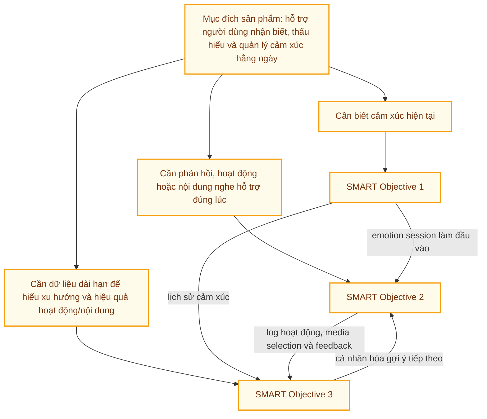
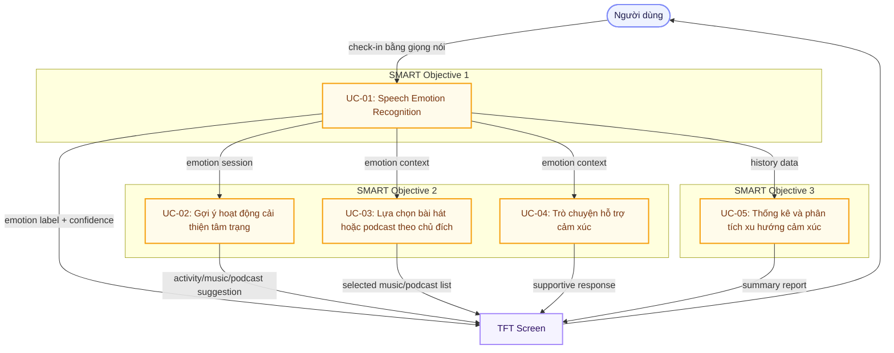
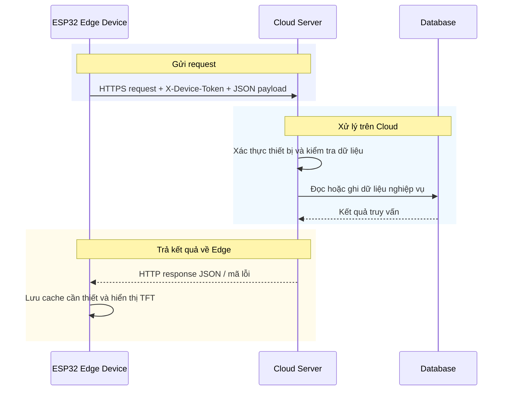

# 00. Giới thiệu

## 0.1. Thông tin tài liệu

Tài liệu này mô tả đặc tả sản phẩm **EmotiCare AIoT - Người bạn đồng hành cảm xúc thông minh**, một thiết bị AIoT thông minh có vai trò đồng hành, nhận biết và hỗ trợ người dùng chăm sóc sức khỏe cảm xúc trong đời sống hằng ngày. Tài liệu là cơ sở thống nhất cho nhóm phát triển phần cứng, Edge AI, máy chủ/dịch vụ Cloud, màn hình TFT và hướng dẫn sử dụng.

| Trường thông tin | Giá trị |
| ---------------- | ------- |
| Tên sản phẩm | EmotiCare AIoT |
| Tên đầy đủ | EmotiCare AIoT - Intelligent Emotional Companion |
| Tên tiếng Việt | Thiết bị AIoT thông minh đồng hành và chăm sóc sức khỏe cảm xúc |
| Loại tài liệu | AIoT Product Specification |
| Môn học | Nhập môn lập trình thiết bị thông minh |
| Lớp | 23CLC02 |
| Phiên bản | 3.1 |
| Ngày cập nhật | 25/06/2026 |

## 0.2. Định vị sản phẩm

**EmotiCare AIoT** là thiết bị AIoT ứng dụng trí tuệ nhân tạo nhằm hỗ trợ người dùng nhận biết, thấu hiểu và quản lý cảm xúc trong cuộc sống hằng ngày. Thiết bị nhận diện trạng thái cảm xúc thông qua giọng nói, đưa ra gợi ý hoặc tương tác phù hợp để cải thiện tâm trạng, đồng thời thống kê và phân tích xu hướng cảm xúc theo ngày, tuần và tháng.

Điểm khác biệt của sản phẩm là cách tiếp cận **ưu tiên xử lý tại thiết bị, có Cloud hỗ trợ**: tác vụ nhận diện cảm xúc cốt lõi được xử lý trực tiếp trên thiết bị để giảm độ trễ và tăng tính riêng tư, trong khi các chức năng gợi ý hoạt động, trò chuyện hỗ trợ và báo cáo dài hạn phối hợp với dịch vụ Internet/Cloud. Toàn bộ kết quả theo dõi, báo cáo và trạng thái đồng bộ được hiển thị trên màn hình TFT của thiết bị.

> **EmotiCare AIoT - Thấu hiểu cảm xúc, chăm sóc tâm trí.**

## 0.3. Vòng đời tài liệu và xác nhận

### 0.3.1. Lịch sử cập nhật

| Phiên bản | Ngày | Người cập nhật | Phase | Nội dung thay đổi |
| --------- | ---- | -------------- | ----- | ----------------- |
| 1.0 | 26/05/2026 | Nhóm dự án | Bản nháp đầu tiên | Khởi tạo đặc tả thiết bị thông minh |
| 2.0 | 13/06/2026 | Nhóm dự án | Cập nhật trong quá trình thực hiện | Cập nhật đặc tả theo hướng sản phẩm trước đó |
| 3.0 | 25/06/2026 | Nhóm dự án | Thiết kế lại sản phẩm | Chuyển đổi đặc tả sang EmotiCare AIoT |
| 3.1 | 25/06/2026 | Nhóm dự án | Hoàn thiện đặc tả | Viết lại có dấu, chi tiết hóa bối cảnh, mục tiêu, Edge AI, dịch vụ Internet, luồng màn hình và hướng dẫn sử dụng |
| 3.2 | 29/06/2026 | Nhóm dự án | Đồng bộ theo SRS | Bổ sung cấu trúc theo mẫu đặc tả yêu cầu phần mềm |

### 0.3.2. Xác nhận

| Vai trò | Người/nhóm phụ trách | Trách nhiệm xác nhận | Trạng thái |
| ------- | -------------------- | -------------------- | ---------- |
| Chủ sở hữu sản phẩm | Nhóm dự án | Xác nhận phạm vi sản phẩm, mục tiêu và tình huống sử dụng | Chờ xác nhận |
| Phụ trách phần cứng | Nhóm dự án | Xác nhận phần cứng, chi phí mẫu thử và luồng màn hình TFT | Chờ xác nhận |
| Phụ trách Edge AI | Nhóm dự án | Xác nhận quy trình nhận diện cảm xúc bằng giọng nói và yêu cầu riêng tư | Chờ xác nhận |
| Phụ trách Cloud/API | Nhóm dự án | Xác nhận cơ sở dữ liệu, API và luồng Edge-Cloud-TFT | Chờ xác nhận |
| Người phản biện/Giảng viên | Giảng viên phụ trách | Đánh giá tính đầy đủ của đặc tả | Chờ xác nhận |

## 0.4. Đối tượng sử dụng tài liệu

| Đối tượng đọc | Phần nên đọc kỹ | Mục đích sử dụng tài liệu |
| ------------- | --------------- | -------------------------- |
| Nhóm phần cứng | Chương 02, 06, 08 | Chọn linh kiện, thiết kế luồng màn hình TFT và chuẩn bị mẫu thử |
| Nhóm Edge AI | Chương 03, 04, 05 | Xây dựng quy trình SER, xác định đầu vào/đầu ra và tiêu chí đánh giá |
| Nhóm Cloud/API | Chương 03, 04, 05, 08 | Thiết kế cơ sở dữ liệu, API, đồng bộ dữ liệu và các thẻ báo cáo |
| Nhóm kiểm thử | Chương 03, 04, 05, 06 | Viết trường hợp kiểm thử theo tình huống sử dụng, yêu cầu chức năng và yêu cầu phi chức năng |
| Giảng viên/reviewer | Toàn bộ tài liệu | Đánh giá tính nhất quán, phạm vi và khả thi của sản phẩm |

## 0.5. Thuật ngữ, tiêu chuẩn và nguyên tắc áp dụng

| Nhóm | Nội dung áp dụng |
| ---- | --------------- |
| Thuật ngữ sử dụng | Thiết bị biên, Edge AI, nhận diện cảm xúc bằng giọng nói, phiên cảm xúc, thẻ báo cáo TFT và dịch vụ gợi ý nội dung được định nghĩa trong phụ lục |
| Cách tổ chức SRS | Tài liệu được tổ chức theo hướng đặc tả yêu cầu phần mềm: mục đích, phạm vi, bối cảnh, tình huống sử dụng, yêu cầu chức năng, yêu cầu phi chức năng, yêu cầu khác và kế hoạch tiếp theo |
| Cách thiết kế API | Dịch vụ Cloud ưu tiên REST API, phản hồi JSON, mã thiết bị hoặc yêu cầu có chữ ký |
| Định dạng dữ liệu | Dữ liệu trao đổi chính dùng JSON; âm thanh thô không được tải lên mặc định; nhật ký/báo cáo có thể xuất dạng CSV hoặc JSON trong các phiên bản sau |
| Nguyên tắc riêng tư | Ưu tiên bảo vệ riêng tư ngay từ thiết kế: xử lý SER tại Edge, chỉ đồng bộ ngữ cảnh cảm xúc và siêu dữ liệu cần thiết |
| Nguyên tắc an toàn | Phản hồi từ Cloud không chẩn đoán y khoa, không thay thế chuyên gia và có bộ lọc an toàn cho tín hiệu nguy cấp |

## 0.6. Cách sử dụng tài liệu này

| Bước | Cách sử dụng |
| ---- | ------------ |
| 1 | Đọc chương 01 để hiểu bối cảnh, mục đích sản phẩm, người dùng mục tiêu và phạm vi |
| 2 | Đọc chương 02 để nắm danh mục, kết nối, chi phí và ràng buộc phần cứng |
| 3 | Đọc chương 03 để hiểu mục tiêu SMART, tình huống sử dụng, đầu vào/đầu ra và sơ đồ |
| 4 | Đọc các phần UC trong chương 03 nếu cần triển khai hoặc đánh giá Edge AI, API Cloud, cơ sở dữ liệu và luồng đồng bộ |
| 5 | Dùng chương 04 và 05 để viết checklist phát triển, trường hợp kiểm thử và tiêu chí nghiệm thu |
| 6 | Dùng chương 06 để demo thao tác trên thiết bị phần cứng/TFT |
| 7 | Dùng chương 08 để tra thuật ngữ, cấu trúc dữ liệu, tóm tắt API, siêu dữ liệu, định dạng dữ liệu và tài liệu tham khảo |

## 0.7. Thông tin thành viên

| STT | Thành viên | MSSV | Số điện thoại | Email |
| --- | ---------- | ---- | ------------- | ----- |
| 1 | Trần Hải Đức | 23127173 | 0916821170 | thduc23@clc.fitus.edu.vn |
| 2 | Nguyễn Trọng Tài | 23127008 | 0377425510 | nttai23@clc.fitus.edu.vn |
| 3 | Nguyễn Công Chiến | 23127331 | 0369314655 | ncchien23@clc.fitus.edu.vn |
| 4 | Phạm Nguyễn Gia Bảo | 20127119 | 0926127333 | pngbao20@clc.fitus.edu.vn |

## 0.8. Phạm vi cập nhật đặc tả

| Hạng mục | Đặc tả trước | Đặc tả cập nhật |
| -------- | ------------ | --------------- |
| Định hướng sản phẩm | Thiết bị thông minh cá nhân với nhiều chức năng rời rạc | Thiết bị đồng hành cảm xúc tập trung vào nhận diện, hỗ trợ và phân tích cảm xúc |
| Objective 1 | Theo dõi phiên học/tác vụ cá nhân | Speech Emotion Recognition trên Edge Device trong 15 giây |
| Objective 2 | Tạo báo cáo cho một nhóm chức năng khác | Cloud-assisted recommendation, media selection và conversation trong 20 giây |
| Objective 3 | Giao diện web theo dõi phiên sử dụng | Báo cáo cảm xúc hiển thị trên TFT theo ngày, tuần, tháng trong 180 giây |
| Edge AI | Xử lý cục bộ cho một tác vụ giới hạn | Phân tích đặc trưng giọng nói và ngữ cảnh sức khỏe cảm xúc tại thiết bị |
| Internet Service | Đồng bộ và giao diện web cơ bản | Thiết kế DB, API, cloud recommendation/conversation/report service và flow Edge-Cloud-TFT |
| User Manual | Hướng dẫn theo luồng cũ | Hướng dẫn theo luồng phần cứng mới của EmotiCare AIoT |

## 0.9. Lịch sử phiên bản

| Phiên bản | Ngày | Người cập nhật | Nội dung |
| --------- | ---- | -------------- | -------- |
| 1.0 | 26/05/2026 | Project team | Khởi tạo đặc tả thiết bị thông minh |
| 2.0 | 13/06/2026 | Project team | Cập nhật đặc tả theo hướng sản phẩm trước đó |
| 3.0 | 25/06/2026 | Project team | Chuyển đổi đặc tả sang EmotiCare AIoT |
| 3.1 | 25/06/2026 | Nhóm dự án | Viết lại có dấu, chi tiết hóa bối cảnh, mục tiêu, Edge AI, dịch vụ Internet, luồng màn hình và hướng dẫn sử dụng |
| 3.2 | 29/06/2026 | Nhóm dự án | Bổ sung các phần theo mẫu SRS: đối tượng đọc, xác nhận, cách dùng, giả định, liên kết, siêu dữ liệu và kế hoạch tiếp theo |

## 0.10. Cấu trúc tài liệu

| Chương | Nội dung |
| ------ | -------- |
| 01. Bối cảnh | Bối cảnh, nguồn cảm hứng từ EMO, vấn đề, người dùng mục tiêu và sơ đồ suy ra mục tiêu |
| 02. Phần cứng | Thành phần phần cứng, kết nối, chi phí và ràng buộc triển khai |
| 03. Mục tiêu và tình huống sử dụng | Mục tiêu SMART, tình huống sử dụng, logic Edge AI, API Cloud, dữ liệu và sơ đồ |
| 04. Kết nối Edge–Server và API | Quy trình kết nối, đồng bộ dữ liệu, API và schema của 5 use case |
| 05. Yêu cầu chức năng | Yêu cầu chức năng được truy vết theo mục tiêu và tình huống sử dụng |
| 06. Yêu cầu phi chức năng | Yêu cầu phi chức năng về hiệu năng, bảo mật, riêng tư, độ tin cậy và an toàn cảm xúc |
| 07. Hướng dẫn sử dụng | Hướng dẫn sử dụng thiết bị phần cứng, màn hình TFT và đồng bộ Internet |
| 08. Kết luận | Tổng kết, lợi ích, giới hạn và hướng phát triển |
| 09. Phụ lục và tài liệu tham khảo | Thuật ngữ, bảng dữ liệu, tóm tắt API và tài liệu tham khảo |

---

# 01. Background

## 1.1. Bối cảnh

Trong học tập, công việc và sinh hoạt cá nhân, cảm xúc của người dùng thay đổi liên tục nhưng thường không được ghi nhận một cách có hệ thống. Nhiều người chỉ nhận ra mình đang căng thẳng, buồn bã hoặc kiệt sức khi cảm xúc tiêu cực đã kéo dài. Ngược lại, những giai đoạn tích cực cũng dễ bị bỏ qua nên người dùng khó biết thói quen nào thật sự giúp mình cân bằng hơn.

Các ứng dụng ghi nhật ký cảm xúc trên điện thoại có thể hỗ trợ theo dõi tâm trạng, nhưng chúng phụ thuộc nhiều vào việc người dùng chủ động mở ứng dụng, tự nhập dữ liệu và tự đánh giá cảm xúc. Điều này tạo ra rào cản sử dụng hằng ngày, đặc biệt với người đang mệt mỏi hoặc căng thẳng. EmotiCare AIoT được thiết kế để giảm rào cản đó bằng một thiết bị vật lý đặt trong không gian cá nhân, cho phép người dùng thực hiện một lần check-in ngắn bằng giọng nói.

### 1.1.1. Thực trạng

Theo báo cáo **World mental health report: Transforming mental health for all** của World Health Organization, nhu cầu chăm sóc sức khỏe tinh thần trên toàn cầu đang ở mức cao, trong khi khả năng đáp ứng của các hệ thống hỗ trợ còn chưa tương xứng [10]. Điều này cho thấy các giải pháp hỗ trợ nhẹ, dễ tiếp cận và có thể dùng thường xuyên trong đời sống hằng ngày là một hướng bổ sung cần thiết, đặc biệt với nhóm người dùng chưa cần can thiệp y tế nhưng cần theo dõi cảm xúc và giảm căng thẳng sớm.

National Institute of Mental Health cũng nhấn mạnh rằng sức khỏe tinh thần bao gồm cả sức khỏe cảm xúc, tâm lý và xã hội; self-care có thể hỗ trợ duy trì sức khỏe tinh thần và hỗ trợ quá trình hồi phục khi người dùng gặp vấn đề tâm lý [9]. Với bối cảnh sinh viên và người đi làm thường chịu áp lực học tập, công việc, giao tiếp và nhịp sống nhanh, việc có một thiết bị giúp ghi nhận cảm xúc ngắn gọn, không phán xét và không yêu cầu thao tác phức tạp có ý nghĩa thực tiễn.

Từ thực trạng này, EmotiCare AIoT không được định vị như thiết bị chẩn đoán bệnh lý. Sản phẩm tập trung vào ba nhu cầu gần với đời sống hơn: giúp người dùng nhận biết cảm xúc hiện tại, nhận gợi ý chăm sóc phù hợp ngay trên thiết bị và xem lại xu hướng cảm xúc theo thời gian.

### 1.1.2. Sản phẩm tương tự

Trên thị trường đã có một số sản phẩm đi theo hướng thiết bị đồng hành cảm xúc hoặc robot xã hội. Tuy nhiên, mỗi sản phẩm có trọng tâm khác nhau, từ giải trí, đồng hành cho người lớn tuổi đến hỗ trợ thói quen sống. EmotiCare AIoT kế thừa ý tưởng tương tác gần gũi của nhóm sản phẩm này nhưng tập trung hẹp hơn vào **Speech Emotion Recognition**, gợi ý chăm sóc cảm xúc và báo cáo cảm xúc trên TFT.

| Sản phẩm tương tự | Mô tả ngắn | Điểm liên quan đến EmotiCare AIoT | Khác biệt của EmotiCare AIoT |
| ----------------- | ---------- | -------------------------------- | ---------------------------- |
| EMO - LivingAI | EMO là AI desktop pet có tính cách riêng, có thể ở bên cạnh người dùng, nhận biết âm thanh/người dùng, di chuyển trên bàn, nhảy theo nhạc, chơi game và hỗ trợ một số tác vụ như báo thức, thời tiết [11]. | Gợi cảm hứng về một thiết bị để bàn có cá tính, tạo cảm giác hiện diện và tương tác thân thiện. | EmotiCare AIoT không tập trung vào giải trí/nhân vật hóa, mà tập trung vào nhận diện cảm xúc bằng giọng nói, lưu emotion session và phân tích xu hướng cảm xúc. |
| ElliQ | ElliQ là companion robot hướng đến người lớn tuổi, hỗ trợ wellness, nhắc thuốc, gợi ý vận động nhẹ, kết nối xã hội, giải trí và giảm cô đơn [12]. | Cho thấy giá trị của thiết bị chủ động trò chuyện, nhắc nhở và hỗ trợ cảm xúc trong không gian cá nhân. | EmotiCare AIoT hướng đến prototype sinh viên, dùng TFT làm giao diện chính, SER chạy tại Edge và Cloud chỉ hỗ trợ gợi ý, media, hội thoại và báo cáo rút gọn. |

Từ việc tham khảo các sản phẩm trên, EmotiCare AIoT chọn một phạm vi khả thi hơn cho đồ án: không xây dựng robot xã hội phức tạp, không cố thay thế người chăm sóc, mà tạo một thiết bị AIoT nhỏ có khả năng lắng nghe một lượt check-in, phân loại cảm xúc, đề xuất hoạt động/bài hát/podcast phù hợp và giúp người dùng nhìn lại dữ liệu cảm xúc ngay trên màn hình phần cứng.

## 1.2. Nguồn cảm hứng từ EMO

Nguồn cảm hứng ban đầu của sản phẩm đến từ hình ảnh **EMO**, một thiết bị/robot để bàn có tính cách thân thiện, biết phản hồi lại người dùng và tạo cảm giác có một người bạn nhỏ trong không gian sống. Điểm hấp dẫn của EMO không chỉ nằm ở phần cứng, màn hình hay chuyển động, mà ở cảm giác thiết bị có thể hiện diện, phản hồi và làm cho tương tác công nghệ trở nên gần gũi hơn.

EmotiCare AIoT kế thừa tinh thần đó nhưng chuyển trọng tâm từ sự dễ thương và giải trí sang **chăm sóc cảm xúc có dữ liệu**. Thiết bị không chỉ phản ứng bằng biểu cảm hoặc câu nói ngắn, mà còn:

* Lắng nghe một tương tác giọng nói có chủ đích.
* Nhận diện trạng thái cảm xúc bằng Edge AI.
* Đưa ra phản hồi đồng cảm, hoạt động cải thiện tâm trạng hoặc nội dung nghe phù hợp như bài hát/podcast.
* Ghi nhận lịch sử cảm xúc để người dùng thấy được xu hướng của chính mình.
* Tạo báo cáo theo thời gian để hỗ trợ xây dựng lối sống cân bằng hơn.

Vì vậy, EmotiCare AIoT được định vị như một **Intelligent Emotional Companion**: không thay thế con người hay chuyên gia sức khỏe tinh thần, nhưng đóng vai trò một điểm chạm nhẹ nhàng, thường xuyên và riêng tư để người dùng quan tâm đến cảm xúc của mình.

## 1.3. Vấn đề cần giải quyết

| Vấn đề | Hệ quả | Cách EmotiCare AIoT giải quyết |
| ------ | ------ | ------------------------------- |
| Người dùng ít ghi nhận cảm xúc hằng ngày | Không thấy được xu hướng cảm xúc dài hạn | Check-in bằng giọng nói và lưu emotion session |
| Cảm xúc tiêu cực kéo dài khó được phát hiện sớm | Người dùng dễ rơi vào trạng thái căng thẳng, buồn bã hoặc mệt mỏi kéo dài | Báo cáo theo ngày, tuần, tháng và phát hiện chuỗi cảm xúc tiêu cực |
| Gợi ý chăm sóc tinh thần thường chung chung | Người dùng khó biết hoạt động hoặc nội dung nghe nào phù hợp với mình | Gợi ý theo cảm xúc hiện tại, chủ đích, lịch sử feedback và phân tích hiệu quả hoạt động/nội dung |
| Dữ liệu giọng nói nhạy cảm | Người dùng lo ngại quyền riêng tư | Ưu tiên Edge AI, không upload âm thanh thô mặc định |
| Thiết bị hỗ trợ tinh thần dễ bị hiểu nhầm là thiết bị y tế | Rủi ro kỳ vọng sai | Đặc tả rõ sản phẩm chỉ hỗ trợ tự chăm sóc, không chẩn đoán hoặc điều trị |

Từ các vấn đề trên, có thể thấy EmotiCare AIoT cần được đặt cạnh các sản phẩm tương tự để làm rõ khoảng trống sản phẩm mà đồ án hướng đến. Các sản phẩm như EMO hoặc ElliQ đã chứng minh rằng thiết bị vật lý có thể tạo cảm giác đồng hành tốt hơn một giao diện phần mềm thuần túy, nhưng chúng chưa trùng hoàn toàn với mục tiêu của EmotiCare AIoT.

| Tiêu chí so sánh | EMO - LivingAI [11] | ElliQ [12] | EmotiCare AIoT |
| ---------------- | ------------------- | ---------- | -------------- |
| Nhóm người dùng chính | Người dùng phổ thông muốn có AI desktop pet để giải trí và tương tác thân thiện | Người lớn tuổi cần đồng hành, nhắc nhở, kết nối xã hội và hỗ trợ wellness | Sinh viên, người đi làm và người quan tâm đến mental wellness |
| Trọng tâm sản phẩm | Tạo cảm giác thú cưng để bàn có cá tính, biết phản hồi, di chuyển, nhảy theo nhạc và hỗ trợ tác vụ đơn giản | Companion robot chủ động trò chuyện, nhắc thuốc, gợi ý vận động, kết nối gia đình/người chăm sóc | Thiết bị AIoT nhận diện cảm xúc qua giọng nói, gợi ý chăm sóc cảm xúc và theo dõi xu hướng trên TFT |
| Nhận diện cảm xúc | Có tương tác thông minh và biểu cảm, nhưng không tập trung vào Speech Emotion Recognition làm use case chính | Có hội thoại và wellness support, nhưng không tập trung vào SER cục bộ trên thiết bị phần cứng sinh viên | UC-01 tập trung vào Speech Emotion Recognition chạy tại Edge |
| Gợi ý chăm sóc cảm xúc | Thiên về giải trí, nhạc, game và phản hồi kiểu thú cưng | Thiên về thói quen sống, nhắc nhở, vận động nhẹ, kết nối xã hội | Gợi ý hoạt động, bài hát, podcast và phản hồi đồng cảm dựa trên emotion context |
| Theo dõi dài hạn | Không phải trọng tâm chính của sản phẩm | Có hỗ trợ caregiver/wellness theo định hướng người lớn tuổi | Báo cáo cảm xúc theo ngày, tuần, tháng hiển thị trực tiếp trên TFT |
| Quyền riêng tư âm thanh | Không phải điểm nhấn chính trong đặc tả đồ án | Có chính sách bảo mật và kết nối Cloud theo hệ sinh thái riêng | Không upload âm thanh thô mặc định; ưu tiên Edge AI cho tác vụ nhận diện cảm xúc |
| Phù hợp phạm vi đồ án | Sản phẩm thương mại có cơ khí, nhân vật hóa và trải nghiệm giải trí phức tạp | Sản phẩm thương mại có dịch vụ Cloud, caregiver app và vận hành dài hạn | Prototype khả thi hơn: Edge SER, Cloud API, TFT screen, database và flow Edge-Cloud-TFT |

Như vậy, EmotiCare AIoT không cố cạnh tranh trực tiếp với robot đồng hành thương mại. Sản phẩm chọn một lát cắt hẹp và rõ hơn: **nhận diện cảm xúc bằng giọng nói, hỗ trợ chăm sóc cảm xúc theo ngữ cảnh và tạo dữ liệu theo dõi dài hạn trên chính thiết bị phần cứng**.

## 1.4. Người dùng mục tiêu

| Nhóm người dùng | Nhu cầu chính | Giá trị sản phẩm |
| --------------- | ------------- | ---------------- |
| Sinh viên | Theo dõi căng thẳng, mệt mỏi, áp lực học tập | Check-in nhanh, gợi ý nghỉ ngơi, xem lại xu hướng cảm xúc |
| Người đi làm | Quản lý stress trong ngày làm việc | Nhận biết thời điểm căng thẳng và chọn hoạt động phục hồi |
| Người quan tâm đến mental wellness | Xây dựng thói quen chăm sóc tinh thần | Báo cáo định kỳ và theo dõi hiệu quả thói quen |
| Gia đình/người chăm sóc | Muốn có góc nhìn tổng quan nếu người dùng đồng ý chia sẻ | Báo cáo tổng quan không xâm phạm nội dung riêng tư |

### 1.4.1. User classes, characteristics và quyền truy cập

| User class | Đặc điểm | Quyền truy cập/chức năng | Giới hạn |
| ---------- | -------- | ------------------------ | -------- |
| End User | Người dùng trực tiếp thiết bị hằng ngày | Check-in cảm xúc, chọn Activity, Music/Podcast, Conversation, Report, xóa dữ liệu cục bộ | Không truy cập database thô hoặc cấu hình hệ thống |
| Device Owner | Người sở hữu/ghép thiết bị với tài khoản | Pairing device, xem trạng thái sync, quản lý consent cơ bản | Chỉ quản lý thiết bị của chính mình |
| Developer/Admin | Thành viên nhóm phát triển hoặc người vận hành demo | Cấu hình API, kiểm tra log, seed dữ liệu media, chạy test | Không xem audio thô nếu user chưa cho phép |
| Cloud Service | Thành phần backend xử lý request từ Edge | Nhận sync, tạo recommendation, media list, conversation response và report cards | Chỉ xử lý dữ liệu theo consent và device token hợp lệ |
| Tester/Reviewer | Người kiểm thử hoặc đánh giá đồ án | Kiểm thử use case, requirement, screen flow và dữ liệu giả lập | Không thay đổi dữ liệu người dùng thật |

## 1.5. Mục đích sản phẩm

Mục đích của **EmotiCare AIoT** là tạo ra một thiết bị AIoT đồng hành cảm xúc có thể giúp người dùng dừng lại, nhận biết trạng thái cảm xúc của mình và lựa chọn cách chăm sóc phù hợp ngay trong đời sống hằng ngày. Sản phẩm không hướng đến việc thay thế chuyên gia sức khỏe tinh thần, mà đóng vai trò như một điểm chạm nhẹ nhàng, riêng tư và dễ tiếp cận để người dùng hình thành thói quen quan sát cảm xúc.

Về mặt trải nghiệm, EmotiCare AIoT tập trung vào ba giá trị chính:

| Giá trị | Ý nghĩa đối với người dùng | Cách sản phẩm hỗ trợ |
| ------- | -------------------------- | -------------------- |
| Nhận biết cảm xúc | Người dùng biết mình đang vui vẻ, bình thường, căng thẳng, buồn bã, tức giận hoặc mệt mỏi | Check-in bằng giọng nói và nhận diện cảm xúc bằng Edge AI |
| Hỗ trợ đúng lúc | Người dùng nhận được một hành động nhỏ, một nội dung nghe phù hợp hoặc một phản hồi đồng cảm khi cần | Cloud gợi ý hoạt động, bài hát, podcast hoặc phản hồi hội thoại, sau đó hiển thị trên TFT |
| Hiểu xu hướng dài hạn | Người dùng nhìn lại sự thay đổi cảm xúc theo thời gian và biết hoạt động/nội dung nào có hiệu quả | Cloud tổng hợp emotion sessions, activity feedback, media selection logs và trả báo cáo rút gọn về TFT |

Từ góc nhìn sản phẩm, mục đích này giúp EmotiCare AIoT khác với một ứng dụng nhật ký cảm xúc thông thường. Thiết bị ưu tiên thao tác ngắn trên phần cứng, xử lý nhận diện cảm xúc tại Edge để giảm phụ thuộc Internet cho tác vụ cốt lõi, và chỉ dùng Cloud cho các phần cần dữ liệu dài hạn hoặc nội dung phong phú hơn như gợi ý, hội thoại và báo cáo.

Do đó, mục đích sản phẩm có thể tóm tắt như sau: **giúp người dùng nhận biết cảm xúc hiện tại, nhận hỗ trợ phù hợp trong thời điểm đó và theo dõi xu hướng cảm xúc lâu dài ngay trên thiết bị TFT**.

## 1.6. Từ mục đích sản phẩm suy ra 3 mục tiêu

Mục đích cốt lõi của EmotiCare AIoT là giúp người dùng **nhận biết cảm xúc**, **được hỗ trợ đúng lúc** và **hiểu xu hướng cảm xúc theo thời gian**. Từ mục đích này, sản phẩm được tách thành ba SMART objective liên kết thành một vòng lặp hoàn chỉnh.


```mermaid
flowchart TD
    Purpose["Mục đích sản phẩm: hỗ trợ người dùng nhận biết, thấu hiểu và quản lý cảm xúc hằng ngày"]

    Need1["Cần biết cảm xúc hiện tại"]
    Need2["Cần phản hồi, hoạt động hoặc nội dung nghe hỗ trợ đúng lúc"]
    Need3["Cần dữ liệu dài hạn để hiểu xu hướng và hiệu quả hoạt động/nội dung"]

    Obj1["SMART Objective 1"]
    Obj2["SMART Objective 2"]
    Obj3["SMART Objective 3"]

    Purpose --> Need1 --> Obj1
    Purpose --> Need2 --> Obj2
    Purpose --> Need3 --> Obj3

    Obj1 -->|"emotion session làm đầu vào"| Obj2
    Obj1 -->|"lịch sử cảm xúc"| Obj3
    Obj2 -->|"log hoạt động, media selection và feedback"| Obj3
    Obj3 -->|"cá nhân hóa gợi ý tiếp theo"| Obj2


    classDef userNode stroke:#818cf8,fill:#eef2ff,stroke-width:2px,color:#1e1b4b
    classDef edgeNode stroke:#a78bfa,fill:#f5f3ff,stroke-width:2px,color:#2e1065
    classDef cacheNode stroke:#2dd4bf,fill:#f0fdfa,stroke-width:2px,color:#0d5a57
    classDef cloudNode stroke:#38bdf8,fill:#f0f9ff,stroke-width:2px,color:#0c3d67
    classDef serviceNode stroke:#4ade80,fill:#f0fdf4,stroke-width:2px,color:#1a3a1a
    classDef actionNode stroke:#f59e0b,fill:#fffbeb,stroke-width:2px,color:#78350f
    class Purpose,Need1,Need2,Need3,Obj1,Obj2,Obj3 actionNode
```

*Mô tả diagram: Sơ đồ cho thấy mục đích chăm sóc cảm xúc được tách thành ba mục tiêu liên kết nhau: Edge AI nhận diện cảm xúc, Cloud hỗ trợ phản hồi/gợi ý, và Cloud tổng hợp báo cáo để hiển thị lại trên TFT screen.*

Ghi chú nội dung đầy đủ của các SMART objective:

| SMART Objective | Nội dung đầy đủ |
| --------------- | --------------- |
| SMART Objective 1 | Phát hiện và phân loại trạng thái cảm xúc của người dùng trong vòng 15 giây sau mỗi lần tương tác bằng giọng nói hợp lệ, đồng thời lưu lại kết quả của từng phiên để phục vụ theo dõi và phân tích cảm xúc theo thời gian. |
| SMART Objective 2 | Đề xuất ít nhất một hoạt động, bài hát, podcast hoặc một phản hồi đồng cảm phù hợp trong vòng 20 giây khi người dùng yêu cầu hỗ trợ và thiết bị có Internet. |
| SMART Objective 3 | Tự động tạo tóm tắt thống kê và phân tích cảm xúc theo ngày, tuần và tháng trên Cloud Service, sau đó trả kết quả rút gọn về TFT screen trong vòng 180 giây sau khi người dùng yêu cầu hoặc sau một chu kỳ đồng bộ. |

## 1.7. Phạm vi sản phẩm

### Trong phạm vi

* Thu âm khi người dùng chủ động kích hoạt tương tác.
* Nhận diện cảm xúc từ giọng nói bằng Edge AI.
* Phân loại các trạng thái: vui vẻ, bình thường, căng thẳng, buồn bã, tức giận, mệt mỏi và nhóm mở rộng.
* Đề xuất hoạt động cải thiện hoặc duy trì tâm trạng.
* Đề xuất bài hát hoặc podcast theo cảm xúc hiện tại, category và chủ đích của người dùng.
* Trò chuyện hỗ trợ cảm xúc với phản hồi đồng cảm và an toàn.
* Lưu emotion session, recommendation log, media selection log và feedback.
* Tạo báo cáo cảm xúc theo ngày, tuần, tháng.
* Hiển thị trên TFT screen về phân bố cảm xúc, xu hướng và hiệu quả hoạt động/nội dung.

### Ngoài phạm vi

* Chẩn đoán bệnh lý tâm thần.
* Thay thế bác sĩ, nhà tâm lý học hoặc dịch vụ khẩn cấp.
* Thu âm liên tục khi người dùng chưa kích hoạt.
* Chia sẻ dữ liệu cảm xúc cho bên thứ ba khi chưa có sự đồng ý.
* Đưa ra kết luận y khoa dựa trên giọng nói hoặc dữ liệu sinh hoạt.

---

# 02. Phần cứng

## 2.1. Vai trò phần cứng

Phần cứng là điểm tương tác trực tiếp với người dùng. Thiết bị thu giọng nói, nhận thao tác nút bấm, hiển thị nội dung ngắn trên TFT, phát tín hiệu âm thanh khi cần và kết nối Wi-Fi. Logic thuật toán được mô tả tại từng tình huống sử dụng ở Chương 03; quy trình Edge–Server và API/schema được tập trung tại Chương 04.

## 2.2. Danh mục phần cứng

| Phần cứng | Vai trò | Giá (VNĐ) |
| --- | --- | ---: |
| ESP32-S AI Thinker | Bộ não trung tâm, xử lý toàn bộ thiết bị và kết nối Wi-Fi | 250.000 |
| LCD TFT ST7789 | Hiển thị menu, cảm xúc, gợi ý, hội thoại và báo cáo | 190.000 |
| INMP441 | Micro thu âm giọng nói qua I2S | 35.000 |
| MAX98357 I2S và loa 3W Class D | Khuếch đại âm thanh và phát loa | 90.000 |
| Module nút bấm 5 cái | Điều hướng màn hình và thao tác trên thiết bị | 30.000 |
| Breadboard | Nối dây, thử nghiệm mạch | 20.000 |
| Dây nối mạch | Kết nối các linh kiện | 30.000 |
| Dây nối nguồn | Cấp nguồn để thiết bị hoạt động | 70.000 |
| Bao bì phần cứng | Hoàn thiện phần bên ngoài của thiết bị | 100.000 |

## 2.3. Kết nối phần cứng

| Nhóm | Kết nối chính | Mục đích |
| --- | --- | --- |
| INMP441 | I2S: SCK, WS, SD | Thu tín hiệu giọng nói |
| LCD TFT ST7789 | SPI: CS, RST, DC, MOSI, SCLK, đèn nền | Hiển thị giao diện |
| Module nút bấm | GPIO | Điều hướng thao tác |
| MAX98357 I2S và loa 3W | I2S | Phát tín hiệu phản hồi và âm thanh |
| Wi-Fi | Tích hợp trên vi điều khiển | Kết nối dịch vụ Cloud |

## 2.4. Tổng chi phí

**Tổng chi phí phần cứng: 815.000 VNĐ.**

Mức giá này là danh mục đã chốt cho mẫu thử. Breadboard và dây nối phục vụ giai đoạn lắp ráp/kiểm tra; bao bì phần cứng dùng để hoàn thiện hình thức thiết bị.

## 2.5. Ràng buộc phần cứng

- Màn hình có không gian hạn chế, vì vậy nội dung cần ngắn và dễ đọc.
- Microphone cần hoạt động tốt trong môi trường demo không quá ồn.
- Wi-Fi là điều kiện để dùng các chức năng Cloud.
- Thiết bị phải hiển thị rõ trạng thái đang ghi âm, kết nối mạng và đồng bộ.
- Mẫu thử không phải thiết bị y tế và không thay thế chuyên gia sức khỏe tinh thần.

---

# 03. Mục tiêu

## 3.1. Tổng quan

Ba SMART objective của EmotiCare AIoT tạo thành một vòng lặp vận hành trên thiết bị, trong đó TFT là giao diện theo dõi chính, Edge AI xử lý tác vụ nhận diện cảm xúc cốt lõi, còn Cloud hỗ trợ các chức năng cần dữ liệu dài hạn hoặc nội dung phong phú hơn.


| SMART Objective   | Mô tả đầy đủ                                                                                                                                                                                                               | Use case liên quan  | Vai trò trong vòng lặp                                                               |
| ----------------- | -------------------------------------------------------------------------------------------------------------------------------------------------------------------------------------------------------------------------- | ------------------- | ------------------------------------------------------------------------------------ |
| SMART Objective 1 | Phát hiện và phân loại trạng thái cảm xúc của người dùng trong vòng 15 giây sau mỗi lần tương tác bằng giọng nói hợp lệ, đồng thời lưu lại kết quả của từng phiên để phục vụ theo dõi và phân tích cảm xúc theo thời gian. | UC-01               | Tạo emotion session làm dữ liệu nền cho các chức năng hỗ trợ và báo cáo              |
| SMART Objective 2 | Đề xuất ít nhất một hoạt động, bài hát, podcast hoặc một phản hồi đồng cảm phù hợp trong vòng 20 giây khi người dùng yêu cầu hỗ trợ và thiết bị có Internet.                                                               | UC-02, UC-03, UC-04 | Biến dữ liệu cảm xúc hoặc nhu cầu trực tiếp từ HOME thành hành động hỗ trợ cụ thể    |
| SMART Objective 3 | Tự động tạo tóm tắt thống kê và phân tích cảm xúc theo ngày, tuần và tháng trên Cloud Service, sau đó trả kết quả rút gọn về TFT screen trong vòng 180 giây sau khi người dùng yêu cầu hoặc sau một chu kỳ đồng bộ.        | UC-05               | Giúp người dùng nhìn lại xu hướng cảm xúc và hiệu quả của hoạt động/nội dung đã chọn |


### Bảng liên kết giá trị mang lại với yêu cầu


| Value proposition                                                  | SMART objective   | Use case | Giá trị người dùng mong đợi                                                               |
| ------------------------------------------------------------------ | ----------------- | -------- | ----------------------------------------------------------------------------------------- |
| Người dùng nhận biết cảm xúc nhanh mà không cần nhập liệu thủ công | SMART Objective 1 | UC-01    | Người dùng có emotion label và confidence ngay trên TFT sau một lần check-in ngắn         |
| Người dùng nhận hỗ trợ phù hợp khi đang cần điều chỉnh cảm xúc     | SMART Objective 2 | UC-02    | Người dùng nhận 5 hoạt động gợi ý mà không phải tự tìm                                    |
| Người dùng chủ động chọn nội dung nghe theo mục đích               | SMART Objective 2 | UC-03    | Người dùng chọn category và nhận danh sách bài hát/podcast phù hợp                        |
| Người dùng có kênh trò chuyện ngắn, đồng cảm và an toàn            | SMART Objective 2 | UC-04    | Người dùng nhận phản hồi ngắn gọn, không phán xét, có safety filter                       |
| Người dùng nhìn lại xu hướng cảm xúc dài hạn trên thiết bị         | SMART Objective 3 | UC-05    | Người dùng xem report cards theo ngày/tuần/tháng ngay trên TFT                            |


### Sơ đồ luồng mục tiêu tổng thể


```mermaid
flowchart TD
    User(["Người dùng"])
    TFT["TFT Screen"]

    subgraph O1["SMART Objective 1"]
        UC1["UC-01: Speech Emotion Recognition"]
    end

    subgraph O2["SMART Objective 2"]
        UC2["UC-02: Gợi ý hoạt động cải thiện tâm trạng"]
        UC3["UC-03: Lựa chọn bài hát hoặc podcast theo chủ đích"]
        UC4["UC-04: Trò chuyện hỗ trợ cảm xúc"]
    end

    subgraph O3["SMART Objective 3"]
        UC5["UC-05: Thống kê và phân tích xu hướng cảm xúc"]
    end

    User -->|"check-in bằng giọng nói"| UC1
    UC1 -->|"emotion label + confidence"| TFT
    UC1 -->|"emotion session"| UC2
    UC1 -->|"emotion context"| UC3
    UC1 -->|"emotion context"| UC4
    UC1 -->|"history data"| UC5
    UC2 -->|"activity/music/podcast suggestion"| TFT
    UC3 -->|"selected music/podcast list"| TFT
    UC4 -->|"supportive response"| TFT
    UC5 -->|"summary report"| TFT
    TFT --> User


    classDef userNode stroke:#818cf8,fill:#eef2ff,stroke-width:2px,color:#1e1b4b
    classDef edgeNode stroke:#a78bfa,fill:#f5f3ff,stroke-width:2px,color:#2e1065
    classDef cacheNode stroke:#2dd4bf,fill:#f0fdfa,stroke-width:2px,color:#0d5a57
    classDef cloudNode stroke:#38bdf8,fill:#f0f9ff,stroke-width:2px,color:#0c3d67
    classDef serviceNode stroke:#4ade80,fill:#f0fdf4,stroke-width:2px,color:#1a3a1a
    classDef actionNode stroke:#f59e0b,fill:#fffbeb,stroke-width:2px,color:#78350f
    class User userNode
    class TFT edgeNode
    class UC1,UC2,UC3,UC4,UC5 actionNode
```


*Mô tả chart: Flow chart này cho thấy Objective 1 tạo dữ liệu cảm xúc tại Edge, Objective 2 và Objective 3 dùng Cloud để xử lý nâng cao, còn mọi kết quả đều quay về TFT screen để người dùng theo dõi.*

---


## 3.2. SMART Objective 1: Phát hiện và phân loại trạng thái cảm xúc của người dùng bằng Speech Emotion Recognition trong vòng 15 giây sau mỗi lần tương tác bằng giọng nói hợp lệ, đồng thời lưu lại kết quả của từng phiên để phục vụ theo dõi cảm xúc theo thời gian

Objective 1 là nền tảng của toàn bộ hệ thống. Đây là objective duy nhất bắt buộc chạy được tại Edge Device khi mất Internet. Kết quả được hiển thị ngay trên TFT và được lưu vào local cache để đồng bộ cloud sau.

### 3.2.1. Tình huống sử dụng UC-01: Nhận diện cảm xúc bằng giọng nói

- **Input:** Giọng nói của người dùng.
- **Output:** Trạng thái cảm xúc, ví dụ: vui vẻ, bình thường, căng thẳng, buồn bã, tức giận, mệt mỏi.

**Mô tả:** Thiết bị sử dụng bài toán **Speech Emotion Recognition (SER)** để phân tích tín hiệu lời nói và suy luận trạng thái cảm xúc. Pipeline SER gồm thu âm có chủ đích, tiền xử lý, trích xuất Log-Mel Spectrogram, MFCC, pitch, energy hoặc embedding âm thanh, sau đó đưa vào mô hình phân loại đã được tối ưu cho edge. Kết quả được hiển thị trên TFT và lưu thành emotion session.

**Ý nghĩa của use case:** UC-01 giúp người dùng gọi tên trạng thái cảm xúc hiện tại mà không cần nhập nhật ký thủ công. Việc đặt use case là Speech Emotion Recognition làm rõ nguồn nhận diện chính là tín hiệu lời nói.

**Vai trò trong objective:** UC-01 là điểm bắt đầu của vòng lặp chăm sóc cảm xúc, nơi giọng nói được chuyển thành emotion label, confidence score và emotion session trong giới hạn 15 giây.


| Trường             | Nội dung                                                                                                                                                                                                                                                                                                                              |
| ------------------ | ------------------------------------------------------------------------------------------------------------------------------------------------------------------------------------------------------------------------------------------------------------------------------------------------------------------------------------- |
| Use case ID        | UC-01                                                                                                                                                                                                                                                                                                                                 |
| Tên use case       | Speech Emotion Recognition                                                                                                                                                                                                                                                                                                            |
| Tác nhân chính     | Người dùng                                                                                                                                                                                                                                                                                                                            |
| Tác nhân phụ       | Edge Device, TFT Screen                                                                                                                                                                                                                                                                                                               |
| Mục tiêu           | Xác định trạng thái cảm xúc hiện tại sau một lần tương tác bằng giọng nói                                                                                                                                                                                                                                                             |
| Tiền điều kiện     | Thiết bị đã bật, microphone sẵn sàng, người dùng chủ động kích hoạt check-in                                                                                                                                                                                                                                                          |
| Kích hoạt          | Người dùng nhấn nút Check-in và nói một câu hoặc một đoạn chia sẻ ngắn                                                                                                                                                                                                                                                                |
| Luồng chính        | 1. Người dùng kích hoạt thu âm. 2. Thiết bị hiển thị trạng thái đang nghe trên TFT. 3. Thiết bị ghi âm trong thời lượng giới hạn. 4. Edge AI tiền xử lý âm thanh. 5. Hệ thống trích xuất đặc trưng SER. 6. Mô hình SER phân loại cảm xúc và trả confidence. 7. TFT hiển thị kết quả. 8. Hệ thống lưu emotion session vào local cache. |
| Luồng thay thế     | Nếu âm thanh quá ngắn, quá nhiễu hoặc confidence thấp, thiết bị yêu cầu người dùng nói lại hoặc lưu kết quả là `uncertain`. Nếu mất Internet, session vẫn được lưu cục bộ.                                                                                                                                                            |
| Hậu điều kiện      | Emotion session được tạo và sẵn sàng đồng bộ cloud khi có Internet                                                                                                                                                                                                                                                                    |
| Dữ liệu vào        | Audio sample, Log-Mel Spectrogram, MFCC, pitch, energy hoặc embedding âm thanh                                                                                                                                                                                                                                                        |
| Dữ liệu ra         | Emotion label, confidence score, timestamp, session ID, sync status                                                                                                                                                                                                                                                                   |
| Mục tiêu hiệu năng | Hoàn tất trong vòng 15 giây                                                                                                                                                                                                                                                                                                           |


#### Kỹ thuật SER triển khai tại Edge

SER chạy theo pipeline `PCM/WAV mono → trích xuất đặc trưng → phân loại → nhãn cảm xúc`. Đầu vào là PCM có dấu 16-bit, một kênh và tối thiểu 2.048 mẫu. Thu âm, kiểm tra chất lượng và suy luận chạy trong task thông thường của ESP32, không chạy trong ISR; workspace được cấp phát tĩnh để không làm tràn stack FreeRTOS. Suy luận không phụ thuộc Internet và không tự tải audio thô lên Cloud.

Schema `ravdess-mfcc45-v1` gồm 45 đặc trưng: trung bình/độ lệch chuẩn của 13 MFCC, 12 chroma, RMS, zero-crossing rate, spectral centroid, bandwidth, rolloff, flatness và contrast. Tập huấn luyện dùng 1.440 mẫu RAVDESS Audio-only Speech với tám nhãn gốc `neutral`, `calm`, `happy`, `sad`, `angry`, `fearful`, `disgust`, `surprised`; nhãn nội bộ phải được ánh xạ rõ, còn mẫu nhiễu hoặc thiếu tin cậy trả `uncertain`.

Mô hình tham chiếu là Extra Trees 100 cây, `float32`, `class_weight=balanced`, seed 42; đánh giá bằng accuracy, macro F1 trên tập 80/20 có phân tầng và tập actor-held-out (actor 21–24). Mô hình được xuất C/C++ bằng emlearn; bản gọn ESP32 dùng Random Forest độc lập và phải được đánh giá lại. nguồn [13]–[14].

#### Sơ đồ luồng


```mermaid
flowchart LR
    Start([Bắt đầu])
    Activate["Người dùng kích hoạt Check-in"]
    Record["Thiết bị ghi âm có giới hạn thời gian"]
    Valid{"Âm thanh hợp lệ?"}
    Retry["Yêu cầu người dùng nói lại"]
    Preprocess["Tiền xử lý âm thanh"]
    Feature["Trích xuất Log-Mel / MFCC / pitch / energy"]
    Infer["Mô hình SER phân loại cảm xúc"]
    Confidence{"Confidence đủ cao?"}
    Uncertain["Đánh dấu uncertain hoặc yêu cầu xác nhận"]
    Save["Lưu emotion session"]
    Display["Hiển thị cảm xúc trên TFT"]
    End([Kết thúc])

    Start --> Activate --> Record --> Valid
    Valid -- "Không" --> Retry --> Record
    Valid -- "Có" --> Preprocess --> Feature --> Infer --> Confidence
    Confidence -- "Không" --> Uncertain --> Save
    Confidence -- "Có" --> Save
    Save --> Display --> End


    classDef userNode stroke:#818cf8,fill:#eef2ff,stroke-width:2px,color:#1e1b4b
    classDef edgeNode stroke:#a78bfa,fill:#f5f3ff,stroke-width:2px,color:#2e1065
    classDef cacheNode stroke:#2dd4bf,fill:#f0fdfa,stroke-width:2px,color:#0d5a57
    classDef cloudNode stroke:#38bdf8,fill:#f0f9ff,stroke-width:2px,color:#0c3d67
    classDef serviceNode stroke:#4ade80,fill:#f0fdf4,stroke-width:2px,color:#1a3a1a
    classDef actionNode stroke:#f59e0b,fill:#fffbeb,stroke-width:2px,color:#78350f
    class Display edgeNode
    class Record serviceNode
    class Start,Activate,Valid,Retry,Preprocess,Feature,Infer,Confidence,Uncertain,Save,End actionNode
```


*Mô tả chart: Flow chart này mô tả tuần tự xử lý SER từ lúc người dùng check-in đến khi TFT hiển thị cảm xúc và local cache lưu phiên.*

---


## 3.3. SMART Objective 2: Đề xuất ít nhất một hoạt động hoặc một phản hồi phù hợp thông qua Cloud Service trong vòng 20 giây sau khi hoàn tất nhận diện cảm xúc và thiết bị có Internet, nhằm cải thiện hoặc duy trì trạng thái cảm xúc của người dùng

Objective 2 không chạy độc lập hoàn toàn trên Edge. Sau khi UC-01 tạo emotion label, thiết bị gửi context lên Cloud Service để nhận gợi ý hoạt động hoặc phản hồi hội thoại, sau đó hiển thị kết quả trên TFT.

### 3.3.1. Tình huống sử dụng UC-02: Gợi ý hoạt động cải thiện tâm trạng

- **Input:** Trạng thái cảm xúc hiện tại nếu có, chủ đích hỗ trợ nhanh và lịch sử tương tác đã đồng bộ.
- **Output:** Năm thẻ hoạt động phù hợp hiển thị trên TFT.

**Mô tả:** Cloud Recommendation Service đề xuất năm hoạt động ngắn, an toàn và phù hợp với emotion label nếu đã có, chủ đích hỗ trợ nhanh, lịch sử tương tác và feedback trước đó. Danh sách hoạt động có thể gồm hít thở, grounding, nghỉ ngơi, vận động nhẹ, ghi nhật ký cảm xúc hoặc kết nối với người thân. Gợi ý bài hát và podcast thuộc UC-03.

**Ý nghĩa của use case:** UC-02 biến nhận biết cảm xúc hoặc nhu cầu hỗ trợ nhanh thành các lựa chọn chăm sóc cụ thể. Người dùng có thể mở Activity trực tiếp từ HOME, hoặc dùng kết quả UC-01 nếu vừa check-in cảm xúc trước đó.

**Vai trò trong objective:** UC-02 là nhánh hỗ trợ nhanh sau nhận diện cảm xúc, trong đó Cloud xử lý recommendation còn TFT hiển thị kết quả ngắn gọn để người dùng chọn.


| Trường             | Nội dung                                                                                                                                                                                                                                                                                                                                                                                       |
| ------------------ | ---------------------------------------------------------------------------------------------------------------------------------------------------------------------------------------------------------------------------------------------------------------------------------------------------------------------------------------------------------------------------------------------- |
| Use case ID        | UC-02                                                                                                                                                                                                                                                                                                                                                                                          |
| Tên use case       | Gợi ý hoạt động cải thiện tâm trạng                                                                                                                                                                                                                                                                                                                                                            |
| Tác nhân chính     | Người dùng                                                                                                                                                                                                                                                                                                                                                                                     |
| Tác nhân phụ       | Edge Device, Cloud Recommendation Service, TFT Screen                                                                                                                                                                                                                                                                                                                                          |
| Tiền điều kiện     | Thiết bị có Internet. Emotion label là tùy chọn; nếu chưa có, Cloud dùng chế độ gợi ý chung an toàn và lịch sử gần nhất.                                                                                                                                                                                                                                                                       |
| Kích hoạt          | Người dùng chọn Activity từ HOME hoặc từ RESULT/SUPPORT                                                                                                                                                                                                                                                                                                                                        |
| Luồng chính        | 1. Người dùng chọn Activity. 2. Thiết bị gửi emotion context nếu có, kèm lịch sử gần nhất lên Cloud. 3. Cloud lấy lịch sử hoạt động và feedback. 4. Cloud chọn, xếp hạng năm hoạt động phù hợp. 5. Cloud trả năm activity card về Edge Device. 6. TFT hiển thị các card gợi ý. 7. Người dùng chọn, bỏ qua hoặc đánh giá. 8. Thiết bị gửi feedback lên Cloud. |
| Luồng thay thế     | Nếu Internet lỗi, TFT hiển thị thông báo cần kết nối Internet để lấy gợi ý cloud.                                                                                                                                                                                                                                                                                                              |
| Dữ liệu vào        | Optional emotion label, optional confidence score, recent session history, activity feedback                                                                                                                                                                                                                                                                                                    |
| Dữ liệu ra         | 5 activity cards, reason text, selected/skipped status, feedback score                                                                                                                                                                                                                                                                                                                          |
| Mục tiêu hiệu năng | Cloud trả kết quả về TFT trong vòng 20 giây                                                                                                                                                                                                                                                                                                                                                    |


#### Kỹ thuật gợi ý hành động

Danh mục có mười hoạt động: `breathing`, `grounding`, `rest`, `rest_water`, `movement`, `journaling`, `body_scan`, `task_reset`, `gratitude`, `reach_out`. Mỗi cảm xúc có tám ứng viên ưu tiên riêng. Hệ thống luôn trả năm card, với `score_action(a) = 0,70 × emotion_priority(a) + 0,30 × personal_feedback(a) − 0,25 × recent_exposure(a)`. Feedback kết hợp tỷ lệ đã chọn (45%) và rating chuẩn hóa quanh mức 3 (55%), tăng dần độ tin cậy trong ba feedback đầu; `recent_exposure` phạt hoạt động xuất hiện trong hai lần gợi ý gần nhất. Cách này giữ an toàn theo cảm xúc nhưng luân phiên được hoạt động, và lý do trên card cho biết khi có phản hồi tích cực hoặc cần làm mới gợi ý.

#### Sơ đồ luồng


```mermaid
flowchart LR
    Start([Bắt đầu])
    Emotion["Nhận emotion label từ UC-01"]
    Online{"Có Internet?"}
    NeedNet["TFT hiển thị yêu cầu kết nối Internet"]
    Send["Gửi context lên Cloud Recommendation API"]
    Rank["Cloud chọn và xếp hạng 5 hoạt động"]
    Return["Cloud trả danh sách card rút gọn"]
    Display["TFT hiển thị 5 activity card"]
    Feedback["Người dùng chọn/bỏ qua/đánh giá"]
    Save["Đồng bộ feedback lên Cloud"]
    End([Kết thúc])

    Start --> Emotion --> Online
    Online -- "Không" --> NeedNet --> End
    Online -- "Có" --> Send --> Rank --> Return --> Display --> Feedback --> Save --> End


    classDef userNode stroke:#818cf8,fill:#eef2ff,stroke-width:2px,color:#1e1b4b
    classDef edgeNode stroke:#a78bfa,fill:#f5f3ff,stroke-width:2px,color:#2e1065
    classDef cacheNode stroke:#2dd4bf,fill:#f0fdfa,stroke-width:2px,color:#0d5a57
    classDef cloudNode stroke:#38bdf8,fill:#f0f9ff,stroke-width:2px,color:#0c3d67
    classDef serviceNode stroke:#4ade80,fill:#f0fdf4,stroke-width:2px,color:#1a3a1a
    classDef actionNode stroke:#f59e0b,fill:#fffbeb,stroke-width:2px,color:#78350f
    class Display edgeNode
    class Feedback cloudNode
    class Start,Emotion,Online,NeedNet,Send,Rank,Return,Save,End actionNode
```


*Mô tả chart: Flow chart này mô tả quá trình lấy năm gợi ý hoạt động từ Cloud rồi hiển thị kết quả lên TFT, bao gồm cả nhánh khi thiết bị không có Internet.*

### 3.3.2. Tình huống sử dụng UC-03: Lựa chọn bài hát hoặc podcast theo chủ đích

- **Input:** Chủ đích của người dùng, category nội dung mong muốn và emotion label gần nhất nếu có.
- **Output:** Danh sách bài hát hoặc podcast theo category hiển thị trên TFT.

**Mô tả:** Người dùng có thể chủ động chọn nghe bài hát hoặc podcast ngay từ HOME, không bắt buộc phải check-in cảm xúc trước. Cloud Media Recommendation Service phân loại nội dung theo các category như thư giãn, tập trung, ngủ nghỉ, vui vẻ, giảm căng thẳng, truyền cảm hứng, podcast ngắn, podcast thiền, podcast chia sẻ cảm xúc. Nếu có emotion context từ check-in gần nhất thì Cloud dùng để cá nhân hóa; nếu chưa có, Cloud ưu tiên category và chủ đích người dùng chọn.

**Ý nghĩa của use case:** UC-03 cho người dùng quyền chủ động hơn. Thay vì chỉ chờ hệ thống gợi ý, người dùng có thể nói rõ mình muốn nghe nhạc thư giãn, podcast động viên hoặc nội dung giúp tập trung.

**Vai trò trong objective:** UC-03 mở rộng Objective 2 từ hỗ trợ phản ứng theo cảm xúc sang hỗ trợ theo chủ đích, vẫn dùng Cloud để chọn nội dung và TFT để hiển thị danh sách.

#### Kỹ thuật gợi ý nhạc và podcast

Có hai luồng. Luồng theo chủ đích lọc theo `category → user_intent → emotion_label`, chỉ xét media đang bật và xếp hạng theo `(ưu tiên category, feedback, tiêu đề)`. Luồng gợi ý nhạc/podcast theo cảm xúc dùng hybrid ranker: 56% mức phù hợp cảm xúc, 22% sở thích từng item, 12% sở thích category, 10% độ mới. Feedback giảm theo half-life 45 ngày, rating 3 là trung tính và có shrinkage; item vừa nghe bị phạt trong 14 ngày. MMR chọn danh sách cuối với `0,86 × relevance − 0,14 × similarity`, phạt trùng category 0,70 và creator 0,30 để tăng đa dạng.


| Trường             | Nội dung                                                                                                                                                                                                                                                                                                                                                                                                |
| ------------------ | ------------------------------------------------------------------------------------------------------------------------------------------------------------------------------------------------------------------------------------------------------------------------------------------------------------------------------------------------------------------------------------------------------- |
| Use case ID        | UC-03                                                                                                                                                                                                                                                                                                                                                                                                   |
| Tên use case       | Lựa chọn bài hát hoặc podcast theo chủ đích                                                                                                                                                                                                                                                                                                                                                             |
| Tác nhân chính     | Người dùng                                                                                                                                                                                                                                                                                                                                                                                              |
| Tác nhân phụ       | Edge Device, Cloud Media Recommendation Service, TFT Screen                                                                                                                                                                                                                                                                                                                                             |
| Tiền điều kiện     | Thiết bị có Internet và người dùng chọn Music/Podcast Mode                                                                                                                                                                                                                                                                                                                                              |
| Kích hoạt          | Người dùng chọn category hoặc nói chủ đích nghe nội dung                                                                                                                                                                                                                                                                                                                                                |
| Luồng chính        | 1. Người dùng chọn Music/Podcast từ HOME hoặc SUPPORT. 2. Người dùng chọn Music, Podcast hoặc Both. 3. Người dùng chọn category hoặc nói chủ đích. 4. Thiết bị gửi category, intent và emotion context nếu có lên Cloud. 5. Cloud lọc danh sách bài hát/podcast theo category. 6. Cloud xếp hạng nội dung phù hợp. 7. TFT hiển thị danh sách rút gọn. 8. Người dùng chọn nội dung để nghe hoặc lưu lại. |
| Luồng thay thế     | Nếu Internet lỗi, TFT hiển thị thông báo cần kết nối Cloud để lấy danh sách nội dung. Nếu category không có nội dung, Cloud trả category gần nhất.                                                                                                                                                                                                                                                      |
| Dữ liệu vào        | User intent, selected category, optional emotion label, optional confidence score, listening history                                                                                                                                                                                                                                                                                                    |
| Dữ liệu ra         | Song list, podcast list, category, reason text, selected media item                                                                                                                                                                                                                                                                                                                                     |
| Mục tiêu hiệu năng | Danh sách nội dung hiển thị trên TFT trong vòng 20 giây                                                                                                                                                                                                                                                                                                                                                 |


#### Nhóm nội dung


| Category            | Nội dung phù hợp                                         | Ví dụ mục đích          |
| ------------------- | -------------------------------------------------------- | ----------------------- |
| Thư giãn            | Nhạc nhẹ, ambient, podcast thở chậm                      | Giảm căng thẳng         |
| Tập trung           | Nhạc không lời, white noise, podcast hướng dẫn tập trung | Học tập/làm việc        |
| Ngủ nghỉ            | Nhạc chậm, sleep story, podcast thiền ngủ                | Chuẩn bị nghỉ ngơi      |
| Vui vẻ              | Nhạc tích cực, podcast truyền cảm hứng                   | Duy trì cảm xúc tốt     |
| Xoa dịu buồn bã     | Nhạc ấm, podcast chia sẻ cảm xúc                         | Cảm thấy được đồng hành |
| Giải tỏa tức giận   | Nhạc grounding, podcast kiểm soát cảm xúc                | Tạm dừng và hạ nhịp     |
| Phục hồi năng lượng | Nhạc nhẹ có nhịp vừa, podcast self-care                  | Khi mệt mỏi             |


#### Sơ đồ luồng


```mermaid
flowchart LR
    Start([Bắt đầu])
    SelectMode["Người dùng chọn Music/Podcast Mode"]
    ChooseCategory["Chọn category hoặc nói chủ đích"]
    Online{"Có Internet?"}
    NeedNet["TFT hiển thị yêu cầu kết nối Internet"]
    Send["Gửi category + emotion context lên Cloud"]
    Filter["Cloud lọc bài hát và podcast"]
    Rank["Cloud xếp hạng nội dung phù hợp"]
    Display["TFT hiển thị danh sách"]
    SelectItem["Người dùng chọn nội dung"]
    Save["Đồng bộ media selection log"]
    End([Kết thúc])

    Start --> SelectMode --> ChooseCategory --> Online
    Online -->|Không| NeedNet --> End
    Online -->|Có| Send --> Filter --> Rank --> Display --> SelectItem --> Save --> End

    classDef userNode stroke:#818cf8,fill:#eef2ff,stroke-width:2px,color:#1e1b4b
    classDef edgeNode stroke:#a78bfa,fill:#f5f3ff,stroke-width:2px,color:#2e1065
    classDef cacheNode stroke:#2dd4bf,fill:#f0fdfa,stroke-width:2px,color:#0d5a57
    classDef cloudNode stroke:#38bdf8,fill:#f0f9ff,stroke-width:2px,color:#0c3d67
    classDef serviceNode stroke:#4ade80,fill:#f0fdf4,stroke-width:2px,color:#1a3a1a
    classDef actionNode stroke:#f59e0b,fill:#fffbeb,stroke-width:2px,color:#78350f
    class Display edgeNode
    class Start,SelectMode,ChooseCategory,Online,NeedNet,Send,Filter,Rank,SelectItem,Save,End actionNode
```


*Mô tả chart: Flow chart này mô tả quá trình người dùng chủ động chọn category bài hát/podcast, Cloud trả danh sách phù hợp và thiết bị ghi nhận lựa chọn.*

### 3.3.3. Tình huống sử dụng UC-04: Trò chuyện hỗ trợ cảm xúc

- **Input:** Giọng nói hoặc câu hỏi của người dùng cùng emotion context.
- **Output:** Phản hồi đồng cảm hiển thị trên TFT.

**Mô tả:** Người dùng có thể mở Conversation Mode trực tiếp từ HOME hoặc sau khi check-in cảm xúc. Thiết bị gửi nội dung chia sẻ của người dùng lên Cloud Conversation Service; nếu có emotion context thì gửi kèm để phản hồi phù hợp hơn. Cloud tạo phản hồi đồng cảm, kiểm tra an toàn, rút gọn nội dung và trả về thiết bị để hiển thị trên TFT.

**Ý nghĩa của use case:** UC-04 phù hợp khi người dùng cần được lắng nghe và phản hồi hơn là chỉ nhận một danh sách hoạt động hoặc nội dung nghe.

**Vai trò trong objective:** UC-04 là nhánh hỗ trợ bằng hội thoại, dùng Cloud để tạo phản hồi linh hoạt nhưng vẫn ràng buộc an toàn.


| Trường             | Nội dung                                                                                                                                                                                                                                                                                                                                            |
| ------------------ | --------------------------------------------------------------------------------------------------------------------------------------------------------------------------------------------------------------------------------------------------------------------------------------------------------------------------------------------------- |
| Use case ID        | UC-04                                                                                                                                                                                                                                                                                                                                               |
| Tên use case       | Trò chuyện hỗ trợ cảm xúc                                                                                                                                                                                                                                                                                                                           |
| Tác nhân chính     | Người dùng                                                                                                                                                                                                                                                                                                                                          |
| Tác nhân phụ       | Edge Device, Cloud Conversation Service, TFT Screen                                                                                                                                                                                                                                                                                                 |
| Tiền điều kiện     | Thiết bị có Internet và người dùng chọn Conversation Mode. Emotion label là tùy chọn; nếu chưa có, Cloud dùng câu chia sẻ hiện tại làm ngữ cảnh chính.                                                                                                                                                                                              |
| Kích hoạt          | Người dùng nói tiếp, đặt câu hỏi hoặc yêu cầu thiết bị trò chuyện                                                                                                                                                                                                                                                                                   |
| Luồng chính        | 1. Người dùng chọn Conversation từ HOME hoặc SUPPORT. 2. Người dùng chia sẻ bằng giọng nói. 3. Edge Device gửi nội dung chia sẻ và emotion context nếu có lên Cloud. 4. Cloud tạo phản hồi đồng cảm. 5. Safety Filter kiểm tra phản hồi. 6. Cloud trả phản hồi rút gọn. 7. TFT hiển thị phản hồi. 8. Metadata được đồng bộ nếu người dùng cho phép. |
| Luồng thay thế     | Nếu phát hiện tín hiệu nguy cấp, Cloud trả thông điệp khuyên liên hệ người thân, chuyên gia hoặc dịch vụ hỗ trợ phù hợp.                                                                                                                                                                                                                            |
| Dữ liệu vào        | User utterance, optional emotion label, optional confidence score, conversation context                                                                                                                                                                                                                                                             |
| Dữ liệu ra         | Empathetic response, suggested next action, safety flag                                                                                                                                                                                                                                                                                             |
| Mục tiêu hiệu năng | Phản hồi đầu tiên hiển thị trên TFT trong vòng 20 giây                                                                                                                                                                                                                                                                                              |


#### Kỹ thuật LLM và an toàn hội thoại

Cloud xác thực phiên, sau đó dùng bộ lọc từ khóa xác định `high`, `medium`, `low` hoặc `none`. Mức `high`/`medium` không gọi LLM mà trả mẫu phản hồi an toàn cùng `next_action`; nội dung nguy cấp được che trước khi lưu. Với `low`/`none`, Gemini hoặc Groq nhận prompt gồm emotion label và nội dung người dùng, tạo phản hồi tiếng Việt ngắn, không chẩn đoán, chỉ nêu một bước nhỏ và một câu hỏi mở. Kết quả giới hạn 500 ký tự; bản ghi âm quá dài/lặp được yêu cầu nói lại thay vì gửi sang LLM.

#### Sơ đồ luồng


```mermaid
flowchart LR
    Start([Bắt đầu])
    Speech["Người dùng chia sẻ hoặc đặt câu hỏi"]
    Online{"Có Internet?"}
    NeedNet["TFT hiển thị yêu cầu kết nối Internet"]
    Send["Gửi emotion context lên Cloud"]
    Generate["Cloud tạo phản hồi đồng cảm"]
    Safety{"Phản hồi an toàn?"}
    Rewrite["Điều chỉnh phản hồi"]
    Crisis{"Có tín hiệu nguy cấp?"}
    Support["Trả thông điệp liên hệ hỗ trợ"]
    Reply["TFT hiển thị phản hồi"]
    Save["Lưu metadata theo consent"]
    End([Kết thúc])

    Start --> Speech --> Online
    Online -- "Không" --> NeedNet --> End
    Online -- "Có" --> Send --> Generate --> Safety
    Safety -- "Không" --> Rewrite --> Crisis
    Safety -- "Có" --> Crisis
    Crisis -- "Có" --> Support --> Save --> End
    Crisis -- "Không" --> Reply --> Save --> End


    classDef userNode stroke:#818cf8,fill:#eef2ff,stroke-width:2px,color:#1e1b4b
    classDef edgeNode stroke:#a78bfa,fill:#f5f3ff,stroke-width:2px,color:#2e1065
    classDef cacheNode stroke:#2dd4bf,fill:#f0fdfa,stroke-width:2px,color:#0d5a57
    classDef cloudNode stroke:#38bdf8,fill:#f0f9ff,stroke-width:2px,color:#0c3d67
    classDef serviceNode stroke:#4ade80,fill:#f0fdf4,stroke-width:2px,color:#1a3a1a
    classDef actionNode stroke:#f59e0b,fill:#fffbeb,stroke-width:2px,color:#78350f
    class Safety serviceNode
    class Start,Speech,Online,NeedNet,Send,Generate,Rewrite,Crisis,Support,Reply,Save,End actionNode
```


*Mô tả chart: Flow chart này mô tả luồng hội thoại cloud-assisted, bao gồm kiểm tra Internet, safety filter và nhánh xử lý tín hiệu nguy cấp.*

---


## 3.4. SMART Objective 3: Tự động tạo tóm tắt thống kê và phân tích cảm xúc theo ngày, tuần và tháng trên Cloud Service, sau đó trả kết quả rút gọn về TFT screen trong vòng 180 giây sau khi người dùng yêu cầu hoặc sau một chu kỳ đồng bộ

Objective 3 giúp người dùng theo dõi dài hạn trực tiếp trên thiết bị. Cloud xử lý tổng hợp dữ liệu, còn thiết bị hiển thị phiên bản rút gọn phù hợp với màn hình TFT.

### 3.4.1. Tình huống sử dụng UC-05: Thống kê và phân tích xu hướng cảm xúc

- **Input:** Lịch sử cảm xúc, activity logs, media selection logs và conversation metadata đã đồng bộ.
- **Output:** Báo cáo rút gọn theo ngày, tuần và tháng hiển thị trên TFT.

**Mô tả:** Cloud Report Engine tổng hợp dữ liệu cảm xúc theo nhiều mốc thời gian, tính tỷ lệ cảm xúc, xu hướng thay đổi và hiệu quả hoạt động. Kết quả được nén thành các thẻ thông tin ngắn để hiển thị trên TFT.

**Ý nghĩa của use case:** UC-05 biến các phiên cảm xúc rời rạc thành bức tranh dài hạn, giúp người dùng theo dõi xu hướng ngay trên thiết bị phần cứng.

**Vai trò trong objective:** UC-05 là phần tổng hợp dữ liệu dài hạn của hệ thống, dùng Cloud cho xử lý nặng và TFT cho hiển thị.


| Trường             | Nội dung                                                                                                                                                                                                                                                                                                                                                                                             |
| ------------------ | ---------------------------------------------------------------------------------------------------------------------------------------------------------------------------------------------------------------------------------------------------------------------------------------------------------------------------------------------------------------------------------------------------- |
| Use case ID        | UC-05                                                                                                                                                                                                                                                                                                                                                                                                |
| Tên use case       | Thống kê và phân tích xu hướng cảm xúc                                                                                                                                                                                                                                                                                                                                                               |
| Tác nhân chính     | Người dùng                                                                                                                                                                                                                                                                                                                                                                                           |
| Tác nhân phụ       | Edge Device, Cloud Report Engine, TFT Screen                                                                                                                                                                                                                                                                                                                                                         |
| Tiền điều kiện     | Có dữ liệu đã đồng bộ lên Cloud                                                                                                                                                                                                                                                                                                                                                                      |
| Kích hoạt          | Người dùng mở Report từ HOME/TFT hoặc thiết bị hoàn tất một chu kỳ đồng bộ                                                                                                                                                                                                                                                                                                                           |
| Luồng chính        | 1. Người dùng chọn Report từ HOME. 2. TFT hiển thị lựa chọn ngày, tuần hoặc tháng. 3. Người dùng chọn period cần xem. 4. Thiết bị gửi yêu cầu report theo period. 5. Cloud Report Engine lấy emotion sessions và logs. 6. Cloud tính phân bố cảm xúc. 7. Cloud phân tích xu hướng và hiệu quả hoạt động/nội dung. 8. Cloud tạo report rút gọn. 9. Thiết bị nhận report và hiển thị kết quả trên TFT. |
| Luồng thay thế     | Nếu dữ liệu quá ít, Cloud trả report `limited_data` và TFT hiển thị khuyến nghị check-in thêm.                                                                                                                                                                                                                                                                                                       |
| Dữ liệu vào        | Emotion sessions, activity logs, media selection logs, conversation metadata, selected period                                                                                                                                                                                                                                                                                                        |
| Dữ liệu ra         | TFT report cards, trend summary, activity effectiveness, data quality                                                                                                                                                                                                                                                                                                                                |
| Mục tiêu hiệu năng | Báo cáo rút gọn hiển thị trên TFT trong vòng 180 giây                                                                                                                                                                                                                                                                                                                                                |


#### Kỹ thuật thống kê và tạo báo cáo

Báo cáo dùng thống kê xác định, LLM không quyết định số liệu. Kỳ hỗ trợ là `daily`, `weekly`, `monthly`; session được chọn theo `client_created_at` rồi dự phòng `created_at`, luôn cùng `user_id` và `device_id`. Phân bố là tỷ lệ số phiên từng nhãn. Nhóm cần hỗ trợ gồm `stressed`, `angry`, `sad`, `tired`; xu hướng so sánh nửa đầu/nửa cuối kỳ, với `delta ≤ −0,15` là cải thiện và `delta ≥ 0,15` là cần chú ý.

Ngưỡng báo cáo đầy đủ là ba phiên. Dưới ngưỡng trả `limited_data`; từ ngưỡng trở lên trả `enough_data` cùng các thẻ hiệu quả gợi ý, hoạt động, media và hội thoại. LLM, nếu được gọi, chỉ diễn giải số liệu đã chốt thành 2–3 câu tiếng Việt, không chẩn đoán y khoa.

#### Sơ đồ luồng


```mermaid
flowchart LR
    Start([Bắt đầu])
    Trigger["Người dùng mở Report trên TFT hoặc hoàn tất sync"]
    Online{"Có Internet?"}
    NeedNet["TFT hiển thị yêu cầu kết nối Internet"]
    Request["Edge gửi report request lên Cloud"]
    Load["Cloud lấy emotion sessions và logs"]
    Enough{"Dữ liệu đủ phân tích?"}
    Limited["Tạo report limited_data"]
    Aggregate["Tính phân bố cảm xúc"]
    Trend["Phân tích xu hướng"]
    Effect["Phân tích hiệu quả hoạt động"]
    Compact["Rút gọn thành TFT report cards"]
    Display["TFT hiển thị báo cáo"]
    End([Kết thúc])

    Start --> Trigger --> Online
    Online -- "Không" --> NeedNet --> End
    Online -- "Có" --> Request --> Load --> Enough
    Enough -- "Không" --> Limited --> Compact
    Enough -- "Có" --> Aggregate --> Trend --> Effect --> Compact
    Compact --> Display --> End


    classDef userNode stroke:#818cf8,fill:#eef2ff,stroke-width:2px,color:#1e1b4b
    classDef edgeNode stroke:#a78bfa,fill:#f5f3ff,stroke-width:2px,color:#2e1065
    classDef cacheNode stroke:#2dd4bf,fill:#f0fdfa,stroke-width:2px,color:#0d5a57
    classDef cloudNode stroke:#38bdf8,fill:#f0f9ff,stroke-width:2px,color:#0c3d67
    classDef serviceNode stroke:#4ade80,fill:#f0fdf4,stroke-width:2px,color:#1a3a1a
    classDef actionNode stroke:#f59e0b,fill:#fffbeb,stroke-width:2px,color:#78350f
    class Display edgeNode
    class Start,Trigger,Online,NeedNet,Request,Load,Enough,Limited,Aggregate,Trend,Effect,Compact,End actionNode
```


*Mô tả chart: Flow chart này mô tả cách thiết bị yêu cầu Cloud tạo báo cáo và nhận lại các thẻ tóm tắt để hiển thị trên TFT.*

## 3.5. Bảng tổng hợp tình huống sử dụng


| ID    | Use case                                        | Input                                          | Output                                     | Xử lý chính |
| ----- | ----------------------------------------------- | ---------------------------------------------- | ------------------------------------------ | ----------- |
| UC-01 | Speech Emotion Recognition                      | Giọng nói người dùng                           | Emotion label, confidence, emotion session | Edge AI     |
| UC-02 | Gợi ý hoạt động cải thiện tâm trạng             | Emotion label và lịch sử đã đồng bộ            | 5 activity card trên TFT                   | Cloud + TFT |
| UC-03 | Lựa chọn bài hát hoặc podcast theo chủ đích     | Chủ đích, category và emotion context          | Danh sách bài hát/podcast trên TFT         | Cloud + TFT |
| UC-04 | Trò chuyện hỗ trợ cảm xúc                       | Giọng nói/câu hỏi và emotion context           | Phản hồi đồng cảm trên TFT                 | Cloud + TFT |
| UC-05 | Thống kê và phân tích xu hướng cảm xúc          | Lịch sử cảm xúc, hoạt động và nội dung đã chọn | Báo cáo rút gọn trên TFT                   | Cloud + TFT |

---

# 04. Kết nối Edge–Server và API

Chương này mô tả cách ESP32 Edge Device kết nối Cloud Server, đồng bộ dữ liệu và gọi API cho năm tình huống sử dụng. Logic thuật toán vẫn được trình bày trực tiếp tại từng use case trong Chương 03.

## 4.1. Quy trình kết nối và trao đổi dữ liệu giữa Edge Device và Cloud Server

Sơ đồ kết nối tuân theo mô hình request/response: ESP32 Edge Device gửi HTTP request qua Wi-Fi đến Cloud Server; Server xác thực, xử lý nghiệp vụ và truy vấn cơ sở dữ liệu; sau đó trả JSON response về thiết bị. TFT chỉ hiển thị dữ liệu rút gọn, còn dữ liệu lịch sử và cấu hình được lưu tại Cloud.


```mermaid
sequenceDiagram
    participant E as ESP32 Edge Device
    participant S as Cloud Server
    participant D as Database

    rect rgb(238, 242, 255)
        Note over E,S: Gửi request
        E->>S: HTTPS request + X-Device-Token + JSON payload
    end

    rect rgb(240, 249, 255)
        Note over S,D: Xử lý trên Cloud
        S->>S: Xác thực thiết bị và kiểm tra dữ liệu
        S->>D: Đọc hoặc ghi dữ liệu nghiệp vụ
        D-->>S: Kết quả truy vấn
    end

    rect rgb(255, 251, 235)
        Note over E,S: Trả kết quả về Edge
        S-->>E: HTTP response JSON / mã lỗi
        E->>E: Lưu cache cần thiết và hiển thị TFT
    end
```

### 4.1.1. Thiết lập kết nối và xác thực

Sau pairing, Edge lưu device token an toàn và gửi token qua header `X-Device-Token` cho mọi API cần xác thực. Khi chưa có mạng, UC-01 tiếp tục chạy cục bộ và ghi `emotion_session` vào cache; các UC Cloud hiển thị trạng thái offline. Khi mạng trở lại, thiết bị gửi lại dữ liệu chưa đồng bộ với `client_session_id` để Server chống tạo trùng theo cặp `device_id + client_session_id`.

### 4.1.2. Chu trình request/response

Thiết bị tạo payload JSON theo schema của use case, đặt timeout và chỉ gửi khi người dùng kích hoạt hoặc có dữ liệu cần đồng bộ. Server xác thực token, xác nhận session thuộc đúng device khi có `session_id`, xử lý request rồi trả status code và JSON card/dữ liệu. Edge chỉ giữ trường cần hiển thị; response thành công được cập nhật lên TFT, còn lỗi `401`, `404`, `422`, `503` được chuyển thành thông báo ngắn và thao tác thử lại.

### 4.1.3. Đồng bộ, lưu trữ và quyền riêng tư

Cloud lưu session, request, feedback và report theo `user_id`/`device_id`. Audio thô không được đồng bộ mặc định; UC-01 chỉ gửi metadata nhận diện. Dữ liệu nguy cấp trong hội thoại được che trước khi lưu. Thiết bị gửi feedback sau khi người dùng chọn/đánh giá hoạt động hoặc media; Server dùng feedback cho cá nhân hóa và thống kê ở các request sau.

## 4.2. API và schema dữ liệu của 5 use case

Mọi request có xác thực dùng header `X-Device-Token`. Trừ API pairing, Server xác thực token trước khi kiểm tra quyền sở hữu session hoặc dữ liệu liên quan. Response lỗi dùng `401` (token không hợp lệ), `404` (không có session/tài nguyên thuộc device), `422` (payload không đúng schema) hoặc `503` (dịch vụ AI tạm thời không sẵn sàng).

| UC | API chính | Request schema tối thiểu | Response/dữ liệu chính |
| --- | --- | --- | --- |
| UC-01 | `POST /api/emotion-sessions/sync` | `sessions[]`: `client_session_id`, `emotion_label`, `confidence_score`, `quality_flag`, `inference_latency_ms`, `client_created_at` | `received_count`, `received_ids`; lưu `emotion_sessions` theo `user_id`, `device_id` |
| UC-02 | `POST /api/recommendations/request`; `POST /api/feedback/activity` | Request: `session_id`. Feedback: `recommendation_id`, `activity_type`, `selected`, `feedback_score` 1–5 | `recommendation_id`, `emotion_label`, 5 activity cards; lưu `recommendation_requests`, `activity_feedback` |
| UC-03 | `GET /api/media/categories`; `POST /api/media/recommendations`; `POST /api/media/music/recommend`; `POST /api/media/podcast/recommend`; `POST /api/feedback/media` | Media request: `category?`, `media_type?`, `emotion_label?`, `user_intent?`. Feedback: `session_id`, `media_item_id`, `feedback_score` 1–5 | Media cards gồm `media_id`, `media_type`, `title`, `creator`, `category`, `duration_sec`, `source_url`, `reason`; lưu `media_selection_logs` |
| UC-04 | `POST /api/conversations/respond`; `GET /api/conversations/history` | Request: `session_id`, `user_message?` tối đa 500 ký tự | `conversation_id`, `safety_flag`, response card (`title`, `body`, `severity`, `next_action`); lưu `conversation_requests` |
| UC-05 | `GET /api/reports/tft-summary?period=daily|weekly|monthly`; `POST /api/reports/generate` | Query hoặc request: `period` là `daily`, `weekly` hoặc `monthly` | Report card gồm phân bố cảm xúc, xu hướng và hiệu quả gợi ý; lưu `tft_reports` |

### 4.2.1. Quy ước schema và thẻ TFT

Các định danh là UUID chuỗi. `feedback_score` nằm trong 1–5; `confidence_score` nằm trong 0–1. Tất cả timestamp API dùng ISO 8601 UTC. Card trả về TFT luôn có `title`, `body` hoặc dữ liệu hiển thị tương đương, `reason` khi là gợi ý và `action_id` để thiết bị gắn thao tác. Thiết bị không gửi audio thô trong bất cứ schema đồng bộ mặc định nào.

---

# 05. Yêu cầu chức năng

## 5.1. Tổng quan

Yêu cầu chức năng của EmotiCare AIoT được cập nhật theo phạm vi mới: người dùng theo dõi toàn bộ trên TFT screen, Objective 1 chạy bằng Edge AI, còn Objective 2 và Objective 3 phối hợp Internet/Cloud.

* **UC-01:** Speech Emotion Recognition trên Edge Device.
* **UC-02:** Gợi ý hoạt động cải thiện tâm trạng qua Cloud Recommendation Service.
* **UC-03:** Lựa chọn bài hát hoặc podcast theo chủ đích qua Cloud Media Recommendation Service.
* **UC-04:** Trò chuyện hỗ trợ cảm xúc qua Cloud Conversation Service.
* **UC-05:** Thống kê và phân tích xu hướng cảm xúc qua Cloud Report Engine, hiển thị trên TFT.

## 5.2. Nhóm chức năng nhận diện cảm xúc trên Edge

| ID | Yêu cầu chức năng | Use case liên quan | Độ ưu tiên |
| -- | ----------------- | ------------------ | ---------- |
| FR-01 | Hệ thống phải cho phép người dùng kích hoạt phiên check-in bằng nút vật lý hoặc thao tác tương đương trên thiết bị. | UC-01 | Must |
| FR-02 | Thiết bị phải hiển thị rõ trạng thái đang ghi âm trên TFT trong suốt thời gian thu giọng nói. | UC-01 | Must |
| FR-03 | Thiết bị phải ghi âm trong thời lượng giới hạn và tự dừng khi đủ dữ liệu hoặc hết thời gian. | UC-01 | Must |
| FR-04 | Edge AI phải tiền xử lý âm thanh, giảm nhiễu cơ bản và trích xuất đặc trưng SER như Log-Mel Spectrogram, MFCC, pitch hoặc energy. | UC-01 | Must |
| FR-05 | Mô hình SER phải phân loại cảm xúc thành các nhóm sản phẩm: vui vẻ, bình thường, căng thẳng, buồn bã, tức giận, mệt mỏi hoặc không chắc chắn. | UC-01 | Must |
| FR-06 | Hệ thống phải trả kết quả cảm xúc trên TFT trong vòng 15 giây sau khi nhận được giọng nói hợp lệ. | UC-01 | Must |
| FR-07 | Hệ thống phải lưu emotion session gồm session ID, user ID, device ID, emotion label, confidence score, quality flag, timestamp và sync status. | UC-01 | Must |
| FR-08 | Nếu dữ liệu âm thanh không hợp lệ hoặc confidence thấp, hệ thống phải yêu cầu người dùng nói lại hoặc đánh dấu kết quả là không chắc chắn. | UC-01 | Should |

## 5.3. Nhóm chức năng đồng bộ nền tảng

| ID | Yêu cầu chức năng | Use case liên quan | Độ ưu tiên |
| -- | ----------------- | ------------------ | ---------- |
| FR-09 | Edge Device phải lưu tạm emotion sessions khi mất Internet. | UC-01, UC-05 | Must |
| FR-10 | Edge Device phải đồng bộ các session pending lên Cloud khi Internet khả dụng. | UC-02, UC-03, UC-04, UC-05 | Must |
| FR-11 | API đồng bộ phải xử lý idempotent theo `device_id + client_session_id` để tránh tạo trùng session. | UC-05 | Must |
| FR-12 | TFT phải hiển thị trạng thái Online, Offline, Sync pending, Waiting cloud và Cloud result ready. | UC-02, UC-03, UC-04, UC-05 | Must |
| FR-13 | Thiết bị phải gửi heartbeat định kỳ để Cloud biết trạng thái thiết bị. | UC-02, UC-03, UC-04, UC-05 | Should |

## 5.4. Nhóm chức năng gợi ý hoạt động qua Cloud

| ID | Yêu cầu chức năng | Use case liên quan | Độ ưu tiên |
| -- | ----------------- | ------------------ | ---------- |
| FR-14 | Khi có Internet, thiết bị phải cho phép người dùng mở Activity từ HOME hoặc sau check-in; thiết bị gửi emotion context lên Cloud Recommendation API nếu có. | UC-02 | Must |
| FR-15 | Cloud phải trả ít nhất một recommendation card phù hợp với emotion label hiện tại. | UC-02 | Must |
| FR-16 | Recommendation card phải được rút gọn để hiển thị được trên TFT, gồm title, type, body ngắn, reason text và action ID nếu có. | UC-02 | Must |
| FR-17 | Kết quả gợi ý phải hiển thị trên TFT trong vòng 20 giây sau khi UC-01 hoàn tất và thiết bị có Internet. | UC-02 | Must |
| FR-18 | Người dùng phải có thể chọn, bỏ qua hoặc đánh giá hoạt động được gợi ý trên thiết bị. | UC-02 | Should |
| FR-19 | Thiết bị phải gửi feedback hoạt động lên Cloud để phục vụ cá nhân hóa sau này. | UC-02, UC-05 | Should |
| FR-20 | Nếu không có Internet, TFT phải thông báo rằng chức năng gợi ý cần kết nối Cloud. | UC-02 | Must |

## 5.5. Nhóm chức năng lựa chọn bài hát hoặc podcast theo chủ đích

| ID | Yêu cầu chức năng | Use case liên quan | Độ ưu tiên |
| -- | ----------------- | ------------------ | ---------- |
| FR-21 | Khi có Internet, thiết bị phải cho phép người dùng mở Music/Podcast Mode trực tiếp từ HOME hoặc từ màn hình SUPPORT. | UC-03 | Must |
| FR-22 | TFT phải hiển thị danh sách category nội dung gồm thư giãn, tập trung, ngủ nghỉ, vui vẻ, xoa dịu buồn bã, giải tỏa tức giận và phục hồi năng lượng. | UC-03 | Must |
| FR-23 | Thiết bị phải gửi category, media type, user intent và emotion context nếu có lên Cloud Media Recommendation API. | UC-03 | Must |
| FR-24 | Cloud Media Recommendation Service phải lọc và xếp hạng bài hát/podcast theo category, emotion label, lịch sử lựa chọn và feedback. | UC-03 | Must |
| FR-25 | TFT phải hiển thị danh sách bài hát/podcast rút gọn, bao gồm title, creator, duration, category và reason text. | UC-03 | Must |
| FR-26 | Người dùng phải có thể chọn nội dung để nghe, lưu lại, bỏ qua hoặc đánh giá sau khi nghe. | UC-03 | Should |
| FR-27 | Thiết bị phải đồng bộ media selection log và media feedback lên Cloud khi có kết nối. | UC-03, UC-05 | Must |

## 5.6. Nhóm chức năng trò chuyện hỗ trợ qua Cloud

| ID | Yêu cầu chức năng | Use case liên quan | Độ ưu tiên |
| -- | ----------------- | ------------------ | ---------- |
| FR-28 | Khi có Internet, thiết bị phải cho phép người dùng mở Conversation Mode trực tiếp từ HOME hoặc sau khi có emotion label. | UC-04 | Must |
| FR-29 | Thiết bị phải gửi user utterance và emotion context lên Cloud Conversation API. | UC-04 | Must |
| FR-30 | Cloud Conversation Service phải tạo phản hồi đồng cảm, ngắn gọn và phù hợp với TFT. | UC-04 | Must |
| FR-31 | Phản hồi đầu tiên phải hiển thị trên TFT trong vòng 20 giây sau khi nhận input hợp lệ và có Internet. | UC-04 | Must |
| FR-32 | Cloud phải áp dụng safety filter để tránh chẩn đoán y khoa, phán xét người dùng hoặc đưa lời khuyên nguy hiểm. | UC-04 | Must |
| FR-33 | Khi phát hiện tín hiệu nguy cấp, Cloud phải trả thông điệp khuyên liên hệ người thân, chuyên gia hoặc dịch vụ hỗ trợ phù hợp. | UC-04 | Must |
| FR-34 | Hệ thống chỉ lưu nội dung tóm tắt hội thoại khi người dùng cho phép. | UC-04 | Must |

## 5.7. Nhóm chức năng báo cáo trên TFT qua Cloud

| ID | Yêu cầu chức năng | Use case liên quan | Độ ưu tiên |
| -- | ----------------- | ------------------ | ---------- |
| FR-35 | Thiết bị phải cho phép người dùng mở Report từ HOME và chọn report period trên TFT: ngày, tuần hoặc tháng. | UC-05 | Must |
| FR-36 | Thiết bị phải gọi Cloud Report API để lấy báo cáo rút gọn theo period đã chọn. | UC-05 | Must |
| FR-37 | Cloud Report Engine phải tính tỷ lệ từng cảm xúc, xu hướng thay đổi, hiệu quả hoạt động và hiệu quả nội dung đã nghe dựa trên dữ liệu đã đồng bộ. | UC-05 | Must |
| FR-38 | Cloud phải trả report dưới dạng TFT cards, mỗi card ngắn gọn và có thể đọc trên màn hình nhỏ; prototype có thể hiển thị dữ liệu giả lập khi chưa đủ dữ liệu thật. | UC-05 | Must |
| FR-39 | Báo cáo rút gọn phải hiển thị trên TFT trong vòng 180 giây sau khi người dùng yêu cầu hoặc sau chu kỳ đồng bộ. | UC-05 | Must |
| FR-40 | Nếu dữ liệu chưa đủ, Cloud phải trả trạng thái `limited_data` và TFT phải hiển thị thông báo khuyến nghị check-in thêm. | UC-05 | Must |
| FR-41 | Thiết bị phải lưu bản report gần nhất để người dùng xem lại nhanh khi mất Internet. | UC-05 | Should |

## 5.8. Nhóm chức năng quản lý dữ liệu người dùng

| ID | Yêu cầu chức năng | Use case liên quan | Độ ưu tiên |
| -- | ----------------- | ------------------ | ---------- |
| FR-42 | Hệ thống phải liên kết mỗi thiết bị với đúng một tài khoản người dùng tại một thời điểm. | UC-02, UC-03, UC-04, UC-05 | Must |
| FR-43 | Người dùng phải có thể xem lịch sử cảm xúc rút gọn trên TFT theo các phiên gần nhất. | UC-05 | Should |
| FR-44 | Người dùng phải có cơ chế xóa dữ liệu cục bộ trên thiết bị. | UC-01, UC-05 | Should |
| FR-45 | Hệ thống phải lưu consent của người dùng liên quan đến dữ liệu âm thanh, hội thoại và lựa chọn nội dung. | UC-03, UC-04, UC-05 | Must |

## 5.9. Ma trận truy vết

| Objective | Use case | Functional requirements |
| --------- | -------- | ----------------------- |
| SMART Objective 1 | UC-01 | FR-01 đến FR-09, FR-44 |
| SMART Objective 2 | UC-02 | FR-12 đến FR-20, FR-42 |
| SMART Objective 2 | UC-03 | FR-12, FR-21 đến FR-27, FR-42, FR-45 |
| SMART Objective 2 | UC-04 | FR-12, FR-28 đến FR-34, FR-42, FR-45 |
| SMART Objective 3 | UC-05 | FR-09 đến FR-13, FR-35 đến FR-45 |

## 5.10. Tóm tắt theo nhóm yêu cầu

| Domain | Requirement range | Thành phần chịu trách nhiệm | Ghi chú kiểm thử |
| ------ | ----------------- | -------------------------- | ---------------- |
| Edge AI | FR-01 đến FR-08 | Edge Device, SER Engine, TFT | Kiểm thử thu âm, inference, confidence và quality flag |
| Sync/Data | FR-09 đến FR-13 | Edge Device, Cloud API, Cloud Database | Kiểm thử pending cache, retry và idempotency |
| Recommendation | FR-14 đến FR-20 | Cloud Recommendation Service, TFT | Kiểm thử 5 activity cards và feedback hoạt động |
| Media | FR-21 đến FR-27 | Cloud Media Recommendation Service, TFT | Kiểm thử category, media list, selection log |
| Conversation | FR-28 đến FR-34 | Cloud Conversation Service, Safety Filter, TFT | Kiểm thử phản hồi đồng cảm và tình huống safety |
| Report | FR-35 đến FR-41 | Cloud Report Engine, TFT | Kiểm thử report ngày/tuần/tháng, limited_data và cache |
| User Data & Consent | FR-42 đến FR-45 | Device Auth, Local Cache, Cloud Database | Kiểm thử pairing, consent và xóa dữ liệu cục bộ |

---

# 06. Yêu cầu phi chức năng

## 6.1. Tổng quan

Non-functional requirements được điều chỉnh theo phạm vi mới: TFT screen là giao diện theo dõi chính, Objective 1 chạy trên Edge, Objective 2 và 3 cần Cloud. Vì nhóm phát triển là sinh viên, các mục tiêu hiệu năng được đặt ở mức khả thi cho prototype.

## 6.2. Hiệu năng

| ID | Yêu cầu | Mục tiêu | Độ ưu tiên |
| -- | ------ | -------- | ---------- |
| NFR-01 | Độ trễ Speech Emotion Recognition | Không quá 15 giây sau tương tác giọng nói hợp lệ | Must |
| NFR-02 | Độ trễ gợi ý hoạt động/nội dung cloud-assisted | Không quá 20 giây sau khi người dùng yêu cầu hỗ trợ và có Internet; nếu có emotion label thì dùng để cá nhân hóa | Must |
| NFR-03 | Độ trễ phản hồi hội thoại cloud-assisted | Không quá 20 giây sau khi có input hợp lệ và có Internet | Must |
| NFR-04 | Độ trễ danh sách bài hát/podcast theo chủ đích | Không quá 20 giây sau khi người dùng chọn category và có Internet | Must |
| NFR-05 | Độ trễ tạo báo cáo TFT | Không quá 180 giây sau yêu cầu hoặc chu kỳ đồng bộ | Must |
| NFR-06 | Độ trễ chuyển màn hình TFT | Thao tác menu phản hồi trong vòng 1 giây | Should |

## 6.3. Độ tin cậy và khả dụng

| ID | Yêu cầu | Mục tiêu | Độ ưu tiên |
| -- | ------ | -------- | ---------- |
| NFR-07 | Hoạt động offline cho Objective 1 | Thiết bị vẫn nhận diện cảm xúc và lưu session khi mất Internet | Must |
| NFR-08 | Phụ thuộc Internet cho Objective 2 và 3 | Khi offline, TFT phải thông báo rõ rằng gợi ý, bài hát/podcast, hội thoại và báo cáo cần Cloud | Must |
| NFR-09 | Không mất dữ liệu pending | Session pending và media feedback pending được giữ cho đến khi sync thành công hoặc bị người dùng xóa | Must |
| NFR-10 | Retry đồng bộ | Thiết bị tự retry khi Internet khả dụng | Should |
| NFR-11 | Idempotency | Server không tạo trùng session khi Edge gửi lại cùng client_session_id | Must |
| NFR-12 | Quan sát trạng thái | TFT hiển thị online/offline, pending count và last sync | Must |

## 6.4. Bảo mật và quyền riêng tư

| ID | Yêu cầu | Mục tiêu | Độ ưu tiên |
| -- | ------ | -------- | ---------- |
| NFR-13 | Không upload audio mặc định | Âm thanh thô không được gửi lên cloud nếu người dùng chưa cho phép | Must |
| NFR-14 | Minh bạch ghi âm | TFT hiển thị rõ khi thiết bị đang nghe/ghi âm | Must |
| NFR-15 | Xác thực thiết bị | Edge API yêu cầu device token hoặc signed request | Must |
| NFR-16 | Phân quyền dữ liệu | Cloud chỉ chấp nhận dữ liệu từ thiết bị đã ghép với user hợp lệ | Must |
| NFR-17 | Xóa dữ liệu cục bộ | Người dùng có cơ chế xóa cache hoặc lịch sử gần trên thiết bị | Should |
| NFR-18 | Bảo mật truyền tải | API dùng HTTPS trong triển khai thực tế | Must |

## 6.5. An toàn cảm xúc

| ID | Yêu cầu | Mục tiêu | Độ ưu tiên |
| -- | ------ | -------- | ---------- |
| NFR-19 | Không chẩn đoán | Hệ thống không tuyên bố chẩn đoán bệnh lý tâm thần | Must |
| NFR-20 | Ngôn ngữ đồng cảm | Phản hồi cloud phải bình tĩnh, tôn trọng và không phán xét | Must |
| NFR-21 | Xử lý tín hiệu nguy cấp | Cloud trả thông điệp liên hệ hỗ trợ phù hợp thay vì tiếp tục hội thoại thông thường | Must |
| NFR-22 | Quyền tự chủ | Người dùng có thể bỏ qua gợi ý, dừng hội thoại, không chọn nội dung nghe hoặc xóa dữ liệu cục bộ | Must |

## 6.6. Khả dụng và trải nghiệm TFT

| ID | Yêu cầu | Mục tiêu | Độ ưu tiên |
| -- | ------ | -------- | ---------- |
| NFR-23 | Thao tác đơn giản | Người dùng bắt đầu check-in bằng một thao tác rõ ràng | Must |
| NFR-24 | Kết quả dễ đọc | Emotion label, confidence, gợi ý và danh sách bài hát/podcast phải vừa màn hình TFT | Must |
| NFR-25 | Luồng màn hình nhất quán | Trang chủ, Kiểm tra cảm xúc, Kết quả, Hỗ trợ, Hoạt động, Nhạc-Podcast, Trò chuyện, Trạng thái và Báo cáo liên kết rõ | Must |
| NFR-26 | Báo cáo TFT dễ hiểu | Các thẻ báo cáo phải ngắn, ưu tiên nhận định chính thay vì bảng dài | Must |
| NFR-27 | Khả năng tiếp cận | Màu sắc, font và tương phản đủ rõ trên màn hình nhỏ | Should |

## 6.7. Khả năng bảo trì và mở rộng

| ID | Yêu cầu | Mục tiêu | Độ ưu tiên |
| -- | ------ | -------- | ---------- |
| NFR-28 | Pipeline tách module | SER, sync, recommendation, media recommendation, conversation và report có thể cập nhật độc lập | Should |
| NFR-29 | Mở rộng emotion taxonomy | Có thể thêm lớp cảm xúc mới mà không phá vỡ schema chính | Should |
| NFR-30 | Mở rộng thư viện hoạt động/nội dung | Có thể thêm hoạt động, bài hát, podcast hoặc category mới trong Cloud Service | Should |
| NFR-31 | Truy vết yêu cầu | Objective, use case, requirement và API có ID rõ ràng | Should |

---

# 07. Hướng dẫn sử dụng

## 7.1. Tổng quan

EmotiCare AIoT được sử dụng trực tiếp trên thiết bị phần cứng. Cảm xúc hiện tại, gợi ý hoạt động, danh sách bài hát/podcast, phản hồi trò chuyện, trạng thái đồng bộ và báo cáo rút gọn đều được hiển thị trên màn hình TFT.

Luồng sử dụng chính:

```text
TRANG CHỦ -> KIỂM TRA CẢM XÚC / HOẠT ĐỘNG / NHẠC-PODCAST / TRÒ CHUYỆN / BÁO CÁO / TRẠNG THÁI
KIỂM TRA CẢM XÚC -> KẾT QUẢ -> HỖ TRỢ -> HOẠT ĐỘNG / NHẠC-PODCAST / TRÒ CHUYỆN
```

## 7.2. Luồng màn hình thiết bị

| Màn hình | Mục đích | Thao tác chính |
| -------- | -------- | -------------- |
| Trang chủ | Xem trạng thái kết nối, cảm xúc gần nhất và số phiên đang chờ đồng bộ | Chuyển trực tiếp sang kiểm tra cảm xúc, hoạt động, nhạc/podcast, trò chuyện, báo cáo hoặc trạng thái |
| Kiểm tra cảm xúc | Ghi âm giọng nói khi người dùng chủ động kích hoạt | Bắt đầu/dừng ghi âm |
| Kết quả | Hiển thị nhãn cảm xúc và độ tin cậy từ Edge AI | Xem kết quả, chuyển sang phần hỗ trợ |
| Hỗ trợ | Chọn hướng hỗ trợ sau khi kiểm tra cảm xúc; các chức năng này cũng có thể mở trực tiếp từ trang chủ | Chọn hoạt động, nhạc/podcast hoặc trò chuyện |
| Hoạt động | Hiển thị 5 gợi ý hoạt động từ dịch vụ gợi ý Cloud | Chọn, bỏ qua hoặc đánh giá hoạt động |
| Nhạc-Podcast | Chọn bài hát hoặc podcast theo chủ đích và nhóm nội dung | Chọn nhóm nội dung, xem danh sách, chọn nội dung để nghe |
| Trò chuyện | Hiển thị phản hồi từ dịch vụ trò chuyện Cloud | Nói tiếp, nhận phản hồi, kết thúc |
| Trạng thái | Xem trực tuyến/ngoại tuyến, số phiên chờ và lần đồng bộ gần nhất | Thử đồng bộ lại |
| Báo cáo | Xem tóm tắt ngày/tuần/tháng từ bộ tạo báo cáo Cloud | Chọn mốc thời gian và xem các thẻ báo cáo |

## 7.3. Thiết lập lần đầu

| Bước | Hành động | Kết quả mong đợi |
| ---- | --------- | ---------------- |
| 1 | Bật nguồn thiết bị | Màn hình Trang chủ hiển thị tên EmotiCare AIoT |
| 2 | Kết nối Wi-Fi hoặc điểm phát sóng | Trạng thái mạng chuyển sang trực tuyến |
| 3 | Nhập mã ghép thiết bị hoặc quét mã theo hướng dẫn của nhóm | Thiết bị được liên kết với người dùng trên Cloud |
| 4 | Kiểm tra microphone | Thiết bị sẵn sàng để kiểm tra cảm xúc |
| 5 | Kiểm tra Trạng thái | TFT hiển thị trạng thái trực tuyến, lần đồng bộ gần nhất và số phiên chờ |

## 7.4. Kiểm tra cảm xúc bằng giọng nói

| Bước | Hành động của người dùng | Hành vi của thiết bị |
| ---- | ----------------------- | -------------------- |
| 1 | Từ Trang chủ chọn Kiểm tra cảm xúc | Màn hình chuyển sang Kiểm tra cảm xúc |
| 2 | Nhấn Start và nói một câu ngắn | Thiết bị hiển thị trạng thái đang nghe |
| 3 | Chờ xử lý | Edge AI phân tích giọng nói trong vòng 15 giây |
| 4 | Xem kết quả | TFT hiển thị nhãn cảm xúc và độ tin cậy |
| 5 | Chọn bước tiếp theo | Chuyển sang Hoạt động, Nhạc/Podcast hoặc Trò chuyện nếu có Internet; người dùng cũng có thể quay về Trang chủ |

Ví dụ kết quả:

| Trường | Giá trị |
| ------ | ------- |
| Cảm xúc | Căng thẳng |
| Độ tin cậy | 0.74 |
| Trạng thái đồng bộ | Đang chờ hoặc đã đồng bộ |
| Gợi ý tiếp theo | Kết nối Cloud để nhận hoạt động, nhạc/podcast hoặc phản hồi trò chuyện |

## 7.5. Sử dụng các dịch vụ hỗ trợ qua Cloud

Gợi ý hoạt động cần Internet và một phiên cảm xúc đã được đồng bộ. Người dùng chọn Hoạt động từ Trang chủ sau khi check-in; thiết bị gửi `session_id` lên Cloud. Kết quả luôn là 5 thẻ hoạt động hiển thị trên TFT, được xếp hạng theo cảm xúc, feedback hoạt động và lịch sử card gần đây. Nhạc/podcast được chọn trong màn hình riêng tại mục 6.6.

| Cảm xúc | Hoạt động ưu tiên mẫu |
| ------- | ---------------------- |
| Vui vẻ | Vận động nhẹ, ghi nhận điều tích cực, kết nối |
| Bình thường | Chia nhỏ việc, vận động nhẹ, hít thở |
| Căng thẳng | Hít thở, neo hiện tại, nghỉ mắt/uống nước |
| Buồn bã | Nghỉ ngơi, kết nối với người tin cậy, viết |
| Tức giận | Hít thở, neo hiện tại, vận động nhẹ |
| Mệt mỏi | Nghỉ mắt/uống nước, nghỉ ngơi, quét cơ thể |

Nếu thiết bị ngoại tuyến, TFT hiển thị thông báo: `Cần Internet để lấy gợi ý từ Cloud`.

## 7.6. Chọn bài hát hoặc podcast theo chủ đích

Chế độ Nhạc/Podcast dành cho trường hợp người dùng muốn chủ động chọn nội dung thay vì chỉ nhận gợi ý tự động. Người dùng có thể mở Nhạc/Podcast trực tiếp từ Trang chủ, chọn loại nội dung, nhóm nội dung và chủ đích ngắn trên TFT; dịch vụ gợi ý nội dung trên Cloud sẽ trả về danh sách phù hợp. Ngữ cảnh cảm xúc chỉ là dữ liệu bổ sung nếu người dùng đã kiểm tra cảm xúc trước đó.

| Nhóm nội dung | Nội dung thường gặp | Khi nên chọn |
| -------- | ------------------ | ------------ |
| Thư giãn | Nhạc nhẹ, ambient, podcast thở chậm | Khi căng thẳng |
| Tập trung | Nhạc không lời, white noise, podcast tập trung | Khi học tập hoặc làm việc |
| Ngủ nghỉ | Nhạc chậm, sleep story, podcast thiền ngủ | Khi chuẩn bị nghỉ ngơi |
| Vui vẻ | Nhạc tích cực, podcast truyền cảm hứng | Khi muốn duy trì cảm xúc tốt |
| Xoa dịu buồn bã | Nhạc ấm, podcast chia sẻ cảm xúc | Khi cần cảm giác được đồng hành |
| Giải tỏa tức giận | Nhạc grounding, podcast kiểm soát cảm xúc | Khi cần tạm dừng và hạ nhịp |
| Phục hồi năng lượng | Nhạc nhẹ có nhịp vừa, podcast self-care | Khi mệt mỏi |

| Bước | Hành động | Kết quả |
| ---- | --------- | ------- |
| 1 | Chọn Nhạc/Podcast từ Trang chủ hoặc Hỗ trợ | Thiết bị kiểm tra Internet |
| 2 | Chọn Music, Podcast hoặc Both | TFT hiển thị danh sách category |
| 3 | Chọn category hoặc nói chủ đích ngắn | Thiết bị gửi intent lên Cloud |
| 4 | Chờ danh sách gợi ý | Cloud trả song/podcast cards |
| 5 | Chọn nội dung để nghe hoặc lưu lại | Thiết bị ghi nhận media selection log |

## 7.7. Sử dụng trò chuyện hỗ trợ cảm xúc qua Cloud

Chế độ Trò chuyện cũng cần Internet. Người dùng có thể mở Trò chuyện trực tiếp từ Trang chủ mà không cần dự đoán cảm xúc trước. Thiết bị gửi nội dung chia sẻ của người dùng lên dịch vụ trò chuyện Cloud; nếu có ngữ cảnh cảm xúc gần nhất thì gửi kèm để phản hồi tinh tế hơn, sau đó hiển thị phản hồi rút gọn trên TFT.

| Bước | Hành động | Kết quả |
| ---- | --------- | ------- |
| 1 | Chọn Trò chuyện từ Trang chủ hoặc Hỗ trợ | Thiết bị kiểm tra Internet |
| 2 | Chia sẻ ngắn bằng giọng nói | Thiết bị gửi context lên Cloud |
| 3 | Đợi phản hồi | Cloud trả phản hồi trong mục tiêu 20 giây |
| 4 | Đọc phản hồi trên TFT | Người dùng có thể tiếp tục hoặc kết thúc |

Lưu ý: EmotiCare AIoT không thay thế chuyên gia sức khỏe tinh thần. Nếu người dùng có cảm giác nguy hiểm cho bản thân hoặc người khác, cần liên hệ ngay người thân, chuyên gia hoặc dịch vụ hỗ trợ khẩn cấp tại địa phương.

## 7.8. Xem trạng thái đồng bộ

| Trạng thái | Ý nghĩa | Hành động đề xuất |
| ---------- | ------- | ----------------- |
| Online | Thiết bị đang kết nối Cloud | Có thể dùng Activity, Music/Podcast, Conversation và Report |
| Ngoại tuyến | Thiết bị không có Internet | Chỉ Mục tiêu 1 hoạt động; dữ liệu được lưu chờ đồng bộ |
| Có phiên chờ | Có phiên chưa đồng bộ | Kiểm tra Wi-Fi hoặc chọn đồng bộ ngay |
| Đang chờ Cloud | Thiết bị đang chờ Cloud trả kết quả | Giữ kết nối và đợi phản hồi |
| Có kết quả từ Cloud | Có kết quả mới từ Cloud | Mở màn hình tương ứng để xem |

## 7.9. Xem báo cáo trên TFT

Màn hình Báo cáo có thể mở trực tiếp từ Trang chủ. Người dùng chọn mốc thống kê cần xem, gồm ngày, tuần hoặc tháng. Báo cáo được tạo trên Cloud và trả về thành các thẻ ngắn; nếu đang demo hoặc dữ liệu thật chưa đủ, thiết bị có thể hiển thị kết quả giả lập để mô phỏng cách Cloud trả về.

| Lựa chọn trên TFT | Ý nghĩa | Giá trị period gửi tới API |
| ----------------- | ------- | ------------ |
| Ngày | Xem thống kê trong một ngày | `daily` |
| Tuần | Xem thống kê trong một tuần | `weekly` |
| Tháng | Xem thống kê trong một tháng | `monthly` |

| Report card | Nội dung |
| ----------- | -------- |
| Emotion mix | Tỷ lệ cảm xúc chính trong period |
| Trend | Xu hướng tích cực, ổn định hoặc tiêu cực |
| Stress streak | Số phiên căng thẳng/buồn/tức giận liên tiếp nếu có |
| Helpful activity | Hoạt động được đánh giá hữu ích nhất |
| Helpful content | Bài hát hoặc podcast được chọn/đánh giá tích cực |
| Data quality | enough_data hoặc limited_data |

Ví dụ kết quả giả lập trả về trên TFT:

| Period | Emotion mix | Trend | Helpful activity | Helpful content | Data quality |
| ------ | ----------- | ----- | ---------------- | --------------- | ------------ |
| Ngày | Vui vẻ 35%, bình thường 30%, căng thẳng 25%, mệt mỏi 10% | Căng thẳng tăng nhẹ vào buổi tối | Hít thở 4-7-8 | Podcast thở chậm 5 phút | enough_data |
| Tuần | Bình thường 37%, vui vẻ 25%, căng thẳng 20%, buồn bã 10%, mệt mỏi 8% | Nhịp cảm xúc ổn định hơn vào nửa cuối tuần | Neo lại hiện tại | Podcast tập trung ngắn | enough_data |
| Tháng | Bình thường 40%, vui vẻ 28%, căng thẳng 20%, buồn bã 8%, mệt mỏi 4% | Cảm xúc ổn định hơn sau tuần 2 | Nghỉ 5 phút khỏi màn hình | Playlist tập trung nhẹ | enough_data |

Nếu thiết bị offline, TFT hiển thị report gần nhất đã cache nếu có, kèm thông báo dữ liệu có thể chưa mới.

## 7.10. Xử lý sự cố

| Vấn đề | Nguyên nhân có thể | Cách xử lý |
| ------ | ------------------ | ---------- |
| Thiết bị không nghe rõ | Microphone bị che hoặc môi trường quá ồn | Nói gần hơn, giảm nhiễu nền |
| Kết quả là không chắc chắn | Câu nói quá ngắn hoặc confidence thấp | Check-in lại bằng câu rõ hơn |
| Không lấy được gợi ý | Thiết bị offline hoặc Cloud timeout | Kiểm tra Wi-Fi và thử lại |
| Không có danh sách bài hát/podcast | Chưa có Internet, category trống hoặc Cloud chưa trả kết quả | Mở Status, đổi category hoặc thử lại |
| Không có phản hồi hội thoại | Internet lỗi hoặc Cloud chưa trả kết quả | Mở Status để xem trạng thái |
| Báo cáo limited data | Chưa đủ session trong kỳ thống kê | Check-in đều hơn trong các ngày tiếp theo |

---

# 08. Kết luận

## 8.1. Tổng kết

EmotiCare AIoT - Người bạn đồng hành cảm xúc thông minh là một thiết bị AIoT giúp người dùng nhận biết, chăm sóc và theo dõi cảm xúc trực tiếp trên màn hình TFT. Sản phẩm được xây dựng quanh ba năng lực chính:

1. Nhận diện cảm xúc bằng giọng nói trên Edge AI.
2. Gửi ngữ cảnh cảm xúc lên Cloud để nhận gợi ý hoạt động, bài hát, podcast hoặc phản hồi trò chuyện.
3. Tổng hợp xu hướng cảm xúc trên Cloud và trả báo cáo rút gọn về TFT.

Ba năng lực này tạo thành vòng lặp: **kiểm tra cảm xúc -> SER tại Edge -> hiển thị trên TFT -> đồng bộ Cloud -> hỗ trợ/báo cáo -> hiển thị trên TFT**.

## 8.2. Mức độ đáp ứng mục tiêu

| SMART Objective | Cách tài liệu đáp ứng |
| --------------- | --------------------- |
| Objective 1 | UC-01, Edge AI pipeline và FR-01 đến FR-08 mô tả nhận diện cảm xúc trong 15 giây, hiển thị TFT và lưu emotion session |
| Objective 2 | UC-02, UC-03, UC-04 và FR-14 đến FR-34 mô tả gợi ý hoạt động, lựa chọn bài hát/podcast, trò chuyện hỗ trợ qua Cloud và hiển thị trên TFT trong 20 giây |
| Objective 3 | UC-05, logic API/dữ liệu báo cáo trong Chương 03 và FR-35 đến FR-45 mô tả báo cáo ngày/tuần/tháng trả về TFT trong 180 giây |

## 8.3. Lợi ích kỳ vọng

| Lợi ích | Mô tả |
| ------- | ----- |
| Tăng tự nhận thức | Người dùng gọi tên được cảm xúc hiện tại thông qua check-in bằng giọng nói |
| Hỗ trợ đúng lúc | Thiết bị hiển thị gợi ý hoạt động, bài hát/podcast hoặc phản hồi Cloud ngay trên TFT |
| Theo dõi dài hạn | TFT hiển thị report cards giúp người dùng nhìn lại xu hướng cảm xúc |
| Phù hợp prototype sinh viên | Edge xử lý phần cốt lõi, Cloud hỗ trợ các phần nặng hơn |
| Riêng tư hơn | Không upload âm thanh thô mặc định; chỉ đồng bộ emotion context cần thiết |

## 8.4. Giới hạn hiện tại

| Giới hạn | Ảnh hưởng |
| -------- | --------- |
| Nhận diện cảm xúc là bài toán xác suất | Kết quả có thể sai khi âm thanh nhiễu, câu nói quá ngắn hoặc cảm xúc phức tạp |
| Objective 2 và 3 phụ thuộc Internet | Khi offline, thiết bị chỉ nhận diện và lưu pending, chưa tạo hỗ trợ cloud mới |
| TFT có không gian hạn chế | Báo cáo và phản hồi phải rút gọn, không phù hợp trình bày bảng dài |
| Không phải thiết bị y tế | Không chẩn đoán, điều trị hoặc thay thế chuyên gia |
| Cá nhân hóa phụ thuộc feedback | Gợi ý sẽ tốt hơn khi người dùng đánh giá hoạt động, bài hát hoặc podcast sau khi trải nghiệm |

## 8.5. Hướng phát triển

| Hướng phát triển | Mô tả |
| ---------------- | ----- |
| Baseline cảm xúc cá nhân | Học ngưỡng cảm xúc riêng của từng người dùng |
| Model update | Cập nhật mô hình SER tối ưu hơn cho Edge Device |
| Cloud recommendation nâng cao | Cá nhân hóa hoạt động, bài hát và podcast dựa trên hiệu quả trong lịch sử |
| TFT visualization tốt hơn | Tối ưu biểu đồ nhỏ, biểu tượng cảm xúc và report cards |
| Tài nguyên hỗ trợ theo khu vực | Gợi ý hotline hoặc dịch vụ hỗ trợ phù hợp với địa phương khi cần |

## 8.6. Kế hoạch tiếp theo và các mốc thực hiện

| Mốc thực hiện | Kết quả bàn giao | Thời gian dự kiến | Trạng thái |
| --------- | ----------- | -------- | ------ |
| Lắp ráp phần cứng | ESP32-S AI Thinker, ST7789, INMP441, MAX98357, loa 3W và 5 nút bấm hoạt động ở mức mẫu thử | Tuần 1 | Dự kiến |
| Kiểm tra luồng màn hình TFT | Các màn hình chạy theo luồng demo | Tuần 1-2 | Đang thực hiện |
| SER nền tảng | Quy trình thu âm, trích xuất đặc trưng và phân loại nhãn cảm xúc cơ bản | Tuần 2 | Dự kiến |
| API Cloud mô phỏng | API mô phỏng cho đồng bộ, gợi ý, nội dung, trò chuyện và báo cáo | Tuần 2 | Dự kiến |
| Tích hợp cơ sở dữ liệu | Cấu trúc người dùng, thiết bị, phiên cảm xúc, nội dung và báo cáo có dữ liệu mẫu | Tuần 3 | Dự kiến |
| Demo đầu-cuối | Thiết bị biên gửi yêu cầu, Cloud trả thẻ, TFT hiển thị kết quả | Tuần 3 | Dự kiến |
| Kiểm tra yêu cầu | Kiểm tra FR/NFR, sơ đồ tình huống sử dụng, sơ đồ luồng và hướng dẫn sử dụng | Tuần 4 | Dự kiến |
| Rà soát đặc tả cuối cùng | Xây dựng lại `Specification.md` và rà soát tính thống nhất của tài liệu | Tuần 4 | Dự kiến |

## 8.7. Kết luận

EmotiCare AIoT không cố gắng thay thế con người trong việc chăm sóc cảm xúc. Sản phẩm đóng vai trò một thiết bị đồng hành nhỏ gọn, cho phép người dùng dừng lại, nhận biết cảm xúc, nhận hỗ trợ từ Cloud khi có Internet và theo dõi xu hướng ngay trên màn hình TFT.

---

# 09. Phụ lục và tài liệu tham khảo

## 9.1. Thuật ngữ

| Thuật ngữ | Mô tả |
| --------- | ----- |
| EmotiCare AIoT | Thiết bị AIoT thông minh đồng hành và chăm sóc sức khỏe cảm xúc |
| Intelligent Emotional Companion | Định vị sản phẩm như một thiết bị đồng hành cảm xúc thông minh |
| Thiết bị biên | Thiết bị phần cứng đặt gần người dùng, có microphone, màn hình TFT, nút bấm và Wi-Fi |
| Màn hình TFT | Màn hình theo dõi chính của sản phẩm trong phiên bản này |
| Edge AI | Mô hình AI chạy cục bộ để xử lý nhận diện cảm xúc bằng giọng nói |
| Dịch vụ Cloud | Phần máy chủ phục vụ gợi ý, chọn nội dung, trò chuyện, báo cáo và đồng bộ dữ liệu |
| Dịch vụ gợi ý nội dung | Dịch vụ Cloud chọn bài hát/podcast theo ngữ cảnh cảm xúc, nhóm nội dung, chủ đích và lịch sử phản hồi |
| Phiên cảm xúc | Bản ghi của một lần kiểm tra cảm xúc |
| Nhãn cảm xúc | Nhãn cảm xúc như vui vẻ, bình thường, căng thẳng, buồn bã, tức giận, mệt mỏi |
| Điểm tin cậy | Độ tin cậy của kết quả nhận diện cảm xúc |
| Thẻ hoạt động | Thẻ gợi ý hoạt động rút gọn để hiển thị trên TFT |
| Thẻ bài hát | Thẻ bài hát rút gọn gồm tiêu đề, người sáng tạo, thời lượng, nhóm nội dung và lý do gợi ý |
| Thẻ podcast | Thẻ podcast rút gọn gồm tiêu đề, người sáng tạo, thời lượng, nhóm nội dung và lý do gợi ý |
| Thẻ phản hồi | Thẻ phản hồi trò chuyện rút gọn để hiển thị trên TFT |
| Thẻ báo cáo TFT | Thẻ báo cáo ngắn gồm nhận định chính theo ngày, tuần hoặc tháng |
| Dữ liệu chưa đủ | Trạng thái báo cáo khi dữ liệu chưa đủ để tạo nhận định rõ ràng |

## 9.2. Bảng tham chiếu tình huống sử dụng

| ID | Tình huống sử dụng | Đầu vào | Đầu ra | Xử lý chính | Mục tiêu thời gian |
| -- | -------- | ----- | ------ | ----------- | ------------------ |
| UC-01 | Speech Emotion Recognition | Giọng nói người dùng | Emotion label, confidence, emotion session | Edge AI | <= 15 giây |
| UC-02 | Gợi ý hoạt động cải thiện tâm trạng | Emotion label và lịch sử đã đồng bộ | 5 activity cards trên TFT | Cloud + TFT | <= 20 giây khi có Internet |
| UC-03 | Lựa chọn bài hát hoặc podcast theo chủ đích | Category, media type, user intent và emotion context nếu có | Danh sách bài hát/podcast trên TFT | Cloud + TFT | <= 20 giây khi có Internet |
| UC-04 | Trò chuyện hỗ trợ cảm xúc | Giọng nói/câu hỏi và emotion context nếu có | Response card trên TFT | Cloud + TFT | <= 20 giây khi có Internet |
| UC-05 | Thống kê và phân tích xu hướng cảm xúc | Lịch sử cảm xúc, hoạt động, media logs và conversation metadata | TFT report cards | Cloud + TFT | <= 180 giây |

## 9.3. Cấu trúc dữ liệu phiên cảm xúc

| Trường | Kiểu dữ liệu | Mô tả |
| ------ | ------------ | ----- |
| id | UUID | ID phiên trên cloud |
| client_session_id | UUID/String | ID phiên sinh từ Edge Device |
| user_id | UUID | Người dùng sở hữu session |
| device_id | UUID | Thiết bị tạo session |
| emotion_label | String | Nhãn cảm xúc |
| confidence_score | Decimal | Độ tin cậy từ 0 đến 1 |
| quality_flag | String | clean, noisy, too_short, low_confidence |
| inference_latency_ms | Integer | Thời gian inference trên Edge |
| client_created_at | Timestamp | Thời điểm tạo trên thiết bị |
| sync_status | String | pending, synced, duplicated, rejected |

## 9.4. Danh mục hoạt động hỗ trợ

| Activity type | Hoạt động | Ý nghĩa |
| ------------- | --------- | ------- |
| `breathing` | Hít thở chậm 4-7-8 | Hạ nhịp và tạo khoảng dừng |
| `grounding` | Neo hiện tại theo bài 5-4-3-2-1 | Giảm quá tải và quay về hiện tại |
| `rest` | Nghỉ yên tĩnh 10–15 phút | Giảm kích thích tức thời |
| `rest_water` | Uống nước, nghỉ mắt | Tạo nhịp phục hồi ngắn |
| `movement` | Kéo giãn hoặc đi bộ ngắn | Đổi nhịp cơ thể nhẹ nhàng |
| `journaling` | Viết 3 câu về điều đang nghĩ | Giúp gọi tên cảm xúc |
| `body_scan` | Quét và thả lỏng cơ thể | Nhận biết vùng đang căng |
| `task_reset` | Chia nhỏ một việc trong 5 phút | Khởi động lại sự tập trung |
| `gratitude` | Ghi nhận ba điều đang ổn | Củng cố cảm xúc tích cực |
| `reach_out` | Kết nối với người tin cậy | Tăng cảm giác được hỗ trợ |

## 9.5. Nhóm nội dung mẫu

| Category | Nội dung thường gặp | Trường hợp sử dụng |
| -------- | ------------------ | ------------------ |
| relax | Nhạc nhẹ, ambient, podcast thở chậm | Khi căng thẳng |
| focus | Nhạc không lời, white noise, podcast tập trung | Khi cần học/làm việc |
| sleep | Nhạc chậm, sleep story, podcast thiền ngủ | Khi cần nghỉ ngơi |
| happy | Nhạc tích cực, podcast truyền cảm hứng | Khi muốn duy trì năng lượng tốt |
| sad_support | Nhạc ấm, podcast chia sẻ cảm xúc | Khi buồn bã |
| anger_release | Nhạc grounding, podcast kiểm soát cảm xúc | Khi tức giận |
| energy_recover | Nhạc nhẹ có nhịp vừa, podcast self-care | Khi mệt mỏi |

## 9.6. Tóm tắt API cho thiết bị biên

| Endpoint | Method | Mô tả |
| -------- | ------ | ----- |
| `/api/devices/pair` | POST | Ghép thiết bị với người dùng |
| `/api/devices/heartbeat` | POST | Cập nhật trạng thái online và firmware |
| `/api/emotion-sessions/sync` | POST | Đồng bộ emotion sessions từ Edge |
| `/api/recommendations/request` | POST | Lấy 5 activity cards từ Cloud |
| `/api/media/categories` | GET | Lấy danh sách category bài hát/podcast |
| `/api/media/recommendations` | POST | Lấy bài hát/podcast theo chủ đích và category |
| `/api/conversations/respond` | POST | Lấy response card từ Cloud |
| `/api/conversations/history` | GET | Lấy lịch sử trò chuyện rút gọn của thiết bị |
| `/api/feedback/activity` | POST | Lưu lựa chọn hoặc đánh giá hoạt động |
| `/api/feedback/media` | POST | Lưu lựa chọn hoặc đánh giá bài hát/podcast |
| `/api/reports/tft-summary` | GET | Lấy report cards theo ngày, tuần hoặc tháng |
| `/api/reports/generate` | POST | Yêu cầu Cloud tạo report mới |
| `/api/device-config` | GET | Lấy cấu hình rút gọn cho thiết bị |

## 9.7. Luồng màn hình phần cứng

```text
TRANG CHỦ -> KIỂM TRA CẢM XÚC / HOẠT ĐỘNG / NHẠC-PODCAST / TRÒ CHUYỆN / BÁO CÁO / TRẠNG THÁI
KIỂM TRA CẢM XÚC -> KẾT QUẢ -> HỖ TRỢ -> HOẠT ĐỘNG / NHẠC-PODCAST / TRÒ CHUYỆN
```

| Màn hình | Chức năng chính |
| -------- | --------------- |
| Trang chủ | Hiển thị trạng thái thiết bị, cảm xúc gần nhất, số phiên chờ đồng bộ và lối vào nhanh đến các chức năng |
| Kiểm tra cảm xúc | Thu giọng nói có chủ đích |
| Kết quả | Hiển thị nhãn cảm xúc và độ tin cậy |
| Hỗ trợ | Chọn hướng hỗ trợ: hoạt động, bài hát/podcast hoặc trò chuyện |
| Hoạt động | Hiển thị các thẻ gợi ý từ Cloud |
| Nhạc-Podcast | Chọn nhóm nội dung và xem danh sách bài hát/podcast theo chủ đích |
| Trò chuyện | Hiển thị thẻ phản hồi từ Cloud |
| Trạng thái | Kiểm tra trực tuyến/ngoại tuyến, số phiên chờ và lần đồng bộ gần nhất |
| Báo cáo | Chọn ngày/tuần/tháng và hiển thị thẻ báo cáo TFT từ Cloud hoặc dữ liệu giả lập khi demo |

## 9.8. Tham chiếu phần cứng

| Thành phần | Vai trò | Ghi chú |
| --------- | ------- | ------- |
| ESP32-S AI Thinker | Bộ điều khiển chính | Điều khiển giao diện, Wi-Fi và các thiết bị ngoại vi |
| LCD TFT ST7789 | Theo dõi chính | Hiển thị cảm xúc, gợi ý, nội dung nghe, phản hồi, trạng thái và báo cáo |
| INMP441 | Thu giọng nói | Giao tiếp I2S |
| MAX98357 I2S và loa 3W | Phản hồi âm thanh | Khuếch đại và phát âm thanh |
| Module nút bấm 5 cái | Điều hướng | Điều hướng và xác nhận thao tác |
| Breadboard, dây nối mạch, dây nối nguồn | Lắp ráp mẫu thử | Kết nối mạch và cấp nguồn |
| Bao bì phần cứng | Hoàn thiện thiết bị | Bảo vệ và tạo hình thức bên ngoài |

## 9.9. Yêu cầu khác: Siêu dữ liệu và định dạng dữ liệu được hỗ trợ

### 9.9.1. Siêu dữ liệu bắt buộc

| Data object | Required metadata | Mục đích |
| ----------- | ----------------- | -------- |
| `emotion_sessions` | `client_session_id`, `device_id`, `user_id`, `emotion_label`, `confidence_score`, `quality_flag`, `client_created_at`, `sync_status` | Truy vết phiên cảm xúc, chống trùng session và phục vụ report |
| `recommendation_requests` | `session_id` nếu có, `request_payload`, `response_payload`, `status`, `created_at` | Lưu lịch sử gợi ý và đánh giá hiệu quả hỗ trợ |
| `media_items` | `media_type`, `title`, `creator`, `category`, `duration_sec`, `enabled` | Phân loại bài hát/podcast và lọc nội dung theo category |
| `media_selection_logs` | `session_id` nếu có, `media_item_id`, `user_intent`, `selected_category`, `feedback_score`, `created_at` | Theo dõi nội dung người dùng chọn và cá nhân hóa gợi ý |
| `conversation_requests` | `session_id` nếu có, `user_message_summary`, `response_text`, `safety_flag`, `created_at` | Lưu metadata hội thoại khi được phép và kiểm tra safety |
| `tft_reports` | `user_id`, `period_type`, `period_start`, `period_end`, `tft_cards`, `emotion_distribution`, `data_quality`, `generated_at` | Hiển thị report cards trên TFT và cache report gần nhất |

### 9.9.2. Định dạng dữ liệu được hỗ trợ

| Format | Extension/MIME | Dùng cho | Trạng thái |
| ------ | -------------- | -------- | ---------- |
| JSON | `application/json` | API request/response, TFT cards, config payload | Supported |
| WAV/PCM local | `.wav`, PCM buffer | Audio sample xử lý cục bộ cho SER | Local only |
| CSV | `text/csv` | Export log/report trong phiên bản sau | Planned |
| Markdown | `.md` | Tài liệu specification và user manual | Supported |
| PNG/JPG | `.png`, `.jpg` | Hình minh họa, prototype screenshot nếu cần | Supported |

## 9.10. Tài liệu tham khảo

[1] PubMed Central, bài tham khảo về Speech Emotion Recognition.  
https://pmc.ncbi.nlm.nih.gov/articles/PMC8898841/

[2] RAVDESS Emotional Speech Audio, Kaggle dataset.  
https://www.kaggle.com/datasets/uwrfkaggler/ravdess-emotional-speech-audio

[3] Kannan Venkataramanan and Haresh Rengaraj Rajamohan, "Emotion Recognition from Speech", arXiv:1912.10458.  
https://arxiv.org/abs/1912.10458

[4] ESP32 Series, Espressif Systems.  
https://www.espressif.com/en/products/socs/esp32

[5] INMP441 MEMS Microphone Module, TDK InvenSense.  
https://invensense.tdk.com/products/digital/inmp441/

[6] Mel-frequency cepstrum, Wikipedia.  
https://en.wikipedia.org/wiki/Mel-frequency_cepstrum

[7] Emotion recognition, Wikipedia.  
https://en.wikipedia.org/wiki/Emotion_recognition

[8] World Health Organization - Mental health.  
https://www.who.int/health-topics/mental-health

[9] National Institute of Mental Health - Caring for Your Mental Health.  
https://www.nimh.nih.gov/health/topics/caring-for-your-mental-health

[10] World Health Organization, "World mental health report: Transforming mental health for all", 2022.  
https://www.who.int/publications/i/item/9789240049338

[11] LivingAI, EMO - AI Desktop Pet product page.  
https://living.ai/product/emo/

[12] ElliQ, Companion Robot for Seniors, Older Adults & Aging Loved Ones.  
https://elliq.com/

[13] Livingstone, S. R. & Russo, F. A., "The Ryerson Audio-Visual Database of Emotional Speech and Song (RAVDESS)", PLOS ONE, 2018.
https://doi.org/10.1371/journal.pone.0196391

[14] Embedded Audio Emotion — tài liệu tham chiếu xuất mô hình nhúng bằng emlearn.
https://github.com/prasenjit52282/embedded-audio-emotion
