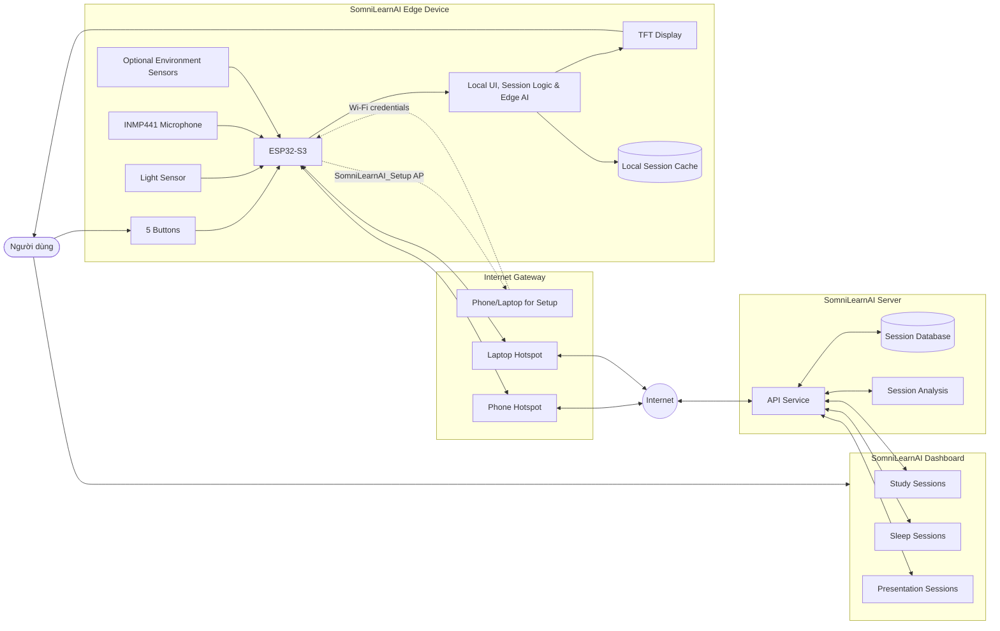
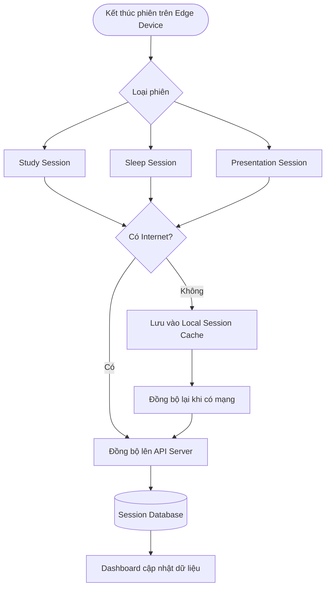

# 02. Architecture & Hardware

## 2.1. Architecture

SomniLearnAI được thiết kế theo mô hình AIoT gồm 3 thành phần chính:

* **Edge Device:** thiết bị SomniLearnAI đặt tại bàn học, bàn làm việc hoặc phòng ngủ của người dùng.
* **Server:** hệ thống API tiếp nhận, lưu trữ và xử lý dữ liệu phiên.
* **Dashboard:** giao diện web giúp người dùng quản lý phiên học, phiên ngủ và phiên thuyết trình.

Trong mô hình này, Edge Device chịu trách nhiệm tương tác trực tiếp với người dùng thông qua màn hình TFT, 5 nút vật lý và các cảm biến. Server đóng vai trò tiếp nhận dữ liệu, lưu lịch sử, hỗ trợ phân tích và cung cấp API cho dashboard. Dashboard là thành phần chính của Objective 3, giúp người dùng quan sát dữ liệu dài hạn thay vì chỉ xem kết quả ngay trên thiết bị.

### 2.1.1. Edge-Server-Dashboard Communication

SomniLearnAI có thể kết nối với Server thông qua Internet. Vì Edge Device không phải lúc nào cũng được đặt trong môi trường có Wi-Fi cố định, thiết bị có thể truy cập Internet thông qua điện thoại hoặc laptop bằng cách sử dụng hotspot.

Quá trình kết nối có thể chia thành 2 pha:

* **Setup / Provisioning Mode:** SomniLearnAI Edge Device phát một Wi-Fi tạm thời, ví dụ `SomniLearnAI_Setup`. Người dùng dùng điện thoại hoặc laptop kết nối vào Wi-Fi này để nhập thông tin mạng.
* **Online Mode:** Sau khi nhận cấu hình, SomniLearnAI ngắt mạng setup và kết nối vào Wi-Fi hoặc hotspot của điện thoại/laptop để truy cập Internet, đồng bộ dữ liệu phiên và giao tiếp với Server.

Luồng kết nối tổng quát:

```text
Phone/Laptop <-> SomniLearnAI_Setup AP
SomniLearnAI Edge Device <-> Phone/Laptop Hotspot <-> Internet <-> SomniLearnAI Server <-> Dashboard
```

Trong đó:

* Điện thoại hoặc laptop được dùng làm điểm phát Wi-Fi tạm thời.
* SomniLearnAI có thể tự phát Wi-Fi setup để người dùng cấu hình tên mạng và mật khẩu.
* SomniLearnAI kết nối vào mạng Wi-Fi đó như một thiết bị client.
* Khi đã có Internet, SomniLearnAI có thể gửi dữ liệu phiên học, phiên ngủ và phiên thuyết trình lên Server.
* Nếu không có Internet, Pomodoro, Sleep Monitoring và hiển thị realtime môi trường vẫn có thể hoạt động cục bộ; Seminar Practice chỉ ghi nhận/lưu tạm phiên và cần Server để chấm điểm đầy đủ.

### 2.1.2. Architecture Diagram



### 2.1.3. Data Flow

| Step | Description |
| ---- | ----------- |
| 1 | Người dùng thao tác bằng 5 nút vật lý trên SomniLearnAI. |
| 2 | ESP32-S3 xử lý thao tác, cập nhật giao diện TFT và điều khiển chức năng cục bộ. |
| 3 | Cảm biến ánh sáng, microphone và cảm biến môi trường ghi nhận dữ liệu khi dùng Study Mode hoặc Sleep Mode. |
| 4 | Thiết bị tạo dữ liệu phiên học, phiên ngủ hoặc phiên thuyết trình sau khi phiên kết thúc. |
| 5 | Nếu chưa có cấu hình mạng, SomniLearnAI bật Wi-Fi setup để điện thoại hoặc laptop kết nối vào và nhập thông tin Wi-Fi. |
| 6 | Khi online, Edge Device gửi dữ liệu phiên lên Server. |
| 7 | Server validate dữ liệu, lưu vào Session Database và tạo dữ liệu tổng hợp cho dashboard. |
| 8 | Dashboard lấy dữ liệu từ API để hiển thị số Pomodoro, tổng kết giấc ngủ theo tháng và điểm các lần thuyết trình. |

### 2.1.4. Session Synchronization Flow



### 2.1.5. Offline and Online Behavior

| Mode | Behavior |
| ---- | -------- |
| Offline | Pomodoro, Sleep Monitoring, hiển thị giờ và realtime môi trường vẫn hoạt động cục bộ; Seminar Practice có thể ghi nhận/lưu tạm phiên nhưng chưa chấm điểm đầy đủ. |
| Online | Thiết bị có thể đồng bộ phiên học, ngủ, thuyết trình lên Server; dashboard cập nhật lịch sử, biểu đồ và tổng kết. |

---

## 2.2. Hardware

SomniLearnAI sử dụng các thành phần phần cứng phổ biến, chi phí tương đối thấp và dễ tìm trên thị trường linh kiện điện tử. Bảng dưới đây mô tả các thành phần chính và giá ước lượng cho phiên bản prototype theo objective mới.

| Component | Quantity | Availability | Interface | Purpose | Estimated Price (VND) |
| --------- | -------- | ------------ | --------- | ------- | --------------------- |
| ESP32-S3 DevKitC-1 (N8R8) | 1 | Mua thêm | Wi-Fi, I2S, SPI, I2C | MCU chính, chạy UI, quản lý phiên, Edge AI cơ bản và đồng bộ dữ liệu lên Server | 150,000 - 220,000 |
| TFT LCD 2.4" ILI9341 | 1 | Có sẵn | SPI | Hiển thị HOME, STUDY, SLEEP, STATUS, giờ hiện tại, Pomodoro, trạng thái chấm điểm thuyết trình và môi trường realtime | 80,000 - 120,000 |
| INMP441 MEMS Microphone | 1 | Có sẵn | I2S | Đo tiếng ồn môi trường khi ngủ và ghi dữ liệu âm thanh cho Seminar Practice để Server xử lý | 40,000 - 55,000 |
| Cảm biến ánh sáng BH1750 | 1 | Có sẵn | I2C hoặc ADC | Đo mức ánh sáng khi học hoặc ngủ, hỗ trợ phát hiện phòng quá sáng | 15,000 - 30,000 |
| Cảm biến môi trường DHT22/SHT31/BME280 | 1 | Tùy chọn | I2C hoặc GPIO | Đo nhiệt độ, độ ẩm và hỗ trợ phân tích tác nhân ảnh hưởng giấc ngủ | 40,000 - 120,000 |
| Cảm biến CO2 SCD40/MH-Z19B | 1 | Tùy chọn | I2C hoặc UART | Đo CO2 phòng ngủ nếu prototype mở rộng môi trường ngủ | 180,000 - 450,000 |
| Nút nhấn tactile 12x12mm | 5 | Có sẵn 3 nút, mua thêm 2 nút | GPIO Digital | Điều hướng Home, Study, Sleep, Status và cấu hình phiên | 5,000/nút; mua thêm khoảng 10,000 |
| Buzzer passive 5V | 1 | Mua thêm | GPIO PWM | Thông báo kết thúc Pomodoro, kết thúc phiên nghỉ hoặc cảnh báo môi trường đơn giản | 8,000 |
| DS3231 RTC Module (kèm pin) | 1 | Mua thêm | I2C | Cung cấp thời gian ổn định, timestamp phiên học/ngủ/thuyết trình và đồng bộ thời gian khi offline | 35,000 |
| MicroSD Card Module hoặc Flash Storage | 1 | Tùy chọn | SPI hoặc internal flash | Lưu tạm dữ liệu phiên khi offline trước khi đồng bộ Server | 0 - 25,000 |
| Pin LiPo 3.7V 1000mAh + TP4056 | 1 | Mua thêm | Power | Nguồn di động tùy chọn cho toàn thiết bị | 60,000 |

### Estimated Total Cost

| Cost Type | Estimated Range |
| --------- | --------------- |
| Core prototype components | Approximately 388,000 - 508,000 VND |
| Optional environment expansion | Approximately 220,000 - 570,000 VND |

Giá trên chỉ mang tính ước lượng cho phiên bản prototype. Chi phí thực tế có thể thay đổi tùy theo nhà cung cấp, chất lượng linh kiện, kích thước màn hình TFT, loại vỏ thiết bị và số lượng sản xuất.

---

## 2.3. Hardware Roles

| Hardware | Role in SomniLearnAI |
| -------- | -------------------- |
| ESP32-S3 | Là bộ xử lý trung tâm của Edge Device, chịu trách nhiệm chạy giao diện, đọc nút bấm, đọc cảm biến, quản lý phiên, chạy Edge AI cơ bản và kết nối Internet. |
| TFT Display | Cung cấp giao diện trực quan cho người dùng, bao gồm Home, Study, Sleep và Status Screen. |
| 5 Buttons | Cho phép người dùng điều khiển thiết bị mà không cần điện thoại, giúp giảm xao nhãng trong lúc học. |
| Light Sensor | Hỗ trợ ghi nhận điều kiện ánh sáng trong môi trường học tập hoặc phòng ngủ. |
| INMP441 | Hỗ trợ ghi nhận âm thanh môi trường khi ngủ và dữ liệu luyện thuyết trình để gửi Server khi cần chấm điểm. |
| Environment Sensors | Hỗ trợ phát hiện tác nhân làm giấc ngủ không ngon như nhiệt độ, độ ẩm hoặc CO2 chưa phù hợp. |
| DS3231 RTC | Giữ thời gian ổn định khi offline và cung cấp timestamp cho các phiên. |
| Local Storage | Lưu tạm session khi thiết bị chưa có Internet. |
| Buzzer | Phát tín hiệu thông báo Pomodoro hoặc cảnh báo trạng thái đơn giản. |

---

## 2.4. Design Considerations

Thiết kế phần cứng của SomniLearnAI ưu tiên các yếu tố sau:

* **Tối giản:** Người dùng thao tác bằng 5 nút vật lý, không cần mở điện thoại trong quá trình học hoặc ngủ.
* **Hiển thị realtime:** Màn hình TFT phải hiển thị giờ hiện tại, thời gian Pomodoro, trạng thái phiên và môi trường xung quanh.
* **Chi phí hợp lý:** Các linh kiện lõi được chọn theo tiêu chí phổ biến, dễ mua và phù hợp với prototype.
* **Khả năng mở rộng:** ESP32-S3 có thể kết nối Wi-Fi và giao tiếp với nhiều module cảm biến môi trường.
* **Hoạt động linh hoạt:** SomniLearnAI vẫn dùng được các chức năng cơ bản khi offline và có thể đồng bộ dữ liệu khi online.
* **Dữ liệu dài hạn:** Thiết kế cần hỗ trợ lưu tạm và đồng bộ các phiên lên dashboard để phục vụ Objective 3.
