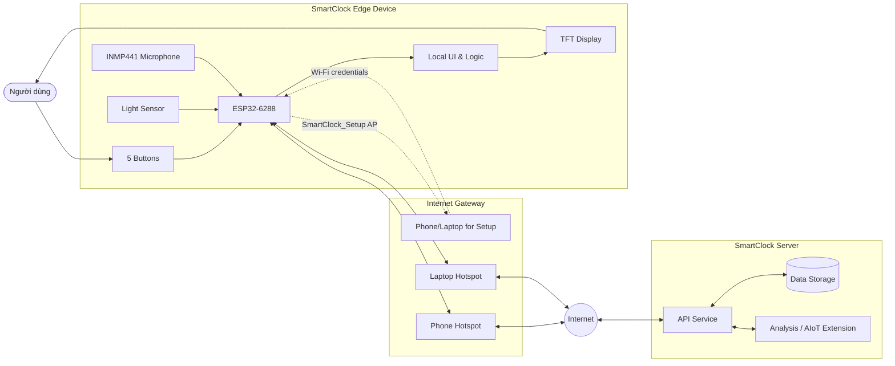

# 02. Architecture & Hardware

## 2.1. Architecture

SmartClock được thiết kế theo mô hình AIoT gồm 2 thành phần chính:

* **Edge Device:** thiết bị SmartClock đặt tại bàn học, bàn làm việc hoặc phòng ngủ của người dùng.
* **Server:** hệ thống xử lý, lưu trữ và mở rộng các chức năng thông minh trong tương lai.

Trong mô hình này, Edge Device chịu trách nhiệm tương tác trực tiếp với người dùng thông qua màn hình TFT, 5 nút vật lý và các cảm biến. Server đóng vai trò tiếp nhận dữ liệu, lưu lịch sử, hỗ trợ phân tích và cung cấp khả năng mở rộng cho các chức năng AIoT.

### 2.1.1. Edge-Server Communication

SmartClock có thể kết nối với Server thông qua Internet. Vì Edge Device không phải lúc nào cũng được đặt trong môi trường có Wi-Fi cố định, thiết bị có thể truy cập Internet thông qua điện thoại hoặc laptop bằng cách sử dụng hotspot.

Quá trình kết nối có thể chia thành 2 pha:

* **Setup / Provisioning Mode:** SmartClock Edge Device phát một Wi-Fi tạm thời, ví dụ `SmartClock_Setup`. Người dùng dùng điện thoại hoặc laptop kết nối vào Wi-Fi này để nhập thông tin mạng.
* **Online Mode:** Sau khi nhận cấu hình, SmartClock ngắt mạng setup và kết nối vào Wi-Fi hoặc hotspot của điện thoại/laptop để truy cập Internet và giao tiếp với Server.

Luồng kết nối tổng quát:

```text
Phone/Laptop ↔ SmartClock_Setup AP
SmartClock Edge Device ↔ Phone/Laptop Hotspot ↔ Internet ↔ SmartClock Server
```

Trong đó:

* Điện thoại hoặc laptop được dùng làm điểm phát Wi-Fi tạm thời.
* SmartClock có thể tự phát Wi-Fi setup để người dùng cấu hình tên mạng và mật khẩu.
* SmartClock kết nối vào mạng Wi-Fi đó như một thiết bị client.
* Khi đã có Internet, SmartClock có thể gửi dữ liệu lên Server hoặc nhận cấu hình từ Server.
* Nếu không có Internet, các chức năng cục bộ như Pomodoro, báo thức, game hoặc hiển thị màn hình vẫn có thể hoạt động ở mức cơ bản.

### 2.1.2. Architecture Diagram



### 2.1.3. Data Flow

| Step | Description |
| ---- | ----------- |
| 1 | Người dùng thao tác bằng 5 nút vật lý trên SmartClock. |
| 2 | ESP32-6288 xử lý thao tác, cập nhật giao diện TFT và điều khiển chức năng cục bộ. |
| 3 | Cảm biến ánh sáng và INMP441 ghi nhận dữ liệu môi trường khi cần. |
| 4 | Nếu chưa có cấu hình mạng, SmartClock bật Wi-Fi setup để điện thoại hoặc laptop kết nối vào và nhập thông tin Wi-Fi. |
| 5 | SmartClock kết nối Internet thông qua Wi-Fi hotspot từ điện thoại hoặc laptop. |
| 6 | Edge Device gửi dữ liệu hoặc nhận cấu hình từ Server. |
| 7 | Server lưu trữ, phân tích và cung cấp nền tảng mở rộng cho các tính năng AIoT. |

### 2.1.4. Offline and Online Behavior

| Mode | Behavior |
| ---- | -------- |
| Offline | Pomodoro, báo thức, điều hướng menu, Flappy Bird và một số chức năng hiển thị vẫn hoạt động cục bộ. |
| Online | Thiết bị có thể đồng bộ cấu hình, gửi dữ liệu theo dõi, lưu lịch sử và mở rộng các chức năng phân tích. |

---

## 2.2. Hardware

SmartClock sử dụng các thành phần phần cứng phổ biến, chi phí tương đối thấp và dễ tìm trên thị trường linh kiện điện tử. Bảng dưới đây mô tả các thành phần chính và giá ước lượng.

| Component | Quantity | Availability | Interface | Purpose | Estimated Price (VND) |
| --------- | -------- | ------------ | --------- | ------- | --------------------- |
| ESP32-S3 DevKitC-1 (N8R8) | 1 | Mua thêm | Wi-Fi, I2S, SPI, I2C | MCU chính, TinyML/Edge AI, đồng bộ Firebase và điều phối các module I2S/SPI | 150,000 - 220,000 |
| TFT LCD 2.4" ILI9341 | 1 | Có sẵn | SPI | Hiển thị toàn bộ UI cho HOME, STUDY, SLEEP và RELAX | 80,000 - 120,000 |
| INMP441 MEMS Microphone | 1 | Có sẵn | I2S | Đo âm thanh môi trường, ghi âm Seminar Practice và theo dõi noise khi ngủ | 40,000 - 55,000 |
| Cảm biến ánh sáng BH1750 | 1 | Có sẵn | I2C hoặc ADC | Đo light level/quality và kiểm tra phòng tối trước khi ngủ | 15,000 - 30,000 |
| Nút nhấn tactile 12x12mm | 5 | Có sẵn 3 nút, mua thêm 2 nút | GPIO Digital | Điều hướng toàn bộ state machine và cấu hình các chức năng | 5,000/nút; mua thêm khoảng 10,000 |
| Buzzer passive 5V | 1 | Mua thêm | GPIO PWM | Báo Pomodoro, báo thức Sleep và âm thanh game | 8,000 |
| MAX98357A I2S Amp + Loa 0.5W | 1 set | Mua thêm | I2S | Phát nhạc MP3/WAV trong RELAX Music Player | 35,000 - 60,000 |
| DS3231 RTC Module (kèm pin) | 1 | Mua thêm | I2C | Kích hoạt báo thức, timestamp Pomodoro và đồng bộ thời gian | 35,000 |
| MicroSD Card Module | 1 | Mua thêm | SPI | Lưu file nhạc MP3/WAV cho Music Player | 25,000 |
| Pin LiPo 3.7V 1000mAh + TP4056 | 1 | Mua thêm | Power | Nguồn di động tùy chọn cho toàn thiết bị | 60,000 |

### Estimated Total Cost

| Cost Type | Estimated Range |
| --------- | --------------- |
| Required additional components | Approximately 418,000 VND |

Giá trên chỉ mang tính ước lượng cho phiên bản prototype. Chi phí thực tế có thể thay đổi tùy theo nhà cung cấp, chất lượng linh kiện, kích thước màn hình TFT, loại vỏ thiết bị và số lượng sản xuất.

---

## 2.3. Hardware Roles

| Hardware | Role in SmartClock |
| -------- | ------------------ |
| ESP32-6288 | Là bộ xử lý trung tâm của Edge Device, chịu trách nhiệm chạy luồng giao diện, đọc nút bấm, đọc cảm biến và kết nối Internet. |
| TFT Display | Cung cấp giao diện trực quan cho người dùng, bao gồm Home, Study, Sleep và Relax Mode. |
| 5 Buttons | Cho phép người dùng điều khiển thiết bị mà không cần điện thoại, giúp giảm xao nhãng. |
| Light Sensor | Hỗ trợ ghi nhận điều kiện ánh sáng trong môi trường học tập hoặc nghỉ ngơi. |
| INMP441 | Hỗ trợ ghi nhận âm thanh môi trường và có thể mở rộng cho chức năng luyện tập thuyết trình. |

---

## 2.4. Design Considerations

Thiết kế phần cứng của SmartClock ưu tiên các yếu tố sau:

* **Tối giản:** Người dùng thao tác bằng 5 nút vật lý, không cần mở điện thoại trong quá trình sử dụng.
* **Chi phí hợp lý:** Các linh kiện được chọn theo tiêu chí phổ biến, dễ mua và phù hợp với prototype.
* **Khả năng mở rộng:** ESP32-6288 có thể kết nối Wi-Fi và giao tiếp với nhiều module cảm biến khác.
* **Tính thực tiễn:** Thiết bị có thể đặt trên bàn học, bàn làm việc hoặc đầu giường.
* **Hoạt động linh hoạt:** SmartClock vẫn dùng được các chức năng cơ bản khi offline và có thể mở rộng khi online.
