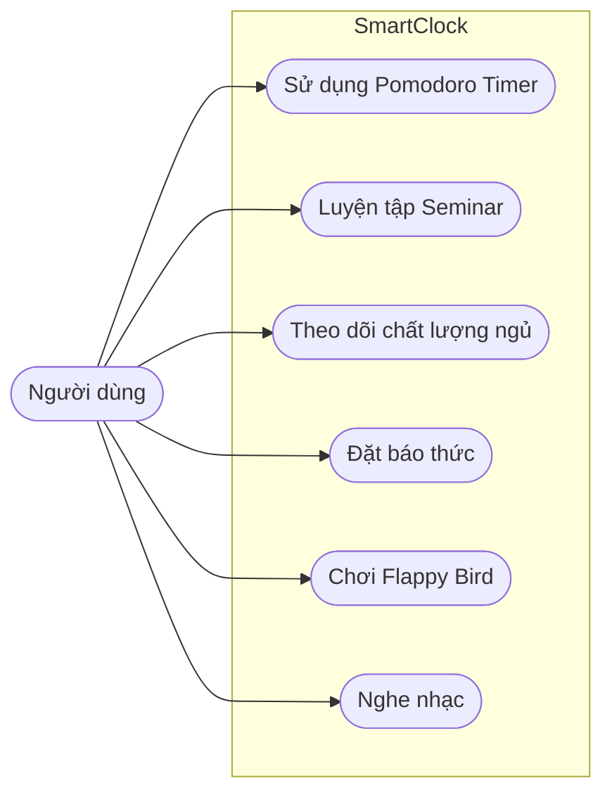
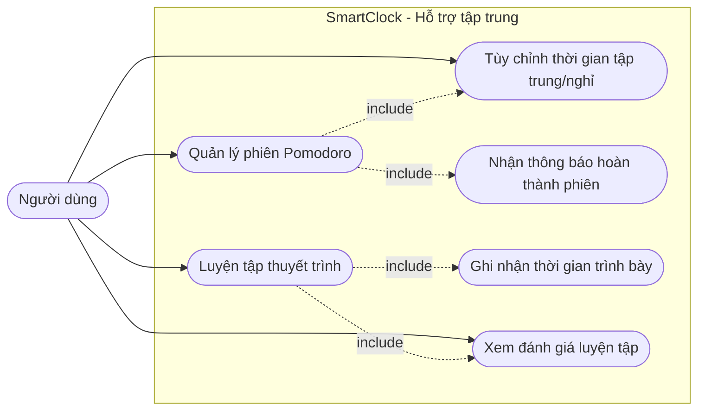
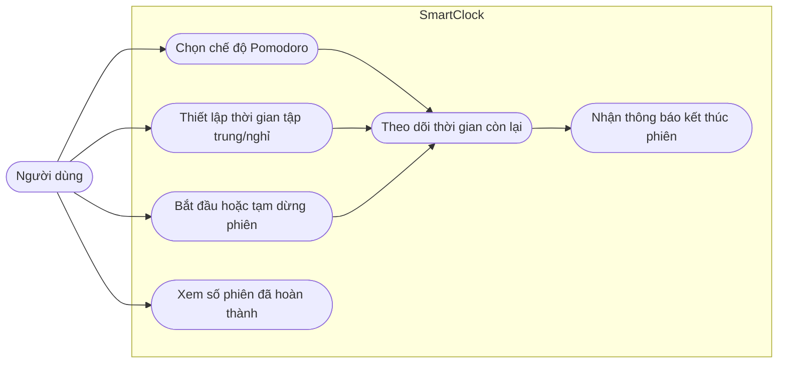
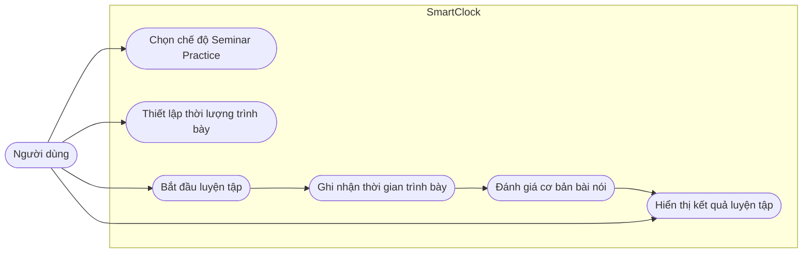
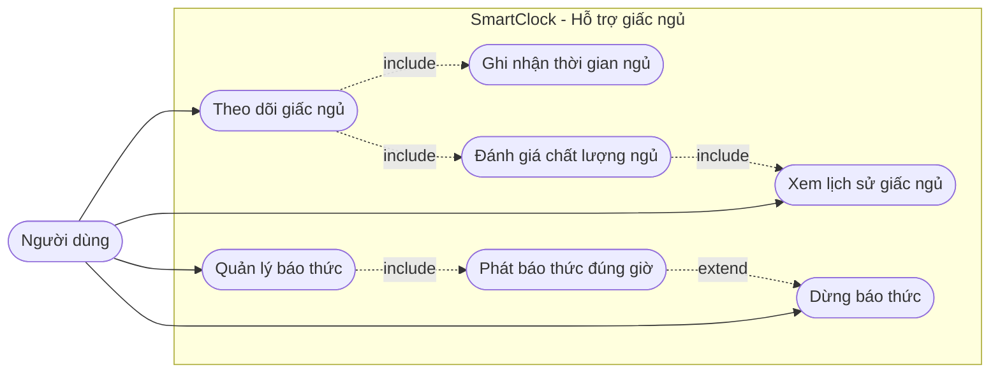
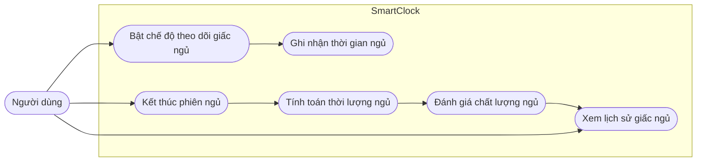
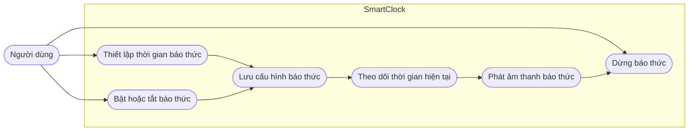
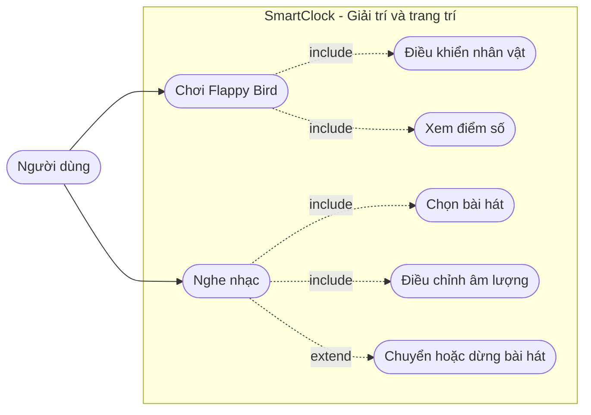
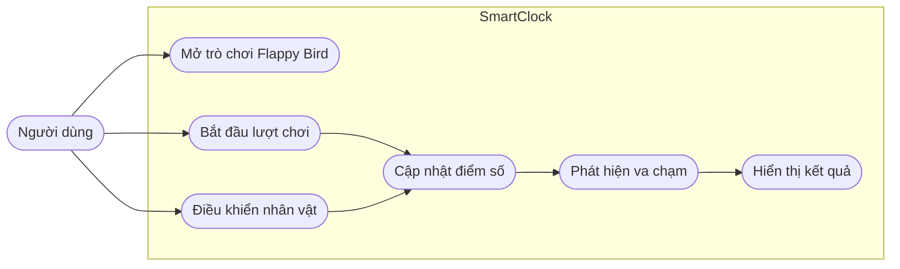
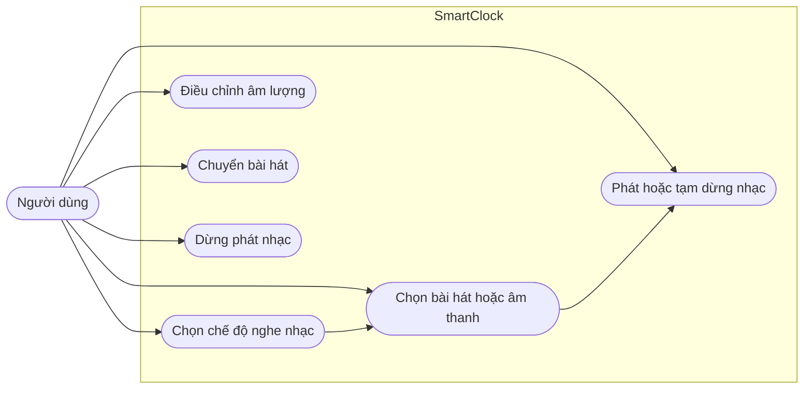

# 03. Objectives

## 3.1. Overview

SmartClock được phát triển với mục tiêu trở thành một thiết bị hỗ trợ cá nhân đa chức năng, hướng đến việc nâng cao chất lượng học tập, làm việc và sinh hoạt hằng ngày của người dùng. Thay vì chỉ hoạt động như một chiếc đồng hồ thông thường, SmartClock được định hướng là một thiết bị thông minh có khả năng hỗ trợ tập trung, cải thiện giấc ngủ và tạo trải nghiệm giải trí nhẹ nhàng trong không gian cá nhân.

Các mục tiêu chính của dự án bao gồm:

* Hỗ trợ người dùng nâng cao khả năng tập trung và tối ưu hiệu suất làm việc.
* Hỗ trợ xây dựng thói quen nghỉ ngơi và cải thiện chất lượng giấc ngủ.
* Tạo ra một thiết bị công nghệ nhỏ gọn có khả năng giải trí và trang trí góc học tập hoặc làm việc.

### Overall Use Case Diagram

---

# 3.2. Objective 1: Hỗ trợ người sử dụng làm việc tập trung hơn

Một trong những mục tiêu quan trọng nhất của SmartClock là hỗ trợ người dùng duy trì trạng thái tập trung trong quá trình học tập và làm việc. Hệ thống được thiết kế nhằm giảm thiểu sự phụ thuộc vào điện thoại thông minh và hạn chế các yếu tố gây xao nhãng trong môi trường làm việc.

### Objective 1 Use Case Diagram

---

## 3.2.1. Use-Case 1: Pomodoro Timer

Pomodoro là một phương pháp quản lý thời gian nổi tiếng được phát triển nhằm giúp người dùng duy trì sự tập trung trong thời gian dài. Phương pháp này chia thời gian làm việc thành các phiên ngắn, phổ biến nhất là:

* 25 phút tập trung làm việc
* 5 phút nghỉ ngơi

Sau nhiều chu kỳ liên tiếp, người dùng sẽ có một khoảng nghỉ dài hơn để giúp não bộ hồi phục và duy trì hiệu suất làm việc ổn định.

SmartClock tích hợp tính năng Pomodoro Timer nhằm hỗ trợ người dùng xây dựng thói quen học tập và làm việc hiệu quả hơn. Hệ thống cho phép người dùng tùy chỉnh thời gian tập trung và nghỉ ngơi phù hợp với nhu cầu cá nhân thay vì cố định theo cấu hình mặc định.

### Main Features

* Bắt đầu hoặc tạm dừng phiên Pomodoro.
* Tùy chỉnh thời gian tập trung và nghỉ ngơi.
* Hiển thị thời gian còn lại theo thời gian thực.
* Phát tín hiệu thông báo khi kết thúc phiên làm việc hoặc nghỉ ngơi.
* Theo dõi số lượng phiên Pomodoro đã hoàn thành.

### Use Case

| Actor           | User                                                                                                                                     |
| --------------- | ---------------------------------------------------------------------------------------------------------------------------------------- |
| Goal            | Tập trung học tập hoặc làm việc hiệu quả hơn                                                                                             |
| Preconditions   | Thiết bị đã được bật                                                                                                                     |
| Main Flow       | Người dùng chọn chế độ Pomodoro → thiết lập thời gian → bắt đầu phiên tập trung → hệ thống đếm thời gian → phát thông báo khi hoàn thành |
| Expected Result | Người dùng duy trì được trạng thái tập trung trong thời gian làm việc                                                                    |

### Use Case Diagram

---

## 3.2.2. Use-Case 2: Seminar Practice

Bên cạnh khả năng hỗ trợ tập trung, SmartClock còn hướng đến việc hỗ trợ người dùng cải thiện kỹ năng thuyết trình và giao tiếp.

Tính năng Seminar Practice cho phép người dùng luyện tập thuyết trình trước thiết bị. Hệ thống sẽ hỗ trợ ghi nhận thời gian trình bày và trong tương lai có thể mở rộng thêm khả năng đánh giá tốc độ nói, độ rõ ràng hoặc mức độ tự tin khi thuyết trình.

Tính năng này đặc biệt phù hợp với sinh viên hoặc người thường xuyên phải trình bày seminar, báo cáo hoặc pitching ý tưởng.

### Main Features

* Hỗ trợ đo thời gian thuyết trình.
* Ghi nhận thời lượng trình bày.
* Hỗ trợ đánh giá cơ bản về bài nói.
* Hỗ trợ luyện tập cá nhân.

### Use Case

| Actor           | User                                                                                                                           |
| --------------- | ------------------------------------------------------------------------------------------------------------------------------ |
| Goal            | Luyện tập kỹ năng thuyết trình                                                                                                 |
| Preconditions   | Thiết bị hoạt động bình thường                                                                                                 |
| Main Flow       | Người dùng chọn chế độ Seminar Practice → bắt đầu trình bày → hệ thống ghi nhận dữ liệu → hiển thị đánh giá sau khi hoàn thành |
| Expected Result | Người dùng cải thiện khả năng trình bày và quản lý thời gian nói                                                               |

### Use Case Diagram

---

# 3.3. Objective 2: Hỗ trợ người sử dụng ngủ ngon hơn

Ngoài việc hỗ trợ năng suất làm việc, SmartClock còn hướng đến việc cải thiện chất lượng nghỉ ngơi và giấc ngủ của người dùng. Một giấc ngủ tốt giúp nâng cao sức khỏe tinh thần, khả năng tập trung và hiệu suất học tập hoặc làm việc trong ngày hôm sau.

### Objective 2 Use Case Diagram

---

## 3.3.1. Use-Case 1: Quan sát và đánh giá chất lượng ngủ

SmartClock có thể hỗ trợ người dùng quan sát thói quen ngủ thông qua việc ghi nhận thời gian đi ngủ, thời gian thức dậy và tổng thời lượng nghỉ ngơi. Dựa trên dữ liệu được ghi nhận, hệ thống hiển thị đánh giá cơ bản để người dùng nhận biết xu hướng giấc ngủ của mình theo từng ngày.

Đây là một tính năng Edge AI của SmartClock. Thiết bị có thể sử dụng một kỹ thuật Machine Learning để xây dựng mô hình đánh giá chất lượng ngủ ngay trên edge device hoặc kết hợp với server khi cần đồng bộ. Input của mô hình bao gồm thời gian ngủ, chất lượng ánh sáng theo thời gian, chất lượng môi trường ngủ theo thời gian, chất lượng âm thanh theo thời gian và các dữ liệu cảm biến liên quan khác. Output của mô hình là điểm số đánh giá chất lượng ngủ, nhận định giấc ngủ có tốt hay không, phân tích nguyên nhân khiến người dùng ngủ không ngon như phòng quá sáng, môi trường quá ồn hoặc thời lượng ngủ chưa phù hợp, đồng thời đưa ra gợi ý cải thiện cho các lần ngủ tiếp theo.

Tính năng này hướng đến việc giúp người dùng hình thành thói quen ngủ lành mạnh hơn, đồng thời tạo nền tảng để mở rộng các chức năng AIoT như phân tích môi trường phòng ngủ, nhắc nhở giờ đi ngủ hoặc đề xuất lịch nghỉ ngơi phù hợp.

### Main Features

* Ghi nhận thời gian bắt đầu và kết thúc giấc ngủ.
* Tính toán tổng thời lượng ngủ.
* Hiển thị đánh giá cơ bản về chất lượng ngủ.
* Theo dõi lịch sử giấc ngủ theo ngày.
* Gợi ý điều chỉnh thói quen nghỉ ngơi.

### Use Case

| Actor           | User                                                                                                                              |
| --------------- | --------------------------------------------------------------------------------------------------------------------------------- |
| Goal            | Theo dõi và cải thiện chất lượng giấc ngủ                                                                                         |
| Preconditions   | Thiết bị đang hoạt động và người dùng đã chọn chế độ theo dõi giấc ngủ                                                            |
| Main Flow       | Người dùng bật chế độ theo dõi giấc ngủ → hệ thống ghi nhận thời gian ngủ → người dùng kết thúc phiên ngủ → hệ thống hiển thị kết quả |
| Expected Result | Người dùng nắm được thời lượng và đánh giá cơ bản về giấc ngủ để điều chỉnh thói quen sinh hoạt                                   |

### Use Case Diagram

---

## 3.3.2. Use-Case 2: Đặt báo thức

SmartClock tích hợp chức năng báo thức tương tự như các thiết bị đồng hồ hoặc điện thoại thông minh hiện nay. Người dùng có thể thiết lập thời gian báo thức nhằm hỗ trợ quản lý lịch sinh hoạt và xây dựng thói quen thức dậy đúng giờ.

Hệ thống được thiết kế với giao diện đơn giản và dễ sử dụng, phù hợp với nhu cầu sử dụng hằng ngày.

### Main Features

* Thiết lập thời gian báo thức.
* Bật hoặc tắt báo thức.
* Phát âm thanh thông báo khi đến giờ.
* Hỗ trợ nhiều mốc báo thức khác nhau.

### Use Case

| Actor           | User                                                                                                                      |
| --------------- | ------------------------------------------------------------------------------------------------------------------------- |
| Goal            | Thức dậy đúng giờ                                                                                                         |
| Preconditions   | Thiết bị đang hoạt động                                                                                                   |
| Main Flow       | Người dùng thiết lập thời gian báo thức → hệ thống lưu cấu hình → đến thời gian cài đặt → thiết bị phát âm thanh báo thức |
| Expected Result | Người dùng nhận được thông báo đúng thời gian mong muốn                                                                   |

### Use Case Diagram

---

# 3.4. Objective 3: Hỗ trợ người dùng giải trí và trang trí góc làm việc

Bên cạnh các chức năng hỗ trợ học tập và sinh hoạt, SmartClock còn được định hướng trở thành một thiết bị có tính giải trí và tính thẩm mỹ, giúp không gian học tập hoặc làm việc trở nên sinh động hơn.

### Objective 3 Use Case Diagram

---

## 3.4.1. Use-Case 1: Game Flappy Bird

SmartClock tích hợp một trò chơi mini lấy cảm hứng từ các thiết bị chơi game cầm tay đời cũ. Trò chơi Flappy Bird được xây dựng nhằm tạo ra các khoảng giải trí ngắn sau thời gian học tập hoặc làm việc căng thẳng.

Tính năng này giúp thiết bị trở nên thú vị hơn và tăng tính tương tác với người dùng.

### Main Features

* Điều khiển nhân vật đơn giản.
* Hiển thị điểm số.
* Tạo trải nghiệm giải trí nhanh.
* Giao diện mang phong cách retro.

### Use Case

| Actor           | User                                                                                            |
| --------------- | ----------------------------------------------------------------------------------------------- |
| Goal            | Giải trí trong thời gian nghỉ ngơi                                                              |
| Preconditions   | Thiết bị đang hoạt động                                                                         |
| Main Flow       | Người dùng mở trò chơi → điều khiển nhân vật → hệ thống cập nhật điểm số → kết thúc khi va chạm |
| Expected Result | Người dùng có trải nghiệm giải trí nhẹ nhàng                                                    |

### Use Case Diagram

---

## 3.4.2. Use-Case 2: Listening to Music

SmartClock hỗ trợ phát nhạc nhằm tạo không gian thư giãn hoặc hỗ trợ tập trung khi học tập và làm việc. Tính năng này được lấy cảm hứng từ các thiết bị nghe nhạc cổ điển với trải nghiệm đơn giản và dễ sử dụng.

Trong tương lai, tính năng này có thể được mở rộng để hỗ trợ nhiều chế độ âm thanh hoặc kết nối với các nền tảng phát nhạc trực tuyến.

### Main Features

* Phát nhạc cơ bản.
* Điều chỉnh âm lượng.
* Chuyển bài hát.
* Hỗ trợ âm thanh thư giãn hoặc nhạc tập trung.

### Use Case

| Actor           | User                                                                     |
| --------------- | ------------------------------------------------------------------------ |
| Goal            | Nghe nhạc để thư giãn hoặc tập trung                                     |
| Preconditions   | Thiết bị hoạt động bình thường                                           |
| Main Flow       | Người dùng chọn chế độ nghe nhạc → chọn bài hát → hệ thống phát âm thanh |
| Expected Result | Người dùng có trải nghiệm thư giãn tốt hơn                               |

### Use Case Diagram

---

# 3.5. Conclusion

Thông qua các mục tiêu và chức năng đã được trình bày, SmartClock không chỉ là một thiết bị đồng hồ thông thường mà còn là một sản phẩm hỗ trợ phong cách sống hiện đại, tập trung vào năng suất cá nhân và trải nghiệm người dùng.

Dự án hướng đến việc kết hợp giữa tính hữu ích, tính giải trí và tính thẩm mỹ trong cùng một thiết bị nhỏ gọn. Đồng thời, SmartClock cũng tạo nền tảng để mở rộng thêm nhiều tính năng AIoT thông minh hơn trong tương lai.

## 3.5.1. Use Case Summary

| Objective | Use Case | Main Actor | Main Purpose | Expected Result |
| --------- | -------- | ---------- | ------------ | --------------- |
| Objective 1: Hỗ trợ tập trung | Pomodoro Timer | User | Quản lý phiên tập trung và nghỉ ngơi | Người dùng duy trì nhịp học tập hoặc làm việc hiệu quả hơn |
| Objective 1: Hỗ trợ tập trung | Seminar Practice | User | Luyện tập thuyết trình và quản lý thời lượng nói | Người dùng cải thiện kỹ năng trình bày và kiểm soát thời gian |
| Objective 2: Hỗ trợ giấc ngủ | Quan sát và đánh giá chất lượng ngủ | User | Theo dõi thời lượng ngủ và nhận đánh giá cơ bản | Người dùng hiểu rõ hơn về thói quen nghỉ ngơi của mình |
| Objective 2: Hỗ trợ giấc ngủ | Đặt báo thức | User | Thiết lập và quản lý thời gian báo thức | Người dùng thức dậy đúng thời gian mong muốn |
| Objective 3: Giải trí và trang trí | Game Flappy Bird | User | Giải trí ngắn trong thời gian nghỉ | Người dùng có trải nghiệm thư giãn nhẹ nhàng |
| Objective 3: Giải trí và trang trí | Listening to Music | User | Phát nhạc thư giãn hoặc nhạc tập trung | Người dùng tạo được không gian học tập, làm việc hoặc nghỉ ngơi phù hợp hơn |
