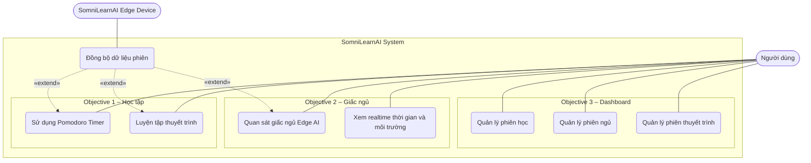
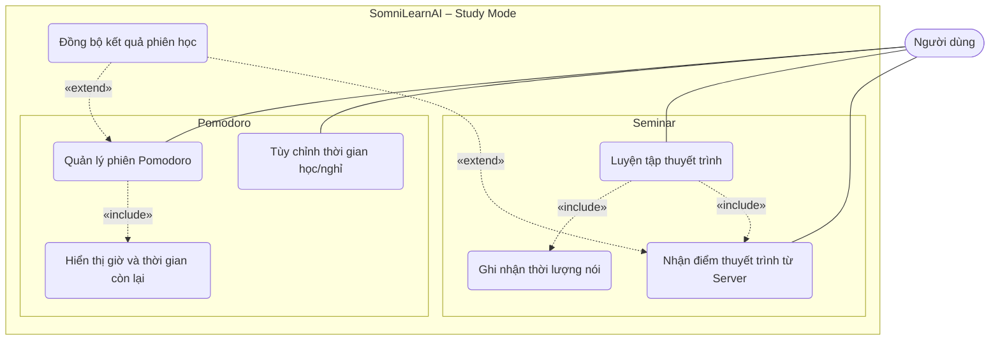
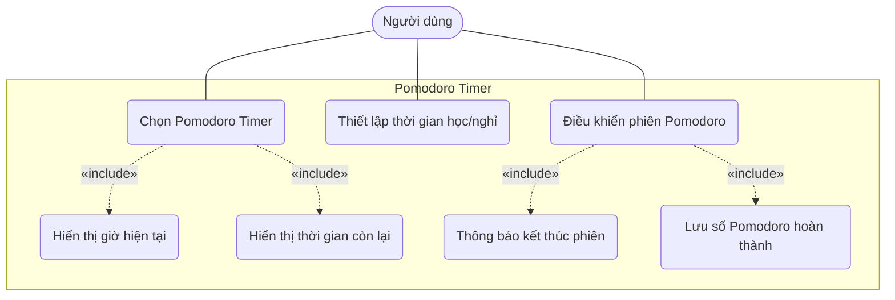
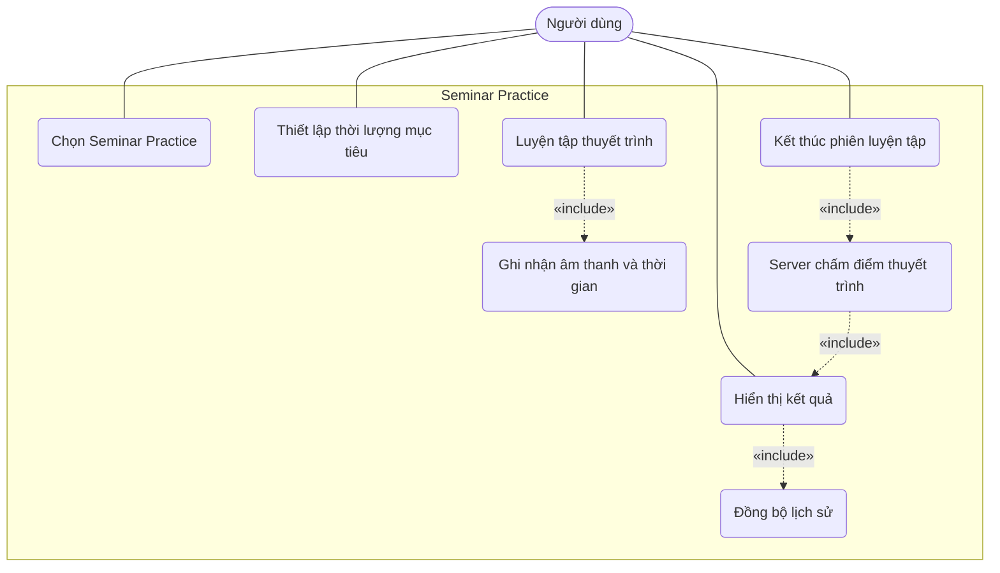
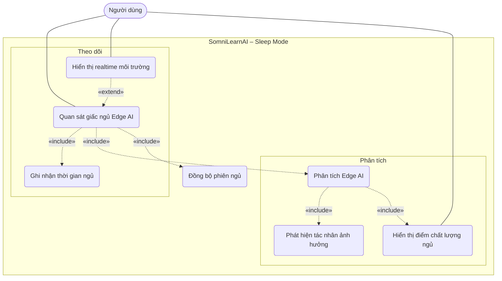
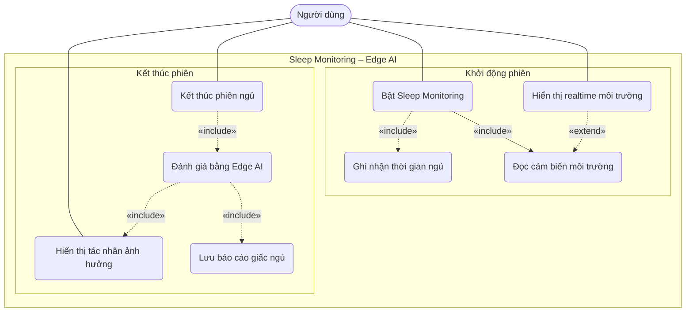
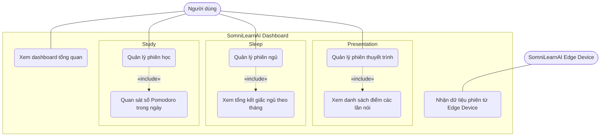
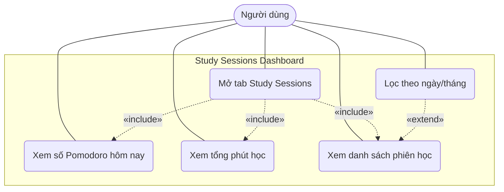
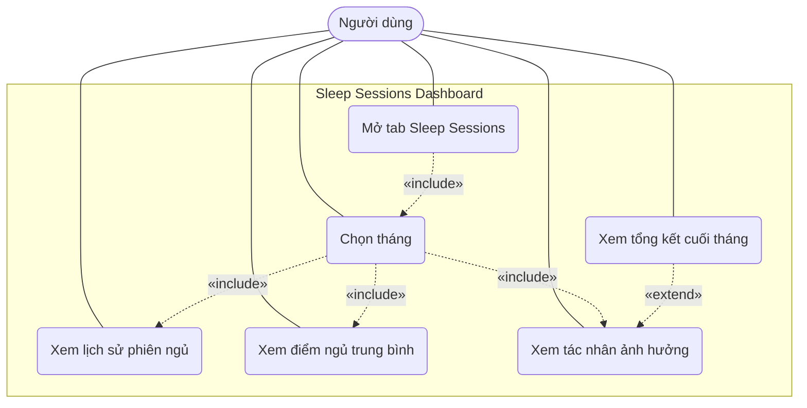
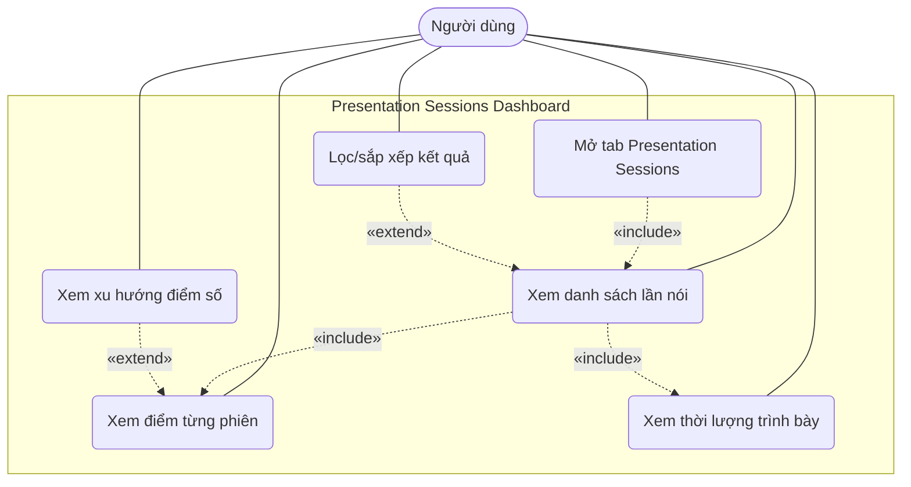

# 03. Objectives

## 3.1. Overview

SomniLearnAI được phát triển với mục tiêu trở thành một đồng hồ thông minh AIoT hỗ trợ người dùng học tập tập trung hơn, luyện tập thuyết trình có phản hồi định lượng, cải thiện giấc ngủ và theo dõi lịch sử các phiên sinh hoạt cá nhân thông qua dashboard.

Sản phẩm tập trung vào 3 objective chính:

* **Objective 1 - Hỗ trợ học tập:** cải thiện khả năng tập trung khi học theo phương pháp Pomodoro, kết hợp luyện tập thuyết trình và nhận điểm chấm từ Server.
* **Objective 2 - Hỗ trợ giấc ngủ:** quan sát giấc ngủ bằng Edge AI, hiển thị realtime môi trường xung quanh và phát hiện các tác nhân làm giấc ngủ không ngon.
* **Objective 3 - Dashboard quản lý phiên:** quản lý lịch sử phiên học, phiên thuyết trình và phiên ngủ để người dùng theo dõi tiến độ dài hạn.

### Overall Use Case Diagram

---

## 3.2. Objective 1: Hỗ trợ học tập theo Pomodoro và luyện tập thuyết trình

## 3.2.1. SMART Objective

SomniLearnAI hỗ trợ cải thiện khả năng tập trung khi học bằng cách cung cấp bộ đếm Pomodoro trực tiếp trên thiết bị, hiển thị giờ hiện tại và thời gian còn lại trên màn hình, đồng thời ghi nhận dữ liệu phiên học để người dùng có thể xem lại trên dashboard. Bên cạnh đó, thiết bị hỗ trợ luyện tập thuyết trình, ghi nhận phiên nói và nhận điểm đánh giá từ Server khi có Wi-Fi.

| SMART factor | Specification |
| ------------ | ------------- |
| Specific | Hỗ trợ người dùng học tập theo Pomodoro và luyện tập thuyết trình bằng thiết bị đặt tại bàn học |
| Measurable | Ghi nhận số Pomodoro hoàn thành, tổng phút tập trung, thời lượng thuyết trình và điểm đánh giá bài nói từ Server |
| Achievable | Sử dụng màn hình TFT, nút vật lý, microphone và xử lý Edge/Server để đếm thời gian, ghi nhận dữ liệu và hiển thị kết quả |
| Relevant | Phù hợp với sinh viên cần giảm xao nhãng khi học và cải thiện kỹ năng trình bày |
| Time-bound | Mỗi phiên học hoặc thuyết trình phải được ghi nhận ngay sau khi kết thúc và có thể xem lại theo ngày trên dashboard |

### Objective 1 Use Case Diagram

---

## 3.2.2. Use-Case 1: Pomodoro Timer

Pomodoro Timer là chức năng cốt lõi của SomniLearnAI trong nhóm hỗ trợ học tập. Người dùng có thể bắt đầu phiên học, tạm dừng, tiếp tục hoặc kết thúc phiên. Màn hình thiết bị phải hiển thị giờ hiện tại, trạng thái phiên, thời gian còn lại và số Pomodoro đã hoàn thành trong ngày.

### Main Features

* Bắt đầu, tạm dừng, tiếp tục và kết thúc phiên Pomodoro.
* Tùy chỉnh thời gian học và thời gian nghỉ.
* Hiển thị realtime giờ hiện tại, thời gian còn lại và trạng thái Study/Break.
* Phát tín hiệu khi kết thúc phiên học hoặc phiên nghỉ.
* Ghi nhận số Pomodoro hoàn thành và tổng thời gian học.
* Đồng bộ phiên học lên dashboard khi có Internet.

### Use Case

| Actor | User |
| ----- | ---- |
| Goal | Duy trì trạng thái tập trung khi học theo phương pháp Pomodoro |
| Preconditions | Thiết bị đã bật, màn hình hoạt động và người dùng đang ở Study Mode |
| Main Flow | Người dùng chọn Pomodoro Timer → thiết lập thời gian nếu cần → bắt đầu phiên học → thiết bị hiển thị giờ và thời gian còn lại realtime → phát thông báo khi kết thúc → lưu phiên học |
| Expected Result | Người dùng hoàn thành phiên học có cấu trúc, biết số Pomodoro trong ngày và có dữ liệu để xem lại |

### Use Case Diagram

---

## 3.2.3. Use-Case 2: Seminar Practice

Seminar Practice hỗ trợ người dùng luyện tập thuyết trình trước thiết bị. SomniLearnAI ghi nhận thời lượng trình bày và dữ liệu âm thanh cần thiết, sau đó gửi lên Server khi có Wi-Fi để chấm điểm bài nói.

### Main Features

* Bắt đầu và kết thúc phiên luyện tập thuyết trình.
* Ghi nhận thời lượng trình bày.
* Lưu tạm phiên thuyết trình khi thiết bị offline.
* Gửi dữ liệu phiên lên Server để chấm điểm khi có Wi-Fi.
* Hiển thị trạng thái chấm điểm, điểm số và nhận xét ngắn sau khi Server xử lý xong.
* Đồng bộ kết quả lên dashboard để theo dõi danh sách các lần nói.

### Use Case

| Actor | User |
| ----- | ---- |
| Goal | Luyện tập và cải thiện kỹ năng thuyết trình |
| Preconditions | Thiết bị hoạt động bình thường, microphone sẵn sàng và người dùng ở Study Mode |
| Main Flow | Người dùng chọn Seminar Practice → bắt đầu luyện tập → thiết bị ghi nhận thời gian và âm thanh → người dùng kết thúc phiên → thiết bị gửi dữ liệu lên Server → Server chấm điểm → dashboard hiển thị kết quả |
| Expected Result | Người dùng biết thời lượng, điểm số và nhận xét sau khi phiên được Server xử lý |

### Use Case Diagram

---

## 3.3. Objective 2: Hỗ trợ cải thiện giấc ngủ bằng Edge AI

## 3.3.1. SMART Objective

SomniLearnAI hỗ trợ cải thiện giấc ngủ bằng cách ghi nhận phiên ngủ, hiển thị realtime các chỉ số môi trường xung quanh như ánh sáng, tiếng ồn, nhiệt độ, độ ẩm hoặc CO2 nếu có cảm biến, sau đó dùng Edge AI để đánh giá chất lượng giấc ngủ và phát hiện tác nhân khiến người dùng ngủ không ngon.

| SMART factor | Specification |
| ------------ | ------------- |
| Specific | Quan sát giấc ngủ và môi trường phòng ngủ bằng cảm biến trên Edge Device |
| Measurable | Ghi nhận thời lượng ngủ, điểm chất lượng ngủ, mức ánh sáng, tiếng ồn và các chỉ số môi trường theo thời gian |
| Achievable | Thiết bị dùng cảm biến, microphone, màn hình TFT và mô hình Edge AI để phân tích dữ liệu tại chỗ |
| Relevant | Giúp người dùng hiểu nguyên nhân làm giấc ngủ không tốt và điều chỉnh môi trường ngủ |
| Time-bound | Mỗi phiên ngủ phải tạo báo cáo sau khi kết thúc; dashboard có thể tổng hợp theo tháng |

### Objective 2 Use Case Diagram

---

## 3.3.2. Use-Case 1: Quan sát giấc ngủ Edge AI

Use case quan sát giấc ngủ Edge AI được giữ làm chức năng chính của Objective 2. Người dùng bật chế độ Sleep Monitoring trước khi ngủ. Trong quá trình theo dõi, thiết bị hiển thị realtime môi trường xung quanh để người dùng biết phòng đang quá sáng, quá ồn, quá nóng hoặc có chỉ số môi trường chưa phù hợp.

Sau khi kết thúc phiên ngủ, Edge AI đánh giá chất lượng giấc ngủ dựa trên thời lượng ngủ và dữ liệu cảm biến. Hệ thống đưa ra điểm số, nhận xét và tác nhân có khả năng làm giấc ngủ không ngon.

### Main Features

* Bắt đầu và kết thúc phiên ngủ.
* Ghi nhận thời gian bắt đầu, thời gian kết thúc và tổng thời lượng ngủ.
* Hiển thị realtime các chỉ số môi trường xung quanh.
* Phân tích âm thanh, ánh sáng và dữ liệu môi trường bằng Edge AI.
* Đánh giá điểm chất lượng giấc ngủ.
* Phát hiện tác nhân ảnh hưởng như phòng quá sáng, tiếng ồn cao, nhiệt độ hoặc độ ẩm chưa phù hợp.
* Đồng bộ phiên ngủ lên dashboard để xem theo ngày và tổng kết theo tháng.

### Use Case

| Actor | User |
| ----- | ---- |
| Goal | Theo dõi và cải thiện chất lượng giấc ngủ dựa trên dữ liệu môi trường |
| Preconditions | Thiết bị đang hoạt động, cảm biến sẵn sàng và người dùng đã chọn Sleep Monitoring |
| Main Flow | Người dùng bật Sleep Monitoring → thiết bị ghi nhận thời gian và môi trường realtime → người dùng dừng phiên khi thức dậy → Edge AI đánh giá chất lượng ngủ → hệ thống hiển thị điểm số và nguyên nhân ảnh hưởng |
| Expected Result | Người dùng biết chất lượng giấc ngủ và các tác nhân cần điều chỉnh trong môi trường ngủ |

### Use Case Diagram

---

## 3.4. Objective 3: Dashboard quản lý phiên học, phiên thuyết trình và phiên ngủ

## 3.4.1. SMART Objective

SomniLearnAI cung cấp dashboard để người dùng quan sát dữ liệu lịch sử từ thiết bị Edge. Dashboard tập trung vào ba loại dữ liệu: phiên học Pomodoro, phiên ngủ và phiên thuyết trình.

| SMART factor | Specification |
| ------------ | ------------- |
| Specific | Xây dựng dashboard web để quản lý các phiên học, ngủ và thuyết trình |
| Measurable | Hiển thị số Pomodoro, tổng phút học, điểm ngủ theo tháng, điểm thuyết trình và danh sách các lần nói |
| Achievable | Server lưu dữ liệu phiên từ Edge Device và cung cấp API cho dashboard |
| Relevant | Giúp người dùng nhìn lại thói quen học tập, giấc ngủ và tiến bộ thuyết trình |
| Time-bound | Dữ liệu phiên được cập nhật sau mỗi lần đồng bộ; báo cáo ngủ có tổng kết cuối tháng |

### Objective 3 Use Case Diagram

---

## 3.4.2. Use-Case 1: Dashboard phiên học

Dashboard phiên học giúp người dùng quan sát hôm đó đã học bao nhiêu Pomodoro, tổng thời gian tập trung là bao nhiêu và xu hướng học tập trong các ngày gần đây.

### Main Features

* Hiển thị số Pomodoro hoàn thành trong ngày.
* Hiển thị tổng thời gian học và thời gian nghỉ.
* Xem danh sách phiên học theo ngày.
* Xem biểu đồ xu hướng học tập theo tuần hoặc tháng.
* Lọc dữ liệu theo khoảng thời gian.

### Use Case

| Actor | User |
| ----- | ---- |
| Goal | Quan sát số Pomodoro và tổng thời gian học trong ngày |
| Preconditions | Thiết bị đã đồng bộ ít nhất một phiên Pomodoro lên server |
| Main Flow | Người dùng mở dashboard → chọn tab Study Sessions → hệ thống hiển thị số Pomodoro hôm nay, tổng thời gian học và danh sách phiên |
| Expected Result | Người dùng biết hôm đó đã học bao nhiêu Pomodoro và có thể điều chỉnh kế hoạch học tập |

### Use Case Diagram

---

## 3.4.3. Use-Case 2: Dashboard phiên ngủ

Dashboard phiên ngủ giúp người dùng quan sát chất lượng giấc ngủ theo tháng. Hệ thống tổng hợp điểm ngủ, thời lượng ngủ, các tác nhân môi trường thường gặp và đánh giá tổng kết cuối tháng.

### Main Features

* Hiển thị lịch sử phiên ngủ theo ngày.
* Hiển thị điểm chất lượng ngủ trung bình theo tháng.
* Tổng hợp thời lượng ngủ trung bình.
* Thống kê tác nhân ảnh hưởng thường gặp.
* Hiển thị đánh giá tổng kết cuối tháng và gợi ý cải thiện.

### Use Case

| Actor | User |
| ----- | ---- |
| Goal | Quan sát giấc ngủ theo tháng và nhận đánh giá tổng kết cuối tháng |
| Preconditions | Server có dữ liệu phiên ngủ được đồng bộ từ Edge Device |
| Main Flow | Người dùng mở dashboard → chọn tab Sleep Sessions → chọn tháng cần xem → hệ thống hiển thị biểu đồ, điểm trung bình và tổng kết cuối tháng |
| Expected Result | Người dùng nhận biết xu hướng giấc ngủ và các yếu tố cần cải thiện |

### Use Case Diagram

---

## 3.4.4. Use-Case 3: Dashboard phiên thuyết trình

Dashboard phiên thuyết trình giúp người dùng xem danh sách các lần luyện nói, điểm số từng phiên, thời lượng trình bày và xu hướng cải thiện kỹ năng.

### Main Features

* Hiển thị danh sách các lần thuyết trình.
* Hiển thị điểm số từng phiên.
* Hiển thị thời lượng nói và nhận xét ngắn.
* Sắp xếp hoặc lọc theo ngày, điểm số hoặc thời lượng.
* Theo dõi xu hướng điểm số qua nhiều lần luyện tập.

### Use Case

| Actor | User |
| ----- | ---- |
| Goal | Quan sát điểm và danh sách các lần luyện thuyết trình |
| Preconditions | Server có dữ liệu phiên thuyết trình từ thiết bị |
| Main Flow | Người dùng mở dashboard → chọn tab Presentation Sessions → hệ thống hiển thị danh sách các lần nói, điểm số và biểu đồ tiến bộ |
| Expected Result | Người dùng biết mức cải thiện thuyết trình qua từng lần luyện tập |

### Use Case Diagram

---

## 3.5. Conclusion

Các objective mới giúp SomniLearnAI có định hướng rõ ràng hơn: thiết bị Edge tập trung vào trải nghiệm học tập, luyện nói và quan sát giấc ngủ trực tiếp; Internet Service tập trung vào dashboard lưu trữ và phân tích lịch sử phiên.

## 3.5.1. Use Case Summary

| Objective | Use Case | Main Actor | Main Purpose | Expected Result |
| --------- | -------- | ---------- | ------------ | --------------- |
| Objective 1: Hỗ trợ học tập | Pomodoro Timer | User | Quản lý phiên học theo Pomodoro | Người dùng biết số Pomodoro, thời gian học và duy trì tập trung tốt hơn |
| Objective 1: Hỗ trợ học tập | Seminar Practice | User | Luyện tập thuyết trình và nhận điểm từ Server | Người dùng nhận điểm số và phản hồi sau khi Server xử lý |
| Objective 2: Hỗ trợ giấc ngủ | Quan sát giấc ngủ Edge AI | User | Theo dõi giấc ngủ và môi trường realtime | Người dùng biết chất lượng ngủ và tác nhân làm ngủ không ngon |
| Objective 3: Dashboard | Phiên học | User | Quan sát số Pomodoro trong ngày | Người dùng theo dõi tiến độ học tập |
| Objective 3: Dashboard | Phiên ngủ | User | Quan sát giấc ngủ theo tháng | Người dùng nhận tổng kết cuối tháng và gợi ý cải thiện |
| Objective 3: Dashboard | Phiên thuyết trình | User | Quan sát danh sách điểm các lần nói | Người dùng theo dõi tiến bộ thuyết trình |
