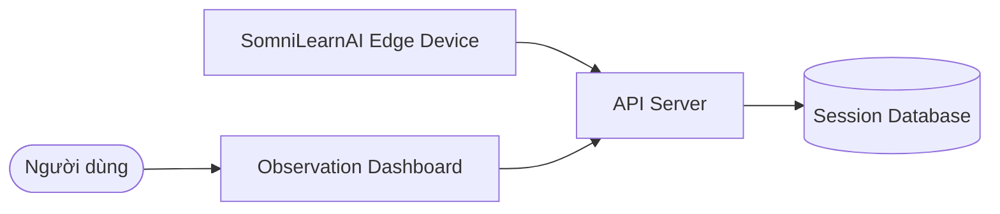
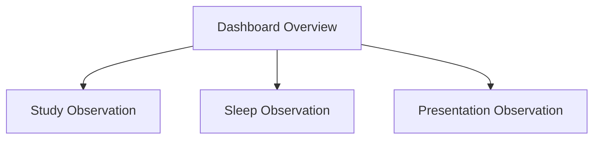
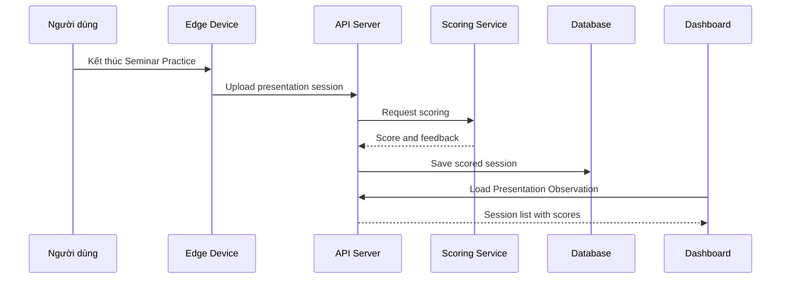
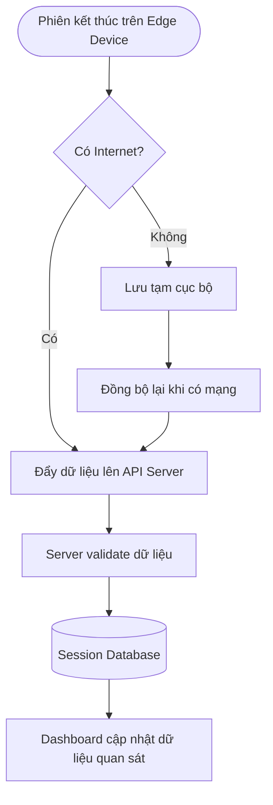

# 05. Internet Service: Dashboard Observation

## 5.1. Overview

Chương này mô tả **Objective 3: dashboard quan sát các phiên học, phiên ngủ và phiên thuyết trình**. Nếu chương 04 tập trung vào quan sát giấc ngủ ngay trên Edge Device, thì chương 05 tập trung vào quan sát dữ liệu dài hạn sau khi các phiên được đồng bộ lên Server.

Internet Service của SomniLearnAI gồm 3 thành phần:

* **API Server:** nhận dữ liệu phiên từ Edge Device và cung cấp dữ liệu cho dashboard.
* **Session Database:** lưu lịch sử phiên học, phiên ngủ và phiên thuyết trình.
* **Web Dashboard:** hiển thị dữ liệu để người dùng quan sát tiến độ và xu hướng.

### Dashboard Observation Context

---

## 5.2. Objective 3 Scope

Dashboard không thay thế chức năng realtime trên thiết bị. Vai trò của dashboard là giúp người dùng nhìn lại dữ liệu đã xảy ra, so sánh theo thời gian và rút ra xu hướng.

| Observation Area | Main Question | Dashboard Output |
| ---------------- | ------------- | ---------------- |
| Study Sessions | Hôm nay đã học bao nhiêu Pomodoro? | Số Pomodoro, tổng phút học, lịch sử phiên |
| Sleep Sessions | Tháng này ngủ có tốt hơn không? | Điểm ngủ, thời lượng ngủ, tác nhân ảnh hưởng, tổng kết cuối tháng |
| Presentation Sessions | Các lần luyện nói có tiến bộ không? | Danh sách điểm, thời lượng nói, feedback, xu hướng điểm số |

---

## 5.3. Session Data Model

### 5.3.1. Study Session

Study Session được tạo sau mỗi phiên Pomodoro.

| Field | Description |
| ----- | ----------- |
| sessionId | Mã phiên học |
| userId | Mã người dùng |
| startedAt | Thời gian bắt đầu |
| endedAt | Thời gian kết thúc |
| focusMinutes | Số phút tập trung |
| breakMinutes | Số phút nghỉ |
| pomodoroCount | Số Pomodoro được tính trong phiên |
| completed | Trạng thái hoàn thành |

### 5.3.2. Sleep Session

Sleep Session được tạo sau khi kết thúc một phiên quan sát giấc ngủ Edge AI.

| Field | Description |
| ----- | ----------- |
| sessionId | Mã phiên ngủ |
| userId | Mã người dùng |
| startedAt | Thời gian bắt đầu ngủ |
| endedAt | Thời gian kết thúc ngủ |
| durationMinutes | Tổng thời lượng ngủ |
| sleepScore | Điểm chất lượng giấc ngủ |
| environmentSummary | Tóm tắt môi trường ngủ |
| detectedFactors | Tác nhân ảnh hưởng như sáng, ồn, nóng, ẩm hoặc CO2 cao |
| recommendation | Gợi ý cải thiện |

### 5.3.3. Presentation Session

Presentation Session được tạo sau mỗi lần luyện thuyết trình. Việc chấm điểm cần Wi-Fi và Server.

| Field | Description |
| ----- | ----------- |
| sessionId | Mã phiên thuyết trình |
| userId | Mã người dùng |
| startedAt | Thời gian bắt đầu |
| endedAt | Thời gian kết thúc |
| durationSeconds | Thời lượng nói |
| presentationScore | Điểm đánh giá từ Server |
| speechRate | Tốc độ nói ước tính |
| clarityScore | Điểm độ rõ ràng |
| serverAnalysisStatus | Trạng thái chấm điểm: pending, scored hoặc failed |
| feedback | Nhận xét ngắn |

---

## 5.4. Dashboard Observation Views

Dashboard được tổ chức theo 3 khu vực quan sát chính.

### 5.4.1. Study Observation

Study Observation giúp người dùng xem hôm đó đã học bao nhiêu Pomodoro và xu hướng học tập trong các ngày gần đây.

| Feature | Description |
| ------- | ----------- |
| Today Pomodoro count | Hiển thị số Pomodoro hoàn thành trong ngày |
| Focus minutes | Hiển thị tổng phút tập trung |
| Session list | Hiển thị danh sách phiên học |
| Trend chart | Biểu đồ số Pomodoro theo ngày |
| Date filter | Lọc theo ngày, tuần hoặc tháng |

### 5.4.2. Sleep Observation

Sleep Observation giúp người dùng xem lại giấc ngủ theo tháng, không chỉ từng phiên riêng lẻ.

| Feature | Description |
| ------- | ----------- |
| Monthly sleep score | Điểm ngủ trung bình theo tháng |
| Sleep duration chart | Biểu đồ thời lượng ngủ |
| Factor analysis | Thống kê tác nhân ảnh hưởng thường gặp |
| Session detail | Chi tiết từng phiên ngủ |
| Monthly summary | Đánh giá tổng kết cuối tháng và gợi ý cải thiện |

### 5.4.3. Presentation Observation

Presentation Observation giúp người dùng xem danh sách các lần luyện nói và nhận biết xu hướng cải thiện.

| Feature | Description |
| ------- | ----------- |
| Session list | Danh sách các lần thuyết trình |
| Score history | Điểm từng phiên |
| Duration | Thời lượng nói |
| Feedback | Nhận xét ngắn sau phiên |
| Progress chart | Biểu đồ xu hướng điểm số |

---

## 5.5. Server-assisted Presentation Scoring

Seminar Practice cần Wi-Fi và sự hỗ trợ của Server để chấm điểm đầy đủ hơn. Edge Device chịu trách nhiệm bắt đầu/kết thúc phiên, ghi nhận thời lượng và gửi dữ liệu âm thanh hoặc feature summary lên Server. Server xử lý dữ liệu, tạo điểm thuyết trình và trả kết quả về dashboard.

Nếu thiết bị offline, phiên thuyết trình có thể được lưu tạm với trạng thái `pending`. Khi thiết bị online lại, dữ liệu được gửi lên Server để chấm điểm và dashboard cập nhật kết quả sau.

---

## 5.6. Synchronization Flow

---

## 5.7. Online and Offline Behavior

| Status | Behavior |
| ------ | -------- |
| Online | Thiết bị gửi phiên học, ngủ và thuyết trình lên Server; dashboard cập nhật dữ liệu quan sát |
| Offline | Thiết bị vẫn chạy Pomodoro, báo thức và Sleep Monitoring; Seminar Practice có thể ghi nhận thời lượng hoặc lưu tạm dữ liệu nhưng chưa chấm điểm đầy đủ |
| Reconnected | Thiết bị gửi các phiên chưa đồng bộ lên Server theo thứ tự thời gian |

---

## 5.8. Security and Privacy Notes

* Dữ liệu phiên cần gắn với `userId` để tách dữ liệu giữa các người dùng.
* Dữ liệu âm thanh thuyết trình cần được gửi qua kết nối an toàn; nếu không cần thiết, Server nên lưu feature summary và kết quả điểm thay vì raw audio.
* Dữ liệu giấc ngủ và môi trường phòng ngủ là dữ liệu cá nhân, cần có cơ chế xác thực dashboard.
* API cần validate dữ liệu đầu vào để tránh phiên thiếu thời gian bắt đầu, thời gian kết thúc hoặc điểm số không hợp lệ.

---

## 5.9. Conclusion

Internet Service là phần hiện thực hóa Objective 3 của SomniLearnAI. Trọng tâm của chương này là **dashboard quan sát**: người dùng nhìn lại phiên học, phiên ngủ và phiên thuyết trình theo thời gian để hiểu tiến độ, xu hướng và các điểm cần cải thiện.
