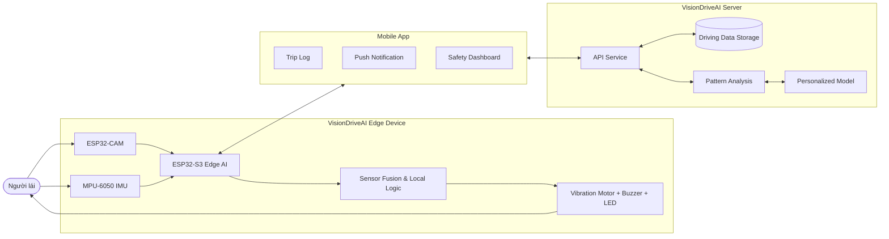

# 02. Architecture & Hardware

## 2.1. Architecture

VisionDriveAI được thiết kế theo mô hình AIoT gồm 3 lớp chính:

* **Edge Device:** thiết bị gắn trên xe máy, xử lý camera, IMU và cảnh báo tại chỗ.
* **Mobile App:** ứng dụng di động nhận log hành trình, thông báo realtime và hiển thị phân tích.
* **Server:** hệ thống lưu trữ dữ liệu, phân tích pattern dài hạn và hỗ trợ cá nhân hóa mô hình.

Điểm cốt lõi của VisionDriveAI là xử lý các tình huống nguy hiểm ngay trên edge device. Internet không phải điều kiện bắt buộc cho cảnh báo tức thời, nhưng cần thiết cho đồng bộ dữ liệu, push notification, phân tích thói quen và cải thiện mô hình cá nhân hóa.

### 2.1.1. Edge-Mobile-Server Communication

Trong quá trình vận hành, Edge Device sử dụng ESP32-S3 và ESP32-CAM để xử lý dữ liệu camera, cảm biến IMU và điều khiển các actuator cảnh báo. Mobile App kết nối với Edge thông qua Wi-Fi/BLE trong phạm vi gần hoặc nhận dữ liệu từ Server sau khi đồng bộ.

Luồng kết nối tổng quát:

```text
Camera + IMU → Edge AI Device → Alert Actuators
Edge AI Device ↔ Mobile App ↔ VisionDriveAI Server
```

Trong đó:

* Edge Device phát hiện hành vi nguy hiểm với độ trễ thấp.
* Cảnh báo rung, buzzer và LED được kích hoạt ngay tại xe.
* Mobile App nhận log hành trình và thông báo cho người dùng hoặc người thân.
* Server lưu dữ liệu lịch sử, phân tích pattern và hỗ trợ cá nhân hóa mô hình theo từng người lái.

### 2.1.2. Architecture Diagram



### 2.1.3. Data Flow

| Step | Description |
| ---- | ----------- |
| 1 | Camera ghi nhận khuôn mặt, hướng nhìn và tư thế tay của người lái. |
| 2 | MPU-6050 ghi nhận chuyển động tay lái, lắc lư, phanh gấp hoặc mất ổn định. |
| 3 | ESP32-S3 xử lý dữ liệu hình ảnh và IMU bằng logic Edge AI / Sensor Fusion. |
| 4 | Khi phát hiện rủi ro, hệ thống kích hoạt cảnh báo rung, buzzer hoặc LED theo mức nguy hiểm. |
| 5 | Sự kiện được ghi log với timestamp, loại hành vi và metadata liên quan. |
| 6 | Mobile App nhận thông báo và hiển thị lịch sử hành trình. |
| 7 | Server tổng hợp dữ liệu dài hạn để phân tích pattern và hỗ trợ cá nhân hóa mô hình. |

### 2.1.4. Offline and Online Behavior

| Mode | Behavior |
| ---- | -------- |
| Offline | Edge Device vẫn phát hiện mất tập trung và kích hoạt cảnh báo cục bộ. |
| Online | Hệ thống đồng bộ log hành trình, gửi thông báo, phân tích pattern và cập nhật cấu hình cá nhân hóa. |

---

## 2.2. Hardware

VisionDriveAI sử dụng các linh kiện phổ biến, phù hợp prototype chi phí thấp và dễ mua trên các nền tảng linh kiện điện tử.

| Component | Quantity | Purpose | Estimated Price (VND) |
| --------- | -------- | ------- | --------------------- |
| ESP32-S3 | 1 | Xử lý Edge AI, Sensor Fusion, Wi-Fi/BLE và điều khiển cảnh báo | 150,000 |
| ESP32-CAM | 1 | Camera nhận diện khuôn mặt, hướng nhìn và tư thế tay | 80,000 |
| MPU-6050 | 1 | Gia tốc kế và con quay hồi chuyển để phân tích chuyển động tay lái | 30,000 |
| Vibration Motor DC | 1 | Tạo rung ở ghi đông để cảnh báo mức nhẹ | 20,000 |
| Buzzer + LED RGB | 1 set | Còi và đèn cảnh báo theo nhiều mức nguy hiểm | 15,000 |
| LiPo Battery 3.7V + Charging Module | 1 | Nguồn độc lập cho prototype | 80,000 |

### Estimated Total Cost

| Cost Type | Estimated Range |
| --------- | --------------- |
| Prototype cost | Approximately 375,000 VND |

Giá trên là ước lượng cho phiên bản prototype. Chi phí thực tế có thể thay đổi theo nhà cung cấp, chất lượng linh kiện, loại module và phương án vỏ/lắp đặt.

---

## 2.3. Hardware Roles

| Hardware | Role in VisionDriveAI |
| -------- | --------------------- |
| ESP32-S3 | Bộ xử lý trung tâm, chạy logic Edge AI, tổng hợp dữ liệu cảm biến và điều khiển cảnh báo. |
| ESP32-CAM | Ghi nhận hình ảnh người lái để phát hiện ngủ gật, nhìn lạc hướng hoặc cầm điện thoại. |
| MPU-6050 | Theo dõi chuyển động tay lái, hỗ trợ phát hiện lắc lư, phanh gấp hoặc mất kiểm soát. |
| Vibration Motor | Tạo phản hồi rung nhẹ hoặc mạnh để cảnh báo mà không gây giật mình quá mức. |
| Buzzer + LED RGB | Tạo cảnh báo âm thanh và ánh sáng khi mức nguy hiểm tăng cao. |
| LiPo Battery + Charging Module | Cấp nguồn độc lập cho thiết bị trong giai đoạn prototype. |

---

## 2.4. Design Considerations

Thiết kế VisionDriveAI ưu tiên các yếu tố sau:

* **Low latency:** cảnh báo cần phản hồi gần như tức thời, mục tiêu dưới 500ms.
* **Edge-first:** các cảnh báo an toàn quan trọng không phụ thuộc Internet.
* **Privacy-aware:** dữ liệu hình ảnh có thể được xử lý tại chỗ, chỉ lưu metadata hoặc ảnh đã làm mờ khi cần.
* **Motorbike-friendly:** thiết bị cần nhỏ gọn, dễ gắn trên xe máy và phù hợp môi trường nội đô.
* **Progressive alerting:** cảnh báo tăng dần để tránh gây hoảng loạn hoặc false alarm.
* **Personalization-ready:** hệ thống có thể học thói quen từng người lái để giảm cảnh báo nhầm.
