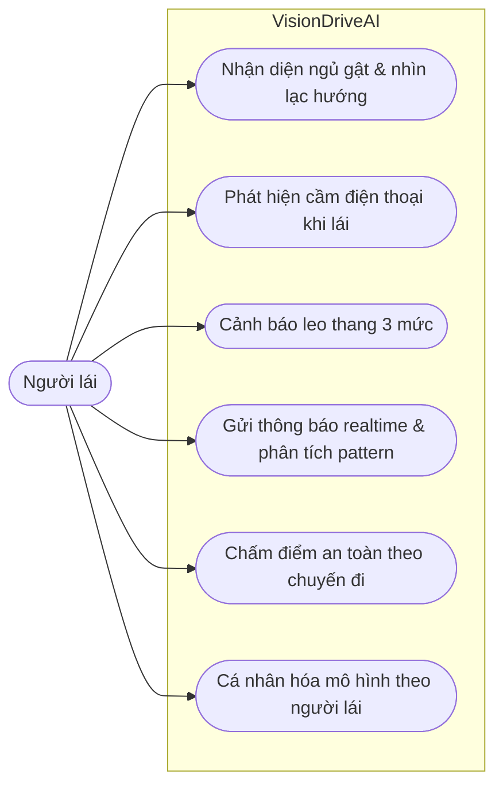
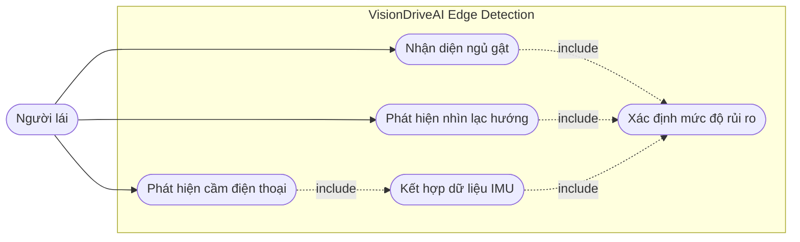
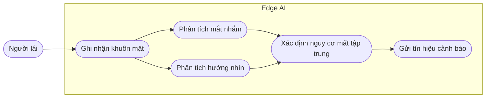
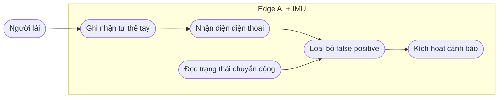
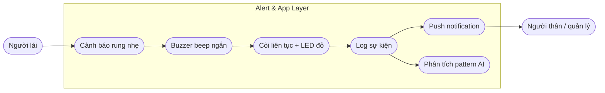
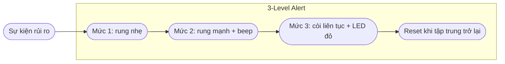
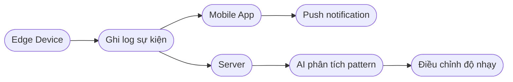
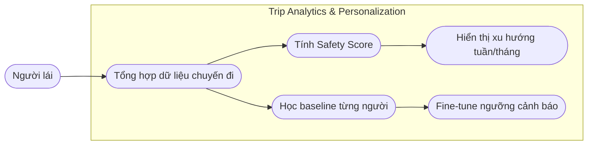
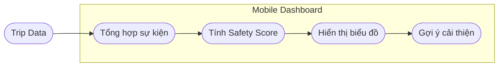
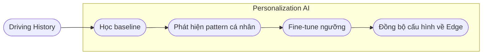

# 03. Objectives

## 3.1. Overview

VisionDriveAI được phát triển với mục tiêu trở thành một hệ thống hỗ trợ an toàn cho người lái xe máy nội đô bằng cách phát hiện hành vi mất tập trung, cảnh báo tức thời và phân tích thói quen lái xe dài hạn. Sản phẩm kết hợp Computer Vision, cảm biến IMU, Edge AI và ứng dụng di động để tạo ra một vòng phản hồi liên tục giữa người lái, thiết bị và dữ liệu hành trình.

Các mục tiêu chính của dự án bao gồm:

* Phát hiện hành vi mất tập trung theo thời gian thực.
* Cảnh báo đa tầng và phản hồi tức thời.
* Phân tích hành trình và cá nhân hóa mô hình theo từng người lái.

### Overall Use Case Diagram

---

## 3.2. Objective 1: Phát hiện hành vi mất tập trung theo thời gian thực

Objective đầu tiên của VisionDriveAI là phát hiện các hành vi nguy hiểm ngay khi chúng xảy ra. Hệ thống sử dụng Computer Vision chạy trên edge kết hợp dữ liệu IMU để nhận diện các tình huống có thể làm giảm khả năng phản ứng của người lái.

### Objective 1 Use Case Diagram

---

## 3.2.1. Use-Case 1: Nhận diện ngủ gật và nhìn lạc hướng

Tính năng này sử dụng ESP32-CAM hướng vào khuôn mặt người lái để phát hiện các dấu hiệu mất tập trung như mắt nhắm quá lâu, đầu gật xuống hoặc ánh mắt nhìn sang hướng khác trong thời gian liên tục.

### Main Features

* Phát hiện mắt nhắm kéo dài.
* Phát hiện đầu gật xuống hoặc tư thế mệt mỏi.
* Phát hiện ánh mắt nhìn ngang liên tục.
* Xử lý trên edge để giảm độ trễ và giảm phụ thuộc cloud.
* Đưa tín hiệu rủi ro sang hệ thống cảnh báo.

### Use Case

| Actor | Rider |
| ----- | ----- |
| Goal | Phát hiện sớm tình trạng buồn ngủ hoặc nhìn lạc hướng khi lái xe |
| Preconditions | Camera đã được lắp đúng hướng và Edge Device đang hoạt động |
| Main Flow | Camera ghi nhận khuôn mặt → Edge AI phân tích mắt/hướng nhìn → hệ thống xác định rủi ro → gửi tín hiệu cảnh báo |
| Expected Result | Người lái được cảnh báo trước khi tình huống mất tập trung kéo dài |
| AI Involvement | Có |

### Use Case Diagram

---

## 3.2.2. Use-Case 2: Phát hiện cầm điện thoại khi lái

Tính năng này sử dụng camera góc rộng và mô hình nhận diện nhẹ để phát hiện tư thế tay có dấu hiệu cầm điện thoại. Dữ liệu IMU được dùng để hỗ trợ phân biệt tình huống xe đang dừng đèn đỏ với tình huống đang di chuyển.

### Main Features

* Nhận diện tư thế tay cầm điện thoại.
* Phân biệt tay cầm điện thoại và tay đang điều khiển ghi đông.
* Kết hợp IMU để giảm false positive.
* Hỗ trợ cảnh báo khi hành vi kéo dài hoặc xảy ra khi xe đang di chuyển.

### Use Case

| Actor | Rider |
| ----- | ----- |
| Goal | Phát hiện hành vi dùng điện thoại trong lúc lái xe |
| Preconditions | Camera và IMU đang hoạt động |
| Main Flow | Camera phát hiện tư thế tay → IMU xác nhận trạng thái di chuyển → hệ thống đánh giá rủi ro → kích hoạt cảnh báo |
| Expected Result | Người lái được nhắc nhở khi có hành vi cầm điện thoại nguy hiểm |
| AI Involvement | Có |

### Use Case Diagram

---

## 3.3. Objective 2: Cảnh báo đa tầng và phản hồi tức thời

Objective thứ hai tập trung vào việc phản hồi nhanh nhưng không gây hoảng loạn. Thay vì chỉ bật còi ngay lập tức, VisionDriveAI sử dụng cảnh báo leo thang theo thời gian và mức độ rủi ro.

### Objective 2 Use Case Diagram

---

## 3.3.1. Use-Case 1: Hệ thống cảnh báo leo thang 3 mức

Hệ thống cảnh báo được chia thành 3 mức để phản hồi theo độ nghiêm trọng của sự kiện. Cách tiếp cận này giúp người lái nhận cảnh báo nhẹ trước, sau đó tăng cường nếu hành vi nguy hiểm vẫn tiếp diễn.

### Main Features

* Mức 1: rung nhẹ ở ghi đông.
* Mức 2: rung mạnh kèm buzzer beep ngắn.
* Mức 3: còi liên tục và LED đỏ nháy.
* Tự reset khi người lái tập trung trở lại.
* Debounce để tránh kích hoạt nhầm.

### Use Case

| Actor | Rider |
| ----- | ----- |
| Goal | Cảnh báo người lái theo mức độ nguy hiểm |
| Preconditions | Edge Device đã phát hiện hành vi rủi ro |
| Main Flow | Sự kiện rủi ro bắt đầu → kích hoạt mức 1 → nếu kéo dài tăng lên mức 2 → nếu tiếp tục nguy hiểm tăng lên mức 3 → reset khi người lái ổn định |
| Expected Result | Người lái được nhắc nhở kịp thời mà không bị cảnh báo quá đột ngột |
| AI Involvement | Không trực tiếp |

### Use Case Diagram

---

## 3.3.2. Use-Case 2: Gửi thông báo realtime và phân tích pattern AI

Mỗi sự kiện mất tập trung được ghi log với timestamp, loại hành vi và metadata cần thiết. Ứng dụng di động có thể gửi thông báo cho người thân hoặc người quản lý. Dữ liệu lịch sử được dùng để phân tích khung giờ hoặc đoạn đường thường xảy ra sự kiện.

### Main Features

* Ghi log sự kiện theo thời gian.
* Gửi push notification cho người dùng hoặc người thân.
* Phân tích khung giờ và khu vực thường xảy ra mất tập trung.
* Tự điều chỉnh độ nhạy cảm biến trong các ngữ cảnh có rủi ro cao.

### Use Case

| Actor | Rider, Family Member, Fleet Manager |
| ----- | ----------------------------------- |
| Goal | Theo dõi sự kiện mất tập trung và phân tích pattern dài hạn |
| Preconditions | App và Server đã được cấu hình |
| Main Flow | Edge ghi log → App nhận thông báo → Server lưu dữ liệu → AI phân tích pattern → hệ thống đề xuất/cập nhật độ nhạy |
| Expected Result | Người dùng hiểu được thời điểm hoặc điều kiện thường gây mất tập trung |
| AI Involvement | Có |

### Use Case Diagram

---

## 3.4. Objective 3: Phân tích hành trình và cá nhân hóa mô hình

Objective thứ ba giúp VisionDriveAI chuyển từ một thiết bị cảnh báo tức thời thành một hệ thống cải thiện hành vi lái xe dài hạn. Dữ liệu sau mỗi chuyến đi được tổng hợp để tạo insight và cá nhân hóa mô hình.

### Objective 3 Use Case Diagram

---

## 3.4.1. Use-Case 1: Chấm điểm an toàn theo chuyến đi

Sau mỗi hành trình, ứng dụng tổng hợp số lần mất tập trung, thời gian mắt nhắm, số lần phanh gấp, số lần cầm điện thoại và các dữ liệu IMU để tính Safety Score từ 0 đến 100.

### Main Features

* Ghi nhận số lần mất tập trung theo chuyến.
* Tổng hợp dữ liệu camera và IMU.
* Tính Safety Score 0-100.
* Hiển thị biểu đồ xu hướng theo tuần hoặc tháng.
* Đưa ra insight giúp người lái cải thiện thói quen.

### Use Case

| Actor | Rider |
| ----- | ----- |
| Goal | Xem mức độ an toàn sau mỗi chuyến đi |
| Preconditions | Hành trình đã được ghi log |
| Main Flow | App tổng hợp dữ liệu → tính Safety Score → hiển thị dashboard → người dùng xem xu hướng |
| Expected Result | Người lái hiểu được chất lượng lái xe và các điểm cần cải thiện |
| AI Involvement | Không trực tiếp |

### Use Case Diagram

---

## 3.4.2. Use-Case 2: Mô hình cá nhân hóa theo từng người lái

Thay vì dùng ngưỡng cố định cho mọi người, VisionDriveAI có thể học baseline hành vi bình thường của từng người lái. Ví dụ, một người thường nhìn trái trước khi rẽ không nên bị xem là mất tập trung nếu hành vi đó phù hợp với ngữ cảnh.

### Main Features

* Học baseline hành vi lái xe bình thường.
* Giảm false positive so với rule-based cố định.
* Điều chỉnh ngưỡng theo từng cá nhân.
* Fine-tune sau 1-2 tuần dữ liệu.
* Hỗ trợ cá nhân hóa cảnh báo theo thói quen.

### Use Case

| Actor | Rider |
| ----- | ----- |
| Goal | Cá nhân hóa mô hình phát hiện để giảm cảnh báo nhầm |
| Preconditions | Hệ thống đã có đủ dữ liệu lịch sử |
| Main Flow | Server phân tích dữ liệu → xác định baseline → cập nhật ngưỡng/mô hình → Edge áp dụng cấu hình cá nhân hóa |
| Expected Result | Hệ thống cảnh báo chính xác hơn theo từng người lái |
| AI Involvement | Có |

### Use Case Diagram

---

## 3.5. Conclusion

VisionDriveAI kết hợp Edge AI, Computer Vision, cảm biến IMU và ứng dụng di động để tạo ra một hệ thống hỗ trợ an toàn có khả năng phản hồi nhanh và học hỏi theo thời gian. Sản phẩm không chỉ phát hiện hành vi mất tập trung mà còn giúp người lái hiểu rõ hơn về thói quen lái xe của mình.

### 3.5.1. Use Case Summary

| Objective | Use Case | AI | Main Purpose | Expected Result |
| --------- | -------- | -- | ------------ | --------------- |
| Objective 1: Real-time detection | Ngủ gật và nhìn lạc hướng | Yes | Phát hiện sớm hành vi mệt mỏi hoặc mất tập trung | Người lái được cảnh báo kịp thời |
| Objective 1: Real-time detection | Cầm điện thoại khi lái | Yes | Nhận diện hành vi dùng điện thoại nguy hiểm | Giảm rủi ro do dùng điện thoại khi lái xe |
| Objective 2: Alert and feedback | Cảnh báo leo thang 3 mức | No | Phản hồi theo mức độ nguy hiểm | Cảnh báo hiệu quả nhưng ít gây hoảng loạn |
| Objective 2: Alert and feedback | Realtime notification và AI pattern | Yes | Ghi log, gửi thông báo và phân tích xu hướng | Người dùng nắm được thời điểm/khu vực rủi ro |
| Objective 3: Analytics and personalization | Safety Score theo chuyến | No | Đánh giá mức độ an toàn sau hành trình | Người lái có insight cải thiện thói quen |
| Objective 3: Analytics and personalization | Cá nhân hóa mô hình | Yes | Học baseline từng người lái | Giảm false positive và tăng độ chính xác |
