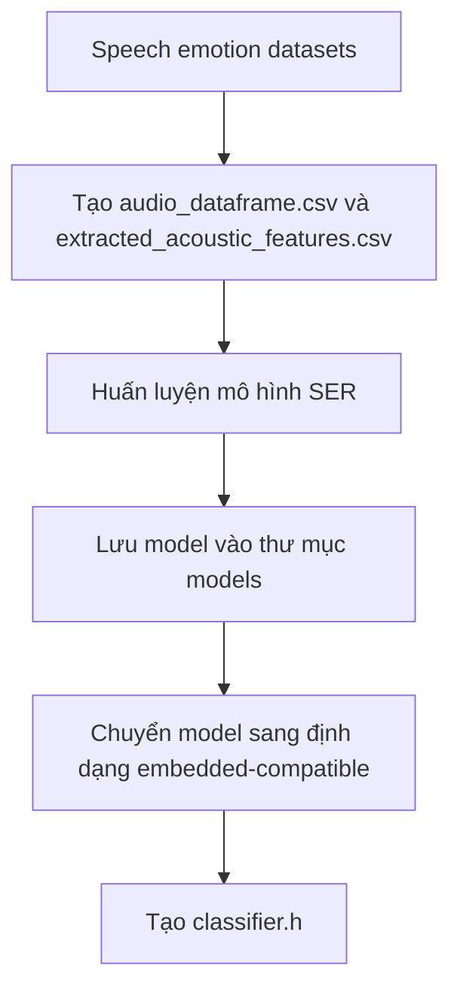
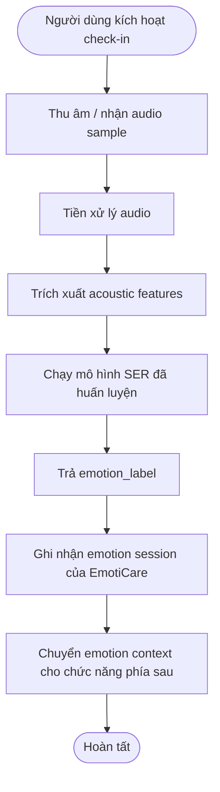
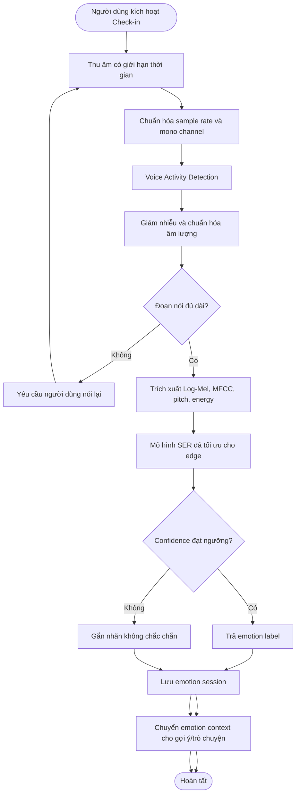

# 04. Edge AI

## 4.1. Vai trò của Edge AI trong Speech Emotion Recognition

Edge AI của EmotiCare AIoT tập trung vào bài toán **Speech Emotion Recognition (SER)**: nhận diện cảm xúc từ tín hiệu giọng nói. Dựa trên repo `embedded-audio-emotion`, hướng triển khai phù hợp là **audio-based on-device emotion recognition**, tức xử lý audio và dự đoán cảm xúc bằng mô hình học máy nhẹ trên thiết bị nhúng.

Trong phạm vi repo, Edge AI đảm nhiệm các bước chính: chuẩn bị dữ liệu âm thanh, trích xuất đặc trưng acoustic, huấn luyện mô hình, kiểm thử audio mới và chuyển mô hình sang định dạng tương thích với thiết bị nhúng. Các nhãn cảm xúc được repo đề cập gồm `anger`, `disgust`, `fear`, `happiness`, `neutrality`, `sadness` và `surprise`.

Đối với EmotiCare AIoT, output cốt lõi của Edge AI nên được xác định là `emotion_label` dự đoán từ audio đầu vào. Các trường như `session_id`, timestamp, `confidence_score`, `quality_flag` hoặc `sync_status` là phần thiết kế bổ sung của hệ thống EmotiCare, không phải chức năng có sẵn trực tiếp từ repo.

Kết quả SER từ Edge AI đóng vai trò là **emotion context** cho các chức năng phía sau như hiển thị trạng thái cảm xúc, lưu lịch sử phiên cảm xúc, gợi ý hỗ trợ hoặc hội thoại.

## 4.2. Cơ sở tham khảo kỹ thuật

Thiết kế SER của EmotiCare AIoT tham khảo các nhóm nguồn sau:

| Nguồn | Giá trị tham khảo cho hệ thống |
| ----- | ------------------------------ |
| Bài báo IEEE PerCom Workshops 2025 "On-device Emotion Recognition from Spoken Language in Embedded Devices" | Cung cấp cơ sở học thuật trực tiếp cho hướng nhận diện cảm xúc từ audio trên thiết bị nhúng chi phí thấp |
| Repo GitHub `prasenjit52282/embedded-audio-emotion` | Cung cấp code tham khảo cho workflow xử lý dữ liệu, huấn luyện mô hình, kiểm thử audio mới và chuyển model sang định dạng phù hợp với embedded device |
| Các bộ dữ liệu speech emotion trong repo gồm CREMA-D, RAVDESS, SAVEE và TESS | Cung cấp dữ liệu giọng nói cảm xúc có nhãn để huấn luyện và thử nghiệm prototype SER |
| Nguồn tổng quan SER hoặc tài liệu nền tảng khác | Bổ sung bối cảnh học thuật về các hướng tiếp cận phổ biến trong Speech Emotion Recognition |

Từ các nguồn này, đặc tả chọn hướng thiết kế thực tế cho prototype:

* Sử dụng audio/giọng nói làm đầu vào chính cho bài toán Speech Emotion Recognition.
* Huấn luyện mô hình trên máy tính hoặc server, sau đó triển khai suy luận trên thiết bị nhúng.
* Ưu tiên các đặc trưng acoustic/prosodic phù hợp với mô hình nhẹ, thay vì mặc định sử dụng mô hình deep learning lớn.
* Dùng các bộ dữ liệu speech emotion có nhãn như CREMA-D, RAVDESS, SAVEE và TESS để huấn luyện/thử nghiệm.
* Đánh giá mô hình không chỉ bằng độ chính xác mà còn bằng F1-score, latency và memory usage để phù hợp với bối cảnh edge device.

## 4.3. Dữ liệu SER và ánh xạ nhãn cảm xúc

Repo `embedded-audio-emotion` sử dụng dữ liệu speech emotion có nhãn từ nhiều nguồn, gồm CREMA-D, RAVDESS, SAVEE và TESS. Trong đó, RAVDESS là một tập dữ liệu quan trọng để tham khảo nhãn cảm xúc giọng nói, nhưng không phải nguồn dữ liệu duy nhất của workflow huấn luyện.

Các nhãn cảm xúc được repo đề cập gồm `anger`, `disgust`, `fear`, `happiness`, `neutrality`, `sadness` và `surprise`. Vì EmotiCare AIoT hướng đến chăm sóc cảm xúc hằng ngày, hệ thống ánh xạ các nhãn SER sang nhãn sản phẩm như sau:

| Nhãn SER trong repo | Nhãn sản phẩm                   | Ý nghĩa trong EmotiCare AIoT                                                                       |
| ------------------- | ------------------------------- | -------------------------------------------------------------------------------------------------- |
| `neutrality`        | Bình thường                     | Người dùng đang ở trạng thái cảm xúc ổn định                                                       |
| `happiness`         | Vui vẻ                          | Cảm xúc tích cực, có thể củng cố bằng phản hồi tích cực                                            |
| `sadness`           | Buồn bã                         | Cần phản hồi đồng cảm hoặc gợi ý hoạt động nhẹ                                                     |
| `anger`             | Tức giận                        | Cần gợi ý tạm dừng, thở chậm hoặc tránh phản ứng vội                                               |
| `fear`              | Căng thẳng / lo lắng            | Cần hỗ trợ giảm áp lực hoặc grounding                                                              |
| `disgust`           | Khó chịu                        | Có thể xử lý như trạng thái tiêu cực cần phản hồi nhẹ                                              |
| `surprise`          | Kích hoạt cao / không chắc chắn | Cần thêm ngữ cảnh hoặc xác nhận từ người dùng                                                      |
| Nhãn mở rộng        | Mệt mỏi                         | Không phải nhãn có sẵn trong repo; cần dữ liệu bổ sung, rule-based feedback hoặc fine-tuning riêng |

Bảng ánh xạ này là taxonomy sản phẩm của EmotiCare AIoT, không phải kết quả phân loại nguyên bản bắt buộc của repo. Ở giai đoạn prototype, hệ thống có thể ưu tiên các nhãn có sẵn trong repo, sau đó mở rộng thêm các trạng thái như mệt mỏi khi có dữ liệu phù hợp.

## 4.4. Dữ liệu đầu vào và đầu ra

Trong phạm vi tham khảo từ repo `embedded-audio-emotion`, dữ liệu đầu vào và đầu ra của Edge AI cần được tách thành hai mức: phần có trong repo và phần mở rộng cho hệ thống EmotiCare AIoT.

### 4.4.1. Dữ liệu đầu vào từ repo tham khảo

| Nhóm dữ liệu | Mô tả | Ghi chú |
| ------------ | ----- | ------- |
| Audio file / audio sample | File âm thanh cần nhận diện cảm xúc | Repo test audio bằng tham số `<audio_file_path>` trong `predictor.py` |
| Trained model | Mô hình đã huấn luyện được lưu trong thư mục `models` | Repo test audio bằng tham số `<model_path>` |
| Extracted acoustic features | File đặc trưng âm thanh dùng cho quá trình huấn luyện | README nêu file `extracted_acoustic_features.csv` là input để train model |

### 4.4.2. Đầu ra từ repo tham khảo

| Đầu ra | Mô tả | Ghi chú |
| ------ | ----- | ------- |
| `emotion_label` | Nhãn cảm xúc dự đoán từ audio đầu vào | Đây là output chắc chắn nhất vì `predictor.py` gọi hàm dự đoán và in ra `emotion` |

### 4.4.3. Dữ liệu mở rộng cho EmotiCare AIoT

Các trường dưới đây có thể được thiết kế bổ sung ở tầng sản phẩm của EmotiCare AIoT, nhưng không nên trình bày như output có sẵn trực tiếp từ repo:

| Trường mở rộng | Vai trò trong EmotiCare AIoT |
| -------------- | ---------------------------- |
| `session_id` | Định danh mỗi lần người dùng thực hiện check-in cảm xúc |
| `device_id` | Định danh thiết bị ghi nhận phiên cảm xúc |
| `started_at`, `completed_at` | Thời điểm bắt đầu và kết thúc phiên ghi âm |
| `sync_status` | Trạng thái đồng bộ dữ liệu với server |
| `confidence_score` | Có thể bổ sung nếu mô hình/logic inference trả về xác suất hoặc điểm tin cậy |
| `quality_flag` | Có thể bổ sung để đánh dấu audio quá ngắn, nhiễu hoặc không đủ chất lượng |
| `inference_latency_ms` | Có thể bổ sung để đo thời gian suy luận thực tế trên thiết bị |

### Ghi chú triển khai

Các đặc trưng như MFCC, pitch, energy hoặc shimmer nên được mô tả ở mục đặc trưng âm thanh thay vì xem là dữ liệu đầu vào trực tiếp từ người dùng. Với repo này, đầu vào trực tiếp khi dự đoán là audio file và model đã huấn luyện; còn các acoustic features là dữ liệu trung gian trong quá trình xử lý hoặc huấn luyện.

## 4.5. Pipeline SER trên Edge Device

Pipeline SER của EmotiCare AIoT được thiết kế dựa trên workflow tham khảo từ repo `embedded-audio-emotion`. Về mặt triển khai, cần tách thành hai giai đoạn: **chuẩn bị mô hình trước khi đưa lên thiết bị** và **suy luận cảm xúc trên thiết bị**.

### Giai đoạn 1: Chuẩn bị mô hình

Giai đoạn này không chạy trực tiếp trong lúc người dùng sử dụng thiết bị. Đây là bước chuẩn bị để tạo mô hình nhẹ có thể triển khai cho môi trường edge/embedded.

### Giai đoạn 2: Suy luận cảm xúc trên thiết bị

Trong phạm vi repo tham khảo, output chắc chắn nhất của pipeline suy luận là `emotion_label` dự đoán từ audio đầu vào. Các bước như lưu `session_id`, timestamp, đồng bộ server, kiểm tra chất lượng audio, confidence threshold hoặc chuyển kết quả sang gợi ý/hội thoại là phần mở rộng của hệ thống EmotiCare AIoT, không phải chức năng có sẵn trực tiếp từ repo.

### Ghi chú

Các bước như Voice Activity Detection, denoise, kiểm tra audio quá ngắn hoặc gắn `quality_flag` có thể giữ trong thiết kế sản phẩm nếu EmotiCare cần tăng độ ổn định khi thu âm thực tế. Tuy nhiên, nên mô tả chúng là các bước bổ sung của hệ thống, không phải pipeline đã được repo triển khai đầy đủ.

## 4.6. Đặc trưng âm thanh

Repo `embedded-audio-emotion` cho thấy hướng tiếp cận chính là trích xuất **acoustic features** từ audio để huấn luyện mô hình nhận diện cảm xúc. README của repo nêu ví dụ các đặc trưng chịu ảnh hưởng bởi trạng thái tinh thần người nói như `intensity` và `shimmer`.

| Đặc trưng                         | Vai trò                                  | Ghi chú triển khai                                                                   |
| --------------------------------- | ---------------------------------------- | ------------------------------------------------------------------------------------ |
| Intensity / Energy                | Mô tả cường độ tín hiệu âm thanh         | Phù hợp để nhận biết mức độ mạnh/yếu hoặc kích hoạt của giọng nói                    |
| Shimmer                           | Mô tả biến thiên biên độ giọng nói       | Được README của repo nêu như một acoustic feature liên quan đến trạng thái người nói |
| MFCC                              | Đặc trưng phổ biến trong xử lý tiếng nói | Có thể dùng cho baseline hoặc mô hình học máy nhẹ nếu được trích xuất trong pipeline |
| Pitch / F0                        | Mô tả cao độ giọng nói                   | Có thể hỗ trợ phân biệt các trạng thái cảm xúc có mức kích hoạt khác nhau            |
| Duration / Pause-related features | Mô tả độ dài phát âm hoặc khoảng dừng    | Có thể dùng bổ sung để kiểm tra chất lượng audio hoặc đặc điểm lời nói               |

Các đặc trưng như Log-Mel Spectrogram, Delta/Delta-delta hoặc đặc trưng dành cho CNN có thể xem là hướng mở rộng, nhưng không nên trình bày như lựa chọn chính nếu chỉ dựa trên repo `embedded-audio-emotion`.

## 4.7. Mô hình đề xuất

Dựa trên repo `embedded-audio-emotion`, mô hình đề xuất cho prototype SER nên ưu tiên hướng **lightweight machine learning model** kết hợp với các acoustic features đã trích xuất từ audio. Cách tiếp cận này phù hợp hơn với mục tiêu chạy suy luận trên thiết bị nhúng so với việc mặc định sử dụng các mô hình deep learning lớn.

| Phương án                                 | Mô tả                                                                                           | Khi sử dụng                                                                                          |
| ----------------------------------------- | ----------------------------------------------------------------------------------------------- | ---------------------------------------------------------------------------------------------------- |
| Acoustic features + classifier nhẹ        | Sử dụng các đặc trưng âm thanh đã trích xuất để huấn luyện mô hình phân loại cảm xúc            | Phương án chính cho prototype bám theo repo                                                          |
| RandomForest-like model                   | Mô hình học máy nhẹ, có thể chuyển sang định dạng embedded-compatible bằng `emlearn`            | Khi cần triển khai thử nghiệm trên thiết bị nhúng                                                    |
| Server-side training, edge-side inference | Huấn luyện model trên máy tính/server, sau đó đưa model đã huấn luyện sang thiết bị để suy luận | Phù hợp với workflow AIoT và hạn chế tài nguyên của edge device                                      |
| Deep learning model nhỏ                   | Mô hình CNN hoặc CNN kết hợp LSTM/GRU                                                           | Chỉ xem là hướng mở rộng nếu có thêm dữ liệu, tài nguyên phần cứng và bằng chứng thực nghiệm phù hợp |

Trong giai đoạn prototype, EmotiCare AIoT nên ưu tiên mô hình nhẹ có thể suy luận nhanh và dùng ít bộ nhớ. Các mô hình CNN, CNN-LSTM hoặc Log-Mel-based deep learning không nên được trình bày là phương án chính nếu chỉ dựa trên repo `embedded-audio-emotion`; chúng phù hợp hơn để ghi là hướng mở rộng trong tương lai.

## 4.8. Tập nhãn sản phẩm

Tập nhãn sản phẩm của EmotiCare AIoT được ánh xạ từ các nhãn SER trong repo `embedded-audio-emotion`. Repo đề cập các nhãn cảm xúc gồm `anger`, `disgust`, `fear`, `happiness`, `neutrality`, `sadness` và `surprise`.

| Nhãn sản phẩm        | Nguồn ánh xạ chính          | Ghi chú                                                                                        |
| -------------------- | --------------------------- | ---------------------------------------------------------------------------------------------- |
| Vui vẻ               | `happiness`                 | Có thể học trực tiếp từ nhãn cảm xúc trong repo                                                |
| Bình thường          | `neutrality`                | Đại diện cho trạng thái cảm xúc ổn định                                                        |
| Buồn bã              | `sadness`                   | Có thể học trực tiếp từ nhãn cảm xúc trong repo                                                |
| Tức giận             | `anger`                     | Có thể học trực tiếp từ nhãn cảm xúc trong repo                                                |
| Căng thẳng / lo lắng | `fear`, một phần `surprise` | Cần tinh chỉnh bằng dữ liệu thực tế của sản phẩm để phù hợp ngữ cảnh sử dụng                   |
| Khó chịu             | `disgust`                   | Có thể giữ thành nhãn riêng hoặc gộp vào nhóm cảm xúc tiêu cực tùy thiết kế sản phẩm           |
| Mệt mỏi              | Dữ liệu mở rộng             | Không phải nhãn có sẵn trong repo; cần thu thêm dữ liệu, fine-tuning hoặc rule-based feedback  |
| Không chắc chắn      | Logic hệ thống              | Không phải nhãn cảm xúc; dùng khi audio kém chất lượng hoặc mô hình không đủ cơ sở để kết luận |

Ở giai đoạn prototype, hệ thống nên ưu tiên các nhãn có sẵn trong repo. Các nhãn mở rộng như `Mệt mỏi` hoặc trạng thái `Không chắc chắn` nên được mô tả là phần thiết kế bổ sung của EmotiCare AIoT.

## 4.9. Confidence và quality flag

Trong repo `embedded-audio-emotion`, output chắc chắn được thể hiện ở mức test audio là nhãn cảm xúc dự đoán (`emotion_label`). Repo chưa thể hiện rõ logic trả về `confidence_score`, `top_k_predictions` hoặc `quality_flag` trong file `predictor.py`.

Do đó, trong EmotiCare AIoT, `confidence_score` và `quality_flag` được xem là **logic bổ sung ở tầng sản phẩm**, dùng để kiểm soát cách hiển thị và sử dụng kết quả SER.

| Điều kiện                                         | Hành vi hệ thống                                                                            |
| ------------------------------------------------- | ------------------------------------------------------------------------------------------- |
| `emotion_label` dự đoán thành công                | Lưu kết quả như một emotion session và chuyển sang các chức năng phía sau                   |
| Không nhận diện được audio hoặc inference lỗi     | Gắn trạng thái không chắc chắn và yêu cầu người dùng thử lại                                |
| Audio quá ngắn                                    | Gắn `quality_flag = too_short` và yêu cầu ghi âm lại                                        |
| Audio nhiễu hoặc khó nghe                         | Gắn `quality_flag = noisy` và đề xuất người dùng nói gần microphone hơn hoặc đổi môi trường |
| Confidence thấp, nếu mô hình có hỗ trợ xác suất   | Hiển thị dạng “có thể là...” thay vì kết luận chắc chắn                                     |
| Confidence đủ cao, nếu mô hình có hỗ trợ xác suất | Hiển thị `emotion_label` như kết quả chính của phiên check-in                               |

Các ngưỡng như `0.50` hoặc `0.75` chỉ nên được xem là giá trị cấu hình thử nghiệm của EmotiCare. Chúng cần được hiệu chỉnh sau khi kiểm thử mô hình trên dữ liệu thực tế, không nên trình bày như ngưỡng có sẵn từ repo.

## 4.10. Đánh giá mô hình

Việc đánh giá mô hình SER cần xem xét cả hiệu năng phân loại và khả năng triển khai trên thiết bị nhúng. Repo `embedded-audio-emotion` báo cáo kết quả với lightweight machine learning models, trong đó chỉ số đáng chú ý là F1-score, response time và memory usage.

| Chỉ số                    | Mục đích                                                                                   |
| ------------------------- | ------------------------------------------------------------------------------------------ |
| Accuracy                  | Đánh giá tỷ lệ dự đoán đúng tổng thể trên tập test                                         |
| Macro F1-score            | Đánh giá cân bằng giữa các lớp cảm xúc, tránh mô hình thiên lệch về lớp có nhiều dữ liệu   |
| Confusion matrix          | Xem các cặp cảm xúc dễ bị nhầm lẫn, ví dụ giữa các cảm xúc có biểu hiện giọng nói gần nhau |
| Latency / response time   | Đánh giá thời gian suy luận, đặc biệt quan trọng khi chạy trên edge device                 |
| Memory usage / model size | Kiểm tra mô hình có phù hợp với giới hạn bộ nhớ của thiết bị nhúng hay không               |
| Robustness test           | Kiểm tra thêm với audio nhiễu, khoảng cách microphone khác nhau hoặc đoạn nói ngắn         |

Trong giai đoạn prototype, EmotiCare AIoT nên ưu tiên `Macro F1-score`, `latency` và `memory usage`, vì repo tham khảo tập trung vào mô hình nhẹ cho thiết bị nhúng. Các ngưỡng cụ thể như latency hoặc dung lượng bộ nhớ cần được đo lại trên phần cứng thực tế của hệ thống.

## 4.11. Lưu trữ cục bộ

Repo `embedded-audio-emotion` chủ yếu cung cấp workflow huấn luyện, lưu model và dự đoán nhãn cảm xúc từ audio. Repo chưa thể hiện rõ cơ chế lưu trữ cục bộ cho từng phiên cảm xúc của người dùng.

Do đó, trong EmotiCare AIoT, lưu trữ cục bộ được xem là **phần thiết kế bổ sung của hệ thống**, dùng để ghi nhận kết quả SER sau mỗi lần người dùng thực hiện check-in cảm xúc.

| Trường                 | Mô tả                                    | Ghi chú                                                               |
| ---------------------- | ---------------------------------------- | --------------------------------------------------------------------- |
| `session_id`           | ID của mỗi phiên check-in cảm xúc        | Do hệ thống EmotiCare sinh ra                                         |
| `device_id`            | ID thiết bị thực hiện ghi nhận           | Phục vụ quản lý thiết bị và đồng bộ                                   |
| `user_id`              | ID người dùng đã liên kết                | Chỉ lưu khi thiết bị có cơ chế định danh người dùng                   |
| `emotion_label`        | Nhãn cảm xúc dự đoán từ audio            | Đây là output cốt lõi từ SER                                          |
| `created_at`           | Thời điểm tạo kết quả                    | Do hệ thống EmotiCare ghi nhận                                        |
| `inference_latency_ms` | Thời gian suy luận                       | Có thể đo bổ sung trong quá trình triển khai                          |
| `quality_flag`         | Trạng thái chất lượng audio hoặc kết quả | Logic bổ sung, ví dụ `clean`, `noisy`, `too_short`, `low_confidence`  |
| `confidence_score`     | Điểm tin cậy của dự đoán                 | Chỉ dùng nếu mô hình hoặc tầng inference hỗ trợ xác suất/điểm tin cậy |
| `audio_saved`          | Cờ cho biết có lưu audio thô hay không   | Mặc định nên là `false` để giảm rủi ro riêng tư                       |
| `sync_status`          | Trạng thái đồng bộ với server            | Ví dụ `pending`, `synced`, `failed`; thuộc tầng sản phẩm/backend      |

Lưu ý: chỉ nên lưu mặc định kết quả suy luận và metadata cần thiết. Audio thô không nên được lưu hoặc đồng bộ mặc định nếu chưa có lý do kỹ thuật rõ ràng và sự đồng ý của người dùng.

## 4.12. Yêu cầu riêng tư và an toàn

* Thiết bị phải hiển thị rõ trạng thái đang ghi âm.
* Không upload âm thanh thô mặc định.
* Dataset nghiên cứu như RAVDESS chỉ dùng cho huấn luyện/thử nghiệm mô hình, không đại diện đầy đủ cho mọi người dùng thực tế.
* Kết quả SER là suy luận xác suất, không phải kết luận chắc chắn về trạng thái tâm lý.
* Kết quả Edge AI chỉ hỗ trợ tự nhận thức, không phải chẩn đoán y khoa.

## 4.2. Cơ sở tham khảo kỹ thuật

Thiết kế SER của EmotiCare AIoT tham khảo ba nhóm nguồn:

| Nguồn | Giá trị tham khảo cho hệ thống |
| ----- | ------------------------------ |
| Bài tổng quan trên PubMed Central | Cung cấp bối cảnh học thuật về bài toán nhận diện cảm xúc từ lời nói và các hướng tiếp cận phổ biến trong SER |
| RAVDESS Emotional Speech Audio trên Kaggle | Cung cấp tập dữ liệu giọng nói cảm xúc có nhãn, phù hợp để huấn luyện/thử nghiệm prototype SER |
| Bài arXiv "Emotion Recognition from Speech" | So sánh các đặc trưng Log-Mel Spectrogram, MFCC, pitch, energy và các mô hình LSTM, CNN, HMM, DNN trên RAVDESS |

Từ các nguồn này, đặc tả chọn hướng thiết kế thực tế cho prototype:

* Dùng RAVDESS làm tập dữ liệu tham khảo chính cho nhãn cảm xúc và cấu trúc dữ liệu huấn luyện.
* Ưu tiên đặc trưng phổ thời gian như **Log-Mel Spectrogram** và **MFCC**.
* Bổ sung đặc trưng prosody như **pitch** và **energy** để hỗ trợ phân biệt cảm xúc.
* Ưu tiên mô hình CNN nhỏ hoặc CNN kết hợp lớp tuần tự nhẹ nếu cần, vì phù hợp hơn cho tối ưu edge so với mô hình quá lớn.
* Đánh giá mô hình bằng accuracy, confusion matrix và latency thay vì chỉ nhìn vào accuracy offline.

## 4.3. RAVDESS và ánh xạ nhãn cảm xúc

RAVDESS là tập dữ liệu âm thanh cảm xúc được sử dụng rộng rãi cho Speech Emotion Recognition. Dataset có các nhãn cảm xúc như neutral, calm, happy, sad, angry, fearful, disgust và surprised. Vì EmotiCare AIoT hướng đến chăm sóc cảm xúc hằng ngày, hệ thống ánh xạ nhãn nghiên cứu sang nhãn sản phẩm như sau:

| Nhãn RAVDESS / SER | Nhãn sản phẩm | Ý nghĩa trong EmotiCare AIoT |
| ------------------ | ------------- | ----------------------------- |
| neutral | Bình thường | Người dùng đang ở trạng thái ổn định |
| calm | Bình thường / thư giãn | Có thể duy trì trạng thái hiện tại |
| happy | Vui vẻ | Cảm xúc tích cực, nên củng cố thói quen tốt |
| sad | Buồn bã | Cần phản hồi đồng cảm hoặc hoạt động nhẹ |
| angry | Tức giận | Cần gợi ý tạm dừng, thở chậm, tránh phản ứng vội |
| fearful | Căng thẳng | Cần hỗ trợ giảm áp lực hoặc grounding |
| disgust | Khó chịu | Có thể gộp vào căng thẳng/tức giận tùy confidence |
| surprised | Không chắc chắn / kích hoạt cao | Cần xác nhận thêm nếu không đủ ngữ cảnh |
| tired | Mệt mỏi | Nhãn mở rộng của sản phẩm, cần dữ liệu bổ sung ngoài RAVDESS hoặc fine-tuning riêng |

## 4.4. Dữ liệu đầu vào và đầu ra

| Nhóm dữ liệu | Mô tả | Bắt buộc |
| ------------ | ----- | -------- |
| Audio sample | Đoạn giọng nói ngắn sau khi người dùng kích hoạt check-in | Có |
| Sampling rate | Tần số lấy mẫu thống nhất cho pipeline, ví dụ 16 kHz hoặc 22.05 kHz | Có |
| Log-Mel Spectrogram | Biểu diễn năng lượng theo thang Mel qua thời gian | Có trong hướng CNN |
| MFCC | Đặc trưng cepstral phổ biến trong xử lý tiếng nói | Nên có |
| Pitch | Cao độ giọng nói | Nên có |
| Energy | Năng lượng âm thanh | Nên có |
| Metadata | session_id, device_id, started_at, completed_at | Có |

| Đầu ra | Mô tả |
| ------ | ----- |
| emotion_label | Nhãn cảm xúc sau ánh xạ sang taxonomy của sản phẩm |
| confidence_score | Độ tin cậy của mô hình |
| top_k_predictions | Danh sách nhãn có xác suất cao nhất, dùng cho debug hoặc kiểm tra nội bộ |
| quality_flag | clean, noisy, too_short, low_confidence |
| inference_latency_ms | Thời gian xử lý trên thiết bị |

## 4.5. Pipeline SER trên Edge Device

*Mô tả chart: Flow chart này mô tả pipeline Edge AI cho Speech Emotion Recognition, từ thu âm đến lưu emotion session và chuyển emotion context cho các chức năng cloud-assisted.*

## 4.6. Đặc trưng âm thanh

| Đặc trưng | Vai trò | Ghi chú triển khai |
| --------- | ------- | ------------------ |
| Log-Mel Spectrogram | Biểu diễn phổ thời gian phù hợp cho CNN | Bài arXiv ghi nhận Log-Mel là đặc trưng hiệu quả trong thử nghiệm với CNN trên RAVDESS |
| MFCC | Đặc trưng tiếng nói kinh điển | Hữu ích cho baseline hoặc mô hình nhẹ |
| Pitch | Mô tả cao độ | Hỗ trợ nhận biết kích hoạt cảm xúc như tức giận/căng thẳng |
| Energy | Mô tả cường độ | Hỗ trợ phân biệt giọng yếu, mạnh, kích động |
| Delta/Delta-delta | Biến thiên theo thời gian | Có thể bổ sung nếu tài nguyên cho phép |
| Duration/Pause ratio | Kiểm tra chất lượng đoạn nói | Hỗ trợ quality flag và retry |

## 4.7. Mô hình đề xuất

| Phương án | Mô tả | Khi sử dụng |
| --------- | ----- | ----------- |
| MFCC + classifier nhẹ | Baseline đơn giản, dễ chạy trên thiết bị | Prototype sớm hoặc phần cứng hạn chế |
| Log-Mel + 2D CNN nhỏ | Chuyển spectrogram thành đầu vào dạng ảnh cho CNN | Phương án chính cho prototype SER |
| CNN + LSTM/GRU nhẹ | CNN trích xuất đặc trưng, lớp tuần tự học biến thiên thời gian | Khi cần cải thiện trên câu nói dài hơn |
| Server-side training, edge-side inference | Huấn luyện trên máy/server, chuyển model tối ưu sang thiết bị | Phù hợp với workflow AIoT |

Mô hình triển khai trên edge cần được tối ưu bằng quantization hoặc định dạng inference nhẹ nếu phần cứng hạn chế. Với ESP32-S3, có thể cân nhắc TensorFlow Lite Micro hoặc chia tách: edge trích xuất đặc trưng và chạy model nhỏ, server dùng cho huấn luyện/cập nhật model.

## 4.8. Tập nhãn sản phẩm

| Nhãn sản phẩm | Nguồn học chính | Ghi chú |
| ------------- | --------------- | ------- |
| Vui vẻ | happy | Có thể học từ RAVDESS |
| Bình thường | neutral, calm | Gộp hai nhãn ổn định |
| Căng thẳng | fearful, surprised, một phần disgust | Cần tinh chỉnh bằng dữ liệu thực tế của sản phẩm |
| Buồn bã | sad | Có thể học từ RAVDESS |
| Tức giận | angry | Có thể học từ RAVDESS |
| Mệt mỏi | dữ liệu mở rộng | RAVDESS không đại diện trực tiếp; prototype có thể dùng rule/feedback hoặc thu thêm dữ liệu |
| Không chắc chắn | confidence thấp hoặc tín hiệu nhiễu | Không phải cảm xúc, là trạng thái chất lượng suy luận |

## 4.9. Logic confidence và quality flag

| Điều kiện | Hành vi hệ thống |
| --------- | ---------------- |
| `confidence_score >= 0.75` và `quality_flag = clean` | Hiển thị emotion label và chuyển sang hỗ trợ |
| `0.50 <= confidence_score < 0.75` | Hiển thị dạng "có thể là..." và cho phép người dùng xác nhận |
| `confidence_score < 0.50` | Gắn nhãn không chắc chắn, không dùng để kết luận xu hướng mạnh |
| `quality_flag = too_short` | Yêu cầu ghi âm lại |
| `quality_flag = noisy` | Cảnh báo môi trường nhiễu và đề xuất nói gần microphone hơn |

## 4.10. Đánh giá mô hình

| Chỉ số | Mục đích |
| ------ | -------- |
| Accuracy | Đánh giá tổng thể trên tập test |
| Confusion matrix | Xem các cặp cảm xúc dễ nhầm, ví dụ calm-neutral hoặc angry-fearful |
| Macro F1-score | Tránh mô hình thiên lệch về lớp nhiều dữ liệu |
| Latency | Đảm bảo inference hoàn tất trong 15 giây trên thiết bị |
| Model size | Đảm bảo model phù hợp bộ nhớ phần cứng |
| Robustness test | Kiểm tra với nhiễu nền, khoảng cách microphone và câu nói ngắn |

## 4.11. Lưu trữ cục bộ

| Trường | Mô tả |
| ------ | ----- |
| session_id | UUID hoặc ID sinh tại thiết bị |
| device_id | ID thiết bị |
| user_id | ID người dùng đã liên kết |
| emotion_label | Kết quả phân loại sau ánh xạ nhãn |
| confidence_score | Độ tin cậy |
| quality_flag | clean, noisy, too_short, low_confidence |
| inference_latency_ms | Thời gian xử lý |
| created_at | Thời điểm tạo session |
| audio_saved | Mặc định `false` |
| sync_status | pending, synced hoặc failed |

## 4.12. Riêng tư và an toàn

* Thiết bị phải hiển thị rõ trạng thái đang ghi âm để người dùng biết khi nào audio đang được thu nhận.
* Không upload hoặc lưu âm thanh thô mặc định nếu chưa có sự đồng ý rõ ràng từ người dùng.
* Các dataset nghiên cứu như CREMA-D, RAVDESS, SAVEE và TESS chỉ dùng cho huấn luyện/thử nghiệm mô hình, không đại diện đầy đủ cho mọi người dùng thực tế.
* Kết quả SER là suy luận bằng mô hình học máy từ tín hiệu giọng nói, không phải kết luận chắc chắn về trạng thái tâm lý.
* Kết quả Edge AI chỉ nên dùng để hỗ trợ tự nhận thức và cá nhân hóa phản hồi, không dùng như chẩn đoán y khoa.
* Khi kết quả không chắc chắn hoặc audio có chất lượng kém, hệ thống nên yêu cầu người dùng thử lại thay vì đưa ra kết luận mạnh.
