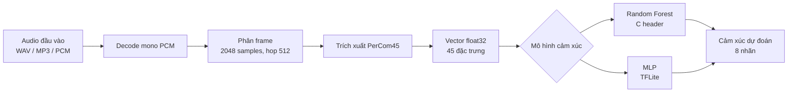
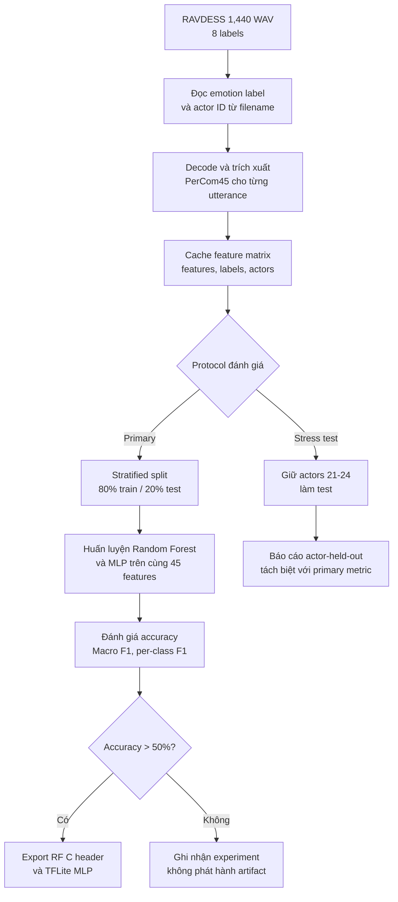
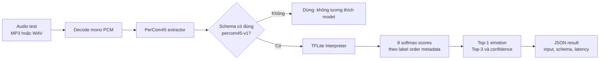

# Methodology — Edge Speech Emotion Recognition

## 1. Mục tiêu nghiên cứu

Nghiên cứu đánh giá khả năng nhận diện cảm xúc từ giọng nói trên thiết bị có
tài nguyên hạn chế. Mục tiêu không chỉ là tối đa hóa độ chính xác trên máy tính
mà còn xác định một representation âm học có thể tái tạo được trong môi trường
nhúng, sau đó so sánh hai hướng triển khai: Random Forest xuất sang C/C++ và
Multi-Layer Perceptron (MLP) xuất sang TensorFlow Lite.

Phương pháp được định hướng bởi bài báo *On-device Emotion Recognition from
Spoken Language in Embedded Devices* (IEEE PerCom Workshops 2025). Tuy nhiên,
đây là một adaptation chứ không phải tái lập hoàn toàn: nghiên cứu giữ tám lớp
cảm xúc của RAVDESS, bao gồm `calm`, trong khi bài báo tham chiếu sử dụng
taxonomy bảy lớp.

## Tổng quan phương pháp

## 2. Dữ liệu và đơn vị phân tích

Tập dữ liệu là phần audio-only speech của RAVDESS, gồm 1.440 phát ngôn WAV của
24 diễn viên. Mỗi phát ngôn là một đơn vị quan sát và được gán một trong tám
lớp: `neutral`, `calm`, `happy`, `sad`, `angry`, `fearful`, `disgust`, và
`surprised`.

Nhãn được lấy từ mã emotion trong tên file chuẩn RAVDESS. Các audio MP3/WAV do
người dùng cung cấp chỉ được dùng cho suy luận minh họa; tên file của chúng
không được xem là ground truth.

## 3. Tiền xử lý âm thanh và biểu diễn đặc trưng

Mỗi tín hiệu được decode thành mono PCM tại sample rate gốc. Tín hiệu được chia
thành các frame 2.048 samples với bước nhảy 512 samples. Trên từng frame, các
đại lượng phổ và năng lượng được tính; sau đó các đại lượng theo thời gian được
tổng hợp để tạo một vector cố định cho toàn phát ngôn.

Schema `percom45-v1` gồm 45 đặc trưng:

| Nhóm | Số chiều | Cách tổng hợp |
| --- | ---: | --- |
| Scalar/prosodic | 13 | Giá trị đại diện trên toàn tín hiệu hoặc trung bình theo frame: energy, ZCR, F0/F2, jitter, shimmer, pause rate, centroid, bandwidth, rolloff, flux, flatness và band-energy proxy |
| MFCC | 13 | Trung bình theo frame của 13 hệ số |
| Chroma | 12 | Trung bình theo frame của 12 pitch classes |
| Spectral contrast | 7 | Trung bình theo frame của 7 dải tần |

Feature vector được lưu cùng thứ tự tên đặc trưng, schema version và label order
trong metadata model. Thứ tự này là một phần của giao diện triển khai: thay đổi
thứ tự, scale hoặc định nghĩa một feature sẽ làm kết quả classifier không còn
hợp lệ.

## 4. Thiết kế thực nghiệm

Một seed cố định được dùng cho các bước ngẫu nhiên. Ma trận feature, nhãn và
actor ID được cache nhằm bảo đảm các mô hình lặp lại trên cùng dữ liệu đầu vào.
Hai protocol được báo cáo riêng:

1. **Stratified random holdout 80/20** là phép so sánh chính giữa các model.
   Phân tầng duy trì phân bố lớp trên tập test, nhưng một actor có thể xuất hiện
   ở cả train và test.
2. **Actor-held-out stress test** giữ toàn bộ actors 21–24 khỏi train. Protocol
   này đo mức độ tổng quát qua speaker mới, nghiêm ngặt hơn và không được gộp
   vào kết quả stratified.

Không sử dụng test set để fit normalizer, chọn feature, hoặc chọn epoch. Với
MLP, normalizer chỉ được adapt trên training split và early stopping theo
validation split nội bộ của training data.

### Pipeline train

## 5. Mô hình so sánh

Hai model được huấn luyện trên chính vector PerCom45:

- **Random Forest** gồm 30 cây, giới hạn độ sâu tối đa 10. Việc giới hạn độ sâu
  kiểm soát kích thước và độ phức tạp suy luận, phù hợp hơn với mục tiêu edge.
- **MLP** gồm một lớp chuẩn hóa, hai hidden layer 96 và 48 units kích hoạt ReLU,
  dropout trong giai đoạn train, và output softmax tám lớp. Model này được
  chuyển sang TensorFlow Lite để đo artifact dành cho runtime nhúng.

Random Forest được xuất ở dạng C header float32 qua emlearn. MLP được đánh giá
cả ở Keras lẫn TFLite trên cùng test split để xác nhận conversion không làm
thay đổi đáng kể metric hoặc label order.

## 6. Chỉ số đánh giá và tiêu chí chấp nhận

Các chỉ số được báo cáo gồm accuracy, Macro F1, precision/recall/F1 theo từng
lớp, latency suy luận desktop và kích thước artifact. Macro F1 được ưu tiên
cùng accuracy vì mỗi lớp đóng góp ngang nhau, giảm nguy cơ một lớp dễ hoặc phổ
biến che khuất lỗi ở lớp khác.

Một artifact chỉ được đánh dấu đủ điều kiện công bố nội bộ khi accuracy trên
test split tương ứng lớn hơn 50%. Điều kiện này không thay thế đánh giá
actor-independent, benchmark trên thiết bị thật, hoặc xác nhận tính phù hợp cho
người dùng ngoài RAVDESS.

### Pipeline test / inference

## 7. Tái tạo native và hiệu lực triển khai

Để chạy Random Forest trên thiết bị, native extractor phải tạo đúng vector
`percom45-v1` trước khi gọi classifier. Do đó nghiên cứu sử dụng fixture parity
để so sánh vector Python với vector C/C++ theo từng primitive có thể đối chiếu.

MFCC, spectral flux và spectral bandwidth không được tuyên bố tương đương số
học với LibXtract cho đến khi benchmark xác nhận. Ở trạng thái hiện tại,
centroid, rolloff và flatness của native implementation cũng chưa đạt tolerance
so với Python. Vì vậy C header đã export là artifact nghiên cứu, chưa phải
firmware production-ready.

## 8. Hạn chế và nguy cơ suy diễn

- RAVDESS là dữ liệu speech được diễn xuất trong điều kiện thu âm kiểm soát,
  không phản ánh hoàn toàn microphone, nhiễu và ngôn ngữ của môi trường sử dụng.
- Stratified holdout có thể đánh giá lạc quan do speaker overlap; cần xem
  actor-held-out result song song.
- Mô hình tám lớp không thể so sánh trực tiếp với công bố bảy lớp.
- Kích thước C header và feature parity phải được xác nhận trên board/partition
  ESP32 mục tiêu trước khi đưa vào sản phẩm.

Các kết quả định lượng và trạng thái artifact được lưu tại
[`result/result.md`](result/result.md); mô tả pipeline hiện hành nằm tại
[`../pipeline/README.md`](../pipeline/README.md).
