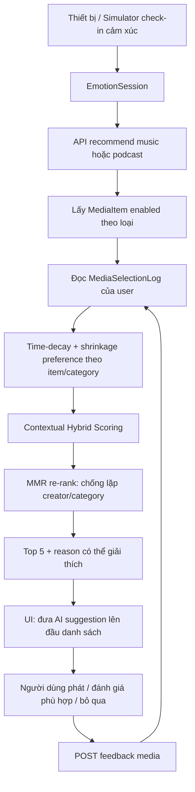

# Quy trình kỹ thuật gợi ý nhạc và podcast

## Mục tiêu

Đưa ra năm nội dung phù hợp với cảm xúc hiện tại, học dần từ đánh giá của
người dùng, nhưng không lặp lại một nội dung hoặc một chủ đề quá nhiều. Đây là
hệ gợi ý chăm sóc tinh thần hằng ngày, không dùng để chẩn đoán hay thay thế tư
vấn chuyên môn.

## Thuật toán đang dùng: Contextual Hybrid Ranker v2

Ranker kết hợp bốn tín hiệu có thể giải thích được:

```text
raw_score = 0.56 × emotion_fit
          + 0.22 × item_preference
          + 0.12 × category_preference
          + 0.10 × novelty
```

- `emotion_fit`: category ưu tiên cho emotion hiện tại. Category đầu có điểm
  `1.0`, category thứ hai `0.65`; category khác là fallback.
- `item_preference`: rating của chính item đó, chuẩn hoá về `[-1, 1]`, có
  time-decay bán rã 45 ngày.
- `category_preference`: cùng cách tính, nhưng gộp theo category để học được
  sở thích ngay cả khi item mới chưa có feedback.
- `novelty`: phạt mạnh nội dung đã tương tác trong ngày; mức phạt giảm dần về
  0 sau 14 ngày. Item chưa từng nghe được thưởng nhẹ.

Rating dùng **shrinkage prior**: tổng preference chia cho `weight + prior`.
Nhờ vậy một lượt like/dislike duy nhất không thể thay đổi thứ hạng quá mạnh.
Đây là cách an toàn cho cold-start và dữ liệu phản hồi còn ít.

Sau khi có điểm thô, hệ chọn top-K bằng **Maximal Marginal Relevance (MMR)**:

```text
MMR = 0.86 × relevance - 0.14 × similarity_to_selected
```

Similarity gồm category trùng (`0.70`) và creator trùng (`0.30`). Kết quả vẫn
phù hợp cảm xúc nhưng tránh một danh sách năm bài cùng chủ đề/nguồn.

## Workflow hoạt động



### Trình tự request

1. Client đồng bộ `EmotionSession` từ edge/simulator.
2. Client gọi `POST /api/media/music/recommend` hoặc
   `POST /api/media/podcast/recommend` với `emotion_label`.
3. Server lấy catalog enabled, lịch sử `MediaSelectionLog` của đúng user và
   tính điểm hybrid.
4. Server MMR re-rank, trả tối đa 5 card gồm `reason`, `ranking_score`, đường
   dẫn audio local và metadata.
5. UI đặt các `media_id` trong kết quả lên đầu tab tương ứng, highlight chúng.
6. Khi người dùng phản hồi, client gọi `POST /api/feedback/media`; log trở
   thành tín hiệu cho request sau.

## Dữ liệu và quyền riêng tư

- Audio được phát từ `/media/...` tại server local. Cột `source_url` không lưu
  URL của nhà cung cấp ngoài.
- Tín hiệu cá nhân chỉ truy vấn theo `EmotionSession.user_id` của device đã
  xác thực.
- Feedback trống là neutral, không được suy diễn thành dislike.
- Không có mô hình được train lại tự động trên dữ liệu người dùng.

## Đánh giá độ chính xác

Theo dõi theo từng loại `song` và `podcast`:

| Nhóm | Metric | Mục tiêu ban đầu |
| --- | --- | --- |
| Relevance | like rate, rating trung bình chuẩn hoá | tăng so với baseline category-only |
| Ranking | Precision@5, NDCG@5 | tính offline khi đủ feedback có nhãn |
| Safety / novelty | repeat-within-24h, coverage | giảm lặp, tăng coverage catalog |
| Diversity | unique category/creator trong top-5 | không để một nguồn chiếm toàn bộ list |
| Podcast | completion rate, early-skip rate | tối ưu riêng khi có telemetry playback |

Nên chạy A/B theo user/device cohort: `category-only` là baseline, `hybrid-v2`
là treatment. Không thay đổi trọng số chỉ dựa vào vài feedback đầu tiên.

## Khi nào mới cần train model

Chưa cần train model với catalog 40 nhạc + 40 podcast và history nhỏ. Khi có
ít nhất vài nghìn feedback/play event chất lượng, có thể thử candidate generator
item-to-item hoặc matrix factorization. Model học máy chỉ tạo candidate; tầng
emotion safety, novelty và MMR vẫn phải giữ ở ranker cuối.

## Tài liệu nền tảng

- [Trajectory Based Podcast Recommendation](https://arxiv.org/abs/2009.03859):
  dùng lịch sử gần đây và tính tuần tự cho podcast.
- [GoalPods](https://research.atspotify.com/publications/enabling-goal-focused-exploration-of-podcasts-in-interactive-recommender-systems):
  mục tiêu người nghe là context quan trọng cho podcast.
- [ACM RecSys Challenge 2018 analysis](https://arxiv.org/abs/1810.01520):
  tham khảo ranking playlist và metric NDCG.
- [Understanding and Evaluating User Satisfaction with Music Discovery](https://research.atspotify.com/2018/7/understanding-and-evaluating-user-satisfaction-with-music-discovery/):
  đánh giá hài lòng không chỉ dựa trên số lượt phát.
