# SmartDesk Buddy — AIoT Productivity & Wellness Companion

Một thiết bị AIoT để bàn tích hợp hỗ trợ học tập, theo dõi môi trường, đánh giá giấc ngủ và giải trí cá nhân.
Thiết bị vận hành trên nền tảng ESP32 kết hợp TinyML/Edge AI, có khả năng xử lý trực tiếp tín hiệu âm thanh từ microphone INMP441 và đồng bộ dữ liệu lên cloud phục vụ phân tích, thống kê và hiển thị web dashboard.

---

## 1. System Overview

### 1.1 Hardware Components

| Thành phần     | Mô tả                                  |
| -------------- | -------------------------------------- |
| MCU            | ESP32-S3                               |
| Display        | TFT LCD Display                        |
| Audio Input    | INMP441 MEMS Microphone                |
| Audio Output   | Speaker/Buzzer                         |
| Interaction    | 5 Physical Buttons                     |
| Sensor         | Ambient Light Sensor                   |
| Connectivity   | WiFi                                   |
| Database       | Firebase                               |
| Backend Server | AI Evaluation & Data Processing Server |

### 1.2 System Architecture

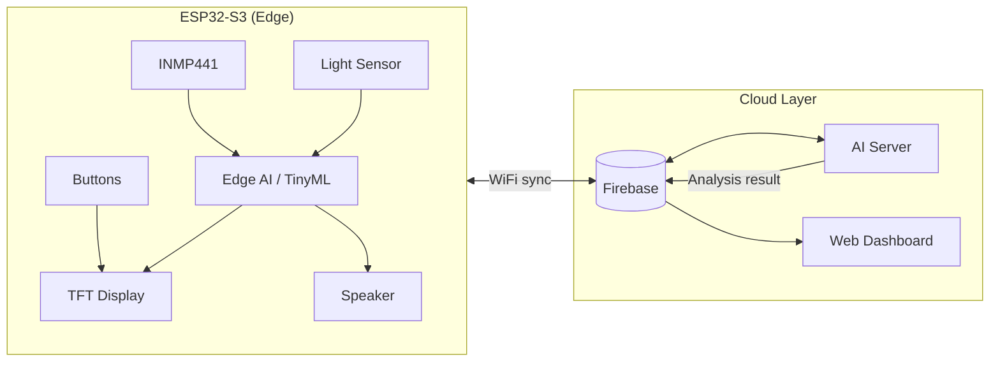

---

## 2. System States & Navigation

### 2.1 Top-Level States

| State | Chức năng           |
| ----- | ------------------- |
| HOME  | Giám sát môi trường |
| STUDY | Hỗ trợ học tập      |
| SLEEP | Hỗ trợ giấc ngủ     |
| RELAX | Giải trí            |

**Button (1):** chuyển vòng trạng thái `HOME → STUDY → SLEEP → RELAX → HOME`.

### 2.2 Global State Machine

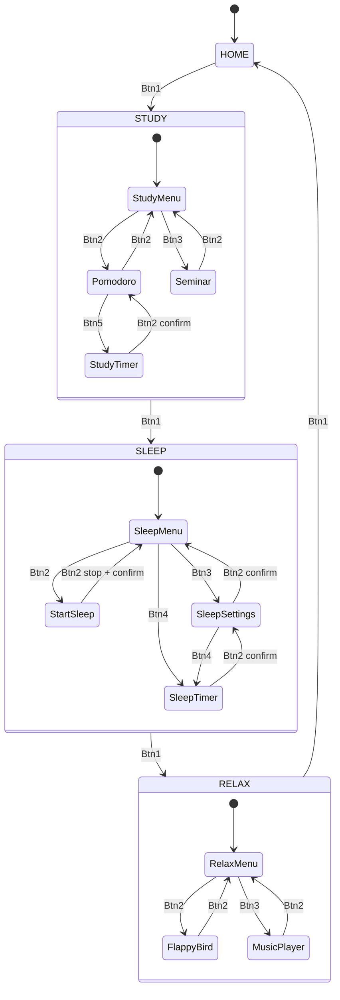

### 2.3 Screen Hierarchy

```text
HOME
├── STUDY
│   ├── Pomodoro
│   │   └── STUDY_TIMER (cấu hình)
│   └── Seminar Practice
├── SLEEP
│   ├── START_SLEEP (monitoring)
│   ├── Sleep Settings
│   └── SLEEP_TIMER (cấu hình)
└── RELAX
    ├── Flappy Bird
    └── Music Player
```

---

## 3. Functional Specification

---

### 3.0 HOME — Environmental Monitoring

#### Mục tiêu

Hiển thị realtime chất lượng môi trường xung quanh.

#### Thông tin hiển thị

| Thông tin     | Mô tả                        |
| ------------- | ---------------------------- |
| Sound Level   | Mức độ âm thanh              |
| Sound Quality | Đánh giá chất lượng âm thanh |
| Light Level   | Mức độ ánh sáng              |
| Light Quality | Đánh giá chất lượng ánh sáng |

#### Processing Flow

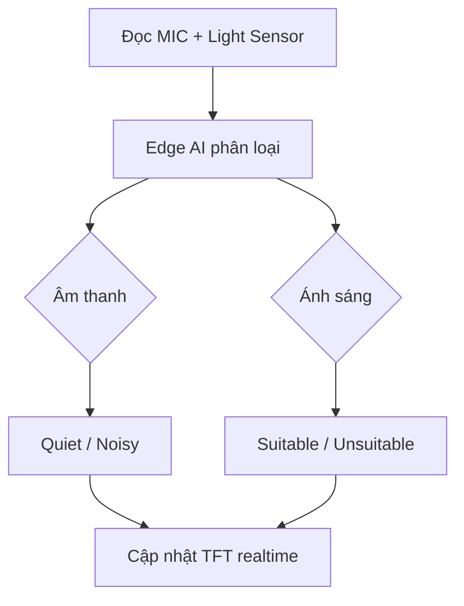

| Bước | Thành phần | Hành động |
| ---- | ---------- | --------- |
| 1    | INMP441    | Thu mẫu audio liên tục |
| 2    | Light Sensor | Đọc cường độ ánh sáng |
| 3    | Edge AI    | Phân loại môi trường (Quiet/Noisy, Suitable/Unsuitable) |
| 4    | TFT        | Render metrics và trạng thái đánh giá |

---

### 3.1 STUDY — Learning Assistant

#### Main Menu — Input Mapping

| Button     | Hành động        |
| ---------- | ---------------- |
| Button (2) | Mở Pomodoro      |
| Button (3) | Mở Practice Seminar |

---

#### 3.1.1 Pomodoro Module

**Cấu hình mặc định:** Study 25 min · Break 5 min

##### User Flow

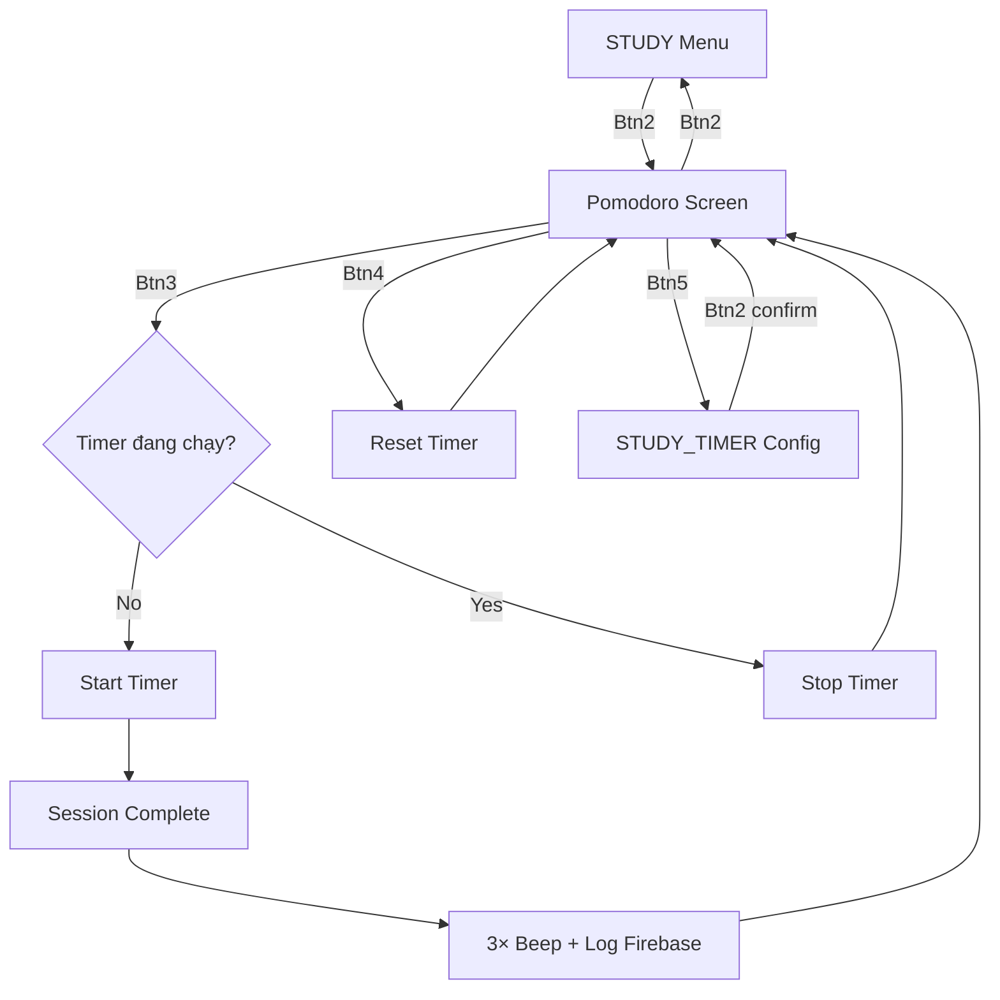

##### Input Mapping

| Button     | Hành động              |
| ---------- | ---------------------- |
| Button (2) | Quay về STUDY Menu     |
| Button (3) | Start / Stop Timer     |
| Button (4) | Reset Timer            |
| Button (5) | Mở STUDY_TIMER Config  |

##### Session Completion Sequence

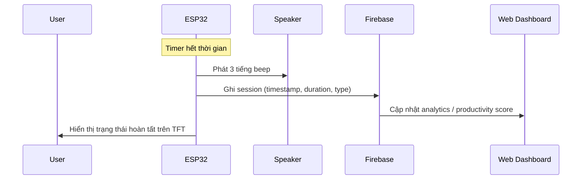

**Payload Firebase (session log):**

- `timestamp`
- `duration`
- `session_type` (study / break)

---

#### 3.1.2 STUDY_TIMER Configuration

##### Input Mapping

| Button     | Hành động        |
| ---------- | ---------------- |
| Button (2) | Xác nhận & quay lại |
| Button (3) | Đổi đơn vị (phút/giây) |
| Button (4) | Tăng giá trị     |
| Button (5) | Giảm giá trị     |

##### Cloud Sync Sequence

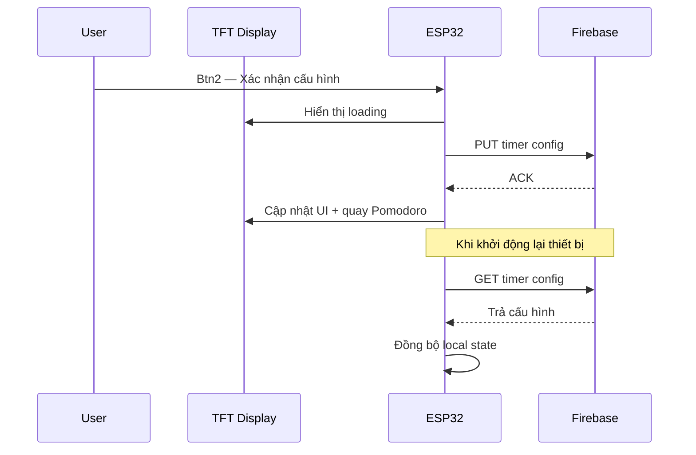

---

#### 3.1.3 Seminar Practice Module

Cho phép người dùng luyện thuyết trình và nhận đánh giá chất lượng giọng nói.

##### Input Mapping

| Button     | Hành động              |
| ---------- | ---------------------- |
| Button (2) | Quay về STUDY Menu     |
| Button (3) | Start / Stop Recording |
| Button (4) | Evaluate Speech        |

##### Evaluation Pipeline

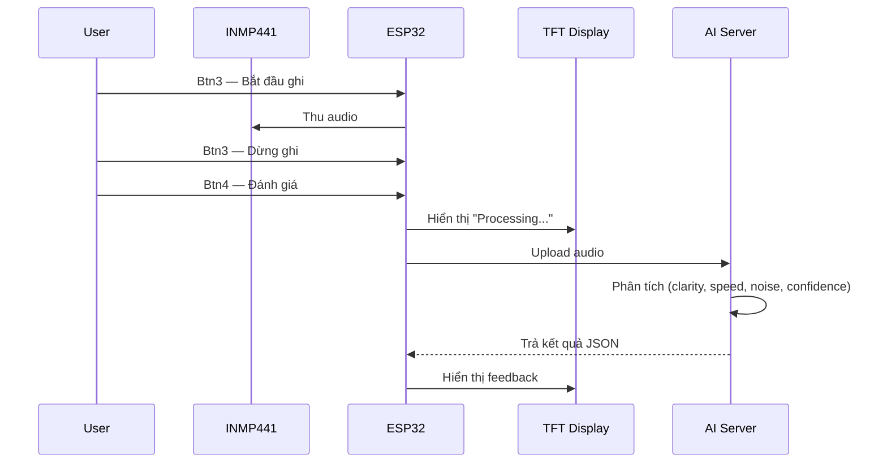

| Metric           | Mô tả                          |
| ---------------- | ------------------------------ |
| Speech clarity   | Độ rõ ràng phát âm             |
| Speaking speed   | Tốc độ nói (WPM hoặc tương đương) |
| Noise level      | Mức nhiễu môi trường            |
| Confidence score | Ước lượng độ tự tin khi nói     |

---

### 3.2 SLEEP — Sleep Monitoring Assistant

**Cấu hình mặc định:** Sleep duration 8h · Alarm disabled · Lưu trên Firebase

#### SLEEP Menu — Input Mapping

| Button     | Hành động              |
| ---------- | ---------------------- |
| Button (2) | Bắt đầu giám sát ngủ   |
| Button (3) | Mở Sleep Settings      |
| Button (4) | Mở SLEEP_TIMER Config  |

---

#### 3.2.1 START_SLEEP Screen

##### Monitoring Loop

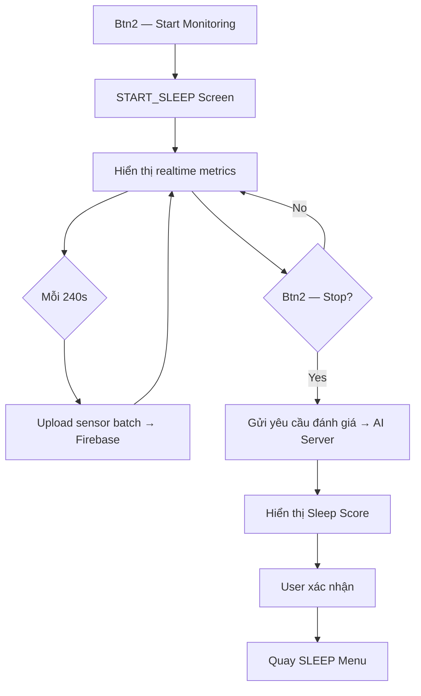

##### Metrics hiển thị (realtime)

- Sound Level / Sound Quality
- Light Level / Light Quality
- Sleep Duration (elapsed)

##### Stop & Scoring Sequence

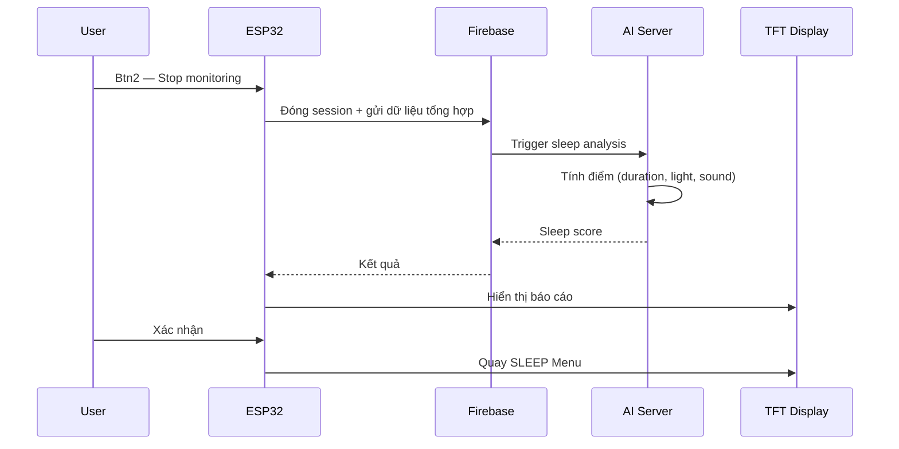

---

#### 3.2.2 Sleep Settings

##### Input Mapping

| Button     | Hành động              |
| ---------- | ---------------------- |
| Button (2) | Xác nhận & lưu         |
| Button (3) | Bật / tắt Alarm        |
| Button (4) | Mở SLEEP_TIMER Config  |

**Alarm mặc định khi bật:** 07:00 AM · Danh sách alarm hiển thị tại SLEEP Menu

---

#### 3.2.3 SLEEP_TIMER Configuration

| Button     | Hành động        |
| ---------- | ---------------- |
| Button (2) | Xác nhận & quay lại |
| Button (3) | Đổi đơn vị       |
| Button (4) | Tăng giá trị     |
| Button (5) | Giảm giá trị     |

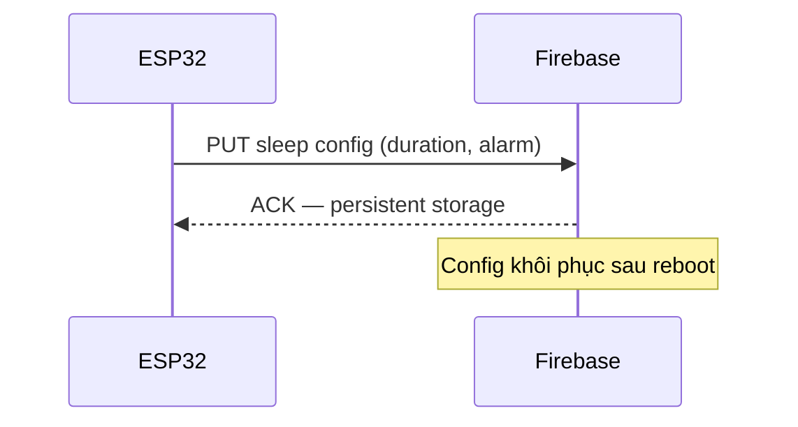

---

#### 3.2.4 Alarm Trigger

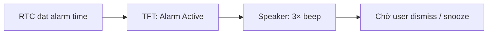

---

### 3.3 RELAX — Entertainment Module

#### RELAX Menu — Input Mapping

| Button     | Hành động        |
| ---------- | ---------------- |
| Button (2) | Mở Flappy Bird   |
| Button (3) | Mở Music Player  |

#### 3.3.1 Flappy Bird Mini Game

##### Input Mapping

| Button     | Hành động        |
| ---------- | ---------------- |
| Button (2) | Mở / thoát game  |
| Button (3) | Jump             |

##### Game Flow

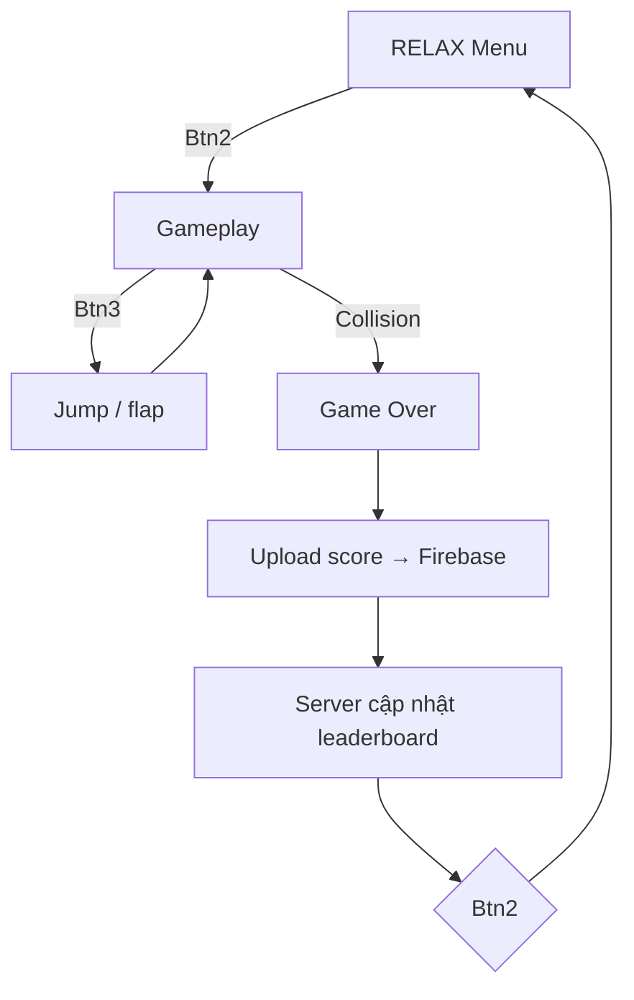

---

#### 3.3.2 Music Player

##### Input Mapping

| Button     | Hành động       |
| ---------- | --------------- |
| Button (2) | Quay RELAX Menu |
| Button (3) | Play / Pause    |
| Button (4) | Next track      |
| Button (5) | Previous track  |

##### Playback Flow

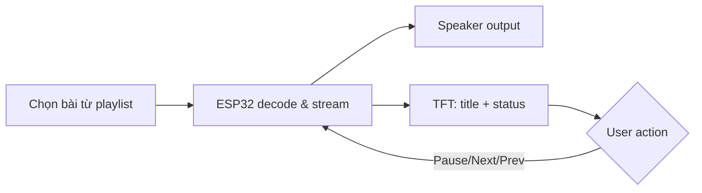

---

## 4. Objectives & Use Cases

---

### 4.1 Objective 1 — Enhance Learning Productivity

**Mô tả:** Hỗ trợ học tập và cải thiện hiệu suất làm việc cá nhân thông qua quản lý thời gian và đánh giá kỹ năng trình bày.

#### Use Case 1 — Pomodoro Study Assistant

| Tính năng | Mô tả |
| --------- | ----- |
| Pomodoro cycle | Chu kỳ 25/5 phút, cấu hình được |
| Audio notification | Beep khi hết phiên |
| Session tracking | Log mỗi phiên lên Firebase |
| Analytics | Dashboard web theo dõi productivity |

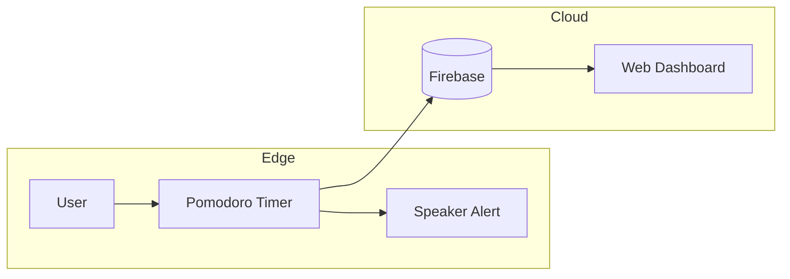

#### Use Case 2 — AI Seminar Evaluation

| Tính năng | Mô tả |
| --------- | ----- |
| Voice recording | Ghi qua INMP441 |
| Speech evaluation | AI server phân tích đa metric |
| Feedback | Kết quả hiển thị TFT |

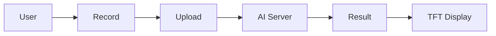

---

### 4.2 Objective 2 — Improve Sleep Quality

**Mô tả:** Theo dõi và đánh giá chất lượng giấc ngủ dựa trên dữ liệu môi trường và thời lượng ngủ

#### Use Case 1 — Sleep Quality Scoring

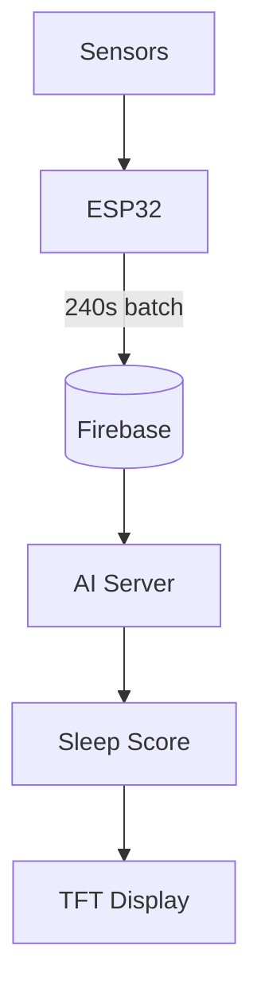

#### Use Case 2 — Smart Alarm System

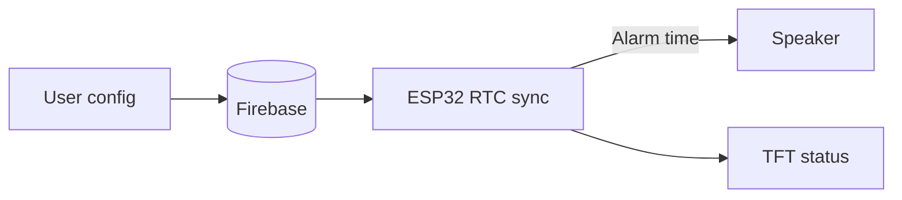

---

### 4.3 Objective 3 — Provide Entertainment Features

**Mô tả:** Tăng trải nghiệm người dùng thông qua game mini và phát nhạc trực tiếp trên thiết bị.

#### Use Case 1 — Flappy Bird

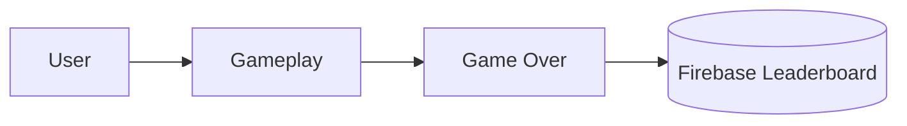

#### Use Case 2 — Music Player

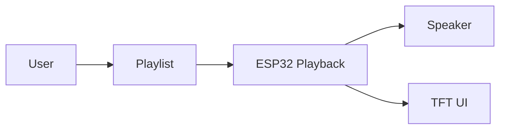
